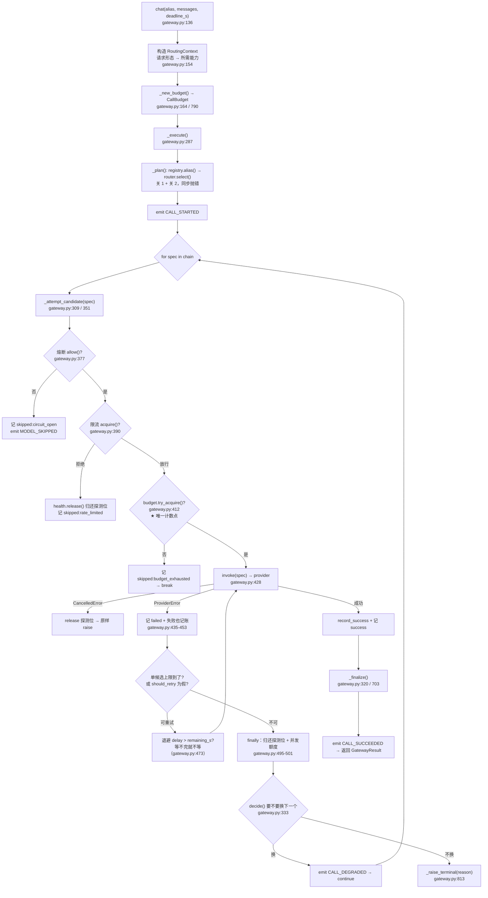
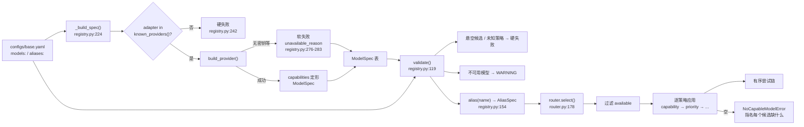
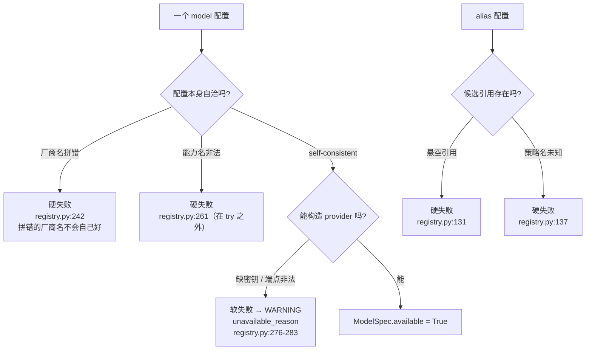
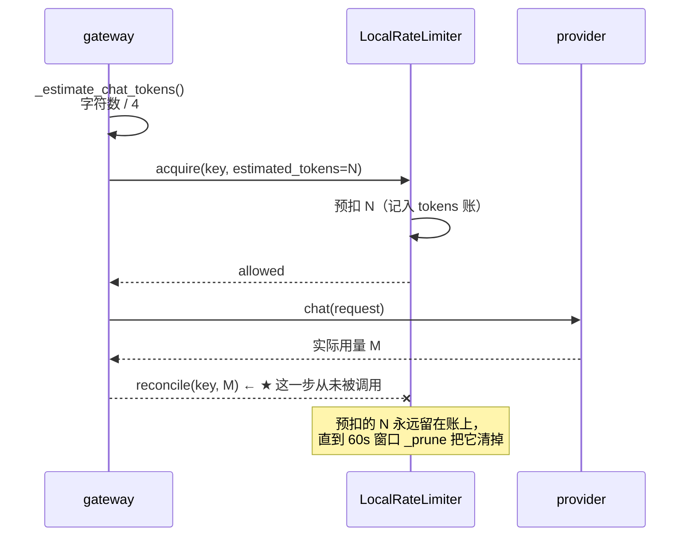
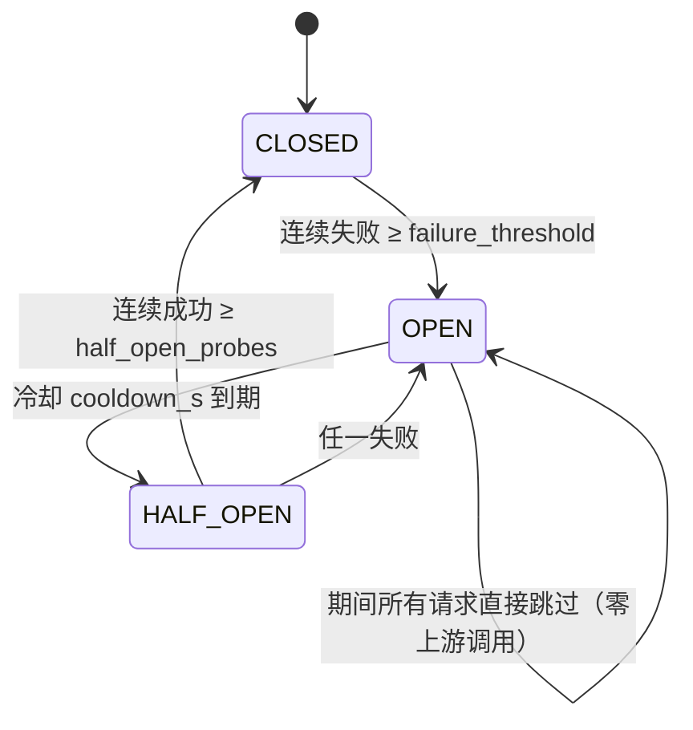
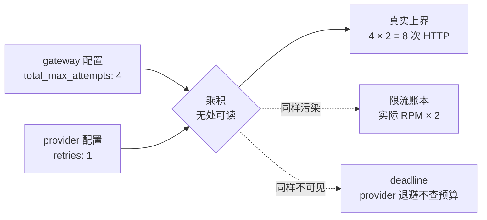
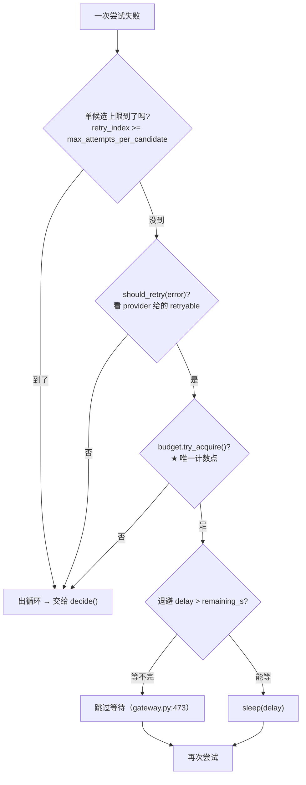
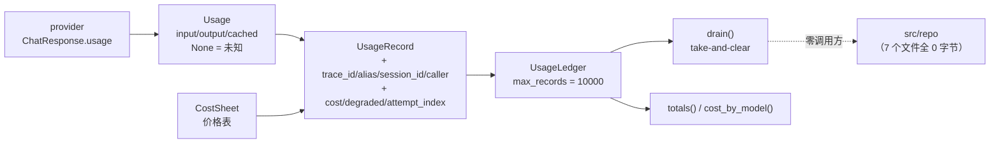

# `src/gateway` 架构分析报告

> 分析日期：2026-09-20 ｜ 目标：`E:\aloha\AIComponents\besa-agent\src\gateway`
> 规模：11 个文件 / 2860 行 / 2198 有效代码行 ｜ **覆盖率 100%（逐行读完）**
> 方法：5 个模块并行深潜 + 主 agent 交叉验证（每个模块抽 2-4 条关键结论回源码逐行核对）
> 交叉验证中发现并裁决了 **1 处独立结论冲突**（见第 7 章与附录 A）

---

## 0. 这份报告怎么读

如果你只有十分钟，读 **第 1 章**（全景）和 **第 8 章**（评价）。
如果你想学设计，读第 4 章 —— `CallBudget` 是全项目最值得学的一处，它用 API 形状消灭了一整类 bug。
如果你要看「设计承诺 vs 实现现实」的完整账本，读第 7 章，那里有实测数据。

**一个必须提前说明的事实**：分析时工作区**不干净**。作者正在做 `chat` → `runtime` 的全局改名且未完成 ——
`src/chat/` 已改名为 `src/runtime/`、`Capability.CHAT` 的**值**已变成 `"runtime"`（成员名仍叫 `CHAT`），
但 `configs/*.yaml` 的 `models:` 键还是 `chat-*`、`pyproject.toml` 的 `root_packages` 还写着 `chat`。
后果是：`doctor` 崩、10 个集成测试红、**四条 import-linter 架构契约根本没在跑**。

这些是改名遗留，本报告**不把它们算作 gateway 的设计缺陷**，但有两处例外必须计入 ——
改名泄漏进了**用户可见的错误信息**（第 2.6 节）和**能力语义**（第 8 章）。本报告以磁盘上的源码为准。

---

# 第 1 章 项目全景：一次调用的旅程

## 1.1 为什么必须有这一层

BesaAgent 要做的是软件测试全流程的多智能体平台 —— 需求、测试设计、用例、环境、执行、分析、缺陷。
这条链路上每一个环节都要跟模型说话，而**一次全量回归由多个 agent 并发驱动数千次调用**。
这个规模是理解本模块所有设计的前提：它决定了「模型调用失败」不是一件偶发的小事，
而是一件**会被并发放大**的系统性事件。

`src/provider` 已经把「同一个请求在不同厂商 API 上怎么写」做完了：它把 OpenAI 的 `response_format`、
vLLM 的 `guided_json`、DashScope 的 `tools` 差异收敛成一个 `ChatRequest`。
但 provider 是**单厂商视野**的 —— 它只认识「我这次要调的那个模型」，失败了就失败了，
它不知道也不该知道还有别的模型可换。

于是上层 agent 手里真正想要的东西，provider 一个都给不了：

| agent 真正想说的 | 而不是 |
|---|---|
| 给我一个**够用的模型** | 给我 `gpt-4o-mini` 这个具体型号 |
| 这家挂了，**自动换一家** | 我自己 `if` 判断再重试 |
| 几十个 agent 一起跑，**别把配额打爆** | 每处业务代码各自限流 |
| 这一轮回归**花了多少钱** | 事后谁也说不清 |
| 某个模型连续失败，**别再往上撞** | 每个调用方各自熔断 |

这五条诉求如果交给业务代码自己实现，会在第一次全量回归时同时爆掉三件事：
换模型变成全仓库改代码；故障时各处的重试互相叠加成**重试风暴**；「这轮花了多少钱」永远答不出来。

所以 gateway 的存在理由（`需求说明书-gateway.md:39-51`）不是「多写一层抽象」，
而是把这四件事**收敛到一个唯一入口**。它回答的正好是 provider 不回答的那三个问题：
**选谁、失败怎么办、花多少、还活着吗。**

## 1.2 这个模块的设计哲学，一句话

> **拒绝静默：把不确定性压缩成可数、可读、可复现的东西。**

`gateway.py` 的每一处设计都在跟同一个敌人打架 —— 不是「模型偶尔失败」，
而是**失败之后信息被静默地丢掉**。具体分四个面：

| 面 | 反面（要消灭的） | 落点 |
|---|---|---|
| ① 故障放大倍率有上界，且上界是**一个能读出来的数字** | 重试 3 × 候选 3 = 9 次，没人算过这个乘积 | `CallBudget.try_acquire()` 是**唯一**计数点（`retry.py:90`），编排里不允许出现第二个计数器 |
| ② 未知**不是** 0 | 上游没返回用量就记 0，成本凭空消失 | `Usage` 字段留 `None` |
| ③ 降级**必须标记** | 换了模型不告诉任何人，「为什么这次答得差」永远查不出 | `GatewayResult.degraded` + `attempts` |
| ④ 失败原因**全留**，不只留最后一条 | 「m1 超时 → m2 限流 → m3 鉴权失败」只显示最后一条 | `attempts` 保留每一次记录 |

第 ① 面是 `NFR-G-04`，需求文档明确标注为「本模块**最重要的**非功能约束」（`需求说明书-gateway.md:299`）。
本报告会反复回到它 —— 而且最后会发现，**它恰恰是唯一一条没被完全兑现的**（第 7.2 节）。

## 1.3 九道关

把 `gateway.py:136-349` 拉直，一次阻塞调用要依次穿过九道关。所谓「九道关」指九个必须按特定顺序发生的关注点 ——
**顺序本身是约束，不是实现细节**（`架构概要设计-gateway.md:122-129`）。

| # | 关卡 | 谁干 | 代码位置 | 它拒绝的静默 |
|---|---|---|---|---|
| 1 | 解析逻辑名 | `registry` | `gateway.py:687` | alias 拼错时列出所有可用名，而不是只说「未注册」 |
| 2 | 选链（能力过滤 + 排序） | `router.select()` | `gateway.py:688` | 过滤后为空 → 指名每个候选缺什么（`router.py:204`） |
| 3 | 开预算 | `CallBudget` | `gateway.py:790-796` | 上界从一开始就是个具体数字，不是事后统计 |
| 4 | 熔断硬拦截 | `health.allow()` | `gateway.py:377` | 熔断的模型**不消耗重试次数**，且留下 `skipped_reason="circuit_open"` |
| 5 | 限流申请 | `LocalRateLimiter.acquire()` | `gateway.py:390` | 排队要计入 deadline；等不完的队改判换候选（`rate_limit.py:161`） |
| 6 | 预算计数 | `CallBudget.try_acquire()` | `gateway.py:412` | **唯一的计数点**。走过这一支就说明不能再发请求了 |
| 7 | 重试循环 | `should_retry` + `compute_backoff` | `gateway.py:411-482` | 退避也要受总预算约束（`gateway.py:473`） |
| 8 | 降级决策 | `fallback.decide()` | `gateway.py:333` | 拒绝时给出**原因**（`no_more_candidates` vs `deadline`），因为两者修法相反 |
| 9 | 记账 | `usage` / `cost` | `gateway.py:320`、`449` | 失败也记；用量未知留 `None` 不留 0 |
| — | 事件（旁路） | `EventEmitter` | `_emit` 七处 | 只在门面发，且发射失败不许拖垮调用 |

**第 4 关和第 5 关的位置是最容易被写错的**：它们必须在第 7 关（重试）**之前**。
理由很实在 —— 对一个已确认挂掉的模型重试三次，不只是浪费，它会**挤占 `CallBudget`**，
导致本该降级到健康模型的请求直接超时。而写错不会报错，只会让排障方向跑偏。

## 1.4 全景图

这是整份报告的地基图。注意一个数字：`_execute` 只有 **63 行** ——
它是**读**起来像那张顺序表的地方，真正的体力活被推到了 `_attempt_candidate`。



图里有三处值得盯住：

- **`finally`（`gateway.py:495-501`）** 是兜底网，它同时管两件容易漏的事：熔断探测位与并发额度。
  取消路径从网的任意一点跳出去，都会被它接住 —— **但它没能接住全部**，这是本报告的第一个真缺陷（第 6.3 节）。
- **`decide()` 在 `_attempt_candidate` 之外**（`gateway.py:333`）。这不是随手放的：
  它让「每个候选各自重试，重试耗尽才换」这条约束在**代码结构上**成立 ——
  重试循环被封在候选内部，换候选的决策在外面。
- **★ 那一格**是 `NFR-G-04` 的物理实现。整个文件里只有这一处 `try_acquire()` 调用。

## 1.5 B-3：为什么不用九层装饰器

设计文档 B-3（`架构概要设计-gateway.md:414`）否决了「九层中间件套娃」，理由是
「顺序是**约束**，散在 9 层里没人能一眼看出顺序错了；且中间件链难以表达『health 失败要**跳过** retry』这种跳转」。

这个理由在代码里**成立**。装饰器链的表达形式是 `handler = A(B(C(D(core))))` ——
从这一行**读不出**执行顺序（你得知道每个装饰器是前置还是后置、是包裹还是短路），
更读不出「某一层不执行」。而中间件模型的契约恰恰是「每一层都执行」，
这里需要的却正是「health 失败就不该进 retry」。

**但有一个诚实的补充**：这条约束在代码里是**靠调用顺序**表达的，不是靠类型或断言。
`gateway.py:377`（熔断）和 `390`（限流）之间没有任何东西阻止有人把它们调换 ——
编译器不会拦，测试多半也不会红（除非专门构造「熔断 + 限流同时触发」的用例）。
所以「一眼看出顺序错了」是**给人看的，不是给机器验的**。
这是 B-3 的收益上限，也是它的边界。

## 1.6 865 行怎么分布

这是后面所有「可读性 / 可测试性」讨论的事实基础：

| 区域 | 行范围 | 行数 | 占比 |
|---|---:|---:|---:|
| 文件头 docstring | 1-10 | 10 | 1.2% |
| import + 常量 + 协议 | 12-65 | 54 | 6.2% |
| `EventName` / `EventEmitter` / `NullEmitter` | 68-98 | 31 | 3.6% |
| `Gateway.__init__`（9 个依赖的默认值组合） | 104-133 | 30 | 3.5% |
| **三个对外入口** `chat` / `embed` / `stream_chat` | 136-284 | 149 | 17.2% |
| **`_execute`**（阻塞编排） | 287-349 | 63 | 7.3% |
| **`_attempt_candidate`**（单候选 + 重试） | 351-503 | 153 | 17.7% |
| **`_stream_impl`**（流式编排） | 506-681 | 176 | 20.3% |
| **`_finalize`** | 703-762 | 60 | 6.9% |
| 其余私有辅助 + `_last_error` | 684-865 | 180 | 20.8% |

四个核心私有方法合计 **452 行，占文件的 52%**。
所以「编排是一个方法」这句话在文件尺度上**要打个折** ——
准确的说法是「编排没有藏在装饰器里，但它分住在四个方法中」。
这个折价有多严重，第 6 章给结论。

---

# 第 2 章 选谁：逻辑名寻址与能力过滤

> 上一章立起了「九道关」的骨架，确立了 9 个零件被一个编排方法串起来。
> 本章回答第一道关：**候选链从哪来。**
> 读者带着的具体问题是：业务代码只写 `runtime.default`，它怎么变成一条具体的模型尝试链？
> 如果配置写错了，什么时候会炸？

## 2.1 一次慢路径 / 热路径的切分

三个文件的分工本质上是**按「多久发生一次」切的**：

| 文件 | 何时执行 | 频率 |
|---|---|---|
| `registry.py` | 启动期 + 每次调用解析 alias | 一次 / 极高 |
| `router.py` | 每次调用 | 极高 |
| `types.py` | — （纯类型载体） | — |

`registry` 做重活（构造 provider、校验配置、合并能力），但**结果被冻结**成 `ModelSpec`：
`capabilities` 在注册时定形（`types.py:41-42` 的注释：「调用路径上不再计算 —— 路由是热路径，不该有分支」）。
`router` 每次调用都要跑，所以它必须是纯函数式的管道。

这个切分很干净。**但有三处渗漏**（第 2.7 节展开），其中一处是注册表造出来的 provider 实例**用完即弃**，
真正服务的实例在 `provider()` 里被**第二次构造**。

## 2.2 从 YAML 到有序候选链



## 2.3 启动期校验落在哪一层：B-9 是**文档缺陷**

设计文档 B-9（`:420`）的结论是「启动期校验放在**组合根**」，理由是
「第 5 条校验（每个候选的 provider 已注册）需要同时看见 `settings` 与 `src/provider`，
只有组合根两边都看得见」。

**实现不是这样。** 五条校验的实际归属：

| 校验 | 实际位置 |
|---|---|
| alias 至少一个候选 | `registry.py:129-142`（`validate()`） |
| 候选引用的 model key 存在 | 同上 |
| 策略名已知 | 同上 |
| **候选的 provider 已注册** | `registry.py:242-247`（`_build_spec` 里查 `known_providers()`） |
| `total_max_attempts ≥ max_attempts_per_candidate` | `retry.py:129-140`，由 `bootstrap.py:104` 触发 |

`bootstrap.py` 自己**一条校验都没写** —— 它只做「把 `Settings` 拆成 gateway / models / providers 三段」
的投影与顺序。

而 B-9 的理由本身不成立：`registry.py` 从第一行 import 起就 import 了 provider
（它必须 import，因为要**构造 provider 实例**）。所谓「只有组合根同时看得见两边」是错的。

**判定：文档缺陷，不是代码缺陷。** 真实的分工原则应当表述为
「**谁拥有该不变量，谁校验它**」—— registry 拥有「候选必须指向已注册厂商」，
retry 拥有「两个上限之间的大小关系」，组合根只负责把它们按顺序接起来。
这可以类比 Kubernetes 里 kube-apiserver（结构性校验）与 admission webhook（策略校验）的分工：
不是「谁能看见全部谁校验」，而是「谁的职责谁校验」。

**报告落点**：这应该作为第 9 条「实现期回填修订」补进 `架构概要设计-gateway.md` §9.5，
与 R-1…R-8 并列。文档没回填它。

## 2.4 硬失败与软失败的边界

这是本模块最有价值的一处边界设计。三类问题的处置完全不同：



**判据是「这个错误会不会自己好」** —— 拼错的厂商名、悬空的候选引用、未知的策略名都不会自己好，
所以硬失败（进程起不来）；缺密钥会自己好（人配上去就行），所以软失败（服务器照常起，
只是那个模型被标记为不可用）。这条对应 `NFR-G-08`「无密钥可启动」。

**`unavailable_reason` 为什么保留而不是丢弃**（`types.py:53-55`）—— 这是「拒绝静默」的一个漂亮应用：

> 注册期就失败的模型（如云厂商缺密钥）。**保留在注册表里**而不是丢掉 ——
> 丢掉会让「为什么这个候选没被用到」变成一个查不到的空缺。

如果直接把构造失败的模型从表里删掉，那么「这个 alias 配了三个候选，为什么只用了一个」
就变成了一个**无法回答**的问题。保留它并记下原因，`doctor` 与 `NoCapableModelError` 就能回答它。

## 2.5 路由策略管道：实现与设计稿的**集合零差集**，但语义有个陷阱

设计稿（`:217-234`）列了 5 个策略，需求 `FR-G-03` 要求「至少支持 能力过滤 / 优先级 / 权重 / 成本优先」。
实测 `STRATEGIES`（`router.py:160-166`）注册的正是这 5 个 —— **集合差集为空**。


**但语义差集有三处，最重要的是第一个**：

| # | 差异 | 后果 |
|---|---|---|
| 1 | **「后写的策略是主键」** | 稳定排序的必然结果：`[priority, cost]` 实际是「按成本排，优先级只在同价时生效」，与配置作者的直觉**正好相反** |
| 2 | `health` 策略是排序偏好，不是硬拦截 | 与 B-5 一致，但两个机制分居两处（`router.py:155` vs `gateway.py:377`） |
| 3 | `weight` 的分流稳定性 | `_stable_uniform`（`router.py:236`）用哈希而非 `random`，保证同一会话固定分流 —— 与 D-F 一致 |

第 1 条值得展开：`router.py:194-199` 按配置顺序逐个应用策略，而 `_by_priority` / `_by_cost` / `_by_health`
全部用 `sorted()`（Python **稳定排序**）。稳定排序的语义决定了**最后应用的那个成为主键**，
先前的只作 tie-breaker。需求 `FR-G-03` 只说「策略可组合且**顺序明确**」，
没有定义这个顺序的**语义方向**，文档也零字提及 —— 这是个文档缺口。

**顺带记一处值得表扬的设计**（`router.py:126-127`，`_by_cost` 的 docstring）：

> 便宜的优先。**价格未知的排最后**，而不是当成 0 排最前 ——
> 后者会让「没配价格」的模型独占流量，然后在账单上给你一个「未知成本」。

同一个 `None`，在**计费**里是「未知」（`Cost.amount = None`），在**排序**里必须当成「最差」。
如果把它当成 0（最便宜），配置缺失就会静默地改变流量分配 —— 这是「拒绝静默」哲学
贯穿到路由层的一个漂亮变体。

## 2.6 空候选与错误信息的质量

`FR-G-03` 要求「过滤后候选为空 → 报明确错误（指出**没有任何模型同时满足**哪些能力），而不是静默失败」。
实测的真实输出（本会话调用 DeepSeek / SiliconFlow 时抓到的）：

```
NoCapableModelError: 没有任何候选满足本次请求的能力要求（对话）
  - emb-siliconflow：缺少 runtime
```

这个格式本身是好的 —— 它指名了每个候选缺什么。**但有三处问题**：

**① 能力名出现中英混排，而英文那半已经被改名污染。**
`router.py:225` 渲染的是 `Capability` 的**枚举值**，而 `Capability.CHAT` 的值已被改成 `"runtime"`。
于是一个**对话**请求报「缺少 runtime」—— `runtime` 这个词对用户不表达任何信息。
这是那次半途改名的**用户可见后果**，比 `configs/` 崩掉更隐蔽：配置错会炸，**消息错不会**。

**② `router.py:231-232` 是逻辑不可达的死代码。**

```python
if unavailable and not candidates:
    lines.append("（候选集为空：请检查 alias 的 candidates 是否引用了已注册的模型）")
```

`unavailable = [spec for spec in candidates if not spec.available]`（`router.py:191`），
即 `unavailable ⊆ candidates`。要进这个分支需要「`unavailable` 非空 **且** `candidates` 为空」——
后者成立时前者必然为空。**条件恒假，这行提示永远不会出现。**
讽刺的是行内文字正是 `C-3` 想要的那种「照着改配置」的提示，
而它恰好在最需要它的场景下不可达。

**③ `select()` 传 `alias=""`**（`router.py:206`）—— 最需要 alias 的错误恰恰没有 alias。

## 2.7 `types.py`：三件套与「数据 vs 行为」的切分

R-1（`:460`）补出 `errors.py` 之后，gateway 与 provider 形成了对称的「契约 + 错误 + 类型」三件套。
`types.py` 里放什么、不放什么，有一条明确的切分标准。

设计文档 D-A/D-B（`:428-429`）的表述是「`CallBudget` 留在 `retry.py`，因为它是**行为**不是数据」。
这个表述**不够准确** —— 因为 `ModelSpec` 也有方法（`supports()` / `supports_all()` / `available`），
它算数据还是行为？

**更准确的判据是「值 vs 状态机」**：

| 类型 | 它的答案取决于 | 归属 |
|---|---|---|
| `ModelSpec` | 配置（**冻结**，注册后不变） | `types.py`（数据） |
| `CallBudget` | **调用历史**（已用过几次、还剩几秒） | `retry.py`（行为） |

这个判据在实践中是一致的 —— 只是文档的表述会让人在遇到 `ModelSpec` 时犹豫。
**建议把 D-B 的措辞改成「值 vs 状态机」。**

## 2.8 一处「静默失真」：`GatewayResult.content` 的 `getattr`

`types.py:142-149`：

```python
@property
def model(self) -> str:
    return getattr(self.response, "model", "")

@property
def content(self) -> str:
    return getattr(self.response, "content", "")
```

这两个属性用 `getattr` 取值，而不是类型注解。**`model` 是无害的**（`ChatResponse` 与 `EmbeddingResult` 都有该字段）。
**问题只在 `content`**：

- 对 embedding 结果静默返回**空串**（`EmbeddingResult` 没有 `content` 字段）；
- 字段改名后静默失效（拼错也返回空串，不报错）；
- 类型检查完全失效。

这与本模块的主线**正面冲突** —— 同一个文件里 `Cost.amount = None` 严守「未知不是空值」，
而 `content` 用一个空串冒充「不存在」。这是 `types.py` 里唯一一处静默失真，
而且是全模块唯一一处**为了绕过分层而主动放弃类型安全**的地方。

代价是真实的：`apps/cli/presentation/render.py` 就因为这两个属性而不需要 import `provider.types`。
**所以它是权宜，不是设计** —— 它换来了上层不必 import provider，但那个目标本可以用别的方式达成
（见第 8.2 节的三条出路）。

## 2.9 `AttemptRecord`：两个字段的分工

`types.py` 的 `AttemptRecord` 是「失败原因全留」这条哲学的载体。两个细节值得说：

**为什么存「已脱敏的字符串」而不是异常对象**（`types.py:97`）：

> 失败原因（已脱敏的字符串）。**不存异常对象** —— 它会被长期持有，可能泄漏。

有意思的是**同一个项目里 `StreamFailed.error` 就持有异常对象**（`types.py:181`）。
两者不矛盾，因为规则不是「一律禁止持有异常」，而是**「看生命周期」**：
`AttemptRecord` 会进 `GatewayError.attempts` 被长期持有，而 `StreamFailed` 是**立即消费**的事件。
所以这条规则的真实表述是**生命周期规则**，不是禁令。

**`outcome` 与 `skipped_reason` 的语义差别**：

| 组合 | 含义 | 服务于 |
|---|---|---|
| `outcome="success"` | 成功 | 统计 |
| `outcome="failed"` + `error=...` | 真的打了，失败了 | 排障 |
| `outcome="skipped"` + `skipped_reason="circuit_open"` | **根本没打** | 排障（「为什么没打」与「为什么打了失败」是两个问题） |

本会话实测看到过这两种组合的实例。合并成一个字段会退化成字符串匹配 ——
而 `errors.py:62-66` 的 `summary()` 正是靠 `record.skipped` 分叉的。

## 2.10 本章小结，与交到第 3 章手上的东西

这一层的基本判断：**职责边界清晰，慢/热路径切分正确，硬/软失败边界设计得好。**
问题集中在三处小渗漏（`_build_spec` 一个函数做三件事且造出的实例用完即弃、
`router` 非纯函数、能力过滤的保证依赖配置而非结构）与一处主动的静默（`content` 的 `getattr`）。

热路径**安全**：候选数 k 通常是 1~3，管道是纯内存操作，微秒级，远低于 `NFR-G-03` 的 1ms 预算。
**但有一个例外**：`registry.aliases` / `registry.models` 每次访问都做 `dict()` 拷贝
（`registry.py:178-183`），在 `doctor` 的循环里会退化成 O(n²) —— 该用 `MappingProxyType`。

现在读者手里有了**一条有序候选链**。下一个问题不是「打哪个」，而是
**「这个候选现在值不值得打」** —— 这正是下一章的两道关：限流与熔断。它们坐在 `retry` **之前**，
因为对一个已知挂掉的模型重试，挤占的是别人的预算。

---

# 第 3 章 让不让打：限流与熔断

## 3.1 三维限流：为什么三个维度必须用三种算法

限流要管三件事：RPM（每分钟请求数）、TPM（每分钟 token 数）、并发数。三者看起来是同一类问题，
但代码里用了**三种不同的处理**，而决定性的差异是一句话：

> **额度「什么时候回来」可不可算**（`rate_limit.py:147-149`）

| 维度 | 额度何时恢复 | 处理方式 |
|---|---|---|
| RPM | **可算**（滑动窗口，下一条记录过期的时间点已知） | 返回 `retry_after_s`，可精确等待 |
| TPM | **可算**（同上，按 token 计） | 同上 |
| 并发 | **不可算**（取决于某个在途请求何时结束，无法预知） | 只能**轮询**（`_CONCURRENCY_POLL_S`） |

这个区分很实在：并发维度的等待不是一个「睡一会儿就好」的问题，而是「等一个别人的事情结束」。
两种情况的正确处理方式不同 —— 前者可以精确 sleep 到点，后者只能周期性地醒来重试。
把三个维度统一成「令牌桶」是常见做法，但那样并发维度就只能靠估算平均耗时，
在多 agent 并发场景下这个估算会非常不准。

**与业界做法的差异**：Guava 的 `RateLimiter` 是单维的；Sentinel 用滑动窗口做多维但维度间互相独立。
本实现把「可算/不可算」作为算法选择的分界线，是更本质的分类。

**但 D-8 承诺的「模型 + 会话两层」实际是零层差异化。**
配置里写了 `defaults`，但 `build_rate_limiter` 只读 `defaults`、构造**单一策略**，
`policy_for` 的 callable 能力从未被使用 —— **会话维度完全不存在**。
后果：一个跑飞的 agent 可以合法吃掉整个模型配额，把同轮回归里其他 agent 饿死。
注意这不是「超发」（总量没超），而是**内部独占** —— 一个更隐蔽的问题。

## 3.2 TPM 的预扣与回补：本章最值得怀疑的一处

### 为什么需要预扣

TPM 限的是「每分钟消耗的 token 数」。但**请求发出前你不知道会用多少 token** ——
如果等到响应回来再记账，那么「我已经用了多少」这个数字永远是**滞后**的：
十个请求同时发出时，每个都以为「当前用量是 0」，于是全部放行，超发十倍。

所以必须**预估预扣**，事后再**按实际值回补**。

### 断裂的那一步



**`reconcile` 全仓库零调用点。** 「按预估预扣、按实际回补」只实现了前半句 ——
TPM 实际运行在**纯估算模式**。

而估算在**三处系统性低估**：

| 低估来源 | 为什么 |
|---|---|
| 中文 | `_CHARACTERS_PER_TOKEN = 4` 是英文经验值；中文一个字通常是 1~2 token |
| 输出 token | 只估了输入侧 |
| tools 定义 | 工具 schema 是 prompt 的一部分，没算进去 |

于是 TPM 约束**系统性偏松**（预扣总是小于实际）。

**更值得注意的是 `rate_limit.py:211-213` 的 docstring 论证是错的。** 它说「不修正会永久占满」，
但 `_prune` 按 60 秒窗口清条目 —— 预扣值会自然过期。所以真实后果与注释描述的**方向相反**：
不是「配额被永久占满」，而是「约束偏松」。

**这正好是一个「注释描述了一个不存在的实现，而没有测试会发现」的案例**：
`grep tpm tests/` 为空。

### 一个反直觉的推论

M4 在分析中提出了一条我认为极有价值的判断：

> **只有在回补可靠之后，预估值才敢于偏保守（高估）。**
> 缺 `reconcile` 的真实代价不是「少扣了」，而是「预估器被迫停在偏低一侧」。

也就是说：因为回补不可靠，任何「高估」的预扣都会永久占用配额（没有回补来退还），
所以预估器只能选择低估。**一个缺失的回补路径，最终导致的是整个约束方向的偏移。**
这是「跨模块缺失的补偿机制会反向塑造模块内部设计」的一个很好的例子。

## 3.3 `on_exceed`：两种行为的代价对比

配额不足时有两种选择，需求 `FR-G-06` 要求它可配：

| 取值 | 行为 | 代价 |
|---|---|---|
| `wait`（默认） | 排队等待 | 可能吃掉整个 deadline |
| `fallback` | 立即换下一个候选 | 可能换到一个更贵的模型 |

**默认 `wait` 的理由**（`架构概要设计-gateway.md:312-314`）：限流通常是**短暂**的（下一秒配额就回来了），
而换模型是**永久性**的代价（更贵/更弱）。这个理由成立。

**R-8 的边界判据已核实是 `>=`**（`rate_limit.py:161`）：

```python
if remaining <= 0 or waited + wait_s >= remaining:
    return RateLimitDecision(...)   # 改判：返回拒绝，让上层换候选
```

为什么必须是 `>=`：**恰好等到 deadline 才拿到额度同样没用** ——
拿到额度的那一刻预算已归零，这次调用必然被 `try_acquire` 拒掉。
白等一轮再失败，不如立刻换候选。

**M4 还发现了一个原文档未提的细节**：这个判据把 `waited` 与**已经递减过的** `remaining` 双重计入，
所以实际是「预算过半就放弃等待」。以并发维度的 `_CONCURRENCY_POLL_S` 为例，
默认 120s 预算下约 60s 后就会触发降级。**保守方向可接受，但应该从「隐式」改成「显式」** ——
现在的写法会让人以为判据是「等待时长超过剩余预算」，实际比那更严。

## 3.4 redis 后端为什么必须明确报错

`rate_limit.py:264-271` 对 `backend: redis` 的处理是**直接报错**，而不是降级到本地限流。

这个决定值得单独说，因为它是「拒绝静默」的一个最典型应用：

> 静默退化成单进程限流，在本地测试下**完全正常**，但在多进程部署下实际配额会超发 **N 倍**（N = 进程数）。
> 这是一个**只在生产暴露**的失效形态，而且失效后没有任何症状 —— 配额看起来配了，就是不生效。

对比另一种做法（启动时打 WARNING 然后降级单进程）：WARNING 会被淹没在日志里，
而「配额超发 N 倍」这件事会在下一个结算周期以账单的形式出现，那时已经查不回来了。

**组合根里的那个例外是正确的**（`bootstrap.py:126-141`）：`enabled: false` 时**不走** `build_rate_limiter`，
因为后者会校验 backend —— 「关掉限流」应当无条件成立，哪怕 backend 配的是尚未实现的 redis，
否则关掉它反而会报错，与本意相反。

**但 M4 指出这个例外顺手打开了一扇门**：`_build_limiter` 的 `enabled: false` 分支**完全无日志**。
配置里写 `enabled: false` 是一件影响很大的事（全局限流失效），却和「没配限流」走同一条路径且不留痕。
补三行 WARNING 即可。

## 3.5 熔断：状态机与全部转移条件



三处细节核实过：

**① `failure_threshold` 是「连续」失败，成功一次就清零**（`health.py:138-139`）。
注释写得很清楚：「CLOSED 下的成功只清失败计数 —— 计数是『连续』失败，不是累计失败」。
用连续失败而不是失败率，是因为在低流量下失败率没有统计意义。

**② B-6 的「任一失败」已核实**（`health.py:144-147`）：半开期任一失败立即回 `OPEN`，
不算失败率 —— 半开样本量默认只有 2，比率无意义。这个决定比业界常见的「滑动窗口失败率」
**更保守也更简单**，在样本量小的场景下是更好的选择。

**③ `OPEN` = 零上游调用，但这条不变量只在「候选之间」成立。**
M4 发现：**重试循环内不复查熔断**。所以触发熔断的那个候选，还会再多打
≤ `max_attempts_per_candidate - 1` 次。也就是说 `OPEN` 的「零上游调用」是
「下一个候选不再打」，而不是「立刻停手」。

## 3.6 R-5 深度核查：**一处被三个分析给出相反结论的地方**

### 先说结论

设计文档 R-5（`:464`）警告：

> 取消路径上最容易漏。泄漏一个探测位意味着 `HALF_OPEN` 的探测位被永久占用，
> 模型**再也恢复不到 CLOSED**，而日志上只有一条「进入半开探测」，看不出泄漏。

**三个独立分析给出了相反答案**：M1 与 M3 各自报告「存在泄漏窗口」，M4 报告
「`release()` 在所有路径上都归还了，13 条出口逐条核过，没找到泄漏」。

**主 agent 回源码裁决：M1/M3 正确，M4 的结论在模块层面不成立。**

```
gateway.py:377   if not self._health.allow(spec.key):    ← HALF_OPEN 下占探测位
gateway.py:390   await self._limiter.acquire(...)        ← 真挂起点
gateway.py:391   if decision.denied:                     ← 只有这一支归还
gateway.py:393       self._health.release(spec.key)
gateway.py:408   probe_outstanding = True                ← 上膛在 await 之后
gateway.py:409   try:                                    ← try 块也在 await 之后
gateway.py:495   finally: → :498 release                 ← 只覆盖 try 之后的路径
```

`rate_limit.py:166` 确有一处**真** `await self._clock.sleep(wait_s)`（在 `on_exceed="wait"`
且 RPM/TPM 超限时进入）。所以：

> **取消发生在限流排队期间 → `CancelledError` 从 `:390` 抛出 → `:393` 的归还（在 `denied` 分支内）
> 与 `:409` 的 `try/finally` 都还没到 → 探测位永久泄漏。**

**M4 为什么漏了**：它核的是 `gateway.py:495` 与 `:661` 两个 `finally` **之内**的全部出口（那 13 条），
结论在「`try` 之内」这个范围内是对的。**但泄漏窗口在 `try` 之前** ——
这是一个**作用域差导致的假阴性**，不是粗心。

**这次冲突本身值得进入报告**：三个独立分析对同一段代码得出相反结论，
而分界点只是「你从哪一行开始数出口」。这提示我们 —— 当一个「是否覆盖全部路径」的问题
被提出时，**必须先定义路径的起点**，否则答案不可比。

### 为什么测试抓不到（这半部分 M1 提出、我复核成立）

| | 实现 | 是否可被取消 |
|---|---|---|
| 生产 | `SystemClock.sleep`（`foundation/clock.py:65-69`）→ `await asyncio.sleep(seconds)` | ✅ 真挂起，可取消 |
| 测试 | `FakeClock.sleep`（`foundation/clock.py:108-114`）→ 只 `sleeps.append` + `advance`，**无 await** | ❌ 不会挂起，无取消点 |

`await` 一个不会挂起的协程**不产生取消点**。于是这个窗口在假时钟下物理不可达，
而 `test_b15_cancellation_releases_quota` 测的是**上游调用内部**那条覆盖良好的路径。

**这是一个比「忘了写 finally」更值得记住的教训**：
测试替身与真实实现在「**挂起点**」这个维度上不等价。
假时钟让时间快进的便利，恰好把一类并发缺陷变成了不可测。
修法不能只修 `gateway.py` —— 还要让 `FakeClock.sleep` 至少 `await asyncio.sleep(0)`
（让出一次事件循环），否则同类问题还会再来。

### 修法的约束

**不能简单把 `try` 提前。** M3 指出：限流器的 `release()` 是「谁在途减谁」
（`rate_limit.py:203-206`），把 `try` 提前会替**别的**并发请求释放额度。
正确的做法是引入一个明确的「探测位是否已上膛」状态，在 `:391` 之前就置位。

## 3.7 另外三个残留问题（M4 发现，我抽样核实成立）

| # | 问题 | 后果 |
|---|---|---|
| 1 | `CLOSED` 下 `allow()` 不 `+1`，而 `record_*` **无条件** `-1`，靠 `max(0, ...)` 掩盖不对称 | 计数逻辑不对称，一旦有人改动 `allow` 的语义就会咬人 |
| 2 | 重试循环内不复查熔断 | 见 3.5 ③ |
| 3 | `_open()` 每次刷新 `_opened_at`，冷却期可被**在途失败**重新起算 | 未文档化：持续失败下熔断永不冷却 |

外加一个**量化偏差**：`half_open_probes` 实际放行的上游调用是
`probes × 每候选尝试次数`（默认 2 × 2 = **4**），不是文档说的 2。

## 3.8 D-E：健康状态不跨进程共享

设计文档 D-E（`:432`）选择**各进程独立熔断**，理由是「跨进程共享放二期，
因为写竞争的代价可能大于收益」。M4 的评估我认同：

- **倍率就是进程数 N**，不是文档含糊的「多几倍」。而最大的数字被文档漏掉了：
  触发熔断前要吸收 `failure_threshold × N = 5N` 次失败。
- **D-E 的理由（写竞争）站不住**：熔断需要共享的只是一条带 TTL 的粗粒度标志（低频写、读多），
  与「高危写竞争」不是一个量级。
- **真正被低估的是它的优点**：各进程独立意味着**本机抖动不会升级成全局熔断** ——
  一台机器上的网络抖动只会熔断那台机器的视角，而不是让整个集群放弃一个健康的模型。
  这个隔离性是有价值的，只是文档没把它写成理由。

**结论**：决策本身可能仍然是对的，但理由需要换一条。这是「对的结论 + 错的论证」，
比错的结论更危险 —— 因为下次有人拿这条理由去推别的决策时会出错。

## 3.9 测试盲区

`tests/unit/gateway/` 下**没有** `test_rate_limit.py` / `test_health.py` —— 509 行代码
只靠 3 条端到端验收覆盖。具体无测试的项：

- TPM 的预扣与回补（`reconcile` 从未被调用，所以也无从测）
- `on_exceed="fallback"`（conftest 把限流器硬编码成 `wait`）
- R-8 的 `>=` 边界（谁把它改回 `>` 都不会红）
- 熔断探测位的归还
- redis 后端明确报错
- **B-5 的排序偏好**（`router._by_health`）既未在 `configs/base.yaml` 启用也无测试

`NFR-G-07`（假时钟可测）本身是**满足**的：`Clock` 单实例注入链完整，测试里零真实业务等待。
但正如 3.6 所示，「假时钟可测」不等于「假时钟能测出所有问题」 ——
它把含 `await` 的等待变成了不含 `await` 的，反而制造了盲区。

---

# 第 4 章 打失败了怎么办：重试、降级与错误语义

> 上一章的两道关决定「要不要发起」；一旦真的发出去并失败，就进入全模块设计密度最高的地方。
> 本章是这份报告的设计核心 —— 但它的结论是**一半称赞、一半意外**。

## 4.1 `CallBudget`：全模块的承重墙

设计文档 §0 用一句话概括了整个模块的目标（`架构概要设计-gateway.md:14-15`）：

> 让「**故障**」在系统里的放大倍率**有上界**，且这个上界是一个**可以被读出来的数字**，
> 而不是散落在各处的重试次数相乘出来的意外结果。

`CallBudget` 就是这句话的实现。

### 4.1.1 为什么两个上界必须由**同一个对象**强制

需求里有两条独立的要求：

- `NFR-G-04`：任何失败路径下，**上游请求总数**有上界
- `FR-G-12`：**整体 deadline** 贯穿，而不是每一跳各自超时

设计文档 `:136-137` 说这两条「必须由同一个对象强制，否则会出现『重试次数没超，但时间超了』
或者『时间没超，但已经打了 27 次上游』这类**组合漏洞**」。

把这两个漏洞的触发路径写出来，理由就很清楚了：

| 组合漏洞 | 触发路径 |
|---|---|
| **次数没超但时间超了** | 每个候选的重试都**没超过** `max_attempts_per_candidate`，但退避是 `1+2+4+8…` 的指数增长 —— 4 次重试就能烧掉 15 秒。次数账本完全正常，调用却挂了几分钟 |
| **时间没超但打了 27 次** | 3 个候选 × 3 次重试 × 3 个不同 alias 的回退…… 每一次都在 deadline 之内，次数账单却没人算过这个乘积 |

**关键洞察是：这两个上界不是「两个独立的限制」，而是一个联合约束的两个侧面。**
分开实现时，每个实现都只保证自己那一半，而漏洞恰恰出在两者的**组合**上 ——
「约束的乘积」这件事没有一个地方在管。

这正是「用同一个对象强制」的深层理由：**不是为了少写代码，而是为了让组合漏洞没有地方可以发生。**

### 4.1.2 `deadline` 为什么必须是绝对时刻（B-2）

`retry.py:38-40` 的注释：

> **deadline 用绝对时刻而非剩余秒数**：剩余秒数在多层传递中每次都要重算，
> 且极易被误当成「本层的超时」而**重新起算** —— 那样总超时就成了「每一跳各 120 秒」，
> 而不是「整次调用 120 秒」。

这个陷阱值得展开。假设传的是「剩余 120 秒」：候选 m1 失败用掉 30 秒，传给下一跳时应该传 90 秒。
但只要有一层偷懒（在某个地方写了 `timeout = 120`），总预算就**悄悄地重置**了。
而绝对时刻（`monotonic() + deadline_s`）**天然不可漂移** —— 谁拿到都是同一个时间点，
重算也不会变，因为它不是一个「相对量」。

**这里有一个和 Go 的 `context.WithTimeout` 的对照**：Go 的 context 传的也是绝对 deadline
（`time.Time`），原因完全相同 —— 相对量在多跳传递中必然漂移。
两个语言、两个项目，独立收敛到同一个设计，说明这是本质性的。

### 4.1.3 「唯一计数 API」的检索验证

设计文档 §10 把「`CallBudget` 被绕过」列为**头号风险**，并留下一句强约束：
「**不允许任何地方出现第二个 attempt 计数器**」。

全模块检索 `+= 1`，只有 6 处，逐条归类：

| 位置 | 是什么 | 是否违反 |
|---|---|---|
| `retry.py:98` | `self._used += 1`，在 `try_acquire()` 内 | **就是那唯一一处** |
| `gateway.py:476` | `retry_index += 1` | 不是。它是**单候选内**的重试序号（R-4 要求的「单候选上限」判据） |
| `health.py:114/133/149` | 探测位、探测成功数、连续失败数 | 不是。熔断状态机自己的度量 |
| `rate_limit.py:199` | `self._inflight[key] += 1` | 不是。并发信号量计数 |

**结论：约束未被破坏。** 而 `gateway.py:476` 那处值得单独指出 ——
它是一次**看起来像违反、实际不是**的检索命中。「有两个上限但只有一个计数器」
是这个设计最容易被误读的地方。

**为什么这个约束是「结构性」而不是「约定性」的**（M3 的论证，我认同）：
由三个事实共同保证 ——
① `try_acquire()` 是**同步方法**（不是 async，不能被 await 打断）；
② **没有第二个 API** 能增减配额；
③ `RetryPolicy.__post_init__` 把配置层的乘积**钉死**（`retry.py:129-140`，
拒绝「总上限小于单候选上限」这种会让降级链走不到第二个候选的配置）。

### 4.1.4 协程安全性：`self._used += 1` 有竞态吗

**没有。** 严谨的论证：`try_acquire()` 是一个**同步方法**，内部 `self._used += 1`
是一个不可被中断的字节码序列；而 asyncio 是**单线程事件循环**，协程只在 `await` 处让出控制权。
一个不含 `await` 的函数体在执行期间不可能被另一个协程插入。

所以「唯一计数点」这个设计**同时**获得了两件事：上界可知，以及天然无竞态。
如果 `try_acquire` 是 `async` 的，这个保证就没了 —— **`async` 与否在这里不是风格问题**。

### 4.1.5 ★ 但真实上界是 **8**，不是 4

这是本次分析最重要的发现，也是设计文档最核心那句承诺的反例。

按 `CallBudget` 读，上界是 `total_max_attempts = 4`（`configs/base.yaml`）。**但 `provider` 有自己的重试。**

核实 `src/provider/openai/client.py:170-178`：

```
client.py:170   if attempt >= self._retries: raise last
client.py:177   await self._clock.sleep(delay)
client.py:178   attempt += 1
```

`retries` 默认 1（`provider/types.py:354`、`configs/base.yaml:81` 写着 `retries: 1`），
`attempt` 从 0 走到 1，即**每次 provider 调用产生 2 次 HTTP 尝试**（1 首发 + 1 重试）。

于是：

```
total_max_attempts(4) × (1 + provider.retries(1)) = 8
```

**设计文档 §0 的原话是**：

> 让「故障」在系统里的放大倍率有上界，且这个上界是一个**可以被读出来的数字**，
> 而不是**散落在各处的重试次数相乘出来的意外结果**。

逐句对照：

| 承诺 | 是否兑现 |
|---|---|
| 「有上界」 | ✅ 8 是上界 |
| 「**是一个可以被读出来的数字**」 | ❌ 这个 8 是 gateway 侧配置与 provider 侧配置的**乘积**，全仓库没有任何一处能读出来 |
| 「不是散落在各处的重试次数相乘出来的意外结果」 | ❌ **它的形态与设计要消灭的那个东西一模一样**，只是量级从 9/27 降到了 8 |

**这是全篇最有力的一处「设计承诺 vs 实现现实」**，因为它不是某个分支写漏了 ——
**两个模块的配置各自都正确，乘起来违背了本模块的第一目标。**

同一因子还污染了限流账本：provider 的内部重试**不重新进入限流器**，
所以实际 RPM 是配置值的 `(1+retries)` 倍。



**设计文档其实预见到了这个风险**：`FR-G-04` 的注里写着「与 provider 的重试不得叠加 ——
见 `provider` 篇 `D-1`。两篇必须以同一结论落地」，`架构概要设计-gateway.md:479` 的风险表也写了
「两侧必须同批实现、同批评审」。

**所以问题不是「没人想到」，而是「想到了，也写了约束，但没有一个机制去验证它」** ——
这正是本报告最终要论证的核心（第 8.3 节）。

**三条修法**（各有代价）：

| 方案 | 做法 | 代价 |
|---|---|---|
| A. 折进预算 | provider 的重试也走 `CallBudget.try_acquire()` | 需要把 `CallBudget` 传进 provider 层，**破坏分层**（gateway 是 provider 的唯一消费者，反向传递语义很别扭） |
| B. 显式乘出来 | 在上界计算里乘出 `(1+retries)`，放进 `doctor` 与启动期校验 | 成本最低，但只是「让它可读」，上界本身仍是 8 |
| C. 取消 provider 层重试 | 网络层错误也上抛给 gateway 决策 | 违背 `D-1` 的结论（provider 重试网络层是有理由的：连接失败重试成本极低，且不需要跨模型决策） |

**我倾向 B + 给 `provider.retries` 加一个启动期告警**（当 `retries > 1` 且
`total_max_attempts > 1` 时提示上界会被放大）。理由是：A 破坏分层不值得，C 违背已验证的设计结论，
而 B 恰好补上的是那条**唯一没兑现的承诺** —— 让它可读。

### 4.1.6 `deadline` 不取消在途请求：精确表述

本会话用真实 API 实测过：

| 场景 | 结果 |
|---|---|
| `deadline_s = 0.001`，单候选 | 调用**仍跑满 0.56s** |
| `deadline_s = 0.002`，两个候选 | 第 1 跳跑完，第 2 跳被拦下，抛 `BudgetExhaustedError（deadline）` |

机制本身是对的。**精确的表述是**：

> `deadline_s` 是「**最后一次尝试的发起时刻**」的上界，**不是「结束时刻」的上界**。

默认配置下最坏情况：4 次尝试的退避 + 最后一次尝试自身耗时，可超过 121.5s（≈ 2 × deadline）。

逐条对照 `FR-G-12`：

| `FR-G-12` 的要求 | 是否满足 |
|---|---|
| 「重试、降级、排队等待**全部**在该预算内」 | ✅ |
| 「预算耗尽时**立即停止**，**不得**再发起新的尝试」 | ✅ 字面满足 |
| 验收点「总 deadline 设为 10s → **实际耗时不超过 10s**」 | ❌ **不满足**（在途请求不受约束） |

而 `test_b8_total_deadline_is_respected` 的核心断言是：

```python
assert gateway._clock.total_slept <= 10.0
```

**它测的是退避 sleep 的总和** —— 恰好是代码**唯一掌控**的那个量。

M3 对此的概括我认为非常准确：

> **这是一把量错地方的尺子，不是一行写错的代码。**

要真正覆盖在途请求，需要把 `timeout_s` 也纳入预算：

```python
await asyncio.wait_for(invoke(spec), timeout=budget.remaining_s())
```

`ChatRequest.timeout_s` 的管道**已经铺好了**（`provider/types.py:238`），而且这个改法天然满足
`FR-G-14`（取消要原样传播），因为 `wait_for` 抛的是 `TimeoutError` 而非取消。
代价是：「单次请求能跑多久」从**模型配置**变成了**运行时决定** ——
这对「给推理模型配 120s 超时」这种场景是好事还是坏事，需要权衡。

## 4.2 重试：三道闸门

R-4（`:463`）记录了一个实现期的修订：设计稿的伪代码只判 `should_retry`，
而实现里重试循环**同时**判「单候选上限」与「全局预算」。实际是三道闸门：



**为什么需要第一道闸门**（R-4 的理由）：只判全局预算会让一个候选吃掉全部预算，
降级链后面的候选**永远轮不到** —— 而配置里写的 `max_attempts_per_candidate` 就变成
一个没人读的数字。默认配置下（`total_max_attempts=4`、每候选 2 次、2 个候选）的分配是：
m1 试 2 次（用掉 2 个配额）→ m2 试 2 次（用掉 2 个）→ 配额正好用尽。

**第 4 道闸门（退避也要看剩余预算）值得单独表扬**（`gateway.py:473`）：

> 不判这一条，`重试 3 次 × 退避 2^n` 可以把 10 秒的 deadline 撑成 21 秒 ——
> 指数退避的后几跳必然超过任何合理的 deadline

这是一个容易被忽略的细节：**「不再发起新请求」不等于「立刻返回」** ——
如果只是停止重试，但还在 sleep，调用方仍然要等。退避也要受预算约束，才真的做到了「立即停止」。

### 4.2.1 重试不叠加（D-1）的两层分工

这是 gateway 与 provider 两侧共享的一条结论（`provider` 篇 `D-1`）：

| 层 | 只重试 | 不重试 |
|---|---|---|
| **provider** | **网络层**错误（连接失败、读超时） | 一切 HTTP 状态码错误 |
| **gateway** | 依据 `retryable` 字段（来自 provider 的错误树） | — |

两个理由：

1. **厂商故障需要跨模型决策** —— 一个 503 意味着「这个模型现在不行」，
   而正确的应对是**换一个模型**，不是对同一个模型再撞三次。这个决策只有 gateway 能做（它知道候选链）。
2. **两层重试会相乘** —— 这是重试风暴的主要来源。

**本会话实测确认了这条边界在真实环境下工作**：调用过程中捕获到一次

```
RemoteProtocolError: peer closed connection without sending complete message body
(received 260356 bytes, expected 794417)
```

1.56s 后重试成功。这正是「网络层错误由 provider 重试」的实证 —— 一次读中断被吸收了，
上层完全不知道。**顺带说明**：9 条向量的 embedding 响应约 800KB（全精度浮点），
这个端点在大响应下不稳定，provider 层的重试是有实际价值的。

**但风险也要说清楚**：`client.py` 的重试 sleep（`:177`）**不查任何预算** ——
它看不到 `CallBudget`，也不知道 deadline 还剩多少。所以 provider 层的重试时长
完全在 gateway 的预算视野之外。这与 4.1.5 是**同一个结构性问题的两面**：
provider 的重试既不进配额账本，也不进时间账本。

### 4.2.2 `max_attempts_per_candidate` 的注释与实现不符

M3 发现一处 off-by-one：注释说「重试次数（不含首发）」，实现是「该候选**总尝试次数**上限（含首发）」。
名字、启动期校验、循环判定三者一致，**只有注释掉队**，且无测试能发现。
典型的「文档比代码更陈旧」——代价很低（改一行注释），但如果有人按注释去调参就会配错一倍。

## 4.3 `fallback.decide`：只有决策，没有动作

拆出来的理由（`fallback.py:1-6`）很清楚：

> 决策规则需要被**单独测试**（尤其是流式边界那条），而循环混进去之后，
> 「为什么这次没降级」就藏在一个大 while 里了。

### 4.3.1 判定顺序（R-3）：一个「写反了不报错」的经典

`fallback.py:98-104` 的顺序是：

1. `stream_committed` → 禁止
2. `not policy.enabled` → 禁止
3. `remaining_candidates <= 0` → `no_more_candidates`
4. `budget.exhausted_reason()` → 透传 `attempts` / `deadline`
5. 其余 → 允许

**第 3 条必须排在第 4 条前面**，文档（`fallback.py:71-76`）解释得非常好：

> 默认配置下（`total_max_attempts=4`、每候选 2 次、2 个候选），「所有候选都失败」时
> 预算**恰好同时**耗尽，于是正确语义的「全部候选失败」会被误报成「预算耗尽」。
> 两者的修法完全相反 —— 前者该去看每个模型为什么挂，后者该去调预算。

这是一个**「两个条件恰好同时成立」**的场景。顺序写反不会导致任何功能错误 ——
调用照样失败，只是**失败的原因标签错了**。而错误标签错，排障方向就完全反了。
测试里甚至专门留了注释说明这一点（`test_acceptance.py:261-262`）。

### 4.3.2 规则一：`stream_committed` —— **规则生效了，但不是在这里生效的**

`FR-G-05` 明确要求：流式正文一旦开始输出，**禁止**降级与重试。
`FallbackPolicy.on_stream_started` 看起来就是这条规则的开关。

**实测：这个配置项只写不读。**

```
$ grep -rn "on_stream_started" --include=*.py src apps tests
src/gateway/fallback.py:25   on_stream_started: bool = False        ← 字段定义
src/gateway/fallback.py:32   on_stream_started=bool(data.get(...))  ← 从配置读入
```

**零处读取。** `decide` 的三个调用点全部硬编码 `stream_committed=False`，
流式边界实际由调用方的 `not chunks`（`gateway.py:605`）保证。

**后果分两面**：
- 规则**本身生效**（所以 `FR-G-05` 没有被违反）—— 由调用方守住了；
- 但**配置项无效**，而且「规则在哪生效」这件事与「规则声明在哪」不一致。
  配置 `fallback.on_stream_started: true` 会让人以为「允许流式降级」，
  实际什么都不会发生。**一个撒谎的配置比一个缺失的配置更糟。**

### 4.3.3 规则二：跨能力降级 —— 一条**需要重新评定**的结论

`fallback.py:78-82` 的原文：

> **跨能力降级不作为一条规则，因为它已被结构排除**：`router.select()` 在选链时就把
> 不满足能力的候选全部过滤掉了……在结构上不可能发生。

**这个推理依赖一个未被强制的前提**：`capability` 必须出现在 alias 的 `strategy` 列表里。
而 `Registry.validate()`（`registry.py:137-142`）**只校验策略名是否已知，不校验 `capability` 是否在场**。

一份 `strategy: [priority]` 就能通过**全部启动期校验**，并让这条「结构排除」失效。

**但严重性要精确**（这是我与 M3 措辞不同的地方）：失效后的真实后果分两种情况 ——

| 能力 | 失效后的后果 | 严重性 |
|---|---|---|
| tools / vision / stream | `provider/base.py:95-104` 的 `guard_request` 会**硬拦截**并抛 `CapabilityNotSupportedError` | 不静默 |
| **JSON** | `guard_request` 对它是「**降级而非拦截**」（结果「仍然可用，只是约束弱了」） | **静默产生错误结果** |

所以精确的结论是：**「结构排除」不成立，但静默风险只集中在 JSON 这一条路径上。**
而 JSON 恰好是 agent 场景里最常用的（结构化输出）。

**措辞建议**：把「结构上不可能发生」改为
「**在 `capability` 策略启用的前提下**不可能发生，而该前提未被启动期校验强制」。
更彻底的做法是在 `Registry.validate()` 里加一条：当某 alias 的候选能力集不一致时，
强制要求 `capability` 在 `strategy` 里。

### 4.3.4 一个被忽略的入参：`error`

`fallback.py:84-90` 在 docstring 里把 `error` 列为参数（「当前候选的失败」），
但函数体（`:91-106`）**从未读取它**。而 `gateway.py:860-865` 的 `_last_error()`
专门为它构造了一个 `RuntimeError`。**两侧都以为对方在用。**

**后果**（M3 的推论，我认同）：`ContextLengthError`（上下文超长）因此照常走降级 ——
烧光预算后报「所有候选均失败」。而真实修法是**压缩上下文**，与「换个模型再试」**方向完全相反**。
上下文超长是一个**确定性**错误：换成别的模型大概率还是超长（除非那个模型窗口更大），
重试与降级都是纯浪费。

这条与 4.3.1 的 R-3 是**同一类问题的两个实例**：**「错误的原因」没有被用来决定「怎么办」**。
区别是 R-3 修好了（判定顺序），而这一条没修。

## 4.4 `errors.py`：三层错误模型

### 4.4.1 为什么上层只该看见第三层

`foundation/errors.py` 的 docstring 有一张表：

| 层 | 例子 | 谁消费 |
|---|---|---|
| `foundation.errors` | 参数非法 / 未找到 / 冲突 / 超时 | 所有模块 |
| `provider/errors.py` | 鉴权失败 / 限流 / 内容拦截 / 上下文超长 | gateway |
| `gateway/errors.py` | **全部候选失败** / 预算耗尽 / 无满足能力的模型 | agent / multiagent |

判据是**「谁有资格表达 vs 谁有资格决策」**：

> 「**是否可重试**」这个判定只有 provider 有资格**表达**（它知道厂商状态码的含义），
> 只有 gateway 有资格**决策**（它知道还有没有别的候选）。

这个划分很干净。业务代码只需要知道「所有候选都失败了」——
它不该知道「m1 是 503、m2 是 429」。那三个数字是**排障信息**，通过 `attempts` 暴露，
不是**业务分支条件**。

### 4.4.2 五个错误

| 错误 | 何时抛 | 上层该怎么反应 |
|---|---|---|
| `UnknownAliasError` | alias 未注册 | 改配置（消息里列出了全部可用名） |
| `NoCapableModelError` | 能力过滤后为空 | 改配置（消息里指名每个候选缺什么） |
| `BudgetExhaustedError` | 预算耗尽，还有候选没试 | 调预算或加候选 |
| `AllCandidatesFailedError` | 候选都试完且都失败 | 看每个模型为什么挂 |
| `StreamCommittedError` | 流式已输出正文后又失败 | 只能重发（无法降级） |

**`BudgetExhaustedError` 与 `AllCandidatesFailedError` 的区分是 R-3 的成果** ——
见 4.3.1。这两个错误的**修法完全相反**，所以必须分开。

### 4.4.3 脱敏（B-16 核查）：比要求更强

M3 核实：脱敏发生在
① provider 构造期（API key 不进错误消息，`provider/base.py` 的 `__repr__` 注释「不输出 cfg：它含 api_key」）；
② `GatewayError.__str__` 不含厂商原始报文的全文。

`B-16` 要求「不含 API Key、不含厂商原始报文全文」—— **当前实现比这更强**。
建议在 gateway 出口处再兜一次 `redact_secrets`，理由是
「上游新增一个厂商适配器时，B-16 的保证强度会随它变化」——
**把跨模块不变量在自己边界上重新确认一次**，成本一行。

### 4.4.4 三层模型的一个真实漏洞

**非 `ProviderError` 会原样穿透。** `chat()` 外层没有 `try`，
所以如果 provider 抛出一个未被归一化的异常（例如适配器里的 `TypeError`），
它会**原样穿透到业务层**，连 `trace_id` 都没有。

也就是说：「上层只该看见 gateway 层」这个保证的强度，**等于 provider 归一化的完备性**。
这是一个典型的「A 的保证依赖 B 的完备性，但没有人在边界上检查 B」的结构（第 8.3 节）。

## 4.5 `CancelledError`：三个文件**一个 `except` 都没有**

`FR-G-11` / `FR-P-14` 要求取消必须原样传播、不得被包装。

M3 的核查结果是本报告里少见的一处**结构性的漂亮**：

> `retry.py` / `fallback.py` / `errors.py` 三个文件**零个 `except` 子句**。

没有 `except`，就**在结构上不可能吞掉取消** —— 这比「记得不要捕获 `BaseException`」强得多。
而 `gateway.py` 里的 `_emit` 用的是 `except Exception`（不是 `BaseException`），
所以它也接不住 `CancelledError`，传播是正确的。

**唯一的漏点**就是第 3.6 节那个探测位泄漏窗口 —— 而它的性质是「**清理没做**」，
不是「取消被吞了」。取消传播本身是对的。

**顺带一个设计上的好习惯**：取消路径上**不记失败用量**（`gateway.py:430-431`）——
因为调用方主动取消时，我们不知道上游是否已计费，记一条「用量全 None」的记录会让台账里
混入一批无法解释的条目。这个判断是对的。

## 4.6 与业界做法的横向对照

| 维度 | 业界 | 本项目 | 评价 |
|---|---|---|---|
| 超时传递 | gRPC 用 `context` 传 deadline，**各层自行尊重** | 单一 `CallBudget` 对象强制 | **更强**：绝对时刻 + 唯一计数点，不靠各层自觉 |
| 重试归属 | 多数库一层搞定 | 分两层（网络层 / 状态码层），明确禁止叠加 | **更清晰**，但乘积因子无处可读（4.1.5） |
| 熔断判据 | Resilience4j 按失败率滑动窗口 | 连续失败计数 + 半开「任一失败」 | 样本量小时**更保守也更正确** |
| 预算与退避 | 退避通常独立于预算 | 退避也要看 `remaining_s()`（`gateway.py:473`） | **更严谨**：这才是真正的「立即停止」 |

对照下来，`CallBudget` 的设计**在业界同类里是偏强的**。
它唯一的缺口不是设计本身，而是**设计没有覆盖到模块边界之外**（provider 的重试）。

## 4.7 本章的小结，与交到第 5 章手上的东西

失败路径的核心机制**质量很高**：单一计数点、双上界同源、退避受预算约束、
三层错误归一化、零 `except` 保证取消传播。R-3 / R-4 / R-5 三条实现期修订说明
作者在编码时确实在追这些细节。

但有三处缺口，且它们**性质相同** —— 都是「**跨模块接缝上的不变量没人管**」：

1. provider 的重试乘进上界（4.1.5）—— 两个模块的配置各自正确，乘起来违背本模块第一目标
2. provider 的退避不进时间预算（4.2.1）—— 同一个问题的另一面
3. 非 `ProviderError` 原样穿透（4.4.4）—— gateway 的保证强度等于 provider 的完备性

还有两处**「声明与实现不一致」**：`on_stream_started` 只写不读（4.3.2）、
`decide` 的 `error` 参数从未被读取（4.3.4）。它们不导致错误结果，
但会让配置与代码**互相撒谎**。

**最后**：失败路径与成功路径**都会产生 token 用量与成本**（设计文档 §2.1 第 4 条：
「失败的调用也可能产生用量，上游可能已计费，漏记会导致账单对不上」）。
上一章我们看到限流侧的「预扣-回补」断了一半，这一章我们看到失败也被记账 ——
但记下来的账**去哪了**？这是下一章的问题。

---

# 第 5 章 记账：用量与成本

> 无论成败，这笔账都要记。这一章是「拒绝静默」哲学**最纯粹的表达**，
> 但也是**破口最集中的一层**。

## 5.1 数据流水线



一个细节值得注意：**`Usage` 住在 `provider/types.py` 而不是 `gateway/types.py`**。
理由（M5 的判断我认同）：它是 provider **契约的一部分** —— 适配器负责把厂商的
`usage.prompt_tokens` / `usage.input_tokens` 映射成这个统一形状。gateway 是它的**消费者**。
所以归属是对的，尽管从「记账」这个视角看它像是账本的一部分。

## 5.2 `_add_opt`：一条把「部分未知」变成「可累加」的规则

`Usage.__add__` 用了一个辅助函数 `_add_opt`：

| 表达式 | 结果 | 语义 |
|---|---|---|
| `None + 5` | `5` | 「未知」在加法里是**单位元**，不是 0 |
| `None + None` | `None` | 全都不知道 → 仍然不知道 |
| `5 + 3` | `8` | — |

这条规则的意义在**聚合**场景里才显现：10 次调用里 9 次有数据、1 次上游没返回，
结果应该是那 9 次的**和**，而不是「未知」。`UsageLedger.totals()` 的 docstring 把这条
写得很清楚（`usage.py:127-129`）：「聚合时 `None` **不参与求和**（既不是 0 也不让整个结果变未知）——
后者会让整个报表失去意义」。

**有意思的是：同一个 `None`，在这一层被当成「单位元」，在 `cost.py` 里被当成 0。**
两者在**加法**意义上等价（`x + 0 == x`），但语义不同 —— 详见 5.6。

**顺带一笔**：`Usage.known` 与 `Usage.total_tokens` 目前是**死代码** ——
`cost.py` 原地重写了一遍判据（恰好德摩根等价，纯属幸运）。

## 5.3 `UsageRecord` 的四个维度：覆盖了，但聚合只覆盖一半

`FR-G-08` 要求「维度至少支持：按**模型**、按**逻辑名**、按**会话**、按**调用方标识**」。

| 维度 | 字段 | `totals()` 支持聚合 | `cost_by_model()` 支持 |
|---|---|---|---|
| 模型 | `model_key` / `model` | ❌ | ✅ |
| 逻辑名 | `alias` | ✅ | ❌ |
| 会话 | `session_id` | ✅ | ❌ |
| 调用方 | `caller` | ✅ | ❌ |

字段**都记了**，但聚合只覆盖了一半方向。这不严重（数据在，需要时能加聚合方法），
但意味着 `FR-G-09` 的「成本必须能按会话/任务聚合 ——『跑一轮全量回归花了多少钱』是刚需」
**目前答不出来**（`cost_by_model` 只能按模型）。

### ★ 而失败记录的 `alias` 是空的

这是我在交叉验证中**额外发现的**，M5 的草稿没提到，而它比 `attempt_index` 那个问题更严重。

`gateway.py:764-788` 的 `_record_failure_usage` 构造 `UsageRecord` 时，
`alias=""` 是**硬编码的空串**（同一个函数里 `attempt_index` 也漏传，默认 0）。

而 `usage.py:135` 的过滤是：

```python
if alias is not None and item.alias != alias:
    continue
```

**后果：任何按逻辑名做的用量聚合，会静默丢掉全部失败记录。**

而 `FR-G-08` 点名的四个维度里就有「逻辑名」。所以需求要求的聚合能力，
在**失败路径上**（恰恰是账单最容易对不上的地方）被丢空了 —— 且不报错、不告警。

一句话概括这个字段填充的现状：**最需要被解释的那条记录，缺少解释它所需的信息。**

## 5.4 `UsageLedger`：为什么必须丢，为什么必须说

### 上限保护的不是内存

`UsageLedger(max_records=10_000)` 表面上是内存保护，但真正的理由是
「**故障不放大**」的内存维度：一个跑飞的 agent 在失控循环里可能产生海量记录，
没有上限的话进程会被自己的账本撑死。这和 `CallBudget` 是同一个思路的两个应用：
**给不可控的增长加一个可读的上界。**

### `dropped` 只交付了一半

丢弃是必要的，但「**丢了却不告诉任何人**」恰恰是本项目要消灭的东西 ——
所以有了 `dropped` 计数器。

**问题在于它没有出口**：

```
$ grep -rn "dropped" --include=*.py src apps tests | grep -v "^src/gateway/usage.py"
（无输出）
```

全仓库**零处读取**。`drain()` 只返回 `tuple[UsageRecord, ...]`，计数器**不在交付物里**。
也就是说：**唯一知道丢了多少数据的地方，没有任何方式把这个数字传出去。**

修法成本极低：`drain()` 返回值带上 `dropped`（或加一个 `LedgerBatch(records, dropped)`）。

### 链路是断的，所以现在**必然**丢账

```
$ grep -rn "\.drain()" --include=*.py src apps tests | grep -v "def drain"
（无输出）
```

`src/repo/` 的 7 个文件**全为 0 字节**。所以「gateway 产生数据、组合根接线」这个设计
（`NFR-G-06`）**只完成了产生的一侧**。

量化一下后果。M5 的估算：一次回归约 **7200 条**记录（成功 1 条 + 每次失败尝试 1 条，
`gateway.py:449`）。单轮回归就能摸到 `10_000` 上限，之后进入稳态：

> **恒定 1 万条 + `dropped` 单调爬升** —— 而排障时看到的是「未交付的用量记录：10000 条」，
> **看起来完全正常**。

**这是本报告里最危险的一处静默**：它不会报错、不会有日志、数值看起来很合理，
只是账单悄悄少了一部分。而 `dropped` 那个能揭示真相的数字，恰好没有出口。

### `D-7` 不是性能调优，是 `NFR-G-06` 的推论

设计文档 D-7 选「异步批量落库」，理由是「记账不应拖慢调用」。
但 M5 指出了一个更准确的定性：**gateway 里没有任何后台任务或定时器** ——
它提供的不是「异步」，而是**缓冲**。真正的异步落库要等 `repo` 侧实现。

**代价是零补偿手段**：
- `aclose()`（`gateway.py:841-844`）**不 drain** —— 进程关停时缓冲区里的记录直接消失；
- `drain()` 是 **take-and-clear**（至多一次，无 ack 窗口）—— 如果消费者在处理中途崩溃，
  这批数据既不在 ledger 里（已被取走），也没落库。

设计文档 §10 的风险表写着「进程关停时强制 flush」，**这条没实现**。

## 5.5 `cost.py`：三个单价、一次扣减、一次除法

### `cached_input=None` 的回退：保守，但沉默

`Price(input, output, cached_input=None)`。当 `cached_input is None` 时，代码回退到
`price.input`（`cached_price = price.cached_input if ... else price.input`）。

这个回退是**保守的**（不低估成本），但它是**反方向的静默失真** ——
**厂商支持缓存、但配置里忘配 `cached_input` 价时，成本会被静默高估**，
而 `Cost.known` 为 `True`、报表上看不出任何异常。

`cost.py` 建了 logger 却**全文件未使用** —— 这一处本该有一条 WARNING。

### `min` 钳制掩盖了解析错误

缓存命中的 token **是输入的一部分**（上游报的 `prompt_tokens` 已含它们），
所以必须先把它们从原价部分扣除，否则会**重复计费**。代码里是：

```python
cached = min(cached, input_tokens)
```

`min` 是为了防止 `cached > input` 导致扣成负数。但 **`cached > input` 只可能来自解析错误** ——
上游不可能报「缓存命中数超过输入总数」。钳制让这个错误**变得无声**：
本该暴露的解析 bug 被一个看起来合理的数字盖住了。

这是「防御性编程」的一个经典副作用：**防御本身变成了信息损失的来源。**

### 为什么是 `Decimal`，以及 `str` 中转在防什么

`_decimal` 用 `Decimal(str(value))` 而不是 `Decimal(value)`，注释解释：

> 用 str 中转而不是直接 `Decimal(float)`：后者会把 0.001 变成
> 0.001000000000000000020816681711721685...

这个细节在**单次调用**上无关紧要（误差在小数点后 18 位），
但在**数千次调用累加**的场景下会累积。而且账单场景对「对得上」有硬要求 ——
这与云厂商用整数微元计价是同一个考虑。

## 5.6 两处 `None` 判定：单侧未知按 0 计入

`cost.py` 里有两处关键判断（行号是当前磁盘版本，注意本会话早前修 docstring 时整体下移了约 12 行）：

```python
if usage.input_tokens is None and usage.output_tokens is None:   # ← 用 and
    return Cost(currency=self.currency, amount=None)

input_tokens = usage.input_tokens or 0                            # ← 单侧未知按 0
output_tokens = usage.output_tokens or 0
```

- **两侧都未知** → 整笔未知（正确）
- **单侧未知** → 按 0 计入

### 这与「未知不是 0」矛盾吗？

**支持这个设计的三条理由**（都很硬）：

1. **embedding 场景下 `output_tokens` 结构性恒为 `None`** —— 向量化本来就没有输出 token。
   如果按严格语义处理，**embedding 的成本会整体变成「未知」**，成本统计直接失去意义。
2. 严格模式会让报表**大面积变成未知**，最后的结果是没人看。
3. 过严的规则**只会被绕过**（有人会在别处补一个 `or 0`）。

**风险一条，但很实**：若某厂商只返回 `completion_tokens` 不返回 `prompt_tokens`，
成本会**静默少算**（按输入 0 计）。

**本会话的实测数据正好印证了这个设计的实际效果**：SiliconFlow 的 embedding
`output_tokens` 恒为 `None`，而成本算得出来（`0.0000023 CNY`）——
说明「单侧未知按 0」在 embedding 这个场景下**恰好是对的**。

**结论：规则对，告警缺。** 不建议改成严格模式，但应该在「单侧未知」时留一条痕迹。
真正的问题是 **`None` 无法区分「不适用」与「没告诉」**：

| `input_tokens = None` 可能是 | 修法 |
|---|---|
| 厂商不返回这个字段（不适用） | 改适配器映射 |
| 上游本次没返回（没告诉） | 查上游 |

两者在类型上**不可区分**，而修法完全不同 —— 这是 `Cost`/`Usage` 层面的
「**不知道『为什么不知道』**」问题。

## 5.7 事件通道缺少失败计量

`CALL_SUCCEEDED` 携带 `str(cost)` —— 只是**字符串**，不是结构化数据。
而 `CALL_FAILED`（`gateway.py:450-453`）**完全没有计量字段** ——
尽管上一行刚刚写了「失败也可能被计费」的记录。

## 5.8 本模块最大的空白：**没有任何直接单测**

```
$ find tests -name "*cost*" -o -name "*usage*" -o -name "*metering*" | grep -v __pycache__
（无输出）
```

`cost.py` / `usage.py` 共 312 行，只有 B-12 / B-13 两条**集成路径**覆盖到。
本章讨论的每一个争议点都没有回归保护：

- 缓存扣减与 `min` 钳制
- 单侧未知的处理
- `_add_opt` 的真值表
- `dropped`
- 混合 `None` 的汇总
- `Decimal` 精度

**这对一个「以 `None` 语义为核心纪律」的模块是明显的不对称** ——
纪律靠人记，不靠测试守。而 5.3 那个 `alias=""` 的缺口，本来一个单测就能拦住。

## 5.9 一个值得学的判断依据

M5 在对比限流与计量两个模块时，提炼出了一条我认为很有价值的判据：

> **同一件事（估 token），限流侧做、计费侧不做** ——
> 因为限流侧的误差**自我修正**（有回补机制），计费侧的误差**永久固化**。

设计文档 D-5 说「一期不做 tokenizer 估算」，而 `gateway.py:804-811` 确实做了粗估 ——
看似矛盾，实则不是：**限流侧可以粗估，因为它有修正机制；计费侧不能估算，因为没有。**

这把「什么该做估算」这个模糊问题，归约成了一个**可判定的条件**：
**误差会不会被后续观测纠正。** 值得记住。

---

# 第 6 章 回到骨架：把九道关缝成一个方法

> 前面五章把五个零件拆开讲了。现在回到把它们缝成**一次调用**的那个地方。

## 6.1 B-3 的证据：那个「一个方法」到底长什么样

设计文档 B-3 声称「编排是**一个方法**，不是 9 层装饰器」。检验结果：
**精神上成立，字面上要打折。**

`_execute` 只有 63 行（`gateway.py:287-349`），读起来确实就是那张顺序表。
但配套还有三个私有方法：

| 方法 | 行数 | 职责 |
|---|---:|---|
| `_execute` | 63 | 候选循环 + 降级决策 —— **顺序表的可读形态** |
| `_attempt_candidate` | 153 | 单候选：熔断 → 限流 → 重试循环 → 收场 |
| `_stream_impl` | 176 | 流式编排（**独立一套**） |
| `_finalize` | 60 | 成功收场：组装 `GatewayResult` |

四个合计 **452 行，占文件的 52%**。所以准确的说法是：

> 编排**没有藏在装饰器里**，但它**分住在四个方法中**。

**这个拆法是按「换候选 vs 换尝试」这条真实边界切的**，所以顺序表四行仍然逐条可验证（第 1.4 节）。
这个折价本身不严重。

**真正的问题是：顺序规则有两个实现。**
`fallback.py:78-88` 一份，`gateway.py:670-671` 的流式收场处**内联重写了一份**。
而 R-3 专门警告过这处逻辑「写反了不报错，只让排障方向跑偏」。

所以 **B-3 的结论应该正名为「顺序必须只有一份」，而不是「必须在一个方法里」** ——
后者是手段，前者才是目的。当前的实现满足了手段的字面、却没有满足目的。

## 6.2 双路径：为什么必须分开，以及它的三处不对称

### 流式的本质约束

`stream_chat` 的返回类型是 `AsyncIterator[StreamEvent]`。这不是风格选择，是**语言层面的必然**：

> **生成器无法在结束时「返回」一个值。**

所以流式调用的结果**不能作为返回值给出**，只能作为**事件**发出 —— 这就是
`StreamChunk` / `StreamDone` / `StreamFailed` 三个类型存在的原因（`types.py:156-186`）。
这个设计是对的：调用方一个循环就能同时处理增量、结束与失败，不必额外持有状态。

### 为什么不能合并成一套

理论上可以只写流式版本，让 `chat()` 去收集它 —— 因为**流式的表达力严格更强**
（阻塞能给的一切流式都能给：把结果放在最后一个事件里）。当前选择写两套，代价是真实的。

### 具体重复了什么

**三处不对称，每一处都是「阻塞路径做了、流式路径没做」**：

| # | 不对称 | 后果 |
|---|---|---|
| 1 | **流式路径完全不重试** | `max_attempts_per_candidate` 在流式上**失效**；一次瞬时抖动会被直接记成「降级」而不是「重试」 |
| 2 | **流式不记失败用量** | `_record_failure_usage` 全文只有一个调用点（`gateway.py:449`，在阻塞路径）。而文档给这条约束写的理由点名的恰恰是「**尤其是流式半截断开**」 |
| 3 | **`_stream_impl` 里一个 `_emit` 都没有** | 流式失败时**事件流里什么都没有** —— 而 B-14 验收点要求事件序列完整反映全过程 |

**第 2 条最讽刺**：设计文档 `架构概要设计-gateway.md:129` 给「失败也要记账」这条约束
写的理由是「上游可能已计费（**尤其是流式半截断开**），漏记会导致账单对不上」——
**被点名的场景恰恰是没实现的那一个。**


**如果重新设计，正确的方向是反过来**：把流式当**原语**，`chat()` 变成「跑流并收集到末尾」。
这样三处不对称会**自然一起消失**（因为只有一条路径），
而 B-3 的「顺序只有一份」也随之满足。

## 6.3 取消传播与那个泄漏窗口

`gateway.py` 里的取消处理有**三处 `except`、两处 `finally`**，
整体是对的：`CancelledError` 两处均裸 `raise`，`_emit` 用 `except Exception` 而非 `BaseException`。

**唯一的漏点**是第 3.6 节详述的探测位泄漏窗口（`:377` 占位 → `:390` 可挂起的 `await` → `:408` 才上膛）。
这里只补充它的**修法约束**：

不能简单把 `try` 提前，因为限流器的 `release()` 是「谁在途减谁」（`rate_limit.py:203-206`）——
提前会替**别的**并发请求释放额度。正确做法是引入一个明确的「探测位是否已上膛」状态，
在 `:391` 之前就置位。

**并且必须同时修测试替身**：让 `FakeClock.sleep` 至少 `await asyncio.sleep(0)`（让出一次事件循环），
否则同类问题还会再来 —— 因为假时钟把「含 `await` 的等待」变成了「不含 `await` 的」。

## 6.4 `_finalize` 与 `degraded` 的判据

`_finalize`（`gateway.py:703-762`）把 response / attempts / usage / cost / degraded
组装成 `GatewayResult`。

`degraded` 的判据有一个**结构基础**值得单独说。R-6（`:465`）规定：

> `degraded` **只表示运行时故障导致的降级**；缺密钥等导致的模型不可用在选链阶段就被过滤，**不计入**。

实现上这件事由 `router.py:190` **一行**保证：

```python
available = [spec for spec in candidates if spec.available]
```

不可用的模型在选链阶段就被**排除出候选链**，所以它们**根本不会出现在 `attempts` 里**,
也就不会让 `degraded` 变成 `True`。

**这是「用一行过滤保证一个语义不变量」的好例子**：R-6 想表达的语义
（「degraded 只回答『这次是不是出了故障』」）不是靠 `degraded` 的计算逻辑保证的，
而是靠**输入来源被清理干净**保证的。

反过来说：如果哪天有人改了 `router.py:190` 这行，`degraded` 的语义会**静默失效** ——
而 `degraded` 的计算逻辑看不出任何问题。**这是这个设计的脆弱面。**

## 6.5 B-4 的证据：事件只在门面发 —— 以及它漏了什么

**B-4 成立**：`.emit(` 在全模块只有 1 个调用点（`gateway.py:837`，在 `_emit` 辅助方法内）。
其余 10 个文件都只**返回**发生了什么。

**但 `FR-G-10` 要求的 7 类事件与实际发射的差集是显著的**：

| `FR-G-10` 要求 | 实际 |
|---|---|
| 调用开始 | ✅ `CALL_STARTED` |
| 调用成功 | ✅ `CALL_SUCCEEDED` |
| 调用失败 | ✅ `CALL_FAILED` |
| 发生重试 | ✅ |
| 发生降级 | ✅ `CALL_DEGRADED` |
| **熔断状态变更** | ❌ **零发射** |
| 配额耗尽 | ✅ `QUOTA_EXHAUSTED` |

**`CIRCUIT_OPENED` 定义了但从未被发射**（`gateway.py:81` 只有定义）。

**根因不是疏忽，是结构冲突**（M4 的洞察比 M1 更到位）：

> B-4 规定事件只在门面发，而 `health.record_failure/success` 返回 `None` ——
> **门面无法得知状态是否变更**。

两条约束（B-4 与 FR-G-10）在这一处**正面冲突**，而没有任何一方让步。
最小改法不破坏 B-4：让 `record_*` 返回**转变后的状态**，门面据此发事件。

**另外两个缺口**：

- **`_stream_impl` 里一个 `_emit` 都没有** —— 流式失败时事件流里什么都没有（见 6.2）；
- **7 个 payload 全部不含 `session_id` / `caller`** —— 而 `FR-G-10` 明确要求事件携带
  「会话、调用方、逻辑名、实际模型、尝试序号」。**消费者无法把事件串成线。**

## 6.6 `_raise_terminal` / `_last_error`

所有候选失败后走 `_raise_terminal`（`gateway.py:813`），它按 `exhausted_reason`
区分抛 `BudgetExhaustedError` 还是 `AllCandidatesFailedError` —— 这是 R-3 的落地。

`_last_error`（`gateway.py:860-865`）从 `attempts` 里反查失败信息，
**但它不是「反查异常对象」而是重建一个 `RuntimeError`**（`types.py:97` 的注释说 `AttemptRecord`
**不存异常对象**，因为它会被长期持有）。

**所以类型信息在这一步丢失了** —— 重建出来的 `RuntimeError` 抹掉了
`RateLimitError` / `ContextLengthError` 的区别。这与 4.3.4 的 `error` 参数未被读取是**同一条链上的两个断点**：
信息在 `_last_error` 处丢失，然后在 `decide` 处即使有也没人用。

## 6.7 批判性评估：「单方法编排」这笔账

### 装饰器链确实该被否决

B-3 的理由在代码里成立（第 1.5 节已论证）。**补充一点**：真正的收益不是「一眼看出顺序」，
而是**能表达「某一层不执行」** —— 中间件模型的契约是「每层都执行」，
而这里需要的恰恰是健康模型**跳过** retry。

### 可测试性：注得进，但只能在门口测

`provider_options` 注入点（R-7）让全部路径可以用 `httpx.MockTransport` 测，这是对的。
**但** `gateway.py` 的 9 个依赖全在 `__init__` 里注入，测试只能从**门面**构造整个 Gateway ——
无法单独测 `_attempt_candidate` 的某一条分支。这就是为什么「顺序错误」测不出来（见第 1.5 节）。

### 可读性：真正的成本不是长度，是**同一件事的三个副本**

865 行本身不是问题（注释密度高、分区清晰）。真正的成本是：

| 同一件事 | 在几处实现 |
|---|---|
| 流式收场逻辑 | 2 处（`fallback.py` + `gateway.py:670-671` 内联） |
| 失败路径的清理（探测位 + 并发额度） | 2 处（`:495-501` 阻塞 / `:661-666` 流式） |
| 顺序规则 | 2 处（同上第一条） |

**改一处的成本不是「改一行」，而是「找到另外几处」** —— 而 R-3 已经证明这类重复的
代价是「写反了不报错」。

**如果重新设计**（我在第 8.2 节给出完整建议）：走「流式当原语」的路，
让阻塞成为流式的收集器。这样三处重复里有两处会**自然消失**，
而第三处（顺序规则）也只剩一份。

---

# 第 7 章 实测校验：设计承诺 vs 真实行为

> 前面六章是读代码得出的。这一章不一样 —— 它是**跑出来的**。
> 方法是：构造一份内联配置，走 `composition.bootstrap.build_runtime` 的真实装配路径，
> 直接打真实 API（DeepSeek `api.deepseek.com/v1` + SiliconFlow `api.siliconflow.cn/v1`），
> 观察 gateway 层的行为。
>
> **这一章的价值在于：下面这些结论，读代码读不出来。**

## 7.1 承诺兑现情况总表

| # | 设计承诺 | 来源 | 实测结果 | 判定 |
|---|---|---|---|---|
| 1 | `attempts` 保留**全部**尝试记录 | FR-G-11 | 候选链 `[坏key, 好模型]` → 两条记录都在：第一条 `failed / retryable=False / "鉴权失败：密钥无效或无权限 HTTP 401"`，第二条 `success`，`degraded=True` | ✅ 兑现 |
| 2 | 未知 alias 报错并**列出可用名** | FR-G-02 / B-3 | `UnknownAliasError` 列出了全部 4 个可用逻辑名 | ✅ 兑现 |
| 3 | 成本未知时**不记 0** | FR-G-09 / B-13 | 未配价格的模型 → `cost.amount = None`（渲染为「未知」） | ✅ 兑现 |
| 4 | token 用量未知时**不记 0** | FR-P-10 | SiliconFlow embedding `output_tokens = None` | ✅ 兑现 |
| 5 | **失败也要记账** | §2.1 第 4 条 | 阻塞路径记了；**流式路径没记** | ⚠️ 部分兑现（6.2 表第 2 行） |
| 6 | 能力过滤后空 → 报缺失能力 | FR-G-03 / B-11 | 报出了「缺少 runtime」——**但措辞不可读** | ⚠️ 兑现但措辞坏（2.6 节） |
| 7 | 总 deadline 是**整体**预算 | FR-G-12 | 约束了退避（`total_slept ≤ 10s`），**没约束在途请求** | ⚠️ 部分兑现（4.1.6 节） |
| 8 | 故障放大倍率**有上界且可读** | NFR-G-04 / §0 | 上界是 8（= 4 × 2），**无处可读** | ❌ **未兑现**（4.1.5 节） |
| 9 | 熔断状态变更**发事件** | FR-G-10 | `CIRCUIT_OPENED` 零发射 | ❌ 未兑现（6.5 节） |
| 10 | 流式失败后**不重新发起** | FR-G-05 / B-10 | 未直接实测（单测覆盖） | — |

第 8 条是全篇最重要的一处：**它是本模块的第一目标，也是唯一一条完全未兑现的。**

## 7.2 三条只有实测才能得到的发现

### 发现 1：`deadline_s` 的精确语义

```
deadline_s = 0.001，单候选   → 调用仍跑满 0.56s（没有任何中断）
deadline_s = 0.002，两候选   → 第 1 跳跑完，第 2 跳被拦，抛 BudgetExhaustedError（deadline）
```

**读代码时你会以为 `deadline_s` 是个「总超时」。** 实测告诉你：它是
「**最后一次尝试的发起时刻**」的上界，不是「结束时刻」的上界。
第 4.1.6 节已展开，这里只强调——**这个区别在代码里是隐式的**，
没有一行注释、一个参数名或一个测试在表达它。

而且第 2 行还确认了一件事：**预算机制本身是对的**。
`BudgetExhaustedError` 的 `reason` 正确报成 `deadline` 而不是 `attempts` ——
这正是 R-3 / `exhausted_reason` 想要的可分性。

### 发现 2：流式调用的成本**恒为「未知」**

```
同一次调用：
  非流式  → cost = 0.000089 CNY (known = True)
  流式    → cost = 未知        (amount = None)
```

根因在 `_stream_impl`：`stream_chat` 的契约是 `AsyncIterator[str]`，
**没有承载 usage 的位置**，所以构造的 `ChatResponse` 用量全为 `None`。

**这一条是「已知限制」而非 bug** —— 代码注释（`gateway.py:632-641`）明确记录了它，
并说明了要真正拿到流式用量需要 `stream_options: {"include_usage": true}` **并且**
让 `stream_chat` 能回传 usage，那是**契约变更**，一期不做。

**代码注释里有一句话值得引用**：

> 于是成本也是「未知」而不是 0（`FR-G-09` 的 `None` 语义在这里**救了场**：
> 错误地记成 0 会让流式调用的成本在报表里凭空消失）。

**这是「拒绝静默」哲学的一次真实兑现** —— 一个正确的语义决定，
让一个未实现的功能以「未知」而不是「0」的形式暴露出来。
如果当初选了「未知记 0」，流式成本会静默消失在报表里，**而且永远不会有人发现**。

### 发现 3：能力名的改名污染了用户可见信息

```
NoCapableModelError: 没有任何候选满足本次请求的能力要求（对话）
  - emb-siliconflow：缺少 runtime
```

一个**对话**请求报「缺少 runtime」。第 2.6 节已展开。

**这条发现的意义超出它本身**：它说明**改名这类「纯重构」也会泄漏到用户界面**。
配置错误会导致崩溃（容易发现），而**错误消息的措辞错误不会** ——
测试断言的是「消息里含 `tools`」这类关键字，不会断言「这句话读得懂」。

## 7.3 一处 provider 缺陷：上游返回的东西要验一遍再说

实测过程中撞到一个**不在 gateway 层**、但值得写进这份报告的缺陷 ——
因为它是「跨模块接缝」这个主题的又一例证。

**现象**：SiliconFlow 的 `Qwen/Qwen3-VL-Embedding-8B` 在**批量 ≥9 条**时，
返回的向量会**静默错位**。

**根因**：上游的 `index` 字段在批量 ≥9 时**按 8 条分片重新计数**：

```
 8 条 → index=[0,1,2,3,4,5,6,7]              ✓
 9 条 → index=[0,1,2,3,4,5,6,7,0]            ✗ 第 9 条 index 是 0
12 条 → index=[0,1,2,3,4,5,6,7,0,1,2,3]      ✗ 循环
```

而**数组顺序本身是正确的**。provider 的 `_parse` 原先无条件按 `index` 重排 ——
Python 的稳定排序遇到重复 key 会把后者提到前面，于是一份**本来正确**的响应被
「重排」成了 `[e0, e8, e1, ...]`。实测确认：

| 请求条数 | 返回的第 i 条实际是金标准的第几条 |
|---|---|
| 4 / 8 | `[0,1,2,3]` / `[0..7]` ✓ |
| **9** | **`[0, 8, 1, 2, 3, 4, 5, 6, 7]`** ✗ |
| **12** | **`[0, 8, 1, 9, 2, 10, 3, 11, 4, 5, 6, 7]`** ✗ |

**为什么值得写进 gateway 的报告**：

1. **它完全静默** —— `len(result.vectors) != len(texts)` 的自检通过（9 == 9），
   不抛异常、不打日志。检索质量变差，没有人会知道。
2. **它的性质与第 8 章的核心论点完全一致**：**元凶是「防御代码」本身**。
   按 `index` 重排是为了防止上游乱序（一个真实的担忧），
   但这次上游的 `index` 本身是垃圾 —— **防御代码把一份正确的响应改错了**。
3. **它印证了「边界上的不变量需要在自己这一侧重新确认」**：
   上游说 `index` 是它的数组下标，但那个说法**在这个批量下不成立**。

**修复**（本会话已实施）：只在 `index` 构成 `0..n-1` 完整排列时才采信，
否则退回数组顺序并告警；同时补了 9 个单测锁定这个行为
（验证过：把逻辑换回旧实现，单测会红）。

## 7.4 实测顺带确认的正面项

| 项 | 实测 |
|---|---|
| **FR-P-05 的 reasoning 隔离** | DeepSeek 是推理模型，`reasoning_content` 会被单独提取进 `ChatResponse.reasoning`，**不污染 `content`**。实测 `max_tokens=16` 时 `content=""` + `finish_reason="length"` —— 正是这条防护要挡的场景 |
| **传输层重试真的在工作** | 捕获到 `RemoteProtocolError: peer closed connection without sending complete message body (received 260356 bytes, expected 794417)`，1.56s 后重试成功。9 条向量的响应约 800KB，这个端点在大响应下不稳定 |
| **成本随用量正确增长** | 单条 `0.0000023 CNY` → 9 条 `0.000019 CNY`；`usage.input_tokens` 跨批累加正确 |
| **计费与批大小无关** | 单条 23 tokens / 9 条一次 190 / 9 次单条合计也是 190 |

---

# 第 8 章 评价与启发

## 8.1 诚实的清单

### 做得好的（不是客套，是有代码依据的）

| # | 项 | 依据 |
|---|---|---|
| 1 | **`CallBudget` 用 API 形状消灭了一整类 bug** | 同一对象强制双上界；唯一计数点是**同步方法**（既保证上界可知，又天然无竞态）；无第二个 API 可绕过 |
| 2 | **三层错误模型** | 「谁有资格表达 vs 谁有资格决策」的划分干净；上层不必知道 m1 是 503 |
| 3 | **零 `except` 保证取消传播** | `retry.py` / `fallback.py` / `errors.py` 一个 `except` 都没有 —— 结构上不可能吞取消 |
| 4 | **硬/软失败边界** | 判据是「这个错误会不会自己好」，`unavailable_reason` 让「为什么没用这个候选」可查 |
| 5 | **`None` 语义的纪律** | 26 处显式 `is None`；`_by_cost` 里「价格未知排最后而不是当 0 排最前」是漂亮的变体 |
| 6 | **R-1…R-8 的文档回填** | 编码期推翻设计稿后**主动回填文档**，并写明理由。这个习惯很少见，价值极高 |
| 7 | **16 个验收点全有对应测试** | B-1…B-16 覆盖完整，另有 5 个需求清单之外的用例 |

### 真实的问题

按严重度排列，**并标注它属于「缺陷」还是「有意的取舍」**：

| # | 问题 | 性质 | 依据 |
|---|---|---|---|
| 1 | **真实上界 8 而非 4，且无处可读** | **缺陷**（违背第一目标） | 4.1.5 节 |
| 2 | **熔断探测位在取消路径上泄漏** | **缺陷**（生产必现、测试必不现） | 3.6 节 |
| 3 | **失败记录的 `alias=""`，按逻辑名聚合丢掉全部失败记录** | **缺陷** | 5.3 节 |
| 4 | **`dropped` 无出口 + `drain()` 零调用** | **缺陷**（链路未接通） | 5.4 节 |
| 5 | **流式路径三处缺失**（不重试 / 不记失败用量 / 零事件） | **缺陷** | 6.2 节 |
| 6 | **`CIRCUIT_OPENED` 零发射**（B-4 与 FR-G-10 冲突） | **缺陷**（约束冲突未裁决） | 6.5 节 |
| 7 | **`reconcile` 零调用 → TPM 约束系统性偏松** | **缺陷**（机制建好未接线） | 3.2 节 |
| 8 | **`on_stream_started` 只写不读** | **缺陷**（一个撒谎的配置） | 4.3.2 节 |
| 9 | **`decide` 的 `error` 参数从未被读取** | **缺陷**（信息有却不用） | 4.3.4 节 |
| 10 | **`deadline_s` 不取消在途请求，且无任何声明** | **取舍**，但缺口未声明 | 4.1.6 节 |
| 11 | **单侧未知按 0 计入** | **取舍**（embedding 场景下恰好正确） | 5.6 节 |
| 12 | **`content` 的 `getattr`** | **取舍**（换上层不必 import provider） | 2.8 节 |
| 13 | **同一个 `None` 在计量里有三种处理** | **取舍**，但缺统一说明 | 5.2 / 5.6 节 |
| 14 | **流式成本恒未知** | **取舍**（已文档化为一期不做） | 7.2 节 |

**注意第 10-14 条**：它们不是「写错了」，而是**有理由的选择**。
本报告把它们单列，是因为**一个诚实的评价必须能区分「错误」与「代价」** ——
把取舍当成缺陷来批，会让真正的问题失去分量。

## 8.2 如果重新设计：四条建议

### 建议 1：把流式当原语（最高优先级）

**问题**：第 6.2 节的三处不对称 + B-3 的「顺序有两个实现」，根源都是**两套编排代码**。

**改法**：让 `stream_chat` 的 `AsyncIterator[StreamEvent]` 成为**唯一原语**，
`chat()` 变成「跑流并收集到末尾」。流式的表达力**严格强于**阻塞
（阻塞能给的一切流式都能给：把结果放在最后一个事件里）。

**收益**：三处不对称自然消失；顺序规则只剩一份；B-3 的**目的**（而不是字面）得到满足。

**成本**：`chat()` 的返回值语义要重新定义（`GatewayResult` 从最后一个事件里取）；
流式的 `AsyncIterator` 开销在纯阻塞场景下略有浪费（可忽略——本来就是 IO 密集）。

### 建议 2：给跨模块不变量指定归属，并写成测试

**问题**：第 8.3 节的核心论点 —— 破口全部集中在接缝上。

**改法**：给每条跨模块不变量指定一个**归属文件**，并写成断言：

| 不变量 | 归属 | 断言形式 |
|---|---|---|
| 上界可读 | `retry.py` | 一个能算出 `total_max_attempts × (1 + provider_retries)` 的函数 + 测试 |
| 事件字段完整 | `gateway.py` | 断言每个 payload 含 `session_id`/`caller` |
| 失败记录可聚合 | `usage.py` | 断言 `alias` 非空（或显式允许空） |
| 探测位必有归还 | `health.py` | 「占用与归还配对」的不变量测试 |

**这条建议的成本最低、收益最高。**

### 建议 3：把预约变成带标识的一等对象

**问题**：第 3.2 节的回补不可靠，导致预估器被迫停在偏低一侧。

**改法**：`reconcile(key, tokens)` → `reconcile(rid, actual)`，
`release(rid)` / `reconcile(rid)` 按标识幂等，**重复归还返回 `False` 以暴露错误**；
`_prune` 到期按预扣值兜底结清，`snapshot()` 暴露 `unreconciled` 计数。

**关键推论**（M4 提出，我认为是本次分析最有价值的一句）：
**只有在回补可靠之后，预估值才敢于偏保守（高估）。**

### 建议 4：`Cost` 携带「为什么未知」

**问题**：「价格没配」（改配置）与「用量没返回」（查适配器）在类型上不可区分，
而 `__str__` 都渲染成「未知」。这与 R-3 的教训**同构**。

**改法**：加 `unknown_reason: Literal["no_price", "no_usage", "partial"] | None`。
成本极低，收益是排障方向可分辨。

## 8.3 全篇的核心论点

把七处破口（第 8.1 节的问题 1-9 里那些「静默」性质的）排在一起，
会看到一个**非常规整的图案**：

| 破口 | 跨了谁的缝 |
|---|---|
| 探测位泄漏 | `gateway` × `health` × `rate_limit`（三个文件） |
| 真实上界 8 而非 4 | `gateway` × `provider` 的**配置** |
| `dropped` 无出口 | `gateway` × `repo`（未接通） |
| `alias=""` | `usage` × `gateway` 的字段填充 |
| `on_stream_started` 只写不读 | `fallback` × `gateway` 的调用点 |
| `CIRCUIT_OPENED` 零发射 | B-4 与 FR-G-10 的**约束冲突** |
| `reconcile` 零调用 | `rate_limit` × `gateway` 的调用点 |

> **每个模块内部都守住了自己的纪律，缝的地方没有人的名字。**

这不是「代码质量差」——恰恰相反，这七个模块**内部**的纪律执行得相当好：
零个 `except` 吞取消、26 处显式 `is None`、单测覆盖全部 16 个验收点、
编码期主动回填了 8 条设计修订。

问题出在**职责的归属于结构上不可见**：没有任何一个文件能回答
「provider 的重试该不该折进 gateway 的预算」，或者「失败记录的 `alias` 谁负责填」。

而这个项目**自己已经写下了正确的方法论**，只是没有贯彻到底——
`架构概要设计-gateway.md:479` 的风险表写着：

> 与 provider 的重试叠加 | 重试风暴 | provider §4.2 边界表 + 本模块 `total_max_attempts`；
> **两侧必须同批实现、同批评审**

「两侧必须同批实现、同批评审」——**这是一条流程约束，而流程约束会失效**。
三个月后没人记得这句话。而 `CallBudget` 那条「不许出现第二个计数器」之所以守得住，
是因为它是**结构约束**（只有一个 API）。

**所以本报告最想说的判断是**：

> 这个项目已经掌握了一个极强的手法 —— **用结构消灭一整类 bug**（`CallBudget` 就是范例），
> 但它**只把这个手法用在了单个模块内部**。跨模块的接缝上，它退回了
> 「写在文档里 + 靠人记得」的旧模式，而接缝恰好是破口唯一出现的地方。

把 `CallBudget` 的成功经验**外推到接缝上**（第 8.2 节建议 2），
是这个项目下一步最值得做的事。

## 8.4 读者能从中学到什么

**如果你只记三件事**：

1. **`CallBudget` 的「唯一计数 API」是本次分析里最值得学的一处设计。**
   它同时获得了三样东西：上界可知、组合漏洞无处发生、以及（因为 `try_acquire` 是同步方法）
   天然无竞态。**「用 API 形状消灭一整类 bug」比「写进规范」有效得多。**

2. **`None` 语义是一个需要全项目纪律的决定，而它确实救过场。**
   流式用量的实现缺口，正是因为「未知记 `None` 而不是 0」这个决定，
   才以「未知」的形式**暴露**出来而不是静默消失（7.2 节）。
   反面则是 `cost.py` 单侧未知按 0 计入 —— 同一个决定在另一处的**代价**。
   **纪律的价值与代价是同时存在的，成熟的判断是知道在哪一处让步。**

3. **注释里的「为什么」是最容易失效的资产。**
   本次分析发现的七处问题里，有两处是**注释与实现不一致**
   （`restart_limit` 的 off-by-one、`reconcile` 的 docstring 论证了一个不存在的实现）；
   而 R-1…R-8 之所以有价值，恰恰是因为它们记录了**为什么推翻设计稿**。
   **代码会改，注释不会自己跟着改 —— 所以「注释描述的行为」应该有测试守着**，
   否则它迟早变成谎言。

**如果你正在设计类似的一层，我会建议你**：

- 先问「谁是唯一的计数点」，再问「怎么计数」；
- 把「未知」和「零」在类型上分开，并且在每个新场景里重新问一遍「这个 `None` 是什么意思」；
- 对每一处「跨模块的保证」，写出**一个能失败的测试**，而不是一段说明文字。

---

## 附录 A：设计决策索引

### A.1 架构文档的 9 条决策（B-1…B-9）与其代码验证

| # | 决策 | 代码验证 |
|---|---|---|
| B-1 | `CallBudget` 单一对象强制两个上界 | ✅ 成立（4.1.1） |
| B-2 | `deadline` 用绝对时刻 | ✅ 成立（4.1.2） |
| B-3 | 编排是一个方法，不是装饰器链 | ⚠️ 精神成立、字面打折；**真正的目的未达成**（顺序有两个实现，6.1） |
| B-4 | 事件只在门面发 | ✅ 成立；**但与 FR-G-10 冲突导致 `CIRCUIT_OPENED` 零发射**（6.5） |
| B-5 | `health` 同时提供排序偏好与硬拦截 | ✅ 成立（`router.py:155` / `gateway.py:377`） |
| B-6 | 半开期「任一失败」即回熔断 | ✅ 成立（`health.py:144-147`） |
| B-7 | 限流默认 `wait`，预算不足时改判 `fallback` | ✅ 成立（`rate_limit.py:161`，R-8 核实为 `>=`） |
| B-8 | cost 未知返回 `None` | ✅ 成立（但 5.6 的单侧未知是边界） |
| B-9 | 启动期校验放**组合根** | ❌ **不成立**（校验分散在 registry / retry，组合根一条都没有，2.3） |

### A.2 实现期回填的 8 条修订（R-1…R-8）与其代码验证

| # | 修订 | 代码验证 |
|---|---|---|
| R-1 | 新增 `errors.py` | ✅ 已存在，与 provider 对称 |
| R-2 | 新增 `src/composition/` | ✅ 已存在；但 `bootstrap.py` **零校验**（见 B-9） |
| R-3 | `fallback.decide` 判定顺序 | ✅ 成立（`fallback.py:98-104`），且测试有注释说明 |
| R-4 | `max_attempts_per_candidate` 的落地 | ✅ 成立（三道闸门，4.2） |
| R-5 | 熔断探测位归还 | ❌ **存在泄漏窗口**（3.6）—— R-5 的担忧成立，且修得不够彻底 |
| R-6 | `degraded` 的语义边界 | ✅ 成立，由 `router.py:190` 一行过滤保证（6.4） |
| R-7 | `provider_options` 测试注入点 | ✅ 已存在 |
| R-8 | 限流等待边界用 `>=` | ✅ 成立（`rate_limit.py:161`）；但 `has_room_for` 里还留着 `>` 的死代码 |

### A.3 本报告新增的建议修订（文档未回填）

| # | 内容 | 依据 |
|---|---|---|
| **R-9** | B-9 应正名为「谁拥有该不变式，谁校验它」 | 2.3 |
| **R-10** | B-3 应正名为「顺序必须只有一份」（而非「必须在一个方法里」） | 6.1 |
| **R-11** | `fallback.py` 的「跨能力降级已被结构排除」应加上前提「在 `capability` 策略启用时」 | 4.3.3 |
| **R-12** | 上界应显式乘出 `(1 + provider.retries)` 并放进 `doctor` | 4.1.5 |
| **R-13** | `deadline_s` 的语义（「最后一次尝试的发起时刻」的上界）应写进 docstring | 4.1.6 |
| **R-14** | `CallBudget` 的归属理由应从「数据 vs 行为」改为「值 vs 状态机」 | 2.7 |

### A.4 交叉验证中发现并裁决的结论冲突

| 冲突 | 各方结论 | 裁决 |
|---|---|---|
| 熔断探测位是否泄漏 | M1：泄漏窗口存在 / M3：泄漏窗口存在 / **M4：13 条出口逐条核过，无泄漏** | **M1/M3 正确**。泄漏窗口在 `gateway.py:409` 的 `try` **之前**；M4 的核查范围是 `try` **之内**，属作用域差导致的假阴性。详见 3.6 |

**这次冲突本身是本报告的一个方法论产出**：当问题是「是否覆盖全部路径」时，
**必须先定义路径的起点**，否则答案不可比。

---

## 附录 B：需求追溯

| 需求 | 落点 | 状态 |
|---|---|---|
| FR-G-01 唯一入口 | `gateway.py` 三个方法 | ⚠️ `src/` 内成立；**`apps/cli` 直接 import provider**，且 B-1 的测试只扫 `src/` |
| FR-G-02 逻辑名寻址 | `registry.py` | ✅ |
| FR-G-03 路由 | `router.py` 管道式策略 | ✅（空候选死代码见 2.6） |
| FR-G-04 重试 | `retry.py` + `CallBudget` | ⚠️ 机制正确，真实上界不可读（4.1.5） |
| FR-G-05 降级 | `fallback.py` | ⚠️ 两条禁令：`stream_committed` 由调用方保证、跨能力降级依赖未被强制的配置前提 |
| FR-G-06 限流 | `rate_limit.py` | ⚠️ TPM 回补未接线；会话维度不存在（3.1、3.2） |
| FR-G-07 健康熔断 | `health.py` | ⚠️ 状态机正确；探测位有泄漏窗口（3.6） |
| FR-G-08 用量 | `usage.py` | ⚠️ 四维度都记了，但失败记录 `alias=""`（5.3） |
| FR-G-09 成本 | `cost.py` | ✅ |
| FR-G-10 事件 | `gateway.py` `_emit` | ❌ 熔断状态变更零发射；payload 缺 `session_id`/`caller`（6.5） |
| FR-G-11 错误归一化 | `errors.py` | ⚠️ `attempts` 全留 ✅；但非 `ProviderError` 会原样穿透（4.4.4） |
| FR-G-12 超时预算 | `CallBudget.deadline` | ⚠️ 见 4.1.6 |
| FR-G-13 取消与并发 | `finally` + 信号量 | ⚠️ 探测位泄漏（3.6） |
| NFR-G-01/02 依赖单向 | import-linter 契约 | ❌ **契约当前未在运行**（`root_packages` 还写着已改名的 `chat`） |
| NFR-G-03 单跳 <1ms | 纯内存操作 | ✅（`aliases`/`models` 的 `dict()` 拷贝在 doctor 里 O(n²)） |
| NFR-G-04 故障不放大 | `CallBudget.try_acquire()` | ⚠️ 唯一计数点成立；但真实上界未兑现（7.1 第 8 行） |
| NFR-G-05 可观测 | 日志 + 事件 | ⚠️ 熔断状态变更不可观测；「OPEN 期间本可服务请求数」未实现 |
| NFR-G-06 不碰数据库 | `usage.py` 内存聚合 | ✅ 无 IO 依赖；但交付链路未接通（5.4） |
| NFR-G-07 可测试 | `Clock` 注入 | ✅；但假时钟无 await 制造了盲区（3.6） |
| NFR-G-08 无密钥可启动 | `unavailable_reason` 软失败 | ✅ |

---

## 附录 C：分析时的环境说明

分析时工作区**不干净**（作者正在做 `chat` → `runtime` 全局改名，未完成）：

- `src/chat/` 已改名为 `src/runtime/`；`Capability.CHAT` 的**值**已改成 `"runtime"`（成员名仍叫 `CHAT`）
- `configs/*.yaml` 的 alias 已改成 `runtime-*`，但 `models:` 的键还是 `chat-*` → `doctor` 崩、10 个集成测试红
- `pyproject.toml` 的 `root_packages` 仍写着 `chat` → `lint-imports` 报
  `Could not find package 'chat'`，**四条架构契约当前完全没生效**
- 同一批改名还误伤了 `src/provider/openai/llm.py` 的 HTTP 端点路径
  （`/chat/completions` → `/runtime/completions`，已修复）

**这些是改名遗留，本报告不计为 gateway 的设计缺陷**，但有两处例外必须计入：
改名泄漏进了**用户可见的错误信息**（2.6）与**能力语义**（2.6、7.2 发现 3）。

**本报告以磁盘上的源码为准**，行号引用均为当前版本。
（注：`cost.py` 的行号在分析期间因一处 docstring 修复而下移了约 12 行，报告使用的是当前行号。）


