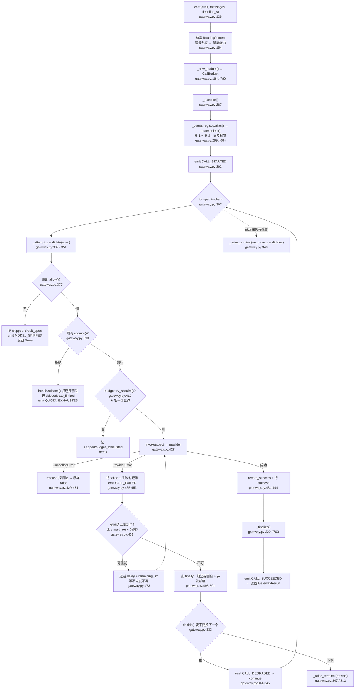
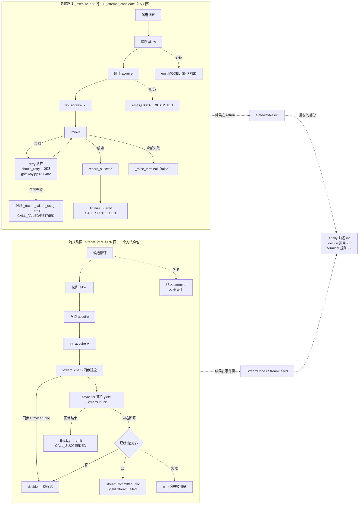
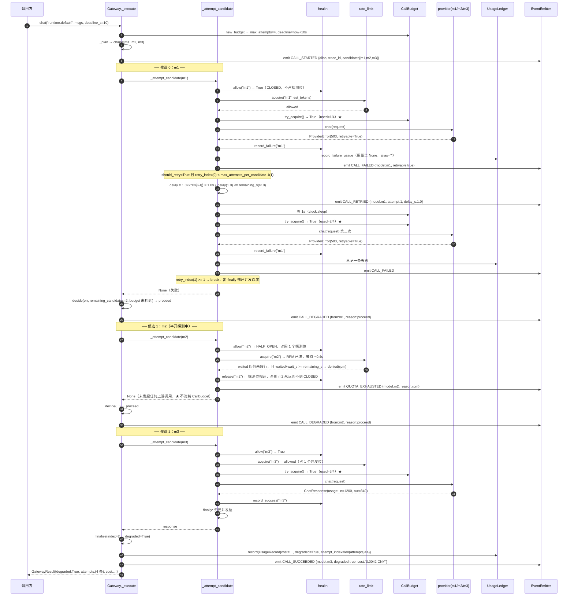

# 第 1 章 项目全景 & 第 6 章 回到骨架深潜 —— `src/gateway/gateway.py`

> 分析对象：`src/gateway/gateway.py`（865 行，占 `src/gateway` 模块 2860 行的 33%，是全模块最大的文件）
> 分析日期：2026-09-20 ｜ 代码基线：磁盘工作区（作者正在做 `chat` → `runtime` 全局改名，未完成）
> 覆盖率：本文件 865/865 行全部读过，明细见文末

---

# 第一部分（全景）：九道关，和把它们串成一个方法的那双手

## 1.1 先把问题摆正：为什么必须有 gateway 这一层

BesaAgent 要做的是软件测试全流程的多智能体平台 —— 需求、测试设计、用例、环境、执行、分析、缺陷。这条链路上的每一个环节都要跟模型说话，一次全量回归由多个 agent 并发驱动数千次调用。

`src/provider` 已经把「同一个请求在不同厂商 API 上怎么写」这件事做完了：它把 OpenAI 的 `response_format`、vLLM 的 `guided_json`、DashScope 的 `tools` 差异收敛成一个 `ChatRequest`。但 provider 是**单厂商视野**的：它只认识「我这次要调的那个模型」，失败了就失败了，它不知道也不该知道还有别的模型可换。

于是上层 agent 手里真正想要的东西，provider 一个都给不了：

| agent 真正想说的 | 而不是 |
|---|---|
| 给我一个**够用的模型** | 给我 `gpt-4o-mini` 这个具体型号 |
| 这家挂了，**自动换一家** | 我自己 `if` 判断再重试 |
| 几十个 agent 一起跑，**别把配额打爆** | 每处业务代码各自限流 |
| 这一轮回归**花了多少钱** | 事后谁也说不清 |
| 某个模型连续失败，**别再往上撞** | 每个调用方各自熔断 |

这五条诉求如果交给业务代码自己实现，会在第一次全量回归时同时爆掉三件事：换模型变成全仓库改代码；故障时各处的重试互相叠加成**重试风暴**；「这轮花了多少钱」永远答不出来。

所以 gateway 的存在理由（`需求说明书-gateway.md:39-51`）不是「多写一层抽象」，而是**把这四件事收敛到一个唯一入口**。它要回答的问题，正好是 provider 不回答的那三个：**选谁、失败怎么办、花多少、还活着吗**。

### 这个项目的设计哲学，一句话

> **拒绝静默：把不确定性压缩成可数、可读、可复现的东西。**

`gateway.py` 的每一处设计都在跟同一个敌人打架 —— 不是「模型偶尔失败」，而是**失败之后信息被静默地丢掉**。具体分四个面：

| 面 | 反面（要消灭的） | 在 gateway 里的落点 |
|---|---|---|
| ① 故障放大倍率有上界，且上界是**一个能读出来的数字** | 重试 3 × 候选 3 = 9 次，没人算过这个乘积 | `CallBudget.try_acquire()` 是**唯一**计数点（`retry.py:90`），编排里不允许出现第二个计数器 |
| ② 未知**不是** 0 | 上游没返回用量就记 0，成本凭空消失 | `Usage` 字段留 `None`（`gateway.py:715`、`772-776`） |
| ③ 降级**必须标记** | 换了模型不告诉任何人，「为什么这次答得差」永远查不出 | `GatewayResult.degraded` + `attempts`（`gateway.py:717`、`types.py:125-140`） |
| ④ 失败原因**全留**，不只留最后一条 | 「m1 超时 → m2 限流 → m3 鉴权失败」只显示最后一条 | `attempts` 保留每一次记录；`GatewayError.summary()` 压成一行（`errors.py:53-67`） |

后面所有分析都回到这四个面。尤其是 ① —— 它是 `NFR-G-04`，需求文档明确标注为「本模块**最重要的**非功能约束」（`需求说明书-gateway.md:299`），也是如果只能记住一句话时该记住的那句。

## 1.2 九道关：一次 `chat()` 到底要穿过什么

把 `gateway.py:136-349` 拉直，一次阻塞调用要依次穿过这些关卡。所谓「九道关」指的是九个必须按特定顺序发生的关注点 —— 顺序本身是约束，不是实现细节（`架构概要设计-gateway.md:122-129`）。

| # | 关卡 | 谁干 | 代码位置 | 它拒绝的静默 |
|---|---|---|---|---|
| 1 | **解析逻辑名** | `registry` | `gateway.py:687` → `_plan` | alias 拼错时列出所有可用名（`errors.py:81-95`），而不是「未注册」 |
| 2 | **选链（能力过滤 + 排序）** | `router.select()` | `gateway.py:688` → `router.py:178` | 过滤后为空 → `NoCapableModelError` 指名每个候选缺什么（`router.py:204`） |
| 3 | **开预算** | `CallBudget` | `gateway.py:790-796` | 上界从一开始就是个具体数字，不是事后统计 |
| 4 | **熔断硬拦截** | `health.allow()` | `gateway.py:377` | 熔断的模型**不消耗重试次数**，且留下 `skipped_reason="circuit_open"` 的记录 |
| 5 | **限流申请** | `LocalRateLimiter.acquire()` | `gateway.py:390` | 排队要计入 deadline；等不完的队改判换候选（`rate_limit.py:161`） |
| 6 | **预算计数** | `CallBudget.try_acquire()` | `gateway.py:412` | 唯一的计数点。走过这一支就说明不能再发请求了 |
| 7 | **重试循环** | `should_retry` + `compute_backoff` | `gateway.py:411-482` | 退避也要受总预算约束（`gateway.py:473`） |
| 8 | **降级决策** | `fallback.decide()` | `gateway.py:333` | 拒绝时给出**原因**（`no_more_candidates` vs `deadline`），因为两者修法相反 |
| 9 | **记账** | `usage` / `cost` | `gateway.py:320`、`449` | 失败也记；用量未知留 `None` 不留 0 |
| — | 事件（旁路） | `EventEmitter` | `_emit` 七处 | 只在门面发，且发射失败不许拖垮调用（`gateway.py:834-839`） |

这九道关里，**第 4 关和第 5 关的位置是最容易被写错的**，而写错不会报错 —— 只会让排障方向跑偏。这是 §1.4 要细讲的。

## 1.3 全景图：一个方法怎么把九道关串起来

这是整份报告的地基图。注意 `_execute` 只有 63 行 —— 它是**读**起来像那张顺序表的地方，真正的体力活被推到 `_attempt_candidate`。



图里有三个位置值得盯住：

- **`finally`（`gateway.py:495-501`）** 是这张图的兜底网。它同时管两件容易漏的事：熔断探测位和并发额度。取消路径从这张网的任意一点跳出去，都会被它接住。
- **`decide()` 在 `_attempt_candidate` 之外**（`gateway.py:333`）。这不是随手放的 —— 它让「每个候选各自重试，重试耗尽才换」这条约束在代码结构上成立：重试循环被封在候选内部，换候选的决策在外面。
- **★ 那一格** 是 `NFR-G-04` 的物理实现。整个文件里只有这一处 `try_acquire()` 调用。

## 1.4 顺序为什么是「约束」而不是「实现细节」

`架构概要设计-gateway.md:124-129` 给了一张四行的顺序表。这张表在代码里逐条可验证：

| 约束（文档 `:124-129`） | 违反的代价 | 代码证据 |
|---|---|---|
| `health` **先于** `retry` | 对一个已确认挂掉的模型重试三次，不只是浪费 —— 它会**挤占 `CallBudget`**，导致本该降级到健康模型的请求直接超时 | `gateway.py:377`（`allow`）在 `gateway.py:411`（retry 循环）之前 |
| `rate_limit` **先于** `retry` | 同上；且排队等待要计入 deadline | `gateway.py:390`（`acquire`）在 `411` 之前 |
| `retry` **在** `fallback` **之内** | 反过来的话，「换候选」会掩盖「同一模型的瞬时抖动」—— 一次 503 抖动就直接跳到更贵的备选 | `_attempt_candidate`（含 retry 循环）被 `_execute` 的候选循环调用（`gateway.py:309`），`decide` 在其**返回之后**（`gateway.py:333`） |
| `usage`/`cost` **在**每次尝试后 | 上游可能已计费（尤其流式半截断开），漏记会导致账单对不上 | 失败分支在同一次迭代内立刻记账（`gateway.py:449`）；成功走 `_finalize`（`gateway.py:320`） |

**为什么这张表不能散在九层装饰器里**：装饰器链的表达形式是 `handler = A(B(C(D(core))))`，从这一行**读不出**执行顺序（你得知道每个装饰器是「前置」还是「后置」，是包裹还是短路），更读不出「health 失败要**跳过** retry」这种跳转 —— 中间件模型的契约是「每一层都执行」，而这里需要的恰恰是「某一层不执行」。B-3 否决装饰器链的理由（`架构概要设计-gateway.md:414`）**在代码里成立**。

不过有一个诚实的补充：这条约束在代码里是**靠调用顺序**表达的，不是靠类型或断言。`gateway.py:377` 和 `390` 之间没有任何东西阻止有人把限流挪到熔断前面 —— 编译器不会拦，测试多半也不会红（除非专门构造「熔断 + 限流同时触发」的用例）。所以「一眼看出顺序错了」是**给人看的**，不是给机器验的。这是 B-3 的收益上限，也是它的边界。

## 1.5 865 行怎么分布的

这是后面所有「可读性/可测试性」讨论的事实基础：

| 区域 | 行范围 | 行数 | 占比 |
|---|---:|---:|---:|
| 文件头 docstring（含 B-3 / NFR-G-04 的声明） | 1-10 | 10 | 1.2% |
| import + 常量 + 协议（`_CHARS_PER_TOKEN`） | 12-65 | 54 | 6.2% |
| `EventName` / `EventEmitter` / `NullEmitter` | 68-98 | 31 | 3.6% |
| `Gateway.__init__`（9 个依赖的默认值组合） | 104-133 | 30 | 3.5% |
| **三个对外入口**：`chat` / `embed` / `stream_chat` | 136-284 | 149 | 17.2% |
| **`_execute`**（阻塞编排） | 287-349 | 63 | 7.3% |
| **`_attempt_candidate`**（单候选 + 重试） | 351-503 | 153 | 17.7% |
| **`_stream_impl`**（流式编排，含重试缺失） | 506-681 | 176 | 20.3% |
| **`_finalize`** | 703-762 | 60 | 6.9% |
| 其余私有辅助（`_plan` / `_resolve_model` / `_record_failure_usage` / `_new_budget` / `_cost_lookup` / `_estimate_chat_tokens` / `_raise_terminal` / `_emit` / `aclose` / 3 个 property） | 684-857 | 174 | 20.1% |
| 模块级 `_last_error` | 860-865 | 6 | 0.7% |

四个核心私有方法合计 452 行，占了文件的 52%。**「编排是一个方法」这句话在文件尺度上要打个折** —— 准确的说法是「编排没有藏在装饰器里，但它分住在四个方法中」。这个折价有多严重，见第二部分 §2.9。

---

# 第二部分（深潜）：回到把它们缝成一个方法的地方

前面五章把五个零件拆开讲了 —— `CallBudget` 怎么当唯一计数点、`health` 的状态机、`rate_limit` 的三维额度、`router` 的策略管道、`fallback` 的判定顺序。现在回到 `gateway.py`，看把它们缝成一个方法的那双手：它有没有把零件缝错边，接缝处有没有漏掉什么。

## 2.1 B-3 的证据：那个「一个方法」到底长什么样

先回答最直接的问题：**三个入口的编排落在哪里？**

| 入口 | 同步部分（调用瞬间执行） | 异步部分（编排） |
|---|---|---|
| `chat`（`gateway.py:136`） | 构造 `RoutingContext`（`:154`）、`_new_budget`（`:164`）、构造 `ChatRequest`（`:167`）、定义 `invoke` 闭包（`:179`） | `_execute`（`:183`） |
| `embed`（`gateway.py:194`） | 手工构造 `RoutingContext`（`:208`，**不走** `for_request`）、`_new_budget`（`:216`）、定义 `invoke` 闭包（`:218`） | `_execute`（`:222`） |
| `stream_chat`（`gateway.py:233`） | 构造 ctx、`_new_budget`、**`_plan` 选链**（`:264`）、定义 `build` 闭包 | `_stream_impl`（`:275`） |

三个入口都遵循同一个模式：**把「与候选无关的东西」先构造好，再交给一个统一的编排方法**。`chat` 和 `embed` 的差别只在两处 —— 一是能力集合的来源（`for_request` 从请求形态推导 vs 手工指定 `{Capability.EMBEDDING}`，`gateway.py:206-207` 有注释解释为什么不硬套 `for_request`），二是 `invoke` 闭包调的是 `model.chat()` 还是 `model.embed()`。这是**参数化得相当干净**的复用。

但 `stream_chat` 是个例外，它走的是另一条路（见 §2.2）。

### 四个私有方法的分工

| 方法 | 行数 | 它负责回答的问题 | 它**不**负责的 |
|---|---:|---|---|
| `_execute`（`:287`） | 63 | 候选链怎么走？这一轮要不要换下一个？所有候选都失败了抛什么？ | 单个候选内部的事（重试、限流、熔断） |
| `_attempt_candidate`（`:351`） | 153 | 这个候选还能不能打？打几次？每次失败要不要再打？探测位和并发额度什么时候还？ | 换不换候选（那是 `decide` 的事，在它外面） |
| `_stream_impl`（`:506`） | 176 | 流式版的全部上述逻辑 —— 一个人全包 | 重试（它没有）、事件（它不发） |
| `_finalize`（`:703`） | 60 | 成功的收场：算成本、记账、发事件、拼 `GatewayResult` | 失败时的收场（那是 `_raise_terminal`） |

这个拆法有个很值得学的细节：**`_attempt_candidate` 不接收 `alias`**。它的参数是 `spec / invoke / budget / attempts / trace_id / session_id / caller / estimate`（`gateway.py:351-362`）—— 全是候选内部需要的东西。这是有意的窄接口，但代价是实在的（§2.9 会算这笔账）。

### 那个「一个方法」实际有多长

`_execute` 本体 63 行，其中真正的控制流只有三个部分：

1. 发 `CALL_STARTED`（`:302-305`）；
2. `for` 循环 + `_attempt_candidate` + 成功则 `_finalize`（`:307-330`）；
3. 失败则 `decide` → 要么 `continue`，要么 `_raise_terminal`（`:332-349`）。

**把 `_execute` 单独读一遍，那张顺序表是能一眼看出来的** —— 我试过：只看 `:307-349`，你看到的正是「遍历候选 → 尝试 → 换候选 or 收场」。这个方法的抽象层次是对的：它说的是「策略」，细节都在下面。

而 `_attempt_candidate`（153 行）是唯一一个长到需要滚动屏的方法。它的内部结构是**顺序的三段**，从注释编号就能读出来（`gateway.py:376` 的「1. 熔断」、`389` 的「2. 限流」、然后才是 `409` 的 `try` / `411` 的 retry 循环）：

```
1. 熔断拦截        gateway.py:377-387   （13 行，含 skip 记录与事件）
2. 限流申请        gateway.py:390-406   （17 行，含探测位归还与 QUOTA_EXHAUSTED）
3. try/finally:
     3a. 预算计数  gateway.py:412-424
     3b. invoke    gateway.py:428
     3c. 失败分支  gateway.py:435-482   ← 这里占了 48 行，是本方法最重的一段
     3d. 成功分支  gateway.py:484-494
     finally:      gateway.py:495-501
```

**这张顺序表在代码里是「自上而下的」而不是「由外向内」的**，这恰恰是 B-3 想要的效果：如果是装饰器链，`health` 和 `rate_limit` 会是两个包裹层，你无法从任何单点看出谁先执行；现在它们就是上下相邻的两段代码。

**结论**：B-3 的「一个方法」在**精神上成立、在字面上要打折**。阻塞路径的编排被拆成 `_execute`（外层循环 + 决策）+ `_attempt_candidate`（单候选），拆法是**沿着「换候选 vs 换尝试」这条真实边界切的**，不是随便切的。所以顺序表仍然可读 —— 代价是你要同时看两个方法才能拼出完整顺序（`decide` 在 `_execute`，retry 在 `_attempt_candidate`，而文档说「retry 在 fallback 之内」，这个「之内」是通过**调用栈**而不是**缩进**表达的）。

## 2.2 双路径为什么必须分开：`_execute` vs `_stream_impl`

### 流式的本质约束

`_stream_impl` 存在，不是因为作者偷懒复制粘贴，而是因为**流式的返回形状根本不同**。

阻塞调用的形状是「函数返回一个值」：

```
async def chat(...) -> GatewayResult        # 结果在 return 里
```

流式调用的形状是「函数在结束时**无法**返回一个值」—— 因为 `chat` 早就在第一个分片吐出时就返回给调用方了。Python 的 `async def` + `yield` 里，`return value` 只能给生成器的 `StopAsyncIteration.value`，而 `async for` 会把它丢掉。**结果无处安放，所以结果只能作为事件发出**：

```
StreamEvent = StreamChunk | StreamDone | StreamFailed    # types.py:186
```

这个决策在 `types.py:156-157` 写得很清楚：「流式无法在结束时『返回』一个值，所以把结果作为**事件**发出。这样调用方一个循环就能同时处理增量、结束与失败，而不必额外持有状态。」

于是**错误也必须变成事件**：`StreamFailed(error=..., attempts=...)`（`types.py:174-183`）。这一点很关键 —— 它意味着流式路径上的错误**不能靠 raise 传播**，只能靠 yield。而 `_stream_impl` 里确实也保留了 `raise`（`:592` 的 `CancelledError`）和 `yield StreamFailed`（`:582`/`:626`/`:681`）两种出口。

### 为什么不能合并成一套

有人会想：既然阻塞路径最后也要 `return`，不如把阻塞也当成「只吐一个事件的流」？反过来，把流式的结果也塞进一个 `GatewayResult`？

两条路都不通：

1. **阻塞合成流**：`GatewayResult` 会退化成「一次性的 `StreamDone`」，调用方要写 `async for` 才能拿一个值 —— 把最常见路径的可用性降级了。而且「流式一旦输出正文就禁止降级」这条规则（`FR-G-05`）在阻塞路径上根本不存在（没有「正文已输出」的概念），合并后要么四处 `if stream:`，要么让阻塞路径背上一个不存在的状态。
2. **流式合成阻塞**：这是**最诱人也最糟**的方案 —— 把流式在 gateway 内部全部缓冲完，再返回一个 `GatewayResult`。它会让「流式」的语义彻底消失（用户拿不到增量），延迟从首字延迟退化成整段延迟。这个方案在别处有个名字叫「假流式」，是典型的**静默失真**：接口还在 `yield`，但用户已经拿不到流的价值了。

所以分开是对的。**但分开的代价必须算清楚** —— 而这个模块付的代价比「复制粘贴一次」更大，因为两份代码**已经开始漂移**了。

### 具体重复了什么

| 逻辑 | 阻塞路径 | 流式路径 | 是否等价 |
|---|---|---|---|
| 熔断拦截 + skip 记录 | `:377-387`（含 `emit MODEL_SKIPPED`） | `:527-531`（**无事件**） | 记录等价，事件不等价 |
| 限流申请 + 探测位归还 + skip 记录 | `:390-406`（含 `emit QUOTA_EXHAUSTED`） | `:533-544`（**无事件**） | 记录等价，事件不等价 |
| 预算计数 + skip 记录 | `:412-424` | `:548-556`（多记 `budget_blocked` / `blocked_at`） | 近似，流式多两个状态位 |
| `finally`：探测位 + 并发额度归还 | `:495-501` | `:661-666` | **逐字重复** |
| 成功后 `_finalize` | `:320-329` | `:648-659` | 逐字重复 |
| `decide()` 判定是否换候选 | `:333-339` | `:574-580`、`:605-611` | 参数相同，**返回值处理不同** |
| 收场：选哪种 terminal error | `_raise_terminal`（`:347`/`:813-832`） | 内联在 `:670-681` | **规则重复，实现不同**（见 §2.8） |
| `probe_outstanding` 标志的用法 | `:408`/`423`/`438`/`485`/`496` | `:546`/`:567`/`:591`/`:596`/`:630`/`:662` | 逐字重复的 6 处赋值 |

最刺眼的是最后两行：**`fallback.decide` 里那条 R-3 特别强调「容易写反、写反了不报错」的判定顺序规则，在 `gateway.py:668-671` 被内联重写了一遍**：

> R-3（`架构概要设计-gateway.md:462`）：「『没有下一个候选』排在『预算耗尽』之前……顺序写反不会报错，只会让排障方向跑偏」

`fallback.py:78-88` 把这条规则封装得很好，注释也写了「第 3 条必须排在第 4 条前面」。但流式路径的收场**没有调用它**，而是在 `gateway.py:670-671` 自己算了一遍：

```
exhausted = budget.exhausted_reason()
ran_out_of_candidates = not budget_blocked or (len(chain) - blocked_at - 1) <= 0
```

这两行是那条规则的**第二个实现**。它现在是对的（我逐个分支验算过：`budget_blocked` 为真且后面还有候选 → 报 `BudgetExhaustedError`；否则报 `AllCandidatesFailedError`），但它和 `fallback.decide` 之间没有任何机械约束保证两者继续一致。R-3 花了整整一行表格来警告「这条顺序容易写反」，然后同一条规则在同一个文件里被写了第二遍 —— **这是本模块最应该被消除的一处静默风险**，因为它的失败模式正是 R-3 描述的那种：不报错，只让排障方向跑偏。

### 流式路径的第二处不对称：它根本不重试

`_stream_impl` 里**没有 retry 循环**。`should_retry` 和 `compute_backoff` 只在 `_attempt_candidate` 被调用（grep 全文 `src/gateway/gateway.py:461`、`:466` 是唯二调用点），而 `_stream_impl` 里一次都没有。

也就是说，流式路径的每个候选只有**一次**机会：第一个分片都没吐出来时遇到 503，它的处理是 `decide(...)` → 换下一个候选（`gateway.py:574-581`），**不是**重试同一个候选。

这带来两个可观察的后果：

1. **`max_attempts_per_candidate` 这个配置在流式路径上完全无效**。配置里写着「每个候选重试 2 次」，但流式调用永远不会用到这个数字。这是一个「配置项存在但没人读」的情况 —— 正是 R-4 想要消灭的那种事（R-4 的理由是「配置里写的 `max_attempts_per_candidate` 变成一个没人读的数字」，`架构概要设计-gateway.md:463`）。R-4 在阻塞路径上把它救回来了，但流式路径上它仍然是死的。
2. **一次瞬时抖动会被记成「降级」**。阻塞路径上，m1 抖动 → 重试 m1 → 成功 → `degraded=False`；流式路径上，同样的抖动 → 直接换 m2 → `degraded=True`（`gateway.py:717`）。同一个上游故障，两条路径给出不同的 `degraded`，而 `degraded` 是给账单和「为什么这次答得差」用的标记。

需要公平地说：设计文档**没有**承诺流式要重试。`架构概要设计-gateway.md:259` 只说「`stream_committed` 为真时禁止降级与重试」，暗示了 `stream_committed` 为假时**可以**重试；而 §2.1 的顺序表（`:124-129`）是通用的，没给流式开豁免。所以更准确的描述是：这是一个**未文档化的实现不对称**，而不是一处明显的违约。它的合理成分是「流式的失败大多发生在中途，那时重试已经不可能」，但「首片之前同步抛错」（`gateway.py:563-583`）这一支明明是可以重试的。

### 流式路径的第三处不对称：它不记失败用量

`_record_failure_usage` 全文只有一个调用点：`gateway.py:449`（阻塞路径的 `ProviderError` 分支）。流式路径的两处失败分支（`:564-583`、`:593-627`）**都没有**调用它。

而 `架构概要设计-gateway.md:129` 给「usage/cost 在每次尝试后」这条约束写的理由是：

> 失败的调用也可能产生用量 | 上游可能已计费（**尤其是流式半截断开**），漏记会导致账单对不上

文档点名的、理由最充分的那种情况（流式半截断开），恰好是代码里唯一没记的情况。这是一处**真实的实现缺口**，不是取舍。它的后果正好落在设计哲学第 ④ 面（失败原因全留）和第 ② 面（未知不是 0）上：流式半截断开的成本会**静默消失**。

### 顺带的第四处：`reconcile` 从来没被调用过

`LocalRateLimiter.reconcile()`（`rate_limit.py:208-228`）的 docstring 说它是**必需的**：

> TPM 预扣的意义是「在请求发出前就占住配额」，但预扣值必然不准。不修正的后果是配额的占用只增不减 —— 跑一段时间后 TPM 会被永久占满，表现为「明明没打满却一直限流」。

`gateway.py:64` 的常量注释也承诺「误差由 `LocalRateLimiter.reconcile` 回补」。但 grep 整个 `src/` 和 `tests/`：**`reconcile` 只有定义，零个调用点**。反方向也一样：`UsageLedger.drain()`（交付给 `src/repo` 的唯一入口）在 `src/` 和 `apps/` 里也是零调用。

这两个都是「机制建好了但没接线」。它们不完全属于 `gateway.py` 的责任（`drain` 的接线在组合根，见 R-2 和 `composition/bootstrap.py`），但 `reconcile` 的调用点在编排里 —— 它应该在每次成功尝试后用 `response.usage` 修正预扣值。以 `_CHARS_PER_TOKEN = 4`（`gateway.py:65`）这个粗估的精度，不修正意味着 TPM 额度会单向漂移。

### 一张图看清两条路径



图右边那个 `DUP` 框就是这笔账：**为了让「结果在 `return` 里」和「结果在事件里」两种形状各自成立，编排逻辑被写了两遍**。重复的不是模板代码，是**有序的、带边界的决策逻辑** —— 这正是最不该重复的那一类。

## 2.3 `_finalize`：成功的收场做了什么

`_finalize`（`gateway.py:703-762`）只有 60 行，但它是一次成功调用里**最后一道信息闸门** —— 所有要流到账本、事件、返回值的字段都在这里定形。顺序是刻意的：

| 步 | 动作 | 位置 | 为什么在这个位置 |
|---|---|---|---|
| 1 | `usage = getattr(response, "usage", None) or Usage()` | `:715` | 用 `getattr` 而不是直接取属性，因为 `response` 既可能是 `ChatResponse` 也可能是 `EmbeddingResult`；**兜底是空的 `Usage()`（全 `None`）而不是 0** |
| 2 | `cost = self._cost.calc(spec.key, usage)` | `:716` | 缺价 → `Cost(amount=None)` → `str()` 得到「未知」（`types.py:119-122`） |
| 3 | `degraded = index > 0` | `:717` | 见下 |
| 4 | 写账本 `UsageRecord.from_parts(...)` | `:719-734` | **先记账再发事件** —— 账本是同步的、不会失败；事件可能被外部总线拖慢或抛异常 |
| 5 | 降级时 `_log.warning(...)` | `:736-740` | 日志是第三只眼睛：账本给财务、事件给总线、日志给排障 |
| 6 | `emit CALL_SUCCEEDED`（携带 `degraded` 与 `str(cost)`） | `:742-751` | |
| 7 | 拼 `GatewayResult` | `:753-762` | `attempts=tuple(attempts)` —— **冻成元组**，防止调用方改到编排的内部列表 |

### `degraded` 的判据，以及 R-6 的结构基础

判据只有一行：`degraded = index > 0`（`gateway.py:717`）—— 也就是**实际成功的候选不是尝试链的第一个**。

R-6 说 `degraded` **只表示运行时故障导致的降级**，缺密钥导致的不计（`架构概要设计-gateway.md:465`）。这个语义在代码里**不是靠 `if` 判出来的，而是靠结构保证的**：

1. 缺密钥之类的静态不可用，在 `registry` 构造期就被写成 `ModelSpec.unavailable_reason`（`registry.py:295`）；
2. `router.select()` 的第一件事就是 `available = [spec for spec in candidates if spec.available]`（`router.py:190`）—— 不可用的候选**根本进不了尝试链**；
3. 既然进不了链，它就占不到 `index`，也就永远无法把 `degraded` 顶成 `True`。

这是一个很漂亮的分工：**语义边界由过滤发生的位置决定，而不是由事后判断决定**。想验证 R-6 是否成立，不需要读 `_finalize`，只需要读 `router.py:190` 那一行。

再把 `index > 0` 的**可达路径**穷举一遍，确认它没有漏掉「静默降级」也没混进「非故障」：

| 让 `index` 前进到 1 的原因 | 是不是运行时故障 | `degraded` 应为 |
|---|---|---|
| 候选 0 熔断打开被跳过（`:377`） | 是（它之前连续失败过） | `True` ✓ |
| 候选 0 限流被拒（`:390`） | 是（配额是运行时状态） | `True` ✓ |
| 候选 0 上游报错且不可重试（`:435`） | 是 | `True` ✓ |
| 候选 0 上游报错、重试耗尽（`:461`） | 是 | `True` ✓ |
| 候选 0 静态不可用（缺密钥） | 不是（配置问题） | 结构上不可能进链 ✓ |

**结论：R-6 成立，且是靠 `router.py:190` 一行过滤成立，不是靠 `_finalize` 里的判断。** 这正是「用结构消除一整类 bug」的第二个实例（第一个是 `CallBudget`）。

### 一处小的语义错位：`attempt_index`

`_finalize` 写账本时用 `attempt_index=len(attempts)`（`gateway.py:732`），而 `UsageRecord.attempt_index` 的文档语义是「本次是第几次尝试（含首发）。重试会重复计费，这个字段让账单可解释」（`usage.py:48`）。

问题在于 `attempts` 里**混着 skipped 记录**。构造一个具体的例子：候选 0 熔断打开被跳过（记 1 条 `skipped`）→ 候选 1 第一次调用成功（记 1 条 `success`）→ `attempt_index = 2`。但这次调用**只向上游发了一次请求**。所以「第几次尝试」这个字段在有任何 skip 的情况下会**偏大**，而它存在的理由恰恰是「让账单可解释」。

同一个字段还与 `degraded` 用**不同的计数基准**：`degraded` 看链位置（`index`），`attempt_index` 看记录条数（`len(attempts)`）。两个都在同一个 `UsageRecord` 里，看起来是一对，其实不是一套数。修法很简单（记 `budget.attempts_used`，也就是那个唯一计数点的读数），但那需要把 `budget` 传进 `_finalize` —— 一个「多传一个参数」和「字段语义正确」之间的取舍。

## 2.4 B-4 的证据：事件只在门面发 —— 以及它漏了什么

### 定义与契约

| 元素 | 位置 | 要点 |
|---|---|---|
| `EventName`（8 个常量） | `gateway.py:68-82` | 字符串常量，不是 `Enum`。带 TODO：`src/event` 实现后应移入 `src/event/types.py`（`:71`） |
| `EventEmitter`（Protocol） | `gateway.py:85-88` | 只有一个**同步**的 `emit(name, payload) -> None` |
| `NullEmitter`（默认） | `gateway.py:91-98` | 「默认值必须是静默的 —— 事件是**观测**，不该成为调用链路的依赖」 |
| `_emit`（唯一出口） | `gateway.py:834-839` | `try: ... except Exception: _log.debug(..., exc_info=True)` |

三点值得注意：

1. **`emit` 是同步的**。这不是随手写的：它让事件总线**无法**在热路径上做网络 I/O，从而保住 `NFR-G-03`（gateway 自身单跳 < 1ms，`需求说明书-gateway.md:298`）。代价是把「不阻塞」的责任推给了将来 `src/event` 的实现 —— 如果那时有人写了个同步发 HTTP 的 emitter，这条 1ms 预算会在**没有任何网关代码变更**的情况下被打破。这是一个把风险外推给下游的设计，值得在 `EventEmitter` 的 docstring 里写死（现在没写）。反过来看，如果做成 `async def emit`，`_emit` 就在热路径上多一个 await 点 —— 也就是多一个取消泄漏窗口（见 §2.5）。所以同步是更安全的选择。
2. **`except Exception` 而不是 `except BaseException`**（`:838`）—— 这个选择很关键：`asyncio.CancelledError` 在 Python 3.8+ 继承 `BaseException`，所以**取消不会被事件总线吞掉**，且 emitter 里真的抛 `CancelledError` 时会正确传播。同时普通异常被吞掉 + `_log.debug`，保证了「观测失败不能拖垮调用」（有测试：`tests/unit/gateway/test_acceptance.py:437-453`）。
3. **payload 是各处内联的字面 dict**，没有统一的构造器 —— 这正是下面差集的来源。

### FR-G-10 要求的 7 类事件 vs 实际发射

需求（`需求说明书-gateway.md:249`）要求至少：**调用开始 / 调用成功 / 调用失败 / 发生重试 / 发生降级 / 熔断状态变更 / 配额耗尽**。

全文 7 个 `_emit` 调用点，逐一列出：

| 常量 | 定义 | 发射点 | 触发条件 | payload |
|---|---|---|---|---|
| `CALL_STARTED` | `:75` | **仅** `:302`（`_execute`） | 选链完成、进入候选循环前 | `alias, trace_id, candidates[]` |
| `CALL_SUCCEEDED` | `:76` | **仅** `:742`（`_finalize`） | 任一候选成功 | `alias, model, trace_id, degraded, cost` |
| `CALL_FAILED` | `:77` | **仅** `:450`（`_attempt_candidate`） | 单次尝试遇 `ProviderError` | `model, error, retryable` |
| `CALL_RETRIED` | `:78` | **仅** `:477`（`_attempt_candidate`） | 决定再试一次同一候选 | `model, attempt, delay_s` |
| `CALL_DEGRADED` | `:79` | **仅** `:341`（`_execute`） | `decide` 允许换下一个候选 | `alias, trace_id, from, reason` |
| `MODEL_SKIPPED` | `:80` | **仅** `:386`（`_attempt_candidate`） | 熔断打开、未发起调用 | `model, reason` |
| `QUOTA_EXHAUSTED` | `:82` | **仅** `:402`（`_attempt_candidate`） | 限流被拒 | `model, reason` |
| `CIRCUIT_OPENED` | `:81` | **零** | —— | —— |

### 差集（这是本节的重点）

**差集一：`CIRCUIT_OPENED` 定义了但从未发射。** grep 整个 `src/`，`:81` 是它唯一的出现。所以 `FR-G-10` 明确点名的「熔断状态变更」这一类事件，**目前一个都没有**。

这里要给代码一个公平的辩解：熔断生效**并非完全不可观测** ——

- 熔断打开时 `health.py:156` 会 `_log.warning("熔断打开：model=...")`；
- 每一次因熔断被跳过的调用都会发 `MODEL_SKIPPED`（`:386`）；
- `gateway.health.snapshot()`（`health.py:224-225`）可以轮询出所有熔断器的状态。

但三者都不是「状态变更事件」：`MODEL_SKIPPED` 是**后果**（第一次跳过之后每次都会发，无法区分「刚打开」和「已打开很久」）；日志不是事件总线；轮询要有人定时去问。**HALF_OPEN 的进入与 CLOSED 的恢复更是没有任何事件**（`health.py:164-175` 只有日志）。而 B-4 又明确规定子模块不许发事件 —— 于是「谁能发这个事件」在结构上只剩门面，但门面只在调 `allow()` 时才知道状态，那时已经是「跳过」而不是「变更」。

**这是一处真实的契约缺口，而不是取舍。** 它的失败模式正好是设计哲学要消灭的那类：一个模型在熔断恢复链上卡住（比如 §2.5 要讲的探测位泄漏），你在事件流里看到的是「这个模型再也没出现过」，而不是「它进了半开、然后再没出来」。

**差集二：流式路径几乎不发事件。** `_stream_impl` 里**一个 `_emit` 都没有**。它唯一能发的事件是 `CALL_SUCCEEDED` —— 通过调用 `_finalize`（`:649`）间接发的。所以对一次流式调用：

| 要求的事件 | 流式路径是否发出 |
|---|---|
| 调用开始 | **否** |
| 调用成功 | 是（经 `_finalize`） |
| 调用失败 | **否**（失败走 `yield StreamFailed`，不发事件） |
| 发生重试 | 不适用（流式不重试，见 §2.2） |
| 发生降级 | **否**（`CALL_DEGRADED` 只在 `_execute:341`） |
| 熔断状态变更 | 否（阻塞路径也没有） |
| 配额耗尽 | **否**（`QUOTA_EXHAUSTED` 只在 `_attempt_candidate:402`） |

也就是说：**一次流式调用在事件总线上只留下一条「成功」记录，失败时连一条都没有。** FR-G-10 的验收点（`需求说明书-gateway.md:255`）写的是「事件序列完整反映 {开始、重试、降级、成功}」，而 `tests/unit/gateway/test_acceptance.py:416-434` 的 `test_b14` 只测了阻塞路径 —— 所以这个缺口在测试上是**静默的**：没有任何一条断言会因为它变红。

**差集三：payload 里没有会话与调用方。** FR-G-10 要求「事件必须携带可关联的标识（**会话、调用方**、逻辑名、实际模型、尝试序号）」（`需求说明书-gateway.md:251`）。实际 payload 里：

- `session_id`：7 个发射点**一个都没有**；
- `caller`：同样一个都没有。`_attempt_candidate` 确实收了这两个参数（`:359-360`），但它们只被用于 `_record_failure_usage`（`:449`）—— **事件与账本用了两套不同的关联字段**；
- `trace_id`：只有 3 处有（`CALL_STARTED`/`CALL_DEGRADED`/`CALL_SUCCEEDED`）。`CALL_FAILED`/`CALL_RETRIED` 这种最需要按 trace 聚合的**中间过程事件反而没有**；
- 字段名也不统一：开始/降级用 `alias`，失败/重试用 `model`，跳过/配额用 `model + reason`。

后果很具体：一个事件消费者**无法**把「这次调用」的 5 条事件按会话或 trace 串起来 —— 它能看见一堆散点，串不成线。而 FR-G-10 存在的全部意义就是串成线。

### 一句话总结 B-4

**「只在门面发」这条做到了**（grep 确认：整个 `src/` 只有 `gateway.py` 调 `emit`，`bootstrap.py:30` 只是把 emitter 注入进来）。**「发了什么」这条打了折扣** —— 三类事件漏发、流式路径基本空白、关联字段不全。B-4 解决的是「事件语义散在 9 个文件里」的问题；它没解决的是「门面自己忘发了」。

## 2.5 取消传播：三处 `except`、两处 `finally`，和一个真实的泄漏窗口

`FR-G-11`（`需求说明书-gateway.md:265`）和 provider 篇的 `FR-P-14` 都要求 `CancelledError` **原样传播**。逐个检查可能吞掉它的地方：

| 位置 | 写法 | 判定 |
|---|---|---|
| `gateway.py:429-434` | `except asyncio.CancelledError:` → 归还探测位 → `raise` | **正确**：裸 `raise`，不包装、不转换成失败 |
| `gateway.py:589-592` | 同上（流式 `async for` 内） | **正确** |
| `gateway.py:435` / `:564` / `:593` | `except ProviderError` | 不吞 `CancelledError`（它不是 `ProviderError` 的子类） |
| `gateway.py:838` | `except Exception`（`_emit` 内） | **正确**：`CancelledError` 继承 `BaseException`，不被捕获 |
| `gateway.py:495-501` / `:661-666` | `finally` 里归还探测位与并发额度 | **正确**：`finally` 在取消路径上必然执行 |

`FR-G-11` 在这里是达标的。而且 `:429-434` 那段注释把「为什么取消不能记成失败」写清楚了 ——

> 取消既不是成功也不是失败：模型没出错，是我们的调用方不想等了。记成失败会污染熔断计数 —— 连续几次用户取消就能把一个健康模型熔断掉。

这是一个很实际的洞见：**把「用户不等了」记成「模型挂了」，会让熔断器变成用户行为的函数**。这个 bug 的表现是「大家都在 Ctrl-C 的时候，模型开始集体熔断」。

### R-5 的兜底：`probe_outstanding` 标志

R-5 说 `CircuitBreaker.release()` 是取消路径上最容易漏的地方（`架构概要设计-gateway.md:464`），漏了的后果是「HALF_OPEN 探测位被永久占用 → 模型再也恢复不到 CLOSED，且日志上只看见一条『进入半开探测』」。

编排里的兜底是一个 `bool` + `try/finally`：

```
:408   probe_outstanding = True          # 在限流放行之后「上膛」
:496   finally: if probe_outstanding: self._health.release(spec.key)
```

逐一列出所有出口，看这个标志是否覆盖全：

| 出口 | 位置 | 探测位怎么还 | 标志 |
|---|---|---|---|
| 限流被拒 | `:393` | 显式 `release()` | 尚未上膛（`:408` 之前） |
| 预算耗尽 | `:422` | 显式 `release()` | 置 False（`:423`） |
| 取消 | `:432` | 显式 `release()` | 置 False（`:433`） |
| 上游失败 | `:437` | `record_failure()` 内部归还 | 置 False（`:438`） |
| 成功 | `:484` | `record_success()` 内部归还 | 置 False（`:485`） |
| **其它异常**（`AttributeError`、`httpx` 未包装的错等） | 无显式分支 | **`finally` 兜底** | 仍为 True → 归还 ✓ |

那个 `probe_outstanding = False` 看着啰嗦，其实在防**反向的错误**：`CircuitBreaker.record_success/record_failure` 内部已经做了 `probes_in_flight -= 1`（`health.py:130`、`:142`），如果 `finally` 再 `release()` 一次，就是**多还一个**。多还的后果不是「泄漏」而是「超额」：`release()` 有 `max(0, ...)` 保护（`health.py:127`），不会变负；但两个探测同时在飞时多还一个，会让计数变成 1，于是第三个探测被放进来 —— **HALF_OPEN 的探测上限（默认 2）被静默突破**。所以这个标志同时是「防泄漏」和「防重复归还」，两件事都必要。

### 但这里有一个真实的漏洞：上膛太晚

把 `_attempt_candidate` 的前 60 行按时间顺序摊开：

```
:377   if not self._health.allow(spec.key):     ← HALF_OPEN 下这里占了一个探测位
       ...
:390   decision = await self._limiter.acquire(spec.key, ...)   ← ★ 一个真正的 await 点
       ...
:408   probe_outstanding = True                 ← 上膛
:409   try:
```

**在 `:377` 与 `:408` 之间有一个 `await`**。`LocalRateLimiter.acquire` 在额度不足且 `on_exceed="wait"` 时会 `await self._clock.sleep(wait_s)`（`rate_limit.py:166`），生产实现是 `await asyncio.sleep(seconds)`（`foundation/clock.py:59-62`）—— 这是一个货真价实的挂起点。

所以：**如果一个取消恰好落在这个限流等待期间，而该模型此刻处于 HALF_OPEN，那么 `:377` 占下的探测位泄漏了** —— 没有 `try/finally` 覆盖它，`probe_outstanding` 还没上膛。`_stream_impl` 有完全相同的窗口（`:527` 占位 → `:533` await → `:546` 上膛）。

泄漏的后果与 R-5 描述的**一字不差**：HALF_OPEN 的探测位永久少一个，`half_open_probes` 默认为 2，两次这样的取消就能让这个模型**再也回不到 CLOSED**，而日志上只留着一条「熔断冷却到期，进入半开探测」（`health.py:168`）。

三点补充，让这个结论既不过度也不轻描淡写：

1. **触发条件窄但真实**：需要「熔断器处于 HALF_OPEN」+「限流器正在排队等待」+「此刻被取消」三者同时成立。它不是每天都发生，但它一旦发生就是**永久**的（除非重启进程），而且它的症状出现在离原因极远的地方。
2. **现有测试结构上抓不到它**：`FakeClock.sleep` 里**没有 `await`**（`clock.py:108-114`，只推进虚拟时间）—— 也就是说在测试环境里 `:390` **不是**一个挂起点，取消无法在那里被投递。`test_b15_cancellation_releases_quota`（`tests/unit/gateway/test_acceptance.py:461-485`）用 `BlockingTransport` 把任务挂在**上游调用内部**（`:428` 那个 await），那是 `try` 块里面、标志已上膛的位置 —— 所以它测的是「覆盖得很好的那条路径」。**这条漏洞在被测覆盖率的盲区里**。
3. **修法很小**：把 `:408` 的 `probe_outstanding = True` 提到 `:377` 的 `allow()` 成功之后、`:390` 之前；或者把 `:390` 的限流申请也纳入 `try` 的范围。前者一行改动。这个细节值得单独提，因为它是「兜底机制本身有缝」而不是「有人忘了写兜底」—— 前者更难发现，因为它披着「我已经用了 finally」的外衣。

### 另一条边界：非 `ProviderError` 的异常不归一化

如果 `invoke()` 抛出的不是 `ProviderError`（比如 provider 漏包装的 `httpx` 异常、或者 gateway 自己的一处 `AttributeError`），它会**穿过 `except ProviderError` 和 `except CancelledError`**，经由 `finally` 归还资源后**原样逃出编排**：

- 不会被重试（`should_retry` 只认 `retryable` 属性，`retry.py:162`）；
- 不会触发降级（`decide` 根本不会被调用）；
- 不会被归一化成 `GatewayError`，**`attempts` 也不会附在错误上**。

这意味着 `FR-G-11` 的「不泄漏厂商细节」实际上是**由 provider 层独自保证**的（要求它把所有上游异常都包装成 `ProviderError`），gateway 侧没有第二道防线。这是一个**有意的取舍**（把非预期异常当编程错误，不该重试、不该降级 —— 这个立场是对的，重试一个 `AttributeError` 只会掩盖 bug），但它的代价是：一次「provider 忘了包装」会在上层表现为一个无 `attempts`、无 alias、无 trace 的裸异常，排障信息全丢。这类情况值得在编排里补一个「归一化但**不重试**」的分支（把未知异常包成 `GatewayError` 并附上 `attempts`，然后立即抛）—— 那与「不重试」并不冲突。

## 2.6 `_raise_terminal` / `_last_error`：错误怎么收口

### 所有候选失败后抛什么

阻塞路径有两个收口点：`gateway.py:347`（`decide` 说不换）和 `:349`（链走完了还有残留）。两者都调 `_raise_terminal(reason, alias, attempts, trace_id)`（`:813-832`），它按 `reason` 分派：

| `reason` | 抛出的异常 | 位置 | 提示了什么 |
|---|---|---|---|
| `"attempts"` / `"deadline"` | `BudgetExhaustedError` | `:821-824` | 附修法提示：调 `total_max_attempts` 还是调 `deadline.default_s`（`errors.py:121-124`） |
| `"stream_committed"` | `StreamCommittedError` | `:825-826` | **死代码**：`_execute` 传的 `stream_committed=False`（`:338`），`decide` 不可能返回这个 reason |
| 其它（`no_more_candidates` / `fallback_disabled`） | `AllCandidatesFailedError`，消息里带上 reason | `:827-832` | 「所有候选均失败（fallback_disabled）」比干巴巴的「全部失败」多给一条线索 |

**错误信息里到底有什么**：编排只负责把 `attempts` 塞进去，真正的组装在 `GatewayError.__str__`（`errors.py:69-78`）：`message` + `alias=` + `[摘要]` + `trace=`。摘要是 `summary()`（`errors.py:53-67`），把每条记录压成 `模型:原因`、跳过的写成 `模型:跳过(原因)`，用 ` → ` 连起来：

> `所有候选均失败（no_more_candidates） alias=runtime.default [m1:503 Service Unavailable → m2:跳过(rate_limited:rpm) → m3:401 Unauthorized] trace=...`

这就是 `FR-G-11` 要的「含各候选的失败原因摘要」（验收点 `需求说明书-gateway.md:267`）。这个设计把「保留全部记录」和「别把九个模型的九个报错倾倒给用户」这对矛盾处理得不错：**摘要给用户，全量 `attempts` 给排障**。`tests/unit/gateway/test_acceptance.py:118-140`（`test_b5`）和 `:493-509`（`test_b16`，验证 API Key 不出现）都覆盖到了。

### `_last_error` 为什么在查 attempts

先纠正一个容易形成的印象：**代码并没有在这里反查「异常对象」**。

```
gateway.py:860-865
def _last_error(attempts) -> Exception | None:
    for record in reversed(attempts):
        if record.outcome == "failed":
            return RuntimeError(record.error or "候选失败")
    return None
```

它是**从记录里重建了一个新的 `RuntimeError`**。这么做的原因有两层：

1. **`AttemptRecord` 故意不存异常对象**（`types.py:96`）：`error: str | None`，注释写着「**不存异常对象** —— 它会被长期持有，可能泄漏」。一次调用的 `attempts` 会随 `GatewayError` 一起被上层长期持有，如果里面挂着 `httpx` 异常的引用链（可能含连接、请求体、**请求头里的 API Key**），泄漏面就大了。B-16 的验收点（错误里不得含 Key）就建立在这个决定上。所以「重建」不是偷懒，是**被迫的正确做法**。
2. **`decide` 需要一个非空 `BaseException`**：`:333-339` 的调用点还写了 `or RuntimeError("候选失败")` 兜底，以防 `attempts` 里一条 `failed` 都没有（例如所有候选都是被跳过的）。

但这里有一个**值得记下来的接口错位**：`decide(error, *, ...)` 的 `error` 参数**在当前实现里从头到尾没被读过**（`fallback.py:64-99` 只检查 `stream_committed` / `policy.enabled` / `remaining_candidates` / `budget`）。`fallback.py:87` 甚至专门写了一句注释解释为什么在预算耗尽那一支不看 `error.retryable`。所以现状是：**为了一个没人读的参数，编排每次都要重建一个异常对象。**

这个「预埋的接口」有真实风险：如果将来有人让 `decide` 按错误类型做判定（这是很自然的演进方向 —— 「401 不该降级，因为所有候选可能共用同一个 Key」），它拿到的会是一个**丢掉类型的 `RuntimeError`**，判定会静默失真 —— 而这恰恰是最难发现的那类 bug（没有异常，只是决策方向悄悄变了）。两条路都比现状好：要么把 `error` 从 `decide` 的签名里删掉（等真需要时再加），要么把参数改成它真正需要的形状（`error_retryable: bool | None` 之类），让「信息在传递中丢失」这件事发生在类型签名上而不是运行时。

## 2.7 一次降级调用的完整时序

把前面所有机制放进同一条时间线：`m1` 报 503 被重试一次后仍失败 → 换 `m2`，`m2` 被限流拒 → 换 `m3` 成功；期间预算是 `total_max_attempts=4`、每候选 2 次，`m2` 处于 HALF_OPEN。



这张图里几个刻意的位置关系值得指出来：

- **`try_acquire` 出现了 3 次，used 只走到 3/4** —— 而如果没有 `CallBudget`，最坏情况是 `3 候选 × 2 次 = 6` 次上游调用。上界从 6 变成 4，而且这个「4」**可以从配置里读出来**（`retry.total_max_attempts`，`retry.py:124`）。这就是 `NFR-G-04` 说的「上界是一个能被读出来的数字」。
- **`m2` 全程零上游调用**（熔断/限流跳过），`used` 停在 2 —— 熔断与限流在 `try_acquire` **之前**拦截，所以它们不消耗预算。这正是顺序表第 1、2 行的价值：如果反过来（先扣预算再查熔断），`m2` 会白吃掉一个额度，`m3` 可能就轮不到了。
- **唯一一处 `release()` 是限流拒绝那次**（图中第 17 行）—— 那正是 R-5 说的「最容易漏」的位置。
- **账本里 `attempt_index=4`**（图最后一条），但真正发往上游的只有 3 次 —— §2.3 那个偏大的例子在这条时间线上真实发生了。

## 2.8 批判性评估：「单方法编排」这笔账

先把 B-3 的原话摆在桌上：**编排是一个方法，不是九层装饰器**，理由是顺序是约束、散在九层里没人能看出顺序错了，且装饰器链难以表达「health 失败要跳过 retry」（`架构概要设计-gateway.md:414`）。

我的结论分三句：

1. **B-3 否决装饰器链的理由是对的**，而且它对标的是工程界真实存在的坏做法；
2. **但 B-3 论证的是一个假二分**（「一个方法」vs「九层装饰器」漏掉了第三种、也可能是更好的选择）；
3. **它的收益在流式路径上已经部分失效** —— 同一条顺序规则被写了第二遍，而 R-3 恰好警告过这条规则写反了不报错。

### 2.8.1 装饰器链为什么确实该被否决

拿业界最常见的两种中间件模型对照：

| 模型 | 代表 | 顺序表达 | 短路（skip）的表达 |
|---|---|---|---|
| **线性管道** | Express `app.use(...)` | 顺序 = 注册顺序，读代码看不出（要看注册处） | 不调 `next()` —— 合法的静默短路，且没人知道发生了 |
| **洋葱模型** | Koa `await next()` | 顺序 = 嵌套关系，前置/后置对称 | 只能靠**抛哨兵异常**，或用「不 await next()」—— 后者又回到线性模型的问题 |
| **本设计的「一个方法」** | `gateway.py` | 顺序 = 语句的上下位置（`allow` 在 retry 之前是**字面相邻**） | 就是一个 `continue`，而且**必须写明 skip 原因**（`AttemptRecord.skipped_reason`） |

第三列的差别是本质的：**中间件模型没有「跳过」这个一等公民**，而本模块的顺序表里有两条约束都是「跳过」（熔断跳过、限流跳过）。用哨兵异常表达跳过，会把「控制流」和「错误处理」混在一起 —— 而错误处理在这条链上已经够复杂了（`ProviderError` / `CancelledError` / 预算耗尽 / 流式已提交）。所以 B-3 是对的，而且理由比文档写的更强：不只是「看不出顺序」，而是**中间件模型缺少本设计最需要的那一种控制流**.

顺带验证一下文件头那句最硬的自我约束（`gateway.py:8-9`）：

> **唯一的上游计数点是 `CallBudget`**。本文件里**不允许出现第二个 attempt 计数器** —— 一旦出现，上界就不再可知。

我按这个约束逐个查了可能成为「第二个计数器」的东西：

| 候选 | 位置 | 是否违反 |
|---|---|---|
| `budget.try_acquire()` | `:412`、`:548` | 合规 —— 这就是那个唯一计数点 |
| `retry_index`（单候选内的重试序号） | `:410`、`:476` | **不违反**：它只在一次 `_attempt_candidate` 内有效，且与预算的关系是 R-4 要求的「两个上限都判」（`:461-463`），不参与全局封顶 |
| `len(attempts)` | `:308` 附近的 `remaining`、`_finalize:732` | 不违反：`remaining` 只用于「还有没有候选没试」，不封顶次数 |
| `len(chain)` | `:308`、`:671` | 不违反：候选数上限是配置事实，不是运行时计数 |

**这条约束守住了。** 值得记一笔：`retry_index` 是最接近违规的那一个 —— 它是个真实的计数器，而且它「合法」的理由不是形式上不叫 counter，而是**它管的上界（单候选）与全局上界正交**，且两者都用到了（R-4 的教训）。如果有人哪天用 `retry_index` 去判「总共还能打几次」，约束就破了，而代码里没有任何东西会阻止这件事。

### 2.8.2 可测试性：注得进，但只能在门口测

**好的一面是这个模块对可测试性的投入在同类项目里算罕见的**：

- 时间可注入：`Clock` 协议 + `FakeClock` 放在 `src/`（`foundation/clock.py`），退避、冷却、限流窗口全部可快进；
- 上游可注入：`Registry.from_config(provider_options={"transport": httpx.MockTransport(...)})`（R-7 专门为此新增的测试注入点，`架构概要设计-gateway.md:466`）；
- 九个依赖全部有默认值且都能替换（`gateway.py:104-128`），`bootstrap.py` 负责生产装配，测试用 `conftest.py` 的 `gateway_factory` 装配（`tests/unit/gateway/conftest.py:100-117`）。

结果就是 `test_acceptance.py` 里 20 个用例（`grep "^def test_\|^async def test_"` 计数）能覆盖 B-1 ~ B-16 的验收点，而且**不用真网络、不用真等待**。

**代价在另一头：编排的内部结构无法被单独测试。** 全文 grep 下来，`tests/` 里**没有任何一处**调用 `_execute` / `_attempt_candidate` / `_stream_impl` / `_finalize` —— 所有测试都从 `gateway.chat()` / `gateway.stream_chat()` 进去。这不是懒，而是**这些私有方法的签名决定了它们没法被孤立地调用**：要调 `_attempt_candidate`，你得先手工造出 `ModelSpec`、`CallBudget`、`RoutingContext`、`invoke` 闭包、`attempts` 列表 —— 也就是**重建一遍 `_execute` 里已经做过的事**。于是：

- 一条只在「流式 + 熔断 + 取消」组合下才出现的 bug（比如 §2.5 的探测位泄漏），**没有单元测试的落点**，只能靠端到端构造；
- 测试的**规模感**被抬高了：`conftest.py` 用了 199 行来搭台，其中 `HostRouter`（按 host 分流，用于模拟多厂商）、`BrokenStreamTransport`（吐 2 片再断）、`BlockingTransport`（挂住不返回）都是为编排路径专门写的。这些工具很有价值，但它们的存在本身说明：**要触达编排的某个分支，成本是「写一个传输层替身」而不是「调一个函数」**。

一句话：**注得进（依赖注入做得好），但测不细（不可从内部拆开测）**。前者是设计给的，后者是「私有方法只吃自己人的参数」这个决定的账单。

### 2.8.3 可读性：真正的成本不是长度，是「同一件事的三个副本」

865 行、四个核心方法 452 行 —— 单看长度并不夸张（Python 项目里 800 行的模块很常见）。真正的成本在三处：

1. **顺序规则被实现了三遍**。`fallback.decide`（`fallback.py:78-88`）一遍；`gateway.py:670-671` 的流式收场内联了第二遍。第三遍是「顺序本身」：`_execute` 里 `decide` 在循环内、`_attempt_candidate` 里 retry 在循环内 —— 这是**靠调用栈**表达的那一遍，我把它算作「必要的一份」，因为把 retry 挤进 `_execute` 只会让那个方法变长。
2. **11 处手工构造 `AttemptRecord`**（`:379, 395, 415, 440, 487, 529, 539, 550, 569, 598, 631`）。每处都要自己记着填 `outcome` / `skipped_reason` / `retryable` / `elapsed_s`。想加一个字段（比如「这个候选当时是不是处于 HALF_OPEN」）要改 11 处，漏一处不会报错（dataclass 有默认值）—— **默认值在这里是沉默的同谋**。
3. **最密的一段是 `:435-482`**（48 行）：一次失败要同时完成「补 trace、记熔断、造记录、记失败用量、发事件、判两个上限、算退避、判退避能否等完、发重试事件、睡觉」。这是全文件认知负荷最高的地方，也是**唯一一处我建议拆的地方** —— 它可以是一个 `_handle_failure(...) -> "retry" | "stop"` 的纯函数式的决策，把「做什么」和「决定什么」分开。注意这跟 B-3 不冲突：拆出去的是**决策**（retry.py 的 `should_retry` 已经是这个思路），留在原地的仍是顺序。

### 2.8.4 改一处的影响面：这是最贵的一条

| 想改的东西 | 要动几处 | 会不会报错 |
|---|---:|---|
| 新增一类事件（例如 `CALL_SKIPPED`） | 2 条路径 × N 个 skip 分支（阻塞 3 处 + 流式 3 处） | 不会 —— 漏发是静默的（现状就是流式 0 事件） |
| 改失败时记账的内容 | `_record_failure_usage`（1 处定义）+ 调用点（阻塞 1 处、流式 **0 处**） | 不会 —— 流式漏记不会红 |
| 改「怎么选 terminal error」 | `fallback.py:78-88` + `gateway.py:670-671` + `_raise_terminal:813-832` | 不会 —— 三处可以各说各话 |
| 给 `AttemptRecord` 加字段 | 11 处构造点 | 不会（dataclass 默认值兜住） |
| 改降级判定 | `fallback.decide`（1 处）✓ | 会 —— 这条是收敛得最好的 |

**这就是「一份逻辑两个实现」的真实价格：不是多写了几行，而是失去了「改一处就对了」这个性质。** 而它和设计哲学正面冲突：设计哲学要消灭的四件事（静默降级、静默错位、静默失真、静默失效），在这张表里以「改了一处、另一处静默保持旧行为」的形式重现了。

### 2.8.5 如果让我重新设计

三个方案，按「收益/风险」排序：

**方案 A（小改，建议立刻做）：把 terminal error 的选择彻底收进 `fallback`。**
让流式收场也调用 `decide` 的同一套规则，而不是在 `gateway.py:670-671` 重算。最省事的做法是给 `fallback.py` 加一个 `terminal_error(reason, alias, attempts, trace_id) -> GatewayError`，让两条路径共用。这一改直接消灭 §2.2 那个「R-3 规则有两个实现」的风险，代价约 20 行。**同时修掉 §2.5 那个上膛太晚的窗口**（把 `probe_outstanding = True` 提到 `allow()` 之后）—— 一行。

**方案 B（中改）：把「流式」当作原语，把阻塞当作收集器。**
这是我认为**结构上最正确**的方向。理由：流式路径的表达力**严格更强** —— 一次阻塞调用可以表示成「一个 `StreamDone` 事件的流」，反过来不行（流式拿不到 usage 是另一回事，那是 provider 契约的限制，不是形状的限制）。所以自然的关系是：

```
_stream_impl（原语：产出 StreamChunk/StreamDone/StreamFailed）
        ↑ 被消费
chat()/embed() = 收集器：async for e in ... → 取那唯一一个 Done → 返回 GatewayResult
```

这样**顺序表只存在一份**，流式路径自动获得重试（顺便解决 §2.2 那个「`max_attempts_per_candidate` 在流式上失效」的问题），事件也只需在生成器里发一次。业界有大量先例：OpenAI SDK 的 `create()` / `stream()`、LangChain 的 `ainvoke` / `astream` 都是「一个执行核 + 两种消费方式」。代价也是真的：阻塞路径要多穿一层生成器，且 `StreamEvent` 需要长出「尝试开始/结束」这类**内部事件**（现在是纯用户可见的事件），才能承载重试与记账。这与「事件只有在门面发」不冲突（还是同一个门面），但会让 `StreamEvent` 这个对外类型多出内部语义 —— 需要区分「给用户的事件」和「给收集器的事件」，也就是两套类型。所以方案 B 不是小手术。

一个前置的反驳值得摆出来：既然阻塞路径直接 `return` 更直白、更快（少一层生成器帧），为什么要为了「消灭重复」付出这个代价？我的答复是——**因为重复已经开始漂移，而且漂移的方向都是静默的**（不重试、不发事件、不记失败用量）。这不是「可能出问题」，是「已经有三处不一致，且没有一条测试会因此变红」。

**方案 C（大改，不建议）：数据驱动的阶段表 / 显式状态机。**

```python
STAGES = (
    Stage("select",   action=_select,     on_reject=TERMINAL),
    Stage("allow",    action=_allow,      on_reject=NEXT_CANDIDATE),
    Stage("acquire",  action=_acquire,    on_reject=NEXT_CANDIDATE),
    Stage("budget",   action=_budget,     on_reject=TERMINAL_OR_NEXT),
    Stage("invoke",   action=_invoke,     on_reject=RETRY_OR_NEXT),
)
```

它的诱惑在于「顺序变成数据，可以被程序读出来」。但我不建议，有三个具体理由：

1. **本链的形状不是线性的**：第 5 步失败后的走向取决于「错误可重试吗 + 单候选上限到了吗 + 退避等得完吗 + 预算还在吗」四件事，`on_reject` 一个字段表达不了；硬塞的结果是把那个 48 行的分支变成四个回调，读起来更远。
2. **`_attempt_candidate` 里那段 48 行的重试分支，其价值恰恰在于「为什么」的注释就在旁边**（`:455-460` 解释为什么两个上限都要判、`:468-472` 解释为什么退避也要受预算约束）。数据驱动的表会把这些理由推到离数据很远的地方 —— 而这份代码的可读性，**主要来自注释而不是结构**。
3. **规模不匹配**：5 个阶段、2 条路径。为这种规模引入一张表，得到的是「顺序可读」和「逻辑跳着读」的交换，不划算。业界用状态机驱动编排（如 AWS Step Functions、Temporal 的工作流定义）是因为它们的阶段数、跨服务重试、持久化需求都远超这里；本模块的阶段数是**两位数以下且几乎不会变**。

所以我的处方是 A（立刻）+ B（下一轮），**放弃 C**。而 B-3 的结论仍然保留 —— 只是要把「一个方法」正名为「一份顺序」：**顺序必须只有一份，至于它在一个方法里还是两个方法里，是次要的。**

## 2.9 哪些设计承诺只有跑真实调用才验证得了

这一轮分析全部基于磁盘源码 + 假时钟 + MockTransport。以下承诺**在单测里怎么测都不算数**，必须真实调用才能验证。这份清单应该直接成为最终章节（实测校验）的输入：

| # | 承诺 | 为什么单测测不了 | 在哪观察 |
|---|---|---|---|
| 1 | `NFR-G-03`：gateway 自身单跳开销 < 1ms | 路由/限额/记账都是内存操作，但**1ms 是端到端预算**，MockTransport 的耗时与真实 TCP+TLS 完全不同量级；真机上 1ms 是否被路由策略（尤其是 `_cost_lookup` + `health` 排序）吃掉，只有真实调用 + 火焰图能回答 | 采样 profiler；`usage` 记录里的 `mono_at` 差值 |
| 2 | `FR-G-13` 的取消场景：并发 100 次随机取消 20 次 → 配额归零 | `test_b15` 只覆盖「挂在上游调用里被取消」。**假时钟的 `sleep` 不产生挂起点**（`clock.py:108-114`），所以「取消落在限流排队期间」这类窗口在测试里**物理上不可达**（正是 §2.5 那个探测位泄漏所在的位置） | 真实并发 + 真实限流等待；盯 `health.snapshot()` 里 HALF_OPEN 的 `probes_in_flight` 是否能归零 |
| 3 | `NFR-G-04` 的上界在**真实故障**下成立 | MockTransport 的 503 是确定性的；真实故障会同时触发限流、熔断、超时、连接复用失败等多种路径交织。**上界必须在「多个 agent 并发 + 厂商半挂」的组合下仍然成立** | 一轮全量回归的上游请求计数；对照 `CallBudget` 的 `max_attempts × 调用次数` |
| 4 | 熔断/限流在**跨进程**下的语义 | D-E 明确一期按进程独立（`架构概要设计-gateway.md:432`）、限流 Redis 后端 `NotImplementedError`（`rate_limit.py:266-271`）。多进程部署时实际配额会**超发 N 倍** —— 这个倍数只有在真实多进程部署里才能量出来 | 多 worker 部署下压测 RPM/TPM 实际值 |
| 5 | TPM 预扣的漂移 | `reconcile` 从未被调用（§2.2）。漂移速率取决于「估算误差 × 调用量」，`_CHARS_PER_TOKEN = 4` 对中文的误差非常大（一个汉字 ≈ 1 token，而 `len(str)` 按字符数算 —— 中文场景下这个估算是**偏低还是偏高**要实测） | 跑一段时间后 `limiter.snapshot()["requests_in_window"]` 与实际放行量对比 |
| 6 | 流式的成本记账缺口 | 流式路径不记失败用量、且成功时 `ChatResponse` 的 usage 全为 `None`（`gateway.py:632-641` 的注释解释了原因：provider 的 `stream_chat` 契约是 `AsyncIterator[str]`，没有承载 usage 的位置）。所以**流式调用的成本在报表里天然是「未知」** —— 除非改用 OpenAI 的 `stream_options.include_usage` 并改 provider 契约（一期明确不做） | 一轮回归里流式 vs 阻塞调用的成本报表 —— 流式那一列应该全是「未知」，这是**预期**，不是 bug |
| 7 | `_CHARS_PER_TOKEN` 的估算误差对限流的影响 | 同上，估算器从没被回补过，误差累积方向只有真实流量能测 | 同 5 |

写到这里，我想把最后一句话留给这份设计最打动我的地方：`gateway.py` 最核心的那几行 —— `budget.try_acquire()`（`:412`）—— 本身没有任何技术难度。难的是**决定「只允许有这一处」并守住它**。整份文档（R-3 的判定顺序、R-4 的双上限、R-5 的探测位、R-6 的 `degraded` 边界）几乎都在记录同一件事：把「一个隐含的、会漂移的、出错不报错的决定」变成「一个显式的、有名字的、出错就看得见的决定」。§2.5 那个上膛太晚的窗口之所以值得写这么长，恰恰因为它违反的正是这个原则 —— 它披着 `finally` 的外衣，让人以为已经守住了。

---

## 覆盖率明细

`gateway.py` 的分段读取记录（`Read` 工具实际读过的行范围，取并集）：

| 段 | 行范围 | 读法 |
|---|---|---|
| 第 1 段 | 1-300 | `Read(limit=300)` —— 文件头、EventName/EventEmitter/NullEmitter、`__init__`、`chat`、`embed`、`stream_chat`、`_execute` 开头 |
| 第 2 段 | 300-599 | `Read(offset=300, limit=300)` —— `_execute` 剩余部分、`_attempt_candidate` 全部、`_stream_impl` 前半 |
| 第 3 段 | 600-865 | `Read(offset=600, limit=300)` —— `_stream_impl` 后半、`_plan`/`_resolve_model`/`_finalize`/`_record_failure_usage`/`_new_budget`/`_cost_lookup`/`_estimate_chat_tokens`/`_raise_terminal`/`_emit`/`aclose`/properties/`_last_error` |

| 文件 | 总行数 | 已读行数 | 覆盖率 | 达标 |
|---|---:|---:|---:|---|
| `src/gateway/gateway.py` | 865 | 865 | 100% | ✅ |

合计：865/865 = 100% ✅

（超过要求的 ≥90%。三段并集覆盖 1-865 全部行，无缺口；行号引用均来自上述三段原文。）

### 为核对结论而额外读过的文件（不在覆盖率统计内）

| 文件 | 行范围 | 用途 |
|---|---|---|
| `src/gateway/fallback.py` | 1-106（全） | 核对 `decide` 的判定顺序（R-3）与 `error` 参数是否被使用 |
| `src/gateway/types.py` | 1-186（全） | `GatewayResult` / `AttemptRecord` / `StreamEvent` 的契约 |
| `src/gateway/errors.py` | 1-147（全） | `summary()` / `__str__` 的摘要实现（FR-G-11） |
| `src/gateway/retry.py` | 1-177（全） | `CallBudget` 唯一计数点、`RetryPolicy` 构造期校验 |
| `src/gateway/health.py` | 1-225（全） | `allow`/`release`/`record_*` 对 `probes_in_flight` 的增减（§2.5 的双重归还分析） |
| `src/gateway/router.py` | 165-214 | `select()` 过滤 `available` 的那一行（R-6 的结构基础） |
| `src/gateway/rate_limit.py` | 100-284 | `acquire` 的等待与 R-8 的 `>=` 边界、`reconcile` 无调用点 |
| `src/gateway/usage.py` | 20-114 | `attempt_index` 的文档语义（§2.3 的错位）与 `drain()` 无调用点 |
| `src/foundation/clock.py` | 1-125 | `SystemClock.sleep` / `FakeClock.sleep` 是否构成取消挂起点（§2.5 的关键前提） |
| `src/provider/types.py` | 165-175 | `Capability.CHAT = "runtime"` 的改名现状 |
| `src/provider/base.py` | 240-290 | `stream_chat` 的契约（`AsyncIterator[str]`，无法承载 usage） |
| `tests/unit/gateway/conftest.py` | 100-199 | `gateway_factory` / `RecordingEmitter` / `BrokenStreamTransport` 等替身 |
| `tests/unit/gateway/test_acceptance.py` | 280-360、410-509 | B-10/B-10b/B-11/B-12/B-14/B-15/B-16 的实际断言 |
| `docs/架构概要设计-gateway.md` | 55-100、122-290、396-480 | §2 责任链、§2.1 顺序表、§3 CallBudget、§4、§7 B 表、§9.5 R 表 |
| `docs/需求说明书-gateway.md` | 150-303 | FR-G-03 ~ FR-G-13、NFR-G-01 ~ NFR-G-08 |
| `C:\Users\17624\repo-analyses\...\drafts\03-research.md` | 1-123（全） | 主 agent 的调研笔记（§9.5 R-1…R-8、B-1…B-9） |

### 命名不一致标注（工作区处于 `chat` → `runtime` 改名中途）

分析中所有涉及命名的位置一律以磁盘源码为准。具体不一致如下，均为**改名未完成的副作用，不是 gateway 的设计缺陷**：

| 位置 | 磁盘上的样子 | 说明 |
|---|---|---|
| `gateway.py:180`、`:558` | `self._resolve_model(spec, "runtime")` | 第二个参数是**类型判别符**（对话模型 vs 向量模型），`_resolve_model:698` 拿它跟字符串 `"runtime"` 比。而 `Capability.CHAT` 的值**也**是 `"runtime"`（`provider/types.py:168`）—— 两个完全不同的概念共用了同一个字符串。这个判别符是裸字符串比较，改名的余波会让它更容易被误读。建议改成 `Enum` 或至少改名为 `"chat-model"` |
| `configs/*.yaml` | alias 已改成 `runtime-*`，`models:` 的键还是 `chat-*` | `doctor` 崩溃、10 个集成测试红的直接原因 |
| `pyproject.toml` | `root_packages` 仍含 `chat` | `lint-imports` 报 `Could not find package 'chat'` → **四条架构契约当前完全没生效**（这点对本报告有影响：`NFR-G-01`「gateway 不得反向依赖 provider」当前**没有机械校验在跑**，§1.1 引用的那条边界是靠代码事实而非契约在守） |
| 文档 | 写 `chat.default` | 代码里已是 `runtime.default`（测试用例全部用 `"runtime.default"`，见 `test_acceptance.py:284` 等） |
| `gateway.py` 文件头 | 提到「本文件里不允许出现第二个 attempt 计数器」 | 与源码一致，无改名影响 |

### 本模块待修清单（按优先级，供最终章节取用）

| 优先级 | 问题 | 位置 | 性质 |
|---|---|---|---|
| **P0** | `probe_outstanding` 上膛太晚：`allow()` 与 `try:` 之间有一个 await（限流等待），取消时会泄漏 HALF_OPEN 探测位 → 模型再也回不到 CLOSED | `gateway.py:377`→`:390`→`:408`（流式 `:527`→`:533`→`:546`） | **真实缺陷**（违反 R-5 自己的目标）；现有测试结构上抓不到 |
| **P0** | 流式路径不记失败用量 —— 而文档给这条约束写的理由点名的正是「流式半截断开」 | `gateway.py:564-583`、`:593-627` 缺 `_record_failure_usage` | **真实缺陷**（`FR-G-08` 缺口，账单静默失真） |
| **P1** | 流式收场内联重写了 R-3 的判定顺序规则，与 `fallback.decide` 成为两个实现 | `gateway.py:670-671` vs `fallback.py:78-88` | 真实风险（R-3 自己警告过写反不报错） |
| **P1** | `reconcile` 零调用点 → TPM 预扣只增不减 | 应在 `gateway.py` 成功尝试后调用；`rate_limit.py:208` 有定义 | 机制未接线（`rate_limit.py:12` 自称必需） |
| **P1** | `CIRCUIT_OPENED` 定义了但从未发射；熔断状态变更（含 HALF_OPEN/恢复）无任何事件 | `gateway.py:81` | **契约缺口**（`FR-G-10` 点名的 7 类之一） |
| **P1** | 流式路径除 `CALL_SUCCEEDED` 外不发任何事件 | `_stream_impl` 全段 | 契约缺口（失败时事件流里什么都没有）；`test_b14` 只测阻塞路径，故静默 |
| **P2** | 事件 payload 不含 `session_id` / `caller`（`FR-G-10:251` 明确要求），且字段名不统一 | 7 个 `_emit` 点 | 契约缺口 → 消费者无法按会话串起事件 |
| **P2** | 流式路径完全没有重试 → `max_attempts_per_candidate` 在流式上失效，瞬时抖动被记成降级 | `_stream_impl` 无 `should_retry`/`compute_backoff` | 未文档化的不对称（非明确违约） |
| **P2** | `attempt_index = len(attempts)` 在有 skip 时偏大，与 `degraded`（看链位置）用两套基准 | `gateway.py:732` | 语义错位 |
| **P2** | `decide` 的 `error` 参数从未被读；为它每次重建 `RuntimeError`，类型信息在此丢失 | `gateway.py:860-865`、`fallback.py:64` | 预埋接口；未来按错误类型判定时会静默失真 |
| **P3** | `_raise_terminal` 的 `stream_committed` 分支不可达 | `gateway.py:825-826`（`_execute:338` 恒传 `False`） | 死代码 |
| **P3** | 11 处手工构造 `AttemptRecord`；非 `ProviderError` 异常逃出编排且不带 `attempts` | `:379`…`:631`；`_execute` 无兜底 except | 可维护性 / 排障信息丢失 |
