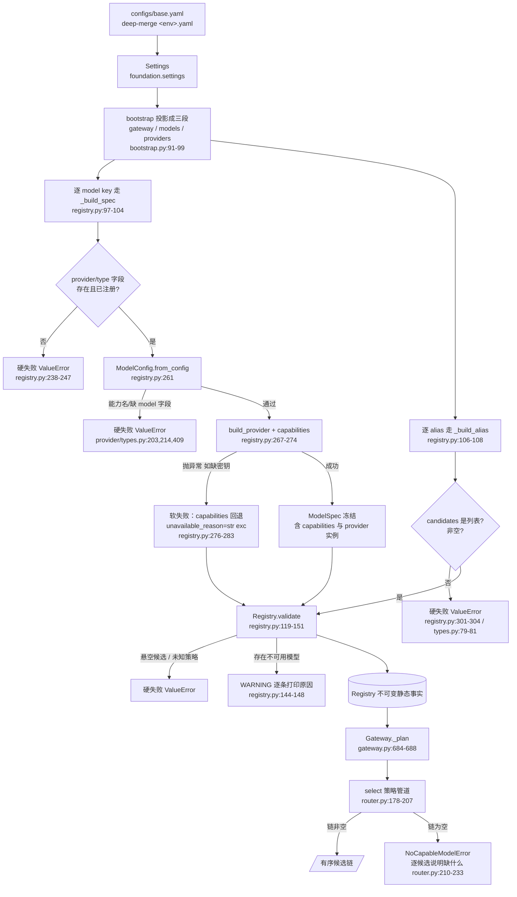
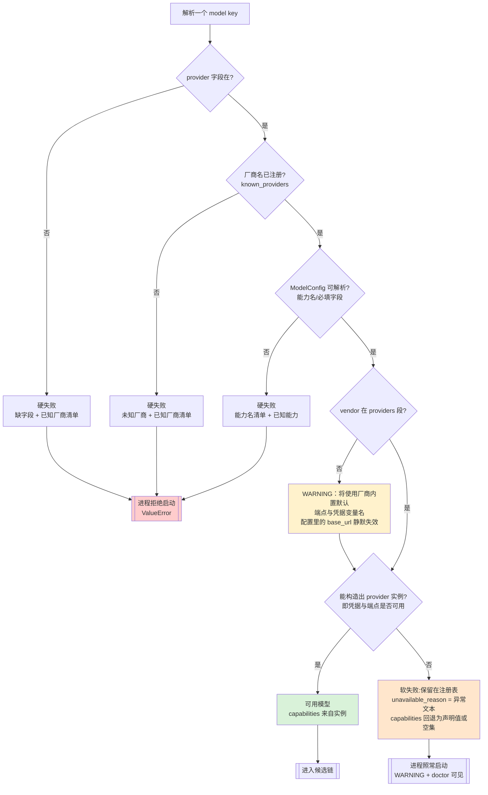
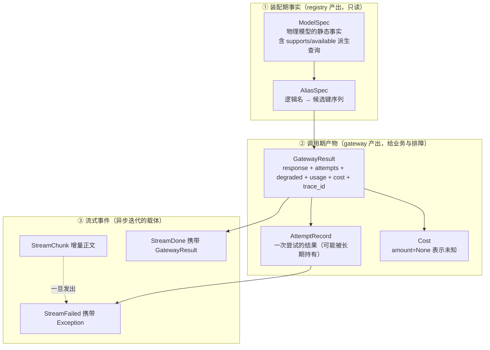

# 第 2 章 选择与装配：`runtime.default` 是怎么变成一条尝试链的

上一章把 gateway 摊成了 9 道关，并说明这 9 个零件被**一个编排方法**串起来（B-3）。本章只回答第一道关的问题：

> 业务代码里只写了一个字符串 `runtime.default`，它怎么变成一个**具体的、有序的、可以挨个去打的**模型列表？如果配置写错了，会在什么时候炸？

一句话答案是：**启动期由 `registry.py` 把配置冻结成不可变的静态事实，调用期由 `router.py` 把这些事实过一遍策略管道变成有序链**。前者只在进程启动时跑一次，错了就拒绝启动；后者在每次调用时跑，错了在调用瞬间抛。`types.py` 负责给这两边以及上层业务定义「数据的形状」。

三个文件共 744 行，本章逐行读完。全章会反复回到一条主线：这条链上的每一处「我不知道」，是被**表达出来**了，还是被**咽下去**了。

---

## 2.1 三个文件的分工：一次慢路径 / 热路径的切分

| 文件 | 行数 | 运行时机 | 有状态吗 | 出错后果 | 是否热路径 |
|---|---:|---|---|---|---|
| `src/gateway/registry.py` | 312 | 进程启动，**一次** | 有（provider 实例缓存） | 硬失败 → 进程起不来；软失败 → 模型不可用但进程照跑 | 否 |
| `src/gateway/router.py` | 246 | **每次调用** | 无（纯函数 + 只读外部状态） | 抛 `NoCapableModelError` / `ValueError` | **是** |
| `src/gateway/types.py` | 186 | —（纯定义） | 无，全部 `frozen=True` | 定义错 → 调用方静默拿错值 | 结构在热路径上 |

切分的依据不是「谁大谁小」，而是**可变性**：

- `Registry` 是有状态的：它持有 `_providers` 缓存（`registry.py:73`），并在 `_build_spec` 里**真的构造了一次 provider 实例**（`registry.py:267-274`）。这是启动期一次性副作用。
- `router.select()` 是纯函数：同样是 `(候选集, 上下文) → 候选集`，同样的输入给同样的输出（除了 `_by_health` 会读熔断状态，见 §2.5）。多 agent 并发调用 gateway 时，热路径上没有共享可变状态需要加锁 —— 这是「一次全量回归并发几千次调用」能成立的前提之一。

这个划分在业界有个直接对应物：**Envoy 的 cluster 与 endpoint 分离**。cluster（静态配置：有哪些上游、怎么连、TLS 怎么配）在启动期确定，endpoint（哪些实例现在健康）在数据面动态决定。BesaAgent 这里的对应关系是：`ModelSpec` = cluster，`router` 的策略管道 = endpoint 选择器，`HealthRegistry` = 健康检查。区别在于 Envoy 的健康判定由独立的数据面进程做，这里退化成进程内的一个字典（`health.py:202`，D-E 明确一期不做跨进程共享）。

还有一条隐含的分工值得点出来：**`registry` 回答「有哪些」，`router` 回答「这次打哪个」**。所以 `registry` 的错误信息面向**改配置的人**（列出已知厂商、列出已定义模型键），`router` 的错误信息面向**正在排障的人**（列出每个候选缺什么）。两者的读者不同，措辞风格也不同 —— 这一点在后面几节反复出现。

---

## 2.2 全流程：从 YAML 到有序候选链



这张图要能独立说明四件事：

1. **解析是两层的**：alias → candidates（配置里的字符串数组）→ ModelSpec → provider 实例。业务只认第一层，这层以上的键名换了不影响业务（`FR-G-02`，`registry.py:3-10`）。
2. **硬失败全部发生在 `Registry` 构造完成之前或之中**，所以「配置错」永远不会跑到线上才炸。
3. **软失败在构造期被降级成一条字段**（`unavailable_reason`），而不是被丢弃。
4. **调用期只做一次 `_plan`**：`select` 的结果在整次调用（含所有重试与降级）中是固定的，不会每打一次候选就重算一遍链 —— 这点很重要，否则候选顺序会在重试过程中变化，`fallback.decide` 的「还有没有下一个候选」就没法算。

配置里那份 `strategy` 的默认值有两个来源，且它们必须一致：`AliasSpec.strategy` 的 dataclass 默认 `("capability", "priority")`（`types.py:77`）与 `registry.DEFAULT_STRATEGY`（`registry.py:47`）字面相同。`_build_alias` 用的是后者（`registry.py:305`），前者只在有人**直接构造** `AliasSpec`（比如单测）时生效。两处硬编码同一份默认值是重复，但影响面很小。

> **工作区状态提醒**（不改设计，只影响阅读）：此刻 `configs/base.yaml:130` 的 alias 候选写的是 `runtime-mock`，而 `models:` 里的键还是 `chat-mock`（`base.yaml:58`）—— 这是 `chat → runtime` 全局改名的半途状态，会让 `Registry.from_config` 走到图里的 H4 分支（悬空候选）并拒绝启动。这不是 gateway 的设计缺陷，但恰好证明了 §2.3 要讨论的那件事：**悬空引用会在启动期就炸，而不是等第一次调用**。

---

## 2.3 启动期校验落在哪一层：B-9 的文档与实现不一致

这是本章最值得挖的一处「文档说 A、实现是 B」。

### 文档说什么

`架构概要设计-gateway.md:420` 的决策 **B-9**：

> 启动期校验放在**组合根**（被否决方案：放在 `registry.py`）—— 第 5 条校验需要同时看见 `settings` 与 `src/provider`，只有组合根两边都看得见。

而 `:371-380` 列了要校验的 5 条，并补了一句「前 4 条是配置自洽性，第 5 条跨了 `foundation.settings` 与 `src/provider` —— 这正是它必须放在组合根的原因」。

### 实现是什么

| # | 校验内容（文档 `:373-377`） | 实际在哪 | 触发方式 |
|---|---|---|---|
| 1 | 每个 alias 至少一个候选 | `registry.py:129-130`（`validate()`）+ `types.py:79-81`（`AliasSpec.__post_init__`） | 硬失败 `ValueError` |
| 2 | 候选引用的 model key 存在 | `registry.py:131-136`（`validate()`） | 硬失败 `ValueError` |
| 3 | `strategy` 里没有未知策略名 | `registry.py:137-142`（`validate()`） | 硬失败 `ValueError` |
| 4 | `total_max_attempts ≥ 1` 且不小于 `max_attempts_per_candidate` | `retry.py:129-140`（`RetryPolicy.__post_init__`） | 硬失败 `ValueError` |
| 5 | 每个候选的 provider 已注册 | **`registry.py:242-247`**（`_build_spec` 里查 `known_providers()`） | 硬失败 `ValueError` |

也就是说：**5 条里有 4 条在 `registry.py`**（3 条在 `validate()`，第 5 条在更早的 `_build_spec`），第 4 条在 `retry.py`（由组合根 `bootstrap.py:104` 构造时触发）。而组合根 `src/composition/bootstrap.py` 里**没有任何一处自己的校验逻辑** —— 它只做两件事：把 `Settings` 拆成 `gateway` / `models` / `providers` 三段喂给 `Registry.from_config`（`bootstrap.py:91-100`），然后按「先注册表、后网关」的顺序装配（`bootstrap.py:93-115`）。

### 判断：这是「实现期发现 B-9 的论证不成立」，不是缺陷

B-9 那句理由在实现面前直接站不住了，而且是**在写第一行代码的时候**就站不住的：

`registry.py:38` 的第一行业务 import 就是 `from provider import build_provider, known_providers`。`Registry` **必须**看得见 `provider` —— 它的核心职责之一就是「按模型键构造并缓存 provider 实例」（`registry.py:186-210`）。既然它本来就要 `import provider`，那「只有组合根两边都看得见」这个前提从头就是假的。

这是**设计稿写在前、依赖关系想清楚在后**的典型症状。写设计稿时，作者把 `registry` 想象成「一个纯粹的配置解析器」（所以不该知道 provider 的存在），把校验当成一件可以外置的独立步骤。真开工才发现：要校验 provider 名注册过没有，最自然的做法就是问 provider 层要一份名单（`provider/__init__.py:71-79` 的 `known_providers()` 就是**为此专门加的**，它的 docstring 写着「供启动期校验用」）；再往后一步，要拿到 `capabilities` 还必须真的构造一次 provider（`registry.py:274`）。于是校验只能内嵌。

那么 B-9 到底还剩什么？我认为它保留了一个**被表述错了的真理**：真正该由组合根决定的是**顺序与投影**，不是校验规则本身。

- **投影**：`Settings` 是一个扁平的「整份配置」，`Registry` 只想看见三段（`gateway` / `models` / `providers`）。哪个键属于哪一段、`gateway_cfg` 里内嵌的 `models` 怎么与外层 `models` 合并（`registry.py:95`），这是组合根的知识。
- **顺序**：注册表必须先于网关建好，因为「配置错误要在启动瞬间暴露」（`bootstrap.py:13-15`）—— 这是组合根的知识。
- **校验规则**：属于**拥有该不变式的那一层**。`ModelSpec` 的形状不变式由 registry 拥有；`RetryPolicy` 的次数关系由 retry 拥有。组合根没有自己的不变式，所以它没有自己的校验。

用 Kubernetes 的类比最容易说清：**CRD 的 schema 校验发生在 API server**（拥有该对象的组件），**跨对象策略才交给 admission webhook**（需要同时看见多方的组件）。B-9 相当于断言「因为某个校验要同时看见 Pod 和 Service，所以所有校验都放 webhook」—— 而实际上 Pod 自身的 schema 校验一直留在 API server 里。BesaAgent 的实现回到了前者：谁拥有这个对象，谁校验它。

**代价**：文档现在描述错了，而 B-9 是「关键设计决策」表里的一条。修法不是改代码（代码的切分是对的），而是把 B-9 重写成：「校验归属 = 谁拥有该不变式；组合根只负责配置投影与装配顺序」。另外第 4 条校验待在 `retry.py` 而不是 `registry.validate()` 是一件**好事**：它离「被它约束的那个对象」最近，改 `RetryPolicy` 的人不可能漏掉它。

### 顺带记两笔这一层的真实摩擦

1. **校验错误的异常类型与 CLI 的捕获范围不匹配**。`Registry.from_config` 抛 `ValueError`（`registry.py:151`、`bootstrap.py:86` 的 docstring 也这么写），但 CLI 入口只捕获 `SettingsError`（`apps/cli/main.py:51-54`）。于是「alias 引用了不存在的模型键」这类**纯配置错误**会以 Python 回溯的形式糊在用户脸上，而不是被渲染成 `配置错误：...` 那一行。`main.py:52-53` 的注释写着「配置错误是**用户可见**的失败，不该以回溯的形式抛出」—— 意图在，但只覆盖了 `SettingsError` 这一半。这是 `FR-G-03` 那一类「错误信息质量」要求在**入口层**的漏网之鱼。
2. **`validate()` 是公开方法，但只有一个调用点**（`registry.py:115`）。它没有做成 `from_config` 的内部步骤，说明作者留了「手工构造 Registry 后单独校验」的口子（测试可以 `Registry(...)` 再 `validate()`）。合理，但目前没有测试用这条路径。

---

## 2.4 硬失败与软失败：边界画在哪里，为什么

`registry.py:12-25` 的模块 docstring 把三类问题和对策列成了表，这是全模块最清楚的一张「意图声明」。实现是否兑现了它，逐条核一遍：

| 问题 | 文档意图 | 实现位置 | 实际行为 | 兑现? |
|---|---|---|---|---|
| 厂商名拼错 | 硬失败 | `registry.py:242-247` | `ValueError`，消息列出全部已知厂商 | ✅ |
| `provider` / `type` 字段缺失 | （文档未列） | `registry.py:238-241` | 硬失败，同样列出已知厂商 | ✅（补充） |
| 策略名拼错 | 硬失败 | `registry.py:137-142` | `ValueError`，消息列出全部已知策略 | ✅ |
| 候选引用不存在的模型键 | 硬失败 | `registry.py:131-136` | `ValueError`，消息附带**已定义的全部模型键** | ✅ |
| `candidates` 不是列表 | （文档未列） | `registry.py:301-304` | 硬失败，报出实际类型名 | ✅（补充） |
| 能力名拼错 / 缺 `model` 字段 | （文档未列） | `provider/types.py:203,214,409` | 硬失败（在 `registry.py:261` 处，**在 try 之外**） | ✅ |
| 云厂商缺密钥 | 软失败 + 保留原因 | `registry.py:276-283` | 模型入表，`unavailable_reason` 有值，打 WARNING | ✅ |
| `vendor` 不在 `providers` 段 | （文档未列） | `registry.py:253-259` | **只打 WARNING**，继续启动 | ✅（有争议，见下） |



这张图要能一眼看出三件事：**「拼错」全部走向左下的红色终点**（进程拒绝启动）；**「环境缺失」全部走向右下的橙色终点**（保留原因、继续启动）；**中间那个黄色 WARNING 是最隐蔽的一类** —— 它既不是拼错到无法识别（所以不硬失败），也不是环境缺失（所以不标记不可用），而是「配置写了但没生效」：进程完全正常地跑起来，只是流量走向不是你以为的那条路。

边界画在哪，可以用两句话概括：**「这个错误会不会自己好？」+「它依赖不依赖运行环境？」**

- 拼错的厂商名/策略名/模型键：**确定的、纯内部的**，不会因为换台机器就好 —— 硬失败。越晚发现代价越大（第一次线上调用才发现，等于把配置错误伪装成运行时故障）。
- 缺密钥：**依赖运行环境的**。同一份 `configs/` 在 CI 上（无 `.env`）必须能启动，否则 `pytest` 和 CI 就没法跑 —— 这是 `base.yaml:5-7` 明说的目标（「默认全部指向 mock，是 `python -m pytest` 与 CI 能在无网络、无密钥、无数据库环境跑通的前提」）。所以软失败，`NFR-G-08`。

### `unavailable_reason` 为什么保留而不是丢弃

`types.py:53-55` 的注释是这个问题的最佳答案：

> 注册期就失败的模型（如云厂商缺密钥）。**保留在注册表里**而不是丢掉 —— 丢掉会让「为什么这个候选没被用到」变成一个查不到的空缺。

这是本模块「拒绝静默」哲学在装配层的落点，展开有三层：

1. **丢掉会制造一个不可回答的问题**。假设 `chat-deepseek` 因为没配 `DEEPSEEK_API_KEY` 被静默剔除，那么当 `runtime.default` 的候选链只剩 `chat-openai` 时，人会问「deepseek 呢？」——答案不在任何地方。保留之后，答案在 `spec.unavailable_reason` 里，`doctor` 会把它打出来（`apps/cli/commands/doctor.py:47-52`，那段代码的注释写着「这才是 doctor 的主要价值」）。
2. **保留下来的模型仍然参与报错**。`select()` 会把不可用候选从链里剔除（`router.py:190-193`），但在构造失败信息时会单独为它们加一行「注册期不可用（原因）」（`router.py:222-223`），并且注释明确指出这么做是为了避免把「缺密钥」误报成「缺能力」。实测输出里能看到这条路径的效果：
   ```
   没有任何候选满足本次请求的能力要求（流式）
     - e1：缺少 runtime, stream
     - e2：注册期不可用（OpenAIProvider 缺少 API key：请在 model 上写 api_key / api_key_env，或设置环境变量 OPENAI_API_KEY）
   ```
   如果这里把 `e2` 悄悄删掉，用户看到的就只有 `e1 缺少能力`，然后会去改一个完全没问题的配置项。
3. **与「注册即健康」的服务发现传统相反**。Consul/Eureka 那一派是「注册的时候假设它是健康的，健康状态由心跳/健康检查事后来推翻」；Envoy 那一派是「配置里有它，能不能用由数据面判定」。这里是第三种：**注册即标记** —— 注册表同时记录「有这个东西」和「它现在为什么不能用」。三者回答的问题不同，这里选的是最符合「配置错要能查」的那一种。

### 两个需要掰开的细节

**细节一：`except Exception` 的兜底范围太宽，这是一个真实的取舍，不是免费的**（`registry.py:276`）。

```python
except Exception as exc:  # noqa: BLE001 - 任何构造失败都只让该模型不可用
```

`noqa` 注释说明作者知道自己在做什么。它有真实的好处：把「缺密钥」(`AuthError`，在 `provider/base.py:381-385` 抛出，由 `__init__` 里的 `_validate_credentials()`（`provider/base.py:336`）触发）、「base_url 非法」、「厂商适配器自己的配置校验失败」全部收敛成同一句「这个模型现在不可用」。这些都是**外部条件导致的**，符合软失败的定义。

但它同时会把**适配器里的编程错误**（例如某个 `TypeError`、拼错的属性名）也降级成一条 WARNING，进程照跑不误。结果是「代码 bug」伪装成「配置问题」，而且症状是「这个模型的流量一直不进来」。缓解手段有两个：`unavailable_reason` 会被 doctor 和错误信息打出来；WARNING 级别在默认日志配置下可见（`apps/cli/runtime/__init__.py:46` 在 `build_runtime` 之前就 `setup_logging` 了，所以这些 WARNING 一定有人接）。

我的判断：**这是可以接受但应该收紧的取舍**。更精确的画法是：`except (ProviderError, ValueError) as exc` 走软失败（配置/环境问题），其余异常用 `_log.exception()` 打完整栈后**重新抛出**（真 bug 应该在启动期就炸，越早越好）。这样「软失败」这一类的成员才真的是「外部条件」而不是「所有异常」。

**细节二：`vendor` 拼错只打 WARNING，这是最容易被忽略、后果最隐蔽的一条**（`registry.py:249-259`）。

场景很具体：你在 `providers:` 段配了 `deepseek: {base_url: https://api.deepseek.com/v1, api_key_env: DEEPSEEK_API_KEY}`，然后在 model 里写 `vendor: deepseekk`（多打一个 k）。因为适配器类自带默认端点与凭据变量名，构造**不会失败** —— 它会用 `openai` 适配器的默认端点 `https://api.openai.com/v1` 去发请求，拿 `OPENAI_API_KEY` 或空 key。表现是「配了代理却不走代理」「配了自家端点却打到公网」。代码注释把这件事说得很透（`registry.py:250-252`），并且选择用 WARNING 让它「至少可见」。

为什么不做成硬失败？因为「`vendor` 缺省 = 用 adapter」是**合法形态**（`registry.py:236`，`base.yaml:26` 明确说「二者默认相同，所以普通厂商只写 `provider` 就行」）。所以 `vendor not in providers_cfg` 这个事实本身是合法的，无法硬失败。

能做的改进是把「可见」做得更实：`doctor` 目前只打印 `vendor=`，不打印**最终生效的 base_url 及其来源**（`doctor.py:48`）。如果 doctor 能打出「`chat-local` → base_url=…（来自 providers.vllm-local）」这样一行，「配了代理却不走代理」就会在启动自检时就现形，而不必等抓包。这是很小的改动、很大的排障收益，我把它记在 §2.10 的改进清单里。

### 能力回退到底安全不安全

软失败分支里有一句值得单独推敲的赋值（`registry.py:279-282`）：

```python
capabilities = declared.capabilities or frozenset()
```

`ModelConfig.capabilities` 只在配置里把能力写成**列表**时非 `None`（`provider/types.py:358`）；写成**映射**（增量覆盖）或**没写**时它是 `None`（`provider/types.py:361`）。注释诚实地说明了这一点：映射或未配时「无法在不知道厂商默认的情况下解析，只能给空集」。

实测确认：`provider: openai` + 不写 `capabilities` + 无密钥环境下，`spec.capabilities == frozenset()`。

那这个空集会不会导致**错误路由**？不会，而且原因和注释说的不完全一样。`select()` 在做任何策略之前就先把不可用候选摘掉了（`router.py:190-193`），所以这个模型**永远不会**因为 capabilities 而「被 capability 策略过滤掉」—— 它在进入管道之前就已经出局了。它之所以出局，是因为 `spec.available` 为 `False`（`types.py:63-65`）。

所以：

- **回退是安全的**（不会把一个能力未知的模型放进链里）。
- 但 `registry.py:279-281` 那句「该模型会因缺能力而被路由过滤掉」**描述的机制是错的**（它其实是被 `available` 过滤掉的）。两条过滤同时存在，注释挑了不生效的那条来解释。
- 更有价值的是这份回退对**显示**的影响：`doctor` 会显示 `caps=[]` 加一行「不可用：原因」（`doctor.py:46-52`）。空能力集在这里是个**诚实的表达**：我们确实不知道它有什么能力，因为我们没能把它构造出来。

**如果让我重新设计**：我会在这里保留 `capabilities` 为「已知的部分」（列表形态就有了）并把空集显式标注为未知，而不是混用同一个 `frozenset()`。现在 `frozenset()` 同时表示「这个模型确实什么都不会」和「我们不知道它会什么」—— 这是本模块哲学最反对的那种语义合并（`None` 与 `0` 的区分在 `Cost`、`Usage` 上做得那么干净，这里却没有）。

---

## 2.5 路由策略管道：实现与设计稿的差集

### 管道语义核实

`router.py:1-5` 声明策略是管道式的 `(候选集, 上下文) → 候选集`。核对代码，签名完全一致（`router.py:160-166` 的 `STRATEGIES` 类型标注就是它），`select()` 按 `strategy` 序列**依次应用**（`router.py:194-199`），每一步的输入是上一步的输出。所以「管道式」这个说法是准确的，不是文档修辞。

### 设计稿 5 条 vs 实现 5 条

| 设计稿（`架构概要设计-gateway.md:221-227`） | 实现 | 差集 |
|---|---|---|
| `capability` 剔除不满足能力的候选 | `_by_capability`，`router.py:89-92` | 无 |
| `priority` 按显式优先级排序 | `_by_priority`，`router.py:95-98` | 无 |
| `weight` 按权重分流（灰度/AB） | `_by_weight`，`router.py:101-122` | 无（实现更细，见下） |
| `cost` 同能力下便宜优先 | `_by_cost`，`router.py:125-137` | 无 |
| `health` 按健康度降序（可选，靠后不剔除） | `_by_health`，`router.py:140-155` | 无 |

**集合差集为空**：5 条都实现了，`STRATEGIES` 里正好注册这 5 个（`router.py:160-166`）。`FR-G-03` 要求的「至少 4 条」（能力/优先级/权重/成本）全部覆盖，`health` 是超出要求的那一条。

但**语义差集不为空**，有三处值得单独说：

**差集一（重要）：5 条策略里只有 1 条是过滤，其余 4 条都是排序。**

```mermaid
flowchart LR
    subgraph IN[输入]
        C[/候选集 ModelSpec 列表/]
    end
    C --> CAP{{capability<br/>FILTER 保留满足 required 的}}
    CAP --> P[priority<br/>SORT -priority 稳定]
    P --> W[weight<br/>SORT u^(1/w) 降序]
    W --> CO[cost<br/>SORT 已知价优先 按价升序]
    CO --> HE[health<br/>SORT CLOSED &lt; HALF_OPEN &lt; OPEN]
    HE --> OUT[/有序尝试链/]

    CAP -.->|链变空| ERR[NoCapableModelError<br/>逐候选说明缺什么]
    HE -.->|只重排 不剔除| OUT

    style CAP fill:#ffe6cc
    style ERR fill:#ffcccc
```

这个事实有一串直接后果：

1. **「空候选」只可能由两处产生**：`available` 过滤（`router.py:190`）和 `capability` 过滤（`router.py:92`）。这正是 `fallback.py:78-82` 敢说「跨能力降级在结构上不可能发生，因为 `router.select()` 已经把所有不满足能力的候选滤掉了」的底气 —— 过滤集中在一个地方，而不是散在每个决策点。这是好设计，`FR-G-05` 那条「降级不得跨能力语义」的禁令被**结构性消除**了，而不是靠每处 `if` 记得判。
2. **`health` 只排序不剔除**是刻意的（设计稿 `:227` 的原话是「熔断的模型靠后而非剔除，保留兜底机会」），与 B-5 的「硬拦截由 `health.allow()` 负责」配套 —— 见下一小节。
3. **多条排序策略组合时，「后写的策略是主键」**。这是 Python 稳定排序的必然结果，也是管道语义的自然推论，但它**违反直觉**，且文档没有一个字提到。本会话实测（两个候选：`cheap-low` priority=1 / `pricey-high` priority=9，价格分别为 1 和 9）：

   | strategy | 结果 | 谁做主 |
   |---|---|---|
   | `(priority, cost)` | `cheap-low`, `pricey-high` | **cost** 主序，priority 只做同价时的次序 |
   | `(cost, priority)` | `pricey-high`, `cheap-low` | **priority** 主序，cost 只做同级时的次序 |

   想「便宜的优先，同价再看优先级」的人会直觉地写 `(cost, priority)` —— 然后得到**完全相反**的结果。当前默认配置（`capability, priority`）和 `base.yaml:131,135` 里的用法都没有触发这个陷阱，所以它是**潜在的**、不是当前的 bug。修法有两种：在 `base.yaml` 与文档里明确写「排序策略后者为主键」；或者更彻底一点，把排序策略在注册期**预编译成一个复合 key 函数**（见 §2.10）。

**差集二：`weight` 的实现比设计稿多了一层语义。**

设计稿只说「按权重分流」。实现用的是 **Efraimidis–Spirakis 加权随机采样的全排序变体**（`router.py:101-122`）：为每个候选算 `u ** (1/w)`，`u` 由 `sha256(session_id + "::" + model_key)` 派生（`router.py:236-246`），然后整体降序排。

三个设计点值得说清：

- **为什么不是「只选一个赢家」**：标准 E–S 采样的用途是选出一个赢家。这里要的是一条**完整的降级链**，所以把「谁排第一」交给加权采样，剩下的按同一把尺子排序，链的完整性得以保留。
- **为什么用哈希而不是 `random`**：`router.py:239-241` 的注释是「分流必须可复现 —— 出了问题时能靠『哪个会话』重算出同一个选择」。这与 `D-F` 决策（`架构概要设计-gateway.md:433`）一致：按会话哈希固定，否则同一会话会在强弱模型之间跳变，用户体验不可解释。实测：同一 `session_id` 连续两次调用得到同一顺序，换 `session_id` 顺序改变。
- **`u` 取 `(0, 1]` 而不是 `[0, 1)`**：`router.py:244-246` 注释说「加 1 避免 0（`0 ** x` 恒为 0，会让权重失效）」。这是一处很细的边界处理，正确。

  但它有一个**未文档化的语义**：`score()` 把 `weight=None` 当成 `1.0`（`router.py:116`）。所以一个权重 0.9 的模型和一个**压根没配 weight** 的模型放在一起，没配的那个反而拿到更多流量（1.0 > 0.9）。`weight` 的缺省语义应该是「不参与分流」还是「权重 1」？现在的实现是后者，且没有任何地方写明。另外两个边界：`weight: 0` 被特判成 `-1.0` 排到最后（`router.py:117-118`）而**不是剔除** —— 这其实是个有用的表达（「最后才用它」），但同样没文档；而如果 alias 下**所有**候选的 weight 都是 0，`weighted` 列表为空会让整个策略直接 no-op（`router.py:109-110`），静默地什么都不做。这三个点建议直接写进 `base.yaml` 的注释里，成本一行字。

**差集三：`cost` 策略的「价格」是一个粗糙标量。**

`_by_cost` 通过 `ctx.cost_of(model_key)` 取价（`router.py:131-135`），而 gateway 注入的这个函数是 `CostSheet.price_of(key).input + .output`（`gateway.py:798-801`）—— 即「每 1K token 的输入价与输出价之和」。这是一个确定但不精确的排序依据：真实成本取决于输入的 token 数与输出的 token 数之比，而这个比例在调用前不可知。设计稿只说「同能力下便宜优先」，没定义「便宜」；实现选了一个**单调、可解释、零依赖**的代理指标，我认为是对的取舍（要更准就得引入预估 token 数与输入输出配比，收益不确定，还会让「为什么这次用了贵模型」难以解释 —— 与 `D-5` 不做语义路由同一个理由）。

顺带一提 `_by_cost` 对未知价格的处理：`(1, Decimal(0))` 排最后（`router.py:132-135`），与 B-8（cost 未知返回 `None` 而非 `0`）一致 —— 如果把未知当 0，没配价格的模型会独占流量，然后在账单上给你一个「未知成本」。这是「未知不是 0」在**排序**这个场景里的落地。

### `STRATEGIES` 的两个细节

- **策略名的拼错在注册期就被拦住**（`registry.py:137-142`），不会等到第一次调用才发现路由没生效。这条值得点赞：如果策略是运行期才解析的字符串，一个拼错的策略名会**静默失效**（管道少一步，路由结果看起来还挺合理），这是最难查的一类配置错误。
- **`list_strategies()`（`router.py:169-170`）目前没有任何调用方**。仓库内检索只有定义。它显然是为 `doctor` 或某个「列出可用策略」的提示准备的（`known` 列表在报错里用的是 `sorted(STRATEGIES)` 而不是它，见 `registry.py:139`、`router.py:197`），现在属于**预留但未接线**的 API。不算问题，但要知道它不是活代码。

### B-5 的双机制：排序偏好 vs 硬拦截，分别在代码哪里

设计稿 `:233-234` / B-5（`:416`）说这两者都存在是刻意的，分工是「前者排序、后者拦截」。核实代码：

| 机制 | 位置 | 读什么 | 副作用 |
|---|---|---|---|
| **排序偏好** | `router.py:140-155`（`_by_health`） | `ctx.health.breaker(spec.key).state`，映射成 `CLOSED=0 < HALF_OPEN=1 < OPEN=2` 后稳定排序 | **会创建熔断器**（见下） |
| **硬拦截** | `gateway.py:377-387`（`_attempt_candidate` 第 1 步，`self._health.allow(spec.key)`） | 熔断状态机，`health.py:97-115` | HALF_OPEN 下占一个探测位，最终必须 `release()` |

职责划分是干净的：**排序决定「先试谁」，拦截决定「这个根本不要试」**。两者缺一都会出问题 ——

- 只有排序没有拦截：熔断的模型排在链尾，但如果前面全挂了，预算还是会被它吃掉（`CallBudget` 只管次数，不管「这次尝试值不值得花」）。
- 只有拦截没有排序：健康的模型和刚恢复的模型混在一起，全凭配置顺序，没有利用「现在谁更健康」这个信息。

有三处实现细节需要补上：

1. **排序偏好的数据来源是「惰性推进」的状态**。`CircuitBreaker.state` 在冷却到期时**返回** `HALF_OPEN`，但不修改内部 `_state`（`health.py:82-94`）。所以 `_by_health` 的读取是**无副作用**的（不会把 OPEN 推开），这是对的 —— 排序不应该改变状态机。真正的状态推进发生在 `allow()` 里（`health.py:100-104`）。
2. **但 `_by_health` 会创建熔断器**。`HealthRegistry.breaker()` 是 get-or-create（`health.py:204-209`），所以在策略管道里排序一个从没被调用过的模型，会给它登记一个 `CircuitBreaker`。后果很轻（多一个字典项，`snapshot()` 里它是 `closed` 所以 doctor 不显示，`doctor.py:54-56` 过滤了非 closed）。但语义上，一个「只读健康度」的操作改变了注册表的内容 —— 这是本模块里少见的「读操作有写副作用」，值得知道。
3. **`_by_health` 是排序、不是过滤**，与设计稿 `:227` 一致。要注意它与 B-5「硬拦截」的**边界**：排序策略永远不可能让链变空（`sorted` 不删元素），所以 `NoCapableModelError` 永远不会由 health 引起 —— 空候选的两个来源（§2.5 差集一）不受影响。

---

## 2.6 空候选与错误信息质量

### `FR-G-03` 的要求与实现

需求 `:168` 的原话是「过滤后**候选为空** → 报明确错误（指出『没有任何模型同时满足：工具调用 + 流式 + 视觉』），而不是静默失败」。实现落在 `router.py:210-233` 的 `_explain()`，它的形态是：

```
没有任何候选满足本次请求的能力要求（流式）
  - e1：缺少 runtime, stream
  - e2：注册期不可用（OpenAIProvider 缺少 API key：请在 model 上写 api_key / api_key_env，或设置环境变量 OPENAI_API_KEY）
```

（本会话实测输出。）

逐项评价：

**做对了的**：

- **逐候选列出原因，而不是只说「没有可用模型」**（`router.py:219-229`）。三个分支覆盖了三种不同的原因：注册期不可用（`router.py:222-223`）、能力缺失（`router.py:225-227`）、满足能力但被后续策略过滤（`router.py:229`）。第三个分支尤其好 —— 它把「这个模型能力够了，是优先级排序把它挤掉了/是别的策略」这件事说出来，否则用户会去反复检查能力声明。
- **注册期不可用与能力缺失分开表述**（`router.py:220-223`），注释明说「否则会把『缺密钥』误报成『缺能力』，排查方向直接跑偏」。这是错误信息质量的关键一条：**同一个症状（候选为空）背后的修法可能是「改配置」也可能是「设环境变量」，两者差一个数量级的排查成本**。
- **`describes` 用人类语言而不是枚举值**做标题（`router.py:216`，`describes=('流式', '工具调用')` 由 `for_request` 维护，`router.py:69-80`）。需求里那句「工具调用 + 流式 + 视觉」就是这个：标题是给人读的。

**不够好的四处**：

1. **同一份信息维护了两遍，而且第二遍退回了枚举值**。标题用中文标签（`describes`），候选明细却用 `cap.value`（`router.py:225`）。于是同一条消息里可能是「没有任何候选满足本次请求的能力要求（工具调用）」+「缺少 tools」—— 一处中文一处英文。实测里更糟：`Capability.CHAT` 的**值**在这次改名中已经变成 `"runtime"`（`provider/types.py:168`），而 `for_request` 永远把 `CHAT` 放进 `required`（`router.py:67`），所以任何「对话请求撞上向量模型」的场景都会得到一句

   > `- emb-xxx：缺少 runtime`

   `runtime` 在这里既不是逻辑名、也不是能力的人类说法，而是模块改名的产物。**这是改名遗留直接污染了用户可见信息**（任务是这么提醒我的，我核实后确认它确实影响了错误信息的可读性，而且这不是 gateway 的设计缺陷，是命名变更的代价）。顺带一提，即使没有改名，`缺少 chat` 也不如「缺少 对话能力」好读。
   **建议**：把能力标签集中成一处映射（`Capability → 中文标签`），`describes` 与 `missing` 都用它。改动约 6 行，消灭一整个「消息里混英文枚举」的问题。
2. **「候选集为空」那条提示是逻辑上不可达的死代码**（`router.py:231-232`）：

   ```python
   if unavailable and not candidates:
       lines.append("（候选集为空：请检查 alias 的 candidates 是否引用了已注册的模型）")
   ```

   `unavailable` 是从 `candidates` 里筛出来的子集（`router.py:190-191`），所以 `not candidates` 为真时 `unavailable` 必为空 —— **这个条件永远不可能同时成立**。实测对一个**真的空候选集**调用 `select([], ...)`，得到的消息只有一行标题：

   > `没有任何候选满足本次请求的能力要求（工具调用）`

   没有任何提示行、没有任何可行动的信息。所幸在真实路径上 `candidates` 为空是不可能的（`AliasSpec.__post_init__` 挡住空列表 `types.py:79-81`，`validate()` 挡住悬空引用 `registry.py:131-136`），所以这是一个**只影响防御性路径的死分支**。但它正是那种「看起来处理了、实际没有」的代码 —— 读到它的人会以为空候选集有专门提示。修法：把条件改成 `if not candidates:`，或者干脆删掉（因为不可达）。
3. **`UnknownAliasError` 把 alias 打了两遍**。实测：

   > `未知的逻辑模型名 'runtime.defualt'；可用的逻辑名：emb.default alias=runtime.defualt`

   后半段的 `alias=runtime.defualt` 来自 `GatewayError.__str__` 的通用后缀（`errors.py:69-78`）。当 `message` 本身已经包含了 alias 时，后缀是冗余的。同理 `NoCapableModelError` 在 `select` 里构造时传的是 `alias=""`（`router.py:206`），所以**路由失败的错误信息里没有 alias** —— 而这条错误恰恰最需要知道「是哪个逻辑名的候选全废了」。调用方 `Gateway._plan` 是知道 alias 的（`gateway.py:687-688`），却没有把它补进错误里。这是一个具体、可修的信息缺口：`select` 的签名应该接受 alias，或者由 `_plan` 捕获后 re-raise 时补上。

**小结**：这套消息已经比绝大多数开源库好（逐候选、分类原因、给已知清单），它的问题不是「有没有信息」，而是**信息的措辞层没有统一来源**（中文标签一处、枚举值一处），以及**几个分支条件写错了导致兜底失效**。都是低成本可修的。

---

## 2.7 `types.py`：三件套与「数据 vs 行为」的切分标准

`types.py:1-10` 的模块 docstring 交代了两件事：为什么要有这个文件（否则 `gateway.py` 要同时承载「类型定义」和「责任链编排」，而它本来就是最复杂的文件）；以及为什么 `CallBudget` **不在**这里（「它是**行为**不是数据，且属于重试语义，所以放在 `retry.py`」，对应 D-A/D-B，`架构概要设计-gateway.md:428-429`）。

先看清楚 `types.py` 里到底装了哪些东西。它们不是一类，而是三类：



### 每个类型承载什么

| 类型 | 行 | 一句话职责 | 关键不变式 / 语义决定 |
|---|---:|---|---|
| `ModelSpec` | `types.py:37-65` | 一个物理模型的**全部静态事实** | `capabilities` 在注册期定形，调用路径上不再计算（`:41-43`，为了热路径无分支） |
| `AliasSpec` | `types.py:68-81` | 一个逻辑名到候选键序列的映射 | `candidates` 不能为空，构造期抛（`:79-81`） |
| `AttemptRecord` | `types.py:84-105` | 一次尝试的结果 | 存**已脱敏字符串**而非异常；保留全部尝试而非只留最后一条 |
| `Cost` | `types.py:108-122` | 成本 | `amount=None` 是「不知道」，**不是 0**（`:110`）；`__str__` 把它渲染成「未知」 |
| `GatewayResult` | `types.py:125-149` | 一次 gateway 调用的完整结果 | `attempts` 与 `degraded` **必须暴露**（`:129-131`，`FR-G-05`） |
| `StreamChunk` / `StreamDone` / `StreamFailed` | `types.py:160-186` | 流式三事件 | 「流式无法在结束时返回一个值，所以把结果作为事件发出」（`:156-157`） |

### 「数据 vs 行为」这条切分标准，在 `types.py` 里贯穿得一致吗？

先摆事实：`ModelSpec` **有方法**（`supports()` / `supports_all()` / `available`，`types.py:57-65`），`Cost` 有 `known` 与 `__str__`（`:116-122`），`AttemptRecord` 有 `skipped`（`:103-105`）。按「有没有方法」来判断，它们全是行为 —— 那 `CallBudget` 凭什么只因为「是行为」就被赶出去？

所以文档那句理由（「它是行为不是数据」）**作为标准是不成立的**，它只是结论的事后描述。真正的分界线在别处，我把它写出来：

> **`types.py` 里的所有类型都是「值」：对同一个实例，任何时刻问它任何问题，答案都一样。`CallBudget` 是「状态机」：它的答案取决于调用历史。**

- `ModelSpec.supports(Capability.STREAM)` 今天问、明天问、并发问，答案永远一样 —— 因为 `capabilities` 在注册期就定形了（`:41-43`），且整个 dataclass 是 `frozen=True`。
- `CallBudget.try_acquire()` 的答案**取决于之前被调用过几次**；`CircuitBreaker.allow()` 的答案取决于之前的成功/失败序列。

这个标准一以贯之：`types.py` 里**没有任何一个 mutating 方法**，所有字段都是 `frozen=True` 的 dataclass，连 `AttemptRecord.elapsed_s` 这种看起来「会变」的字段也是构造时定值（`:101`）。甚至连 `StreamFailed` 携带的 `Exception` 对象（`:182`）都不违反这条 —— 异常对象是「谁消费谁处理」的即时值，不是被反复查询的状态。

**所以我的判断是：切分实践是一致的，但切分的表述是错的。** 文档与代码注释应该改写成「**无状态值 vs 有状态机**」，而不是「数据 vs 行为」。这个差别不是文字游戏，它直接影响未来的判断：如果标准是「数据 vs 行为」，那 `ModelSpec.supports()` 就是在违规（它有行为），需要的时候会被搬走；如果标准是「值 vs 状态机」，`ModelSpec` 的位置一目了然，不需要每次重新辩论。

顺带一个佐证：`AliasSpec` 的默认 `strategy` 与 `registry.DEFAULT_STRATEGY` 字面重复（`types.py:77` vs `registry.py:47`）。这是「同一个值定义在两个地方」的小冗余，但它也说明 `types.py` 的定位是「形状 + 构造期不变式」，而不是「默认值策略」—— 默认值属于 registry 的配置知识。

另外两个类型系统层面的细节：

- `AttemptOutcome = Literal["success", "failed", "skipped"]`（`types.py:34`）用 `Literal` 而不是 `Enum`。好处是与 `slots`/序列化友好、比较 `record.outcome == "skipped"` 直接可读；代价是没有 `Enum` 的成员校验（拼错字符串不会有静态错误）。实测代码里存在**位置参数构造** `AttemptRecord(spec.key, spec.provider, "skipped", skipped_reason=...)`（`gateway.py:529,551,631`）与**关键字构造**混用（`gateway.py:379-384`）。位置参数依赖字段顺序（`model_key, provider, outcome`），而 `outcome` 是第三个字段 —— 一旦有人在中间插入字段，`gateway.py:529` 那三处会静默地把 `provider` 或 `outcome` 错位。这是 `Literal` + 位置参数组合出来的真实风险，建议统一成关键字构造。
- `StreamEvent = Union[StreamChunk, StreamDone, StreamFailed]`（`types.py:186`）是联合类型，做穷尽匹配时靠 `isinstance`。没有用 `Enum` 标签或 `match` 结构。对三个事件来说是合理的（`isinstance` 足够），且 `StreamFailed` 必须最后检查 ——这种隐式顺序约束没有写成注释，是个可补的点。

---

## 2.8 `AttemptRecord` 的两个细节：为什么不留异常、`outcome` 与 `skipped_reason` 的区别

### 为什么存「已脱敏的字符串」而不是异常对象

`types.py:96` 的注释一句话说完：**「不存异常对象 —— 它会被长期持有，可能泄漏。」**

把这句话还原成具体场景：`AttemptRecord` 会被装进 `GatewayError.attempts`（`errors.py:45,50`），而 `GatewayError` 会一路冒到业务层、被日志记录、被 CLI 渲染、可能被事件总线发出去、可能被持久化成排障记录。一个 `httpx` 异常对象里的 `request.headers` 通常**带着 `Authorization: Bearer sk-...`**。异常对象活多久，密钥就可能活多久，而它可能活到「某个日志聚合服务里」。

这条规则有一个**看起来是反例**的地方值得点出来，因为它恰好能证明规则不是「一律不许拿异常」：`StreamFailed.error: Exception`（`types.py:182`）**就是**持有异常对象。区别在于**生命周期**：`StreamFailed` 是一个**立即被消费**的事件，调用方 `async for` 拿到它、处理它、然后它就消失了，不进任何长期结构（`gateway.py:681` 构造它并 `yield` 出去，不落库、不发事件总线）。而 `AttemptRecord` 进 `attempts` 元组、进 `GatewayError`、进 ledger 相关路径。

所以真实的规则是：**「会不会被长期持有 / 会不会流出进程边界」决定能不能拿异常对象**。`provider/base.py:463-464` 的 `__repr__` 也遵守同一条纪律（注释「不输出 cfg：它含 api_key（`NFR-P-04`）」）—— 这个纪律在 provider 与 gateway 两层是一致的。

代价也要说清：脱敏后的字符串**丢掉了异常的类型信息与 `retryable` 之外的属性**。`AttemptRecord` 用两个字段补偿：`retryable: bool | None`（`:98`，从 `ProviderError.retryable` 提取出来的、供排障判断「为什么不重试」的那一位）和 `outcome`。这是对的做法 —— 把「长期需要的那几个事实」显式建模成字段，而不是把整个异常留下。

### `outcome` 与 `skipped_reason` 的语义差别

`AttemptOutcome` 有三个取值（`types.py:34`），`skipped_reason` 是自由字符串（`:99-100` 注释列了 `circuit_open` / `rate_limited` / `budget_exhausted`）。本会话实测到两种组合：

| 组合 | 含义 | 构造点 |
|---|---|---|
| `outcome=failed, skipped_reason=None` | **发起了上游调用**，调用失败（超时/503/鉴权…） | `gateway.py:440-443` |
| `outcome=skipped, skipped_reason="budget_exhausted"` | **压根没发起调用**，因为预算没了 | `gateway.py:415-419` |
| `outcome=skipped, skipped_reason="circuit_open"` | 压根没发起，因为熔断拦下 | `gateway.py:379-384` |
| `outcome=skipped, skipped_reason="rate_limited:..."` | 压根没发起，因为限流拒绝 | `gateway.py:395-401` |
| `outcome=success, skipped_reason=None` | 调用成功 | `gateway.py:487-490` |

**为什么不是用一个字段**（例如 `outcome="skipped", error="budget_exhausted"`）？因为两个字段回答的是**两个不同人的问题**：

- `outcome` 服务于**统计**：成功率、降级率、跳过率。「这次上游调用有没有真的发生」是一个可以聚合的布尔事实。
- `skipped_reason` 服务于**排障**：「为什么这个候选没被用上」。它的取值域是开放的（实测有 `rate_limited:wait` 这种带冒号的复合值，`gateway.py:399`，冒号后半段是 `RateLimitDecision.reason`）。

把它们合并成一个字符串字段，会让「统计有多少次失败」退化为字符串匹配，而字符串匹配会随着新原因的加入悄悄失准。`GatewayError.summary()` 正是靠 `record.skipped`（即 `outcome == "skipped"`，`types.py:103-105`）分叉出两种渲染方式（`errors.py:62-66`）：

```
m1:TimeoutError → m2:跳过(budget_exhausted) → m3:401
```

这一行就是这两个字段分工的最佳证明：跳过的显示「跳过(原因)」，失败的显示「错误」。

**我要提的两个批评**：

1. **`skipped_reason` 是自由字符串而不是枚举**（`:99-100` 只在注释里列了三个值，`gateway.py:399` 已经造出了第四种形态 `rate_limited:<子原因>`）。可读性换来了不可聚合性。既然 `outcome` 用了 `Literal`（有类型约束），`skipped_reason` 至少也该是 `Literal["circuit_open", "budget_exhausted"] | None` 加一个独立的 `detail` 字段。一期不做聚合的话，现状可接受；但这笔债要在二期做「跳过原因统计」时还。
2. **`outcome` 与 `error` 之间存在一个未强制的组合约束**：`outcome="failed"` 时 `error` 理论上必须非空（否则 `summary()` 会退化成打 `failed` 这个字面量 —— `errors.py:66` 的 `record.error or record.outcome` 正是为这种情况准备的兜底）。同理 `outcome="skipped"` 时 `skipped_reason` 应非空。这些约束没有 `__post_init__` 校验（对比 `AliasSpec` 就有）。考虑到这些记录是排障的最后一道线索，我倾向于在这里加校验（或至少在 `__post_init__` 里把「failed 但没 error」标出来）。

---

## 2.9 `GatewayResult.model` / `.content` 的 `getattr`：本模块唯一一处「静默失真」

```python
@property
def model(self) -> str:
    return getattr(self.response, "model", "")

@property
def content(self) -> str:
    """便捷取文本。仅对 ``ChatResponse`` 有意义。"""
    return getattr(self.response, "content", "")
```

（`types.py:142-149`。）

**它解决了什么问题？** `GatewayResult.response` 的类型是 `Union[ChatResponse, EmbeddingResult]`（`:133`）。直接在联合类型上访问 `.content`，静态检查会报错（`EmbeddingResult` 没有 `content` 字段，`provider/types.py:313-321`）。`getattr(x, "content", "")` 把这个类型错误变成了运行时的默认值。

**代价有三个，都在同一类**：

1. **对向量化结果调用 `.content` 静默返回空串**。`embed()` 返回的 `GatewayResult` 里 `response` 是 `EmbeddingResult`，`.content` 给 `""`。调用方写 `print(result.content)` 会看到一行空白，而不是「你取错字段了」。
2. **字段改名会静默失效**。假如哪天 `ChatResponse.content` 被改名（本仓库**正在进行**一次全局改名，这个假设一点不抽象），`types.py` 这一行不会有任何提示，所有取文本的地方会一起变成空串。
3. **类型检查完全失效**。mypy/pyright 看不到 `content` 的存在，调用方也就得不到「这个属性可能不存在」的提示。

这与本模块的核心哲学直接冲突：整份设计文档都在讲「未知不是 0」「降级必须标记」「失败原因全留」，而这里是「取不到 → 给空串」。**空串与 `None`、与「没有这个字段」是三件事**，正是 `Cost.amount=None`（`:110`）和 `Usage` 的 `None` 语义（`provider/types.py:257-260`）花了大量篇幅要区分的东西。在同一个文件里，一个字段严守 None 语义，另一个属性用 `""` 兜底，这是**标准不一致**。

**是权宜还是设计？** 我判断是**权宜**，理由很直接：模块 docstring 对每一个别的决策都给了理由（为什么要有 `types.py`、为什么 `CallBudget` 不在、为什么 `unavailable_reason` 要保留、为什么事件化流式），唯独这两个属性只给了一句「仅对 `ChatResponse` 有意义」的功能说明，**没有任何「为什么必须用 getattr」的论证**。一个真正的设计决策在这个仓库里是会留下理由的。

**如果重新设计**，我会：

- 让 `content` 通过 `isinstance` 窄化，并且**返回类型带上「可能没有」**：`content: str | None`（对 `EmbeddingResult` 返回 `None`）。取不到就明说取不到。
- 或者更好一点：干脆不在 `GatewayResult` 上提供这两个便捷属性，让调用方自己窄化 —— 因为「便捷取文本」的调用方本来就知道自己发起的是 `chat` 还是 `embed`，它是**最清楚类型**的一方。便捷属性唯一帮到的是「不想写 `isinstance` 的人」，而那种便利的代价是三条静默失败路径。
- 如果一定要保留（写起来确实省事），至少加一层运行时校验：`isinstance(self.response, ChatResponse)` 不成立时，`content` 抛 `AttributeError` 或返回 `None`。

需要公平地说一句：`model` 这个属性没有上面的问题 —— `ChatResponse` 与 `EmbeddingResult` **都有** `model` 字段（`provider/types.py:298`、`:319`），`getattr` 对它是真正的「两种响应共有的字段」。所以问题只集中在 `content`，修它也只需要动 `content` 一处。

---

## 2.10 批判性评估：职责边界、热路径、如果重新设计

### 职责边界清晰吗？清晰，有三处渗漏

`registry` = 启动期的「有哪些」+ 不可用标记；`router` = 调用期的「这次打哪个」。这条线画得很干净，而且是**按时机**画的（一次 vs 每次），不是按概念画的 —— 这是它稳定的原因。对比一下常见的另一种画法（`Resolver` 负责 alias 解析、`Router` 负责选优、`Filter` 负责能力、`Ranker` 负责排序，四个类互相注入），这里三个文件 744 行就结束了，而且 `select()` 是一个可以单独拿 `list[ModelSpec]` 来测的纯函数（单测里就是这么用的）。

三处渗漏：

1. **`_build_spec`（`registry.py:224-296`）一个函数干了三件事**：校验厂商名（244-247）、构造 provider 实例（267-274）、解析能力与优先级（261-264）。它们被绑在一起的原因很实在 —— **能力的唯一来源是构造出来的实例**（`registry.py:274`：`capabilities = provider.capabilities()`）。也就是说，「知道一个模型有什么能力」这件事，在本设计里需要**先把它造出来**。代价在测试和装配上都看得到：想验证「厂商名拼错会硬失败」，不需要真的构造 provider；但想验证「缺密钥会软失败」，就必须构造。还有一个不显眼的事实：`_build_spec` 里造出来的那个实例**读完能力就被丢掉了**（`ModelSpec` 只存 `config=dict(raw)`，`registry.py:294`），真正服务流量的是 `Registry.provider()` 里**第二次**构造出来、并被缓存的那个（`registry.py:202-209`）。所以每个模型在启动期都被构造了两遍，能力是从一个「替身」身上读出来的。这一处的代价其实很小 —— `Provider.__init__` 里的 httpx client 是**惰性**创建的（`provider/base.py:335` 初始化成 `None`，`:406-408` 才 `_make_client()`），所以被丢掉的那个实例不会漏连接池，只是白解析一遍配置（`ModelConfig.from_config` 在 `registry.py:261` 与 `build_provider` 内部各跑一次）。记这一笔是为了说明：**「能力需要实例才能知道」这个耦合本身才是问题，它的资源开销反而不是**。
2. **`router` 不是纯函数**，尽管它看起来是。`_by_health` 读 `ctx.health.breaker(key).state`，而 `breaker()` 会**创建**熔断器（`health.py:204-209`）。所以「排序」这个读操作改变了 `HealthRegistry._breakers` 的内容。后果很轻（多几个 `closed` 状态的字典项），但它破坏了「router 无状态」的直观假设，也让「`select` 是纯函数」这句话需要加个脚注。
3. **「候选为什么出局」的理由分散在两处**：`available` 在 `select` 里（`router.py:190`），`capability` 在策略里（`router.py:92`）。错误信息因此必须同时照顾两边（`_explain` 先判 `spec.available` 再判能力差集，`router.py:219-229`）。这不算严重（两处就在同一个文件里），但如果哪天再加一个「本地能力」之外的过滤维度（例如预算/租户白名单），这个分散会开始咬人。

### 热路径开销：`NFR-G-03`（单跳 <1ms）安全吗？

结论：**安全，且余量很大**，但有两个不显眼的地方值得记账。

先把 `_plan`（`gateway.py:684-688`）每次调用的开销拆开：

| 步骤 | 复杂度 | 说明 |
|---|---|---|
| `registry.alias(alias)` | O(1) | 一次 dict 查找 + 一个 `AliasSpec`（`registry.py:161-164`） |
| `registry.candidates(alias)` | O(k) | k = 候选数，每个候选一次 dict 查找（`registry.py:173-175`） |
| `select` 的 available 过滤 | O(k) | 两次列表推导（`router.py:190-191`） |
| 每个策略 | O(k) 或 O(k log k) | capability 是 O(k)；priority/weight/cost/health 都是 `sorted` |
| `_by_cost` 的策略内查询 | O(k) | 每个候选一次 `cost_of` → `CostSheet.price_of` dict 查找（`gateway.py:798-801`） |
| `_by_health` | O(k) | 每个候选一次 `health.breaker` dict get-or-create |

k 是**候选数**（典型 1–3，配置里就是两三个），所以整个管道是几十次 dict 查找 + 两三次 3 元素排序 —— 微秒级，比 1ms 低两三个数量级。真正的开销在别处（`has_any_image(messages)` 扫全部消息、`_estimate_chat_tokens` 扫全部文本，`gateway.py:802-810`），而那些是**请求规模**的函数，不是路由的函数，且无法避免。

两个值得记账的点：

1. **候选链每次调用重算，没有缓存**。这是**对的**：`health` 和 `cost` 的输入会随时间变化，缓存会让「刚熔断的模型还在链首」。要缓存也只能缓存 `capability + priority` 那段静态部分。谨慎起见我算了一下，为它加缓存不值得（复杂度 + 失效逻辑 >> 微秒收益）。
2. **`Registry.aliases` / `Registry.models` 每次访问都复制整个字典**（`registry.py:178-183` 的 `dict(...)`）。热路径不用它们（`gateway` 用的是 `alias()` / `candidates()` / `model()`），所以不影响 `NFR-G-03`。但 `doctor` 的写法是反例：`for name in sorted(runtime.registry.aliases)` 之后在循环体里又访问 `runtime.registry.aliases[name]`（`doctor.py:37-38`），于是每次迭代复制一遍全表 —— O(n²) 的字典复制。n 是个位数，实际无感；但如果本意是「对外只读」，正确的工具是 `types.MappingProxyType`（零拷贝、真只读），而不是「每次给一份拷贝」。这是一个**用错了工具的小地方**，也是我在这一章里唯一一处明确的「实现比意图更贵」的发现。

### 如果让我重新设计这一层

三条，按我心中的价值排序：

**第一条（最有价值）：把「能力知识」从 provider 实例上拆下来。**

现在 `ModelSpec.capabilities` 必须通过构造 provider 才能得到（`registry.py:274`），所以「缺密钥」这个纯环境问题会连带**丢掉能力信息**（`registry.py:282` 回退成空集或配置声明值）。这带来两个后果：一是 §2.4 说的「空集同时表示『什么都不会』和『不知道』」的语义合并；二是**装配期副作用不可避免**。

改法：让 `provider` 层提供一份**不需要凭据就能读到**的静态能力声明（例如「适配器默认能力集」做成类属性/纯函数，`provider/base.py:314` 的 `DEFAULT_CAPABILITIES` 已经是这个形状了），让 `capabilities` 的解析发生在 `ModelConfig` 层（它已经会解析列表与映射两种形态，`provider/types.py:374-390` 的 `capabilities_or`），只在需要时才构造实例。收益：装配期有两个阶段 —— 纯数据的注册表（可测试、无副作用）与惰性构造的 provider（第一次真正调用时才建），顺带消掉「启动期每个模型被构造两遍、第一遍只为读能力」这件事（§2.10 渗漏 #1），以及「缺密钥时能力信息整个丢失、只能用空集兜底」这个语义问题（§2.4）。

**第二条：把策略字符串在注册期预编译成类型化对象。**

现在 `strategy: ["capability", "priority"]` 是一串运行期才解释的字符串。注册期只校验「名字存在」（`registry.py:137-142`），不校验**组合是否合理**（例如 `["cost", "cost"]`、或两条排序策略的意图）。预编译成 `(Filter, [Sorter...])` 之后：过滤与排序分成两种类型（现在的 `STRATEGIES` 字典把两者混在一个签名里，`router.py:160-166`）；多条排序的「后写为主键」可以编译成一个显式复合 key 函数（消灭 §2.5 差集一的陷阱）；`cost` 策略缺 `cost_of`、`health` 策略缺 `health` 时的静默 no-op（`router.py:128-129`、`147-148`）可以在编译期就报错 —— 现在这两个 `if ctx.xxx is None: return specs` 是「配了 health 策略但忘了注入 health 对象 → 策略静默失效」的入口。

**第三条：`select` 应该知道自己服务于哪个 alias。**

现在 `select` 构造 `NoCapableModelError` 时只能传 `alias=""`（`router.py:206`），因为它的签名里没有 alias（它的输入是「候选集」而不是「alias」）。这是分层带来的合理代价（`select` 只认候选集），但结果是**最需要 alias 的那条错误恰好没有 alias**。最小改动是让 `Gateway._plan`（`gateway.py:684-688`，它知道 alias）在捕获后补上；更干净的改法是让 `select` 接受一个可选的 `alias` 参数，或者由 `Registry.candidates()` 返回一个带 `alias` 的 `CandidateSet` 值对象。

### 哪些是缺陷，哪些是有意的取舍（分清）

| 事项 | 我的判定 | 理由 |
|---|---|---|
| B-9 文档说组合根、实现在 registry | **文档缺陷**（不是代码缺陷） | 代码切分是对的（谁拥有不变式谁校验）；论证的前提（registry 看不见 provider）从第一行 import 起就不成立 |
| 能力回退成空集，语义与「什么都不会」合并 | **设计缺陷（小）** | 同一文件内 `Cost`/`Usage` 严守 None 语义，这里却用空集兜底，标准不一致 |
| `except Exception` 把编程错误降级成 WARNING | **有意的取舍，但应收紧** | 换来「任何环境问题不阻止启动」（NFR-G-08）；代价是 bug 伪装成配置问题 |
| `vendor` 拼错只 WARNING | **有意的取舍**（`vendor` 缺省合法），但可观测性可加强 | 硬失败会误杀合法配置；真正的修法是让 doctor 显示 base_url 的来源 |
| `content` 用 `getattr` 兜底 | **权宜之计，建议改** | 缺少设计理由，且违反本模块「不静默」的主线 |
| `skipped_reason` 是自由字符串 | **一期可接受的取舍** | 换来可读的复合原因（`rate_limited:wait`）；二期做统计时要还债 |
| `weight=None` 视为 1.0；全 0 时策略 no-op | **未文档化的语义**（缺陷嫌疑） | 三个边界行为（None/0/全 0）都没写进配置注释 |
| 「候选集为空」提示分支不可达（`router.py:231-232`） | **缺陷（死代码）** | 条件 `unavailable and not candidates` 逻辑上不可能成立；生产路径不可达所以危害低 |
| `aliases`/`models` 每次访问拷贝整表 | **用错工具** | `MappingProxyType` 才是「只读视图」；拷贝在 `doctor` 的循环里退化成 O(n²) |
| `registry.py:23,146,277` 与 `bootstrap.py:10` 引用 `NFR-G-05` | **缺陷（可追溯性）** | 需求 `:300` 的 `NFR-G-05` 是「可观测」，无密钥可启动是 `NFR-G-08`（需求 `:303`）。四处引用错了条款 |
| 每个模型在启动期被构造两遍，第一遍只为读能力后丢弃 | **有意的取舍，但可消除** | 根因是「能力必须由实例提供」（`registry.py:274`）；资源开销很小（client 惰性，`provider/base.py:335,406`），语义开销是「能力读自替身」 |
| `AliasSpec.strategy` 默认值与 `DEFAULT_STRATEGY` 重复 | 小冗余 | `types.py:77` vs `registry.py:47`，字面重复但影响面小 |
| `list_strategies()` 无调用方 | 预留 API | 未接线，不是 bug |

最后一行那条 `NFR-G-05` / `NFR-G-08` 的错引值得一提，因为它和本章的主题直接相关：**这个模块把「可追溯」当成第一性原则（每个决策都标了编号），却在四处把「无密钥可启动」记到了「可观测」这个编号上**。编错条款不会让代码出错，但会让「这个行为是为了哪条需求」这个问题得到错误答案 —— 而这正是这个模块最想避免的那类错误。

---

## 2.11 本章小结，与交到第 3 章手上的东西

回到读者进门时的问题：

- **`runtime.default` 怎么变成一个具体的尝试链？** 启动期 `Registry.from_config` 把配置拆成 `ModelSpec`（物理事实，能力在注册期定形）与 `AliasSpec`（逻辑名 → 候选键序列），并当场校验；调用期 `Gateway._plan` 用 `registry.candidates(alias)` 取回候选的 `ModelSpec` 列表，交给 `router.select()` 过一遍策略管道，产出**有序的**尝试链（顺序 = 先试谁）。
- **配置写错了什么时候炸？** 分两类。「拼错」（厂商名 / 策略名 / 候选键 / 能力名）在**进程启动瞬间**硬失败（§2.4 图的左侧）；「环境缺失」（缺密钥）在启动期软失败，模型带 `unavailable_reason` 留在表里，`doctor` 能看（图的右侧）；「配了但没生效」（`vendor` 拼错）只留一条 WARNING（图的中间黄色节点）。第三类是当前可观测性最弱的一环。

这一章挖出的最重要的一件事，不是某个 bug，而是**一个关于「校验该放哪儿」的认知更新**：B-9 当初把校验放组合根，是因为它以为 registry 看不见 provider；真动手才发现 registry 本来就必须 import provider（它要构造 provider 实例）。于是校验回到了「谁拥有这个不变式，谁校验它」。**设计稿写在依赖关系之前，就会被依赖关系打脸** —— 这条教训对第 3 章（限流/熔断/预算）同样适用：那些不变式（配额、探测位、预算）分散在 `rate_limit.py`、`health.py`、`retry.py` 三个文件里，而它们必须在同一个顺序约束下协同，正是下一章要处理的问题。

拿到这条有序候选链之后，**第一个要判断的不是「打哪个」，而是「这个候选现在值不值得打」**。链是有序的，但顺序只表达了「偏好」，没表达「可行性」—— 排在链首的模型可能刚刚熔断、可能正在限流、可能预算已经被前面的候选吃掉一半了。这三件事都发生在**发起调用之前**，而且按 `架构概要设计-gateway.md:155-159` 的顺序约束，它们必须排在 `retry` 之前。这就是第 3 章（限流与熔断）要回答的问题。

---

## 附：本章覆盖率明细

| 文件 | 总行数 | 已读行数 | 覆盖率 | 达标 |
|---|---:|---:|---:|---|
| src/gateway/registry.py | 312 | 312（1–312，全文一次性读完） | 100% | ✅ |
| src/gateway/router.py | 246 | 246（1–246，全文一次性读完） | 100% | ✅ |
| src/gateway/types.py | 186 | 186（1–186，全文一次性读完） | 100% | ✅ |

合计：744/744 = 100% ✅

**为理解本章而额外读的邻近代码**（不计入上表，但结论依赖它们，便于复核）：
`src/gateway/errors.py`（全文 148 行）、`src/gateway/health.py`（全文 226 行）、`src/gateway/fallback.py:60-100`、`src/gateway/gateway.py:120-310 / 362-411 / 660-815`、`src/gateway/cost.py:1-80`、`src/provider/types.py`（全文 446 行）、`src/provider/__init__.py`（全文 132 行）、`src/provider/base.py:226-464`（节选）、`src/foundation/provider.py:60-125`（节选）、`src/composition/bootstrap.py`（全文 149 行）、`apps/cli/commands/doctor.py`（全文 67 行）、`apps/cli/main.py`、`apps/cli/runtime/__init__.py`、`configs/base.yaml`（全文 185 行）、`tests/unit/gateway/conftest.py`、`tests/unit/gateway/test_acceptance.py:315-384`。

**本会话实测的验证点**（结论中的「实测」指这些）：
1. 悬空候选 + 未知策略名 → `ValueError`，消息逐条列出，并附「已定义/已知」清单；
2. `provider: opemai` → `ValueError`，列出全部已知厂商；
3. 缺密钥 → 模型入表、`available=False`、`unavailable_reason` 有值、`capabilities == frozenset()`、WARNING 已发出；
4. 空候选报错文案与逐候选明细（含「注册期不可用」单独成行）；
5. `select([], ...)` → 只有标题一行，无任何提示（确认 `router.py:231-232` 分支不可达）；
6. `weight` 策略同 session 可复现、跨 session 变化；`weight: 0` 排最后；
7. `(priority, cost)` 与 `(cost, priority)` 的排序主键相反（「后写为主键」）。

