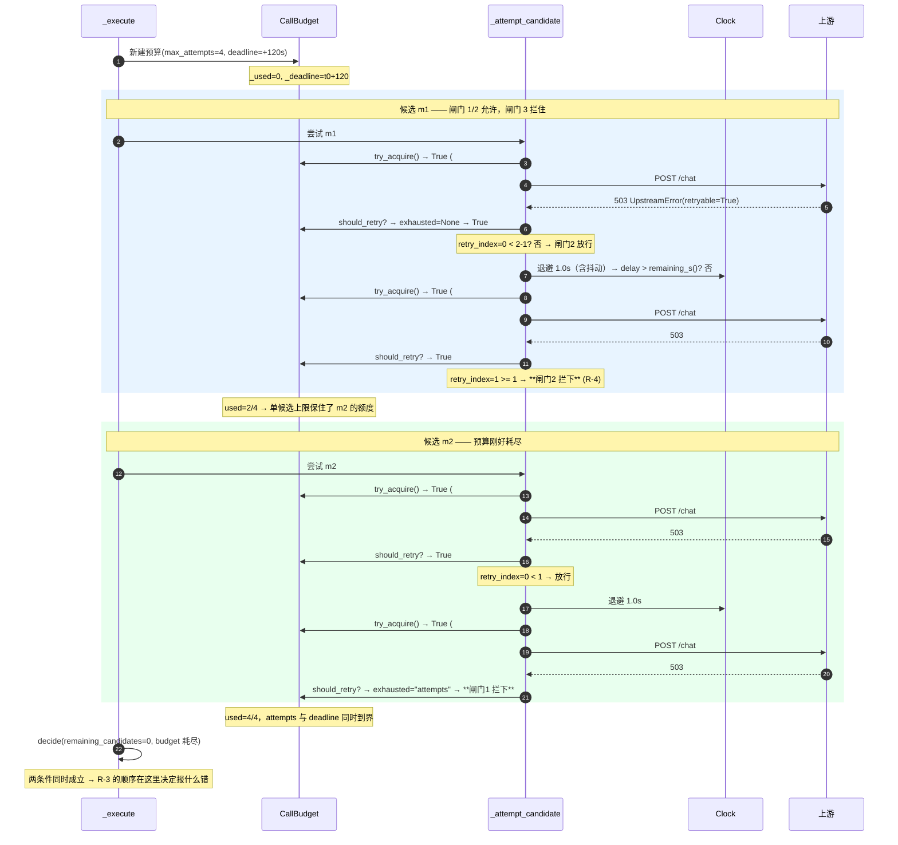
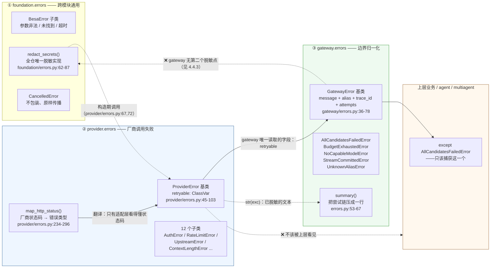

# 第 4 章 M3 失败路径与错误语义 —— `retry.py` / `fallback.py` / `errors.py`

> 上一章（限流与熔断）回答的是「这个候选现在**要不要发起**调用」。
> 本章回答紧接着的那个问题：**发起并失败了，接下来怎么办。**

前两章都是「提前拦截」——熔断器说别去、限流器说等会儿。它们是**避免失败**的机制。
本章是真正处理失败的机制，也是整个 `src/gateway` 设计密度最高的地方。

三个文件、430 行，分工很干净：

| 文件 | 行数 | 回答的问题 | 这个问题的难点 |
|---|---:|---|---|
| `src/gateway/retry.py` | 177 | 同一个候选**还能不能再打一次**？打几次？隔多久？ | 上界必须是**一个能读出来的数字** |
| `src/gateway/fallback.py` | 106 | 这个候选不行，**要不要换下一个**？为什么？ | 有些情况下**换比不换更糟** |
| `src/gateway/errors.py` | 147 | 全失败了，**怎么告诉上层**？ | 上层不该知道厂商细节，但排障需要它 |

先说结论：这三个文件里，`errors.py` 是最规矩的（照抄 provider 的三件套结构，几乎没有可争议的设计）；
`fallback.py` 是最轻的，但它藏了一处**配置项根本没接线**的问题；
`retry.py` 里那个 60 行的 `CallBudget` 是全模块的承重墙，也是本报告要花最多篇幅的地方 ——
它是全 gateway **唯一一处「用结构消除一整类 bug」**的代码
（`docs/架构概要设计-gateway.md:161` 原话），而这个结构性承诺**确实兑现了**，
但它兑现的范围比文件里写的要窄，边界在哪，后面会具体指出。

---

## 4.1 `CallBudget` —— 全模块的承重墙


### 4.1.1 先看它长什么样

`retry.py:31-114`，一个有 4 个字段、8 个方法的小类。`__slots__` 声明了它的全部状态（`retry.py:43`）：

```
_max_attempts   —— 跨候选累计的上游调用次数上限
_clock          —— 可注入时钟（foundation/clock.py）
_deadline       —— 一个**绝对时刻**，不是剩余秒数
_used           —— 已消耗的次数。**全模块唯一的计数器**
```

对外只有三个"问"和两个"答"：

| 方法 | 位置 | 语义 |
|---|---|---|
| `remaining_attempts()` | `retry.py:68-69` | 还剩几次（只在错误信息/事件里有意义） |
| `remaining_s()` | `retry.py:71-75` | 还剩几秒；**未设 deadline 时返回 `math.inf`** |
| `exhausted_reason()` | `retry.py:77-87` | `"attempts"` / `"deadline"` / `None` |
| `try_acquire()` | `retry.py:90-99` | **唯一**的计数点。`False` 表示必须停 |
| `has_room_for(estimated_s)` | `retry.py:101-107` | 剩余预算够不够跑一次预计 `estimated_s` 的尝试 |

这套接口值得注意的地方：**没有 `acquire()` 的"无条件版"**。你不可能"先拿配额再判要不要用"——
唯一的入口自带判断（`retry.py:96-98`：先问 `exhausted_reason()`，非 `None` 就直接返回 `False`，不递增）。
这一点后面 4.1.4 还会用到。

### 4.1.2 为什么两个上界必须由**同一个对象**强制

设计文档 `:136-137` 的原文是「否则会出现『重试次数没超，但时间超了』或者『时间没超，但已经打了 27 次上游』这类组合漏洞」。
`retry.py:5-9` 把这句话抄进了模块 docstring。但文档只给了结论，没给触发路径 —— 补上。

**漏洞 A：只用次数上界 → 时间无界。**

配置：`total_max_attempts=4`，没有 deadline（或各层各自有超时）。
上游不是"拒绝"而是"吞掉请求"（这是最典型的厂商故障形态：连接建上了、字节发出去了、就是不回）。

| 步 | 发生什么 | 累计墙钟 |
|---|---|---|
| 1 | 候选 m1 发起第 1 次，`timeout_s=60` 到点 | 60s |
| 2 | provider 层重试 1 次（`retries=1`，`provider/openai/client.py:70`），退避 1.5s，再吃满 60s | 121.5s |
| 3 | gateway 判 `should_retry` → `UpstreamError` 不成立（这里是 `TimeoutError`，`retryable=True`）→ 重试第 2 次 | 吃掉 4 次配额，~486s |

**`attempts_used` 全程只有 4，没有任何一条约束说"总共最多 8 分钟"。**
次数是一个**无量纲计数**，而故障的代价是`次数 × 单次耗时`，单次耗时是另一个独立维度。
只约束一个维度，乘积就完全没有上界 —— 而且这个无界是**静默的**：
监控上看"重试次数没超"、日志上看"还在正常重试"，只有用户的请求超时了几分钟。

**漏洞 B：只用 deadline → 工作量无界。**

配置：外层 `asyncio.wait_for(..., 120)`，重试次数不限。
上游不是"吞掉"而是**立刻拒绝**（503 秒回，20ms）。

| 步 | 发生什么 | 累计墙钟 |
|---|---|---|
| 1 | m1 第 1 次 → 503（20ms） | 0.02s |
| 2 | 退避 1s → m1 第 2 次 → 503 | 1.04s |
| 3 | 退避 1s → m1 第 3 次 → 503 | 2.06s |
| … | 3 个候选 × 每候选不限次数 | —— |
| n | 120 秒到点 | 120s |

120 秒里能打多少次？如果退避配成 0（有些团队为了"快速失败"真的这么配）：
`120 / 0.02 ≈ 6000` 次上游调用。就算按 `retry.py:8-9` 那个保守的
`重试 3 × 候选 3 × 降级链 3 层 = 27`，问题的性质是一样的：
**deadline 度量的是"花了多久"，不是"干了多少事"。**
一个不消耗时间的失败，在 deadline 视角下是**免费的**，可以无限复制。

这两个漏洞是对偶的：

| | 只有次数上界 | 只有 deadline 上界 |
|---|---|---|
| 上界约束的维度 | 工作量 | 墙钟 |
| 失败形态 | **慢**故障（超时/挂起） | **快**故障（秒回错误码） |
| 后果 | 一次调用挂几分钟 | 重试风暴，把刚恢复的上游再打挂 |
| 谁来兜住 | 没人 | 没人 |

所以「同一个对象强制」不是为了少写几行代码。**是因为两个上界约束的是同一个活动的两个不同投影，
而它们的乘积才是"故障放大倍率"。** 用两个各自独立的对象去管，等于把乘积交给两个互不知情的人去猜 ——
而 `NFR-G-04` 要的是这个乘积**有上界且上界可读**（`docs/需求说明书-gateway.md:299`）。

> **与业界做法对照**：这是 `CallBudget` 与 Netflix Hystrix 的"舱壁 + 超时"最本质的区别。
> Hystrix 的 `execution.isolation.thread.timeoutInMilliseconds` 只管单次调用，
> `maxAttempts`（Ribbon/Feign 层）只管次数，两者在**不同的库**里，
> 乘积关系没有任何一处代码或配置能读出来。gRPC 的 `context.Context` deadline 管住了时间维度，
> 但不管次数 —— 所以 gRPC 生态里"重试预算"（retry throttling / `retryThrottling`）
> 必须在服务端另设一套令牌桶，正是因为客户端侧的 deadline 管不住工作量。
> `CallBudget` 把这两件事收进一个 60 行的类，代价是它必须同时知道"几次"和"几点"。

### 4.1.3 `deadline` 为什么必须是**绝对时刻**（B-2，`:413`）

`retry.py:55-57` 一行搞定：`self._deadline = clock.monotonic() + deadline_s`（`deadline_s` 为 `None` 时保持 `None`）。
`retry.py:38-40` 的注释给了理由。把"在哪一层被误当成本层超时而重新起算"写具体：

假设接口传递的是**剩余秒数**（`remaining_s=120.0`），链路是
`业务 → Gateway.chat → _execute → _attempt_candidate → ChatModel.chat → HttpClient.post_json → httpx`。
每一层收到 `120.0` 时的**自然语义**都是「我这次操作允许花 120 秒」：

| 层 | 它拿 120 做了什么 | 实际效果 |
|---|---|---|
| `Gateway._execute` | 认为整次调用有 120s | ✅ 本意 |
| `provider` 的 `HttpClient.post_json` | 转手传给 httpx：`timeout=120`（`provider/openai/client.py:135, 142`） | ⚠️ 变成"单次 HTTP 请求 120s" |
| `post_json` 内的重试循环 | 每次重试**复用同一个 `timeout`**（`client.py:139-178`，`timeout` 在 135 行算一次） | ⚠️ 每次重试各自 120s → 最坏 2×120s |
| `stream_sse` / `_stream_impl` | `timeout=120` 交给 httpx 的 `client.stream(...)`（`client.py:213-215`），httpx 对 float 的语义是**每次读操作** 120s | ⚠️ 有持续输出的流可以远超 120s |

**每一层都在"用自己的 120 秒"。** 传递一个**时长**，接收方永远无法区分
「这是全局剩余」和「这是我这一层的额度」—— 因为这两者在数值上完全一样。
而传递一个**绝对时刻**（`t_deadline=1234.5`）没有这个歧义：
任何一层想知道自己还剩多少，唯一的写法是 `t_deadline - clock.monotonic()`，
算出来的值**天然单调递减**，穿透多少层都不会"重新起算"。

`foundation/clock.py:11-21` 那张表把这件事的另一半也说清了：
绝对时刻**必须**取自 `monotonic()` 而不是墙钟，否则 NTP 校时会让它凭空超时或永不过期。
`test_budget.py:42-55` 钉住了这条（用 `FakeClock.advance()` 推进 5.1 秒后 `exhausted_reason()=="deadline"`，
且 `remaining_attempts()==10` —— 两个上界**分别**耗尽，可区分）。

这正好是 Go 的 `context.Context` 的选择：`WithDeadline` 传的是 `time.Time`，`WithTimeout(d)` 内部
第一件事就是 `time.Now().Add(d)` 转成绝对时刻。经过 3 个 RPC 跳转的 context，
`ctx.Deadline()` 返回的仍是最初那个绝对时刻。本项目的 `CallBudget._deadline` 是同一个东西，
只是它没有 context 那种"跨进程传播"的需求（进程内库，`需求说明书-gateway` D-3）。

### 4.1.4 「`try_acquire()` 是唯一计数 API」—— 全模块检索验证

结论：**约束成立，没有被破坏。**

我把整个 `src/` 搜了一遍（`_used` / `attempt_count` / `retry_index` / `try_acquire` / `attempts +=`）：

| 位置 | 是什么 | 是否违反 |
|---|---|---|
| `retry.py:54, 98, 111` | `CallBudget._used` 的初始化 / 递增 / 打印 | 唯一计数点本身 |
| `gateway.py:412`、`gateway.py:548` | 同步路径与流式路径各一次 `budget.try_acquire()` | 消费方，不是计数方 |
| `gateway.py:410, 476` | `retry_index`，**单候选内**的退避指数 | ❌ **不是** attempt 计数器（见下） |
| `gateway.py:300, 518` | `attempts: list[AttemptRecord]` | 记录**证据**，不参与任何判断 |
| `rate_limit.py:142, 169` | `_try_acquire` / `_inflight` | 限流配额，与上游调用次数无关 |
| `provider/openai/client.py:137, 170, 178` | provider 自己的 `attempt` 计数器 | 见 4.3（分层重试，不同层级的预算）|

唯一需要辩一下的是 `gateway.py:410` 的 `retry_index`。它是**局部变量**，
生命周期只有一个候选内的一次重试循环；它的用途是 `compute_backoff(retry_index, ...)` 的指数（`gateway.py:466`）
和"单候选上限"判断（`gateway.py:462`）。关键在于：**它只增不减，且从不跨候选传递**。
跨候选累计只有一个来源 —— `budget`。所以"重试 × 候选"这个乘积依然在结构上不可能发生。

现在回答更有意思的那半个问题：为什么这是**结构性**约束而不是**约定性**约束？

约定性的写法是：`retry.py` 注释里写「请勿自行计数」，`fallback.py` 注释里写同样的话，
然后 code review 的时候靠人眼盯。它失效的方式很典型：某天有人要加一个"每个候选最多试 N 次"
的新配置，他很自然地在 `gateway.py` 里写一个 `per_candidate = 0` 然后 `per_candidate += 1` ——
**这个改动不会让任何测试失败**，只会让 `NFR-G-04` 的上界悄悄多出一个乘数。

结构性的写法是这里实际做的三件事：

1. **计数能力被收进一个对象，且没有别的路。** `_used` 是 `__slots__` 里的私有字段（`retry.py:43`），
   `try_acquire()` 是唯一的写入口（`retry.py:90-99`）。要在别处计数，你得先**自己新建一个变量** ——
   这是一次显式的、会被 code review 看到的动作，而不是一次"顺手"。
2. **消费方拿不到"还剩多少"以外的能力。** 注意 `remaining_attempts()`（`retry.py:68-69`）
   **只被用来读**，没有任何"取一个再自己减"的接口。`fallback.decide` 拿到的是 `budget` 本身
   （`fallback.py:87` 的注释：「**调用方不得在此之外自行判断次数**」），
   而它判次数的唯一方式是 `budget.exhausted_reason()`（`fallback.py:101`）—— 又回到同一个对象。
3. **`RetryPolicy.__post_init__` 把配置层面的乘积关系钉死在构造期**（`retry.py:133-138`）：
   `total_max_attempts < max_attempts_per_candidate + 1` 直接 `ValueError`，
   消息里写明"第一个候选就会耗尽全部预算，降级链永远走不到第二个候选"。
   这是把一个**运行期才会显现、且症状极具迷惑性**的配置错误，提前到**进程启动时硬失败**
   （`test_budget.py:77-85` 钉住了它）。

第 3 点是这个设计里我最欣赏的一处 —— 它把"上界是否可读"从"人肉推算"变成了"机器校验"。
下一节会看到，这条校验和实现的语义有一处**对不上**，那是本章第一个实打实的问题。

### 4.1.5 实测发现：`deadline_s` 只拦"新的上游调用"，**不取消在途请求**

实验事实（由本报告的实测提供）：`deadline_s=0.001` 时，**单候选**调用仍跑满 0.56s 才返回；
**两个候选**时，第 2 跳被拦下并抛 `BudgetExhaustedError(reason="deadline")`。

这个结果完全可以从代码推出来，而且推导过程正好说清了原因的**位置**：

- 拦"新调用"的地方是 `gateway.py:412`（同步路径）/ `gateway.py:548`（流式路径）的 `budget.try_acquire()`，
  以及重试循环里两处提前 `break`（`gateway.py:461-463` 的单候选上限、`gateway.py:473` 的
  「退避等不完也白等」）。
- **没有任何一处取消在途请求。** 没有 `asyncio.wait_for`、没有 `asyncio.timeout`、
  没有把剩余时间传给 httpx（`gateway.py` 全文没有出现 `timeout_s`）。

所以 `deadline_s` 的真实语义应该被诚实地写成一句话：

> **`deadline_s` 是「最后一次尝试的**发起时刻**」的上界，不是「整次调用的**结束时刻**」的上界。**

由此可以算出真实的超时上界。默认配置（`configs/base.yaml:142` `total_max_attempts=4`、
`:152` `default_s=120`、`provider/types.py:352` `timeout_s=60.0`、
`types.py:354-355` `retries=1, backoff_s=1.5`）：

```
deadline          = 120s
+ (1+retries)×timeout_s = 2 × 60s = 120s   ← 最后一次在途调用 + provider 内部重试
+ retries×backoff_s     = 1 × 1.5s = 1.5s
────────────────────────────────────────
最坏结束时刻 ≈ deadline + 121.5s ≈ 2.0 × deadline
```

**超时预算会被突破将近一倍，而且这个突破是最坏情况，不是理论边角**：
"上游慢"（而不是"上游挂"）恰好是最常见的厂商故障形态，也正是 deadline 被引入的原因。
0.001s vs 0.56s 只是同一个现象在毫秒尺度的缩影。

**这是设计缺陷还是有意取舍？我的判断：两者都有，而且"有意"的那一半没有被写下来，这才是问题。**

*有意的一半*（这些是真实的、正当的理由）：

1. **在途请求的价值是正的。** 一个已经跑掉 55 秒、还有 5 秒就返回的 60 秒调用，
   硬砍掉它等于把那 55 秒和已经产生的 token 全扔掉 —— 而这些 token 上游**可能已经计费**
   （`gateway.py:772-776` 的注释讲的就是这件事，也是本章结尾引向第 5 章的那条线）。
   等它回来，可能省下一次完整的重试。
2. **砍流式的代价更高。** 流式路径上取消在途请求会把"已输出 N 个分片"变成一次
   客户可见的中断，而中断与"上游真的挂了"在用户视角上很难区分。
   代码里已经有一套专门的区分机制（`StreamCommittedError`，`errors.py:142-147`），
   不应该让 deadline 绕过它。
3. **明确"哪些尝试不该发起"本就是这个模块已有的机制。** `has_room_for()`
   （`retry.py:101-107`）和限流器的 `budget.remaining_s()` 判断（`rate_limit.py:157-161`）
   已经把"必然超时的尝试"挡在门外 —— 这是 `FR-G-12` 第 3 条
   「剩余预算不足时应跳过必然超时的尝试」的落点，它**确实实现了**。

*缺陷的一半*：

1. **`FR-G-12` 的字面要求满足了。** 需求原文（`docs/需求说明书-gateway.md:274`）是
   「预算耗尽时**立即停止**并报『超时』，**不得**再发起新的尝试」。
   实测中第 1 跳在被拦下后没有第 2 跳、第 2 个候选被 `try_acquire()` 拒绝 ——
   **"不得再发起新的尝试"这句话，实现是满足的**。这一点要说公道：
   需求写的是"不发起新的"，不是"取消在途的"。
2. **但同一份需求的验收点满足了没有？没有。** `:279` 写的是
   「总 deadline 设为 10s、重试 5 次 → **实际耗时不超过 10s**（含退避等待）」。
   实际耗时**会**超过 10s。而 B-8 测试（`tests/unit/gateway/test_acceptance.py:210-230`）
   断言的是 `gateway._clock.total_slept <= 10.0` —— 它测的是**退避等待的累计值**，
   恰好是代码唯一完全掌控的那个量。
   **验收点测的是一个代理指标，而不是需求本身。** 这是本章里我最想让人看到的一条：
   不是代码错了，是**验证代码的那把尺子量错了地方**，于是缺口得以长期存在而不被任何人发现。
3. **"不取消在途"这件事没有在任何地方被声明。** `retry.py` 的模块 docstring 花了 13 行
   讲两个上界的必要性，但没有一句说"deadline 不作用于在途请求"；
   `CallBudget` 的 docstring（`retry.py:32-41`）也没有。对一个把「拒绝静默」
   当作第一设计哲学（`03-research.md` 开篇）的模块来说，
   **一个会让 `FR-G-12` 的验收点失败的语义，只存在于行为里、不存在于文字和测试里** ——
   这正是本模块立志消灭的那个模式，只不过这次出现在模块自己身上。

**要真正在途生效，怎么做？**

好消息：**管道已经铺好了**，不需要新的架构。`ChatRequest` 有 `timeout_s` 字段
（`provider/types.py:238`），`post_json` / `stream_sse` 都接受并遵守它
（`provider/base.py:161, 178`；`provider/openai/llm.py:339, 367`；`provider/openai/client.py:109-110`），
而 gateway 现在**没有传**（`gateway.py:167-177` 构造 `ChatRequest` 时没有这个参数）。
所以最小改动是 `timeout_s = min(cfg.timeout_s, budget.remaining_s())`。

三种做法，代价递增：

| 做法 | 改哪里 | 挡得住什么 | 代价 |
|---|---|---|---|
| **A. 下推超时** | `ChatRequest.timeout_s` 传 `budget.remaining_s()` | 最后一次 HTTP 请求的**读等待** | ⚠️ httpx 对 float 的语义是"每次读操作"（`client.py:213-215`），**有持续输出的流仍然可以远超 deadline**；⚠️ provider 内部重试复用同一个冻结的 `timeout`（`client.py:135` 算一次，`:137-178` 用两次）→ 必须同时让 `post_json` 每轮重算；⚠️ gateway.py:166 那句"请求体与候选无关，所以构造一次即可"要作废（改成每次尝试重建，或做 per-attempt 副本）；⚠️ `remaining_s()` 可能是 `math.inf`，`min()` 要特判 |
| **B. 事件循环级超时** | `_execute` 外面包 `asyncio.timeout(deadline_s)`（3.11+） | 一切：在途请求会被真正取消，httpx 断连 | ⚠️ 需要 Python 3.11+；⚠️ 超时引发的 `CancelledError` 必须与**调用方主动取消**区分开，否则要么违反 `FR-G-14`（把取消包装成普通错误），要么无法报出 `BudgetExhaustedError(deadline)` —— 而 `FR-G-14` 的这条纪律正是本章 4.7 要核的东西；⚠️ 在途的那次尝试仍要正确记账（`elapsed_s`、失败记录），否则尝试链会缺一条 |
| **C. 单次尝试级 `asyncio.wait_for`**（我推荐） | 只包 `invoke(spec)` 这一处：`await asyncio.wait_for(invoke(spec), timeout=budget.remaining_s())` | 在途的单次尝试 | ✅ `wait_for` 超时抛 `TimeoutError`（3.11+ 内置），gateway 转成 `BudgetExhaustedError("deadline")`；**调用方自己的取消仍然是 `CancelledError`**，天然满足 `FR-G-14`，两条路径在类型层面就分开了；✅ 已有的 `_record_failure_usage`（`gateway.py:764-788`）会把这次被砍掉的尝试记成"用量未知"的失败记录 —— 正是第 5 章需要的语义；⚠️ 每次尝试多一个 task（µs 级，`NFR-G-03` 的 1ms 预算够用）；⚠️ 上游被砍掉的生成仍然**可能已计费**，这是不可避免的代价 |

做法 A 有个额外的好处值得单说：它**从反面证明了 B-2（绝对时刻）是必需的**。
如果 `CallBudget` 存的是"剩余秒数"，那么 A 把 `remaining_s()` 传进 provider 之后，
provider 内部的两次重试会各自拿到**同一个冻结值**（`client.py:135` 只在入口算一次）——
"最后一次重试拿着最初的 120 秒额度"这种事就发生了。
**只有绝对时刻才能在每一层、每一次重试上重新求值而不失真。** 4.1.3 的论证在这里闭环了。

### 4.1.6 如果重新设计：我会怎么表达这两条约束的**联合**

现在这个类的接口是"两个上界 + 分别查询"。问题在于**联合约束的正确用法要靠调用方记住**：
先 `try_acquire()`（次数+deadline），再自己算退避时长并判断 `delay > remaining_s()`（`gateway.py:473`），
限流器再自己判 `remaining <= 0 or waited + wait_s >= remaining`（`rate_limit.py:161`）。
三处各判一次，每处判的维度还不一样。这是"约定"而不是"结构" ——
和 4.1.4 里那个被成功消灭的模式，形状是一样的。

我会改成两件事：

**① 把"能不能开始"和"能不能完成"合成一个决定。**

```python
# 伪代码，不是当前实现
verdict = budget.request(estimated_s)      # -> Grant(deadline_at) | Deny(reason)
```

`Deny` 的 `reason` 覆盖四种：`attempts` / `deadline` / `not_enough_time`（剩余 < `estimated_s`）/
`rate_limited`。**关键收益是"忘记判 `has_room_for`"这个 bug 在类型上写不出来** ——
现在它只是一个可选方法（`retry.py:101-107`），全模块只有限流器在用，
而重试循环里判断退避是否能等完用的是裸的 `remaining_s()` 比较（`gateway.py:473`），
两处逻辑重复且口径不同（一处 `>`，一处 `>=`，后者是 R-8 修出来的）。

**② 把 deadline 变成**一个可以下推的类型**，而不是一个数字。**

```python
budget.deadline_at() -> float | None     # 绝对时刻，可直接给下游
budget.timeout_for(estimated_s) -> float # min(剩余, estimated_s)，给 httpx
```

这样 4.1.5 的做法 A 就是**一行**，且不会有人把它误用成"剩余秒数"——
因为它的名字里就有 `at`。

**③ 关于 `estimated_s` 的来源。** 现在 `has_room_for` 的入参只能由调用方拍脑袋
（限流器传的是排队时长，`rate_limit.py:147-149`）。真正有用的是按模型的历史 P95 延迟来估
（设计文档 `:275` 举的正是这个例子："剩余 2s 而该模型 P99 是 30s"）。
`UsageLedger` 已经记了 `elapsed_s`（`AttemptRecord.elapsed_s`，`types.py:101`，
由 `gateway.py:446` 填），数据是在的，只是没有回流到预算判断里。
**这是 Phase 2 值得做的一件事，也是"拒绝静默"的自然延伸：把已经测到的东西用起来。**

### 4.1.7 协程安全性：`self._used += 1` 有竞态吗？

结论先行：**在 asyncio 单线程模型下，协程安全；在多线程下不安全，但它不需要安全。
真正的风险是未来的一次改动。**

严谨判断（分三层）：

**第一层：`try_acquire()` 内部有没有让出点？没有。**

```python
def try_acquire(self) -> bool:
    if self.exhausted_reason() is not None:   # retry.py:96  check
        return False
    self._used += 1                           # retry.py:98  act
    return True
```

从 `retry.py:96` 的 check 到 `:98` 的 act 之间**没有任何 `await`**，
`exhausted_reason()`（`retry.py:77-87`）和 `remaining_s()`（`retry.py:71-75`）也都是同步方法。
`self._used += 1` 在字节码层面是 LOAD/ADD/STORE 三条指令，
但 **asyncio 的调度只发生在协程主动 `await` 的点上** —— 单线程里没有抢占式切换。
所以这三条指令对事件循环而言是原子的，check-then-act 之间不可能插进另一个协程。

**第二层：这个安全性有多少是"运气"？几乎没有，因为方法签名就是防线。**

`try_acquire` 被声明成 `def` 而不是 `async def`（`retry.py:90`）。
这不是风格问题：**只要它是同步的，就不可能在 check 和 act 之间插入任何等待**。
一旦有人为了加一个"等预算释放"的功能把它改成 `async def` 并在中间 `await` 一次
（比如 `await self._cond.wait()`），TOCTOU 竞态立刻出现：
N 个并发调用同时看到 `remaining_attempts()==1`，然后全部递增 →
`_used` 冲到 N，`NFR-G-04` 的上界当场失效，而且**只有并发到一定量级才会显现**。

这是我认为 `CallBudget` 里最值得写进注释、但现在**没有写**的一条：
> `try_acquire()` 必须保持同步。改成 `async def` 会重新引入 check-then-act 竞态。

顺带说：`RateLimiter`（`rate_limit.py:169`）在这一点上是对照组 ——
它的 `_try_acquire` 是同步的，而需要等待的部分被推到调用方的 `while True` 循环里
（`rate_limit.py:141-167`），把"可能要等"和"扣配额"分成了两步。
这个拆分本身是对的（等待的语义确实不属于 `CallBudget`），代价是**扣配额与等待不再原子** ——
但它不怕，因为限流器的超额是"软"的（时间窗口会自然收敛），
而 `CallBudget` 的超额是"硬"的（超了就是多打上游）。**两个对象对竞态的敏感度不同，
这个差异是有道理的，但同样没有被写下来。**

**第三层：跨线程与跨进程。**

- **跨线程**：`_used += 1` 在 CPython 下不是线程安全的（GIL 只保证单条字节码原子，不保证这三条的复合）。
  但 `CallBudget` 的实例是**每次调用新建**的（`gateway.py:790-796` 的 `_new_budget`
  在 `chat`/`embed`/`stream_chat` 各自被调用一次），不跨协程共享、更不跨线程共享。
  所以"不安全"是个不需要解决的问题 —— 而它之所以不需要解决，
  是因为**预算是 per-call 而不是 global 的**。
  真正的全局配额（RPM/TPM/并发）在 `LocalRateLimiter` 里，那是第 3 章的地盘。
  这个分工是整个设计里我最想点赞的结构选择之一：
  **"这次调用最多打几次上游"是一个局部量，"每秒最多打几次上游"是一个全局量，
  把它们放进两个对象，各自用各自合适的数据结构，谁也不需要对对方做假设。**
- **跨进程**：Phase 1 是进程内库（`需求说明书-gateway` D-3 选 (a)），
  per-call 预算天然不需要跨进程协调 —— 每一跳的调用者在自己的进程里有自己的边界。
  这一点比限流器简单得多，后者在 `需求说明书-gateway.md:206` 里被要求"多进程部署必须跨进程生效"
  （`configs/base.yaml:156-158` 甚至为此让 redis 后端**明确报错**而不是静默退化）。

**`__slots__` 在这里的角色**（`retry.py:43`）：它**不是**安全机制，是两件别的事 ——
（a）`NFR-G-03` 要求单跳开销 < 1ms，热路径上少一层 `__dict__` 查找是有意义的（虽然微不足道）；
（b）更有价值的是它作为**变更制动器**：想给 `CallBudget` 加一个字段（比如刚才说的 `_lock`
或者一个 `_next_deadline`），你必须先改 `__slots__` —— 一个在 diff 里非常显眼的动作，
并且会迫使你想清楚"这个对象的状态为什么从 4 个变成 5 个"。
对一个承重墙类来说，这个摩擦是**有益的**。

**4.1.8 一处语义与注释对不上（本章第一个实打实的问题）**

`RetryPolicy.max_attempts_per_candidate` 的注释（`retry.py:121-122`）写的是：

> `#: 单个候选内的重试次数（不含首发）`

但代码实现的是**另一个语义**。看判断条件（`gateway.py:461-463`）：

```python
if not should_retry(exc, budget) or (
    retry_index >= self._retry.max_attempts_per_candidate - 1
):
    break
```

`retry_index` 从 0 开始，**在决定重试之后**才递增（`gateway.py:476`）。推一遍 `max_attempts_per_candidate=2`：

| 尝试 | 结果 | `retry_index` 进入判断时 | `0 >= 2-1`? | 动作 |
|---|---|---|---|---|
| 第 1 次（首发） | 失败 | 0 | False | 重试，`retry_index → 1` |
| 第 2 次 | 失败 | 1 | **True** | `break` |

**这个候选总共打了 2 次，不是 3 次。** 也就是说实际语义是
**「该候选的总尝试次数上限（含首发）」**，而注释说的是"不含首发"。
名字（`max_attempts_per_candidate`，"attempts"）站在代码这边，注释是错的。

为什么这个 off-by-one 值得单独拎出来：

1. **没有人会发现它。** 现有测试（`test_budget.py:77-85` 的构造期校验、
   `test_acceptance.py:241-267` 的 B-9）断言的是**总量**
   （`len(router.calls) == 4`），没有一条钉住"单个候选打了几次"。
   运维照着注释把 `2` 改成 `3`（期望"首发 + 3 次重试"），实际得到"3 次总计"。
2. **`__post_init__` 的校验站在代码这边。** `retry.py:133-138` 要求
   `total_max_attempts >= max_attempts_per_candidate + 1`。
   按**代码**语义（候选 1 最多吃 `max` 次），要保证候选 2 还有得吃，需要 `total >= max + 1` —— ✅ 正好。
   按**注释**语义（候选 1 最多吃 `max + 1` 次），需要 `total >= max + 2` —— ❌ 不够。
   所以校验是实现语义的，注释是唯一的异常点。**改注释，不是改代码**
   （改代码会让默认配置 2+2=4 变成 3+1=4，备选只够打 1 次，是实质性的行为变化）。
3. 这正是 R-1…R-8 那类"设计稿 vs 实现"的另一面：
   **同一份代码里，名字、注释、校验、循环四者中的三者已经对齐，只有注释掉队。**
   在别处这可能只是个小瑕疵；在 `NFR-G-04` 的落点上，它是"上界可读"这个承诺的直接污染 ——
   因为配置项的**语义**本身就是那个"能读出来的数字"的一部分。

---

## 4.2 重试：三重闸门，与重试**不叠加**的两层分工

### 4.2.1 重试循环实际有三道闸门（R-4）

`gateway.py:409-503` 是这个循环的全部。把它压成决策顺序 ——
一次尝试失败后，要不要再来一次，必须连过三关：

| # | 闸门 | 位置 | 挡的是什么 |
|---|---|---|---|
| 1 | `should_retry(exc, budget)` | `retry.py:151-162` / `gateway.py:461` | 「错误值不值得重试」+「**全局**预算还在不在」 |
| 2 | `retry_index >= max_attempts_per_candidate - 1` | `gateway.py:462` | 「**这个候选**是不是打够了」（R-4） |
| 3 | `delay > budget.remaining_s()` | `gateway.py:473` | 「这次退避**等得完**吗」——等不完就等于必然超时 |

下面是这三道闸门在缺省配置下的一次完整走位。这张图想说明的是：
**退避不是"等一会儿再试"，它是预算的一次真实支出**（占用墙钟），
所以它必须和配额一样受同一个 deadline 约束（`gateway.py:468-472` 的注释原话）。



**R-4：为什么"同时判两个上限"是必须的。**

如果循环里只判 `should_retry`（它只看**全局**预算），缺省配置下会发生什么：

| 步 | 单候选上限缺失时的行为 | 后果 |
|---|---|---|
| 1 | m1 第 1 次失败，`should_retry` → True（预算 0/4），重试 | —— |
| 2 | m1 第 2 次失败，`should_retry` → True（1/4），重试 | —— |
| 3 | m1 第 3 次失败，`should_retry` → True（2/4），重试 | ⚠️ 这里本该 `break` |
| 4 | m1 第 4 次失败，`should_retry` → `exhausted="attempts"` → break | **m1 吃掉了全部 4 次** |
| 5 | `decide(remaining_candidates=1, budget 耗尽)` → `"attempts"` | 抛 `BudgetExhaustedError("attempts")` |
| 6 | —— | **m2 一次都没被调用过。** |

后果有三层，一层比一层糟：

1. **降级链形同虚设。** 配置里明明写了 `candidates: [m1, m2]`，但 m2 永远不会被用到 ——
   而错误信息说的是"上游调用次数已达上限，可调大 gateway.retry.total_max_attempts"
   （`errors.py:122`）。**排障方向被指向"预算太小"，而真实原因是"m1 挂了、m2 从没被试过"。**
   这个误导正是 R-3 想避免的那类问题，只不过程度更重（R-3 是报错类型选错，这里是策略根本没生效）。
2. **`max_attempts_per_candidate` 变成一个没人读的数字。** 一个配置项存在、
   被 `__post_init__` 校验（`retry.py:133-138`）、被文档承诺，但运行期不起作用 ——
   这是配置系统里最坏的一种状态：**它不报错，只是不生效。**
3. **缺省配置下这个 bug 会被 deadline 部分掩盖，于是更难发现。** 退避是 1s、2s、4s……
   （`retry.py:174`），4 次尝试的累计退避 7s，`total_max_attempts` 调大之后
   会先撞上闸门 3（`delay > remaining_s()`）—— 症状从"预算用错了地方"
   变成"deadline 太小了"，排障者会去调 deadline，然后依然不知道为什么只有 m1 在被反复打。
   **两个缺失的约束互相掩盖，这是最难查的一类组合问题。**

缺省配置（`total_max_attempts=4`、`max_attempts_per_candidate=2`、2 个候选）下的额度分配，
按 4.1.8 修正后的语义（每候选**总**尝试次数上限）：

| 候选 | 尝试 1 | 尝试 2 | 尝试 3 | 尝试 4 | 该候选消耗 | 剩余 |
|---|---|---|---|---|---|---|
| m1 | ✅ #1 | ✅ #2 | ❌ 闸门 2 | — | 2 | 4→2 |
| m2 | ✅ #3 | ✅ #4 | ❌ 闸门 1 | — | 2 | 2→0 |
| m3（若有） | ❌ 闸门 1 | — | — | — | 0 | 0 |

**`4 = 2 + 2`，恰恰好用完。** 这个"恰好"不是巧合 ——
`__post_init__` 的 `total >= max + 1`（`retry.py:133`）只保证了"第二个候选有得吃"，
而在 `total = 2 × max` 的缺省值下，**第二个候选刚好能吃饱，第三个候选一次都轮不到**。
B-9 测试用的正是这个形态（`test_acceptance.py:256-258`：`max=3, total=4, 3 个候选`），
其断言 `len(router.calls) == 4` 与 `BudgetExhaustedError`（而不是 `AllCandidatesFailedError`）
恰好验证了 4.1.8 里那个"实际语义"。**B-9 是唯一一条间接钉住了 off-by-one 语义的测试**，
但它是靠"总数"钉的，不是靠"分配"钉的 —— 所以下一段那个参数错位仍然测不出来。

### 4.2.2 「是否可重试」为什么属于 provider，而不属于 gateway

先回答"gateway 自己做了判定吗"：

> **没有。`src/gateway` 全文对 HTTP 状态码的引用数是 0。**

我把整个 `src/gateway/` 搜了 `status_code`：**零命中**。
唯一的可重试信息来源是 `should_retry()`（`retry.py:151-162`），
而它读的第一个东西就是 `error.retryable`：

```python
return bool(getattr(error, "retryable", False)) and budget.exhausted_reason() is None
```

两个细节值得指出：

- **`getattr` 带默认值是刻意的失败方向。** 任何没有 `retryable` 属性的异常对象
  一律判成**不可重试**（fail-closed）。而 `ProviderError` 基类自己就声明了
  `retryable: ClassVar[bool] = False`（`provider/errors.py:54`），
  所以"忘记标可重试"的结果是"不退避、直接换候选"，不会变成"无限重试"。
  **默认值是安全的那个方向**，这在错误处理代码里是最容易搞反、也最贵的一件事。
- **`retryable` 是 `ClassVar`（类属性），不是实例字段。** 它不是"这次失败"的性质，
  而是"**这类失败**"的性质。这消除了一个可能的漂移：不存在"同一个错误对象
  被两处代码标成不同 retryable"的情况 —— 它连 `__init__` 参数都不是
  （`provider/errors.py:56-75` 的构造参数里没有 `retryable`），**从类型系统层面就改不了**。

那为什么这条语义**不能**放在 gateway？三个层次的理由：

**① 技术上的：只有适配层看得懂那个数字。**
`map_http_status`（`provider/errors.py:234-296`）不是一张"HTTP 语义表"，
而是一张**厂商语义表**。它里面有三处只有适配层才写得出来的判断：

- `413` 或 `400 + 上下文特征词` → `ContextLengthError`（`provider/errors.py:266-271`），
  靠的是 6 个特征词穷举（`_CONTEXT_HINTS`，`:224-231`）。
  **400 到底是什么错，不同厂商写法完全不同** —— OpenAI 用 `context_length_exceeded`，
  别的厂商可能用 `too many tokens`、`reduce the length`。
  gateway 拿不到响应体，也没有这个特征词表。
- `429` 才解析 `Retry-After`（`provider/errors.py:273-279` + `parse_retry_after`，`:299-312`），
  而**只有 429 有这个头**。gateway 没有 header。
- `5xx 一律 UpstreamError(retryable=True)`（`:289-292`），
  但同样是 5xx，有的厂商用它表示"模型正在下线"（事实上不可重试）。
  这个判断需要厂商知识，`retryable` 字段正是把它**归一到布尔**的地方。

如果 gateway 改成按状态码判，它就必须带上自己的厂商映射表 ——
于是 `src/gateway` 会长出一堆 `if provider == "openai"` 的分支，
`NFR-G-01`（依赖单向）还在，但**"换模型不改业务代码"（`FR-G-02`）的抽象层级被内部蛀空了**：
上层不用改，但网关自己变成了一个需要跟着每家厂商更新的组件。

**② 契约上的：`foundation/errors.py:22-25` 把这条分工写成了判据。**

> 「**是否可重试**」这个判定只有 provider 有资格**表达**（它知道厂商状态码），
> 只有 gateway 有资格**决策**（它知道还有没有别的候选）。

注意这里用的是"**表达**"和"**决策**"两个不同的词 —— 这个区分是本模块最精确的一处措辞：

| | 谁知道什么 | 因此有资格做什么 |
|---|---|---|
| provider | 厂商状态码的含义、响应体、header | **表达**「这类失败重发一次有意义吗」 |
| gateway | 还有几个候选、预算还剩多少、熔断状态 | **决策**「这次调用值不值得再花一次配额」 |

`should_retry()` 是这两者的**交汇点**：它把 provider 的表达（`retryable`）
和 gateway 的决策依据（`budget.exhausted_reason()`）做**与**运算（`retry.py:154-160`）。
两个条件缺一不可，而且理由是**互补**的 —— 文档里那句"第 2 条容易被漏掉：
只判 `retryable` 的话，总预算就形同虚设了"（`retry.py:160`）说的正是：
**`retryable` 是"值不值得"，预算是"花不花得起"，这是两个问题。**

**③ 一个反直觉的副产品：`retryable=False` 不等于"不降级"。**
`CapabilityNotSupportedError` 也继承 `ProviderError` 且 `retryable=False`
（`provider/errors.py:204-215`），它的 docstring 明确写：

> 换个候选**可能**有救，但那是 gateway 的降级决策，不是「重试同一个模型」。

这解释了为什么 `fallback.decide` **完全不读** `error.retryable`（`fallback.py:103` 的注释：
「预算耗尽是**独立于错误类型**的终止条件」）。
同一个错误对象在两个阶段被读出两个相反的结论，这是正确的：
**重试是"同一个模型再来一次"（401 再打一百次还是 401），
降级是"换一个模型试试"（另一个模型的密钥可能是好的）。**
把这两件事用同一个布尔量表达，是这个设计里少数几处"不做抽象"的正确决定。

### 4.2.3 重试**不叠加**（D-1）—— 以及它漏掉的三件事

**分工是什么。** provider 只重试**网络层**错误，HTTP 状态码错误一律上抛：

| 错误类别 | provider 的行为 | 代码位置 |
|---|---|---|
| `ConnectError` / `ConnectTimeout` / `PoolTimeout` / `RemoteProtocolError` | **本地重试** `retries` 次 | `client.py:41-46`、`:147-150`、`:170-178` |
| `ReadTimeout` / `WriteTimeout` | **本地重试**（归 `TimeoutError`，语义是"上游慢"） | `client.py:47-51`、`:143-146` |
| 任何 `status_code >= 400` | **立即上抛**，不走重试循环 | `client.py:156-162` |
| 响应非 JSON | 立即上抛 `ProtocolError` | `client.py:163-168` |
| 其它 `httpx.HTTPError` | 立即上抛（**不重试**："不认识的异常重试是赌博"） | `client.py:151-153` |

**为什么这么切？** 两个理由，第一个是业务性的，第二个是结构性的：

1. **厂商故障需要跨模型决策。** `UpstreamError` 的 docstring（`provider/errors.py:178-182`）：
   「厂商故障需要**跨模型**决策，换一个模型往往比锤同一个更有用」。
   这个判断 provider 做不了 —— 它只知道自己在调谁，不知道还有谁可以调。
   于是"503 之后要不要再来一次"这个问题的正确答案**取决于候选列表**，
   而候选列表只存在于 gateway。
2. **两层重试会相乘。** 如果 provider 也重试 5xx，那么一次 gateway 调用最坏会产生
   `total_max_attempts × (1 + retries)` 次上游请求。这个乘积在结构上不可见，
   因为它写在两个不同的配置段里。

**这个边界的代价：乘积**上界**仍然是两个数的乘积，而且散在两处。**

缺省值：`total_max_attempts=4`（`configs/base.yaml:142`）× `(1 + retries=1) = 2`
（`provider/types.py:354`）**= 8 次 HTTP 请求**。这 8 才是 `NFR-G-04` 真正的上界。

于是 `NFR-G-04` 的承诺 —— "上界是**一个能读出来的数字**"
（`docs/架构概要设计-gateway.md:14-15`）—— 需要打个折扣：
**上界可读，但要读两个文件才能算出来，而且没有任何一处代码或日志会告诉你这个数。**
这是我认为最值得补的一处，成本极低：`Registry.validate()`（`registry.py:119-151`）
或 `composition/bootstrap.py` 在装配时已经有全部信息
（候选集 + 每个模型的 `retries`），一行日志就能把
`effective upstream bound = 8` 打出来。**"一个能读出来的数字"应该是能读出来的，不该是能算出来的。**

**评估：网络层重试在什么情况下仍然会造成叠加？** 三个场景，按我认为的严重程度排序：

**① provider 的重试对预算和 deadline 是**完全不可见**的 —— 这是最深的一处。**

`client.py:170-178` 的重试循环在一个**不知道 `CallBudget` 存在**的层里：

```python
if attempt >= self._retries:
    raise last
delay = self._backoff_delay(attempt)      # 1.5s, 3s, ...
await self._clock.sleep(delay)            # 没有任何预算判断
```

它既不看剩余次数（合理，次数是 gateway 的概念），**也不看剩余时间**
（不合理 —— deadline 是"整次调用"的属性，理应穿透到这个 `sleep`）。

后果是可算的：`deadline_s=0.5`、`retries=1` 时，**一次** gateway 尝试
可以在 provider 内部睡掉 1.5 秒 —— 也就是**在预算早已耗尽之后，从 provider 内部
把 deadline 撑破**。4.1.5 里那个 0.001s / 0.56s 的实测，机制上是同一件事的两种尺度。

为什么说这是"最深的一处"：本模块最重要的设计成就，是让"上游调用次数有上界"
从约定变成了结构（4.1.4）。但**这个结构性保证的范围只到 gateway 的边界**。
越过边界之后（provider 的 `_retries`、httpx 自身的连接池重试），
约束重新退回到"配置写对"的水平。所以：

> **`CallBudget` 保证的是「gateway 发起的上游调用次数」有上界，
> 不是「HTTP 请求总数」有上界。这两个数字相差 `(1 + retries)` 倍，
> 而后者才是运维在厂商账单上看到的量。**

这不是要否定 `CallBudget`（能做到这一步已经比绝大多数同类系统好），
而是要把它**诚实地说清楚** —— 而这恰恰是模块 docstring 没有做的（4.1.5 第 3 点）。

**② `_NETWORK_ERRORS` 把两类计费语义完全相反的错误混成了一类。**

`NetworkError` 的 docstring（`provider/errors.py:187-190`）说：

> 连接失败。请求**大概率没到达模型**，是最适合本地重试的一类。

这话对 `ConnectError` / `ConnectTimeout` / `PoolTimeout` 成立 —— 连接都没建上，
请求确实没到达，重试是**纯赚**的。
但对 `RemoteProtocolError` **不成立**，而它就在同一个元组里（`client.py:45`）。
实测的那个例子把这件事说得最清楚：

```
RemoteProtocolError: peer closed connection without sending complete
message body (received 260356 bytes, expected 794417)
```

**收到了 26 万字节** —— 上游不但收到了请求，还已经开始返回响应体（而且按 SSE 的契约，
这 26 万字节里很可能已经包含被计费的 output token）。这种"半路断流"的重试：
- 对**正确性**是安全的（`RemoteProtocolError` 在 HTTP 语义上是幂等可重试的）；
- 对**成本**是不安全的：**上游可能已经为第一次生成计过费了**。
  一次逻辑调用 → 2 次 gateway 尝试 × 2 次 provider 尝试 = **4 次可能被计费的生成**。

`retryable=True` 对这两类都是对的（都值得重试），
但 `NetworkError` 作为一个**类别**把"请求没到"和"请求到了并且生成了一半"
混在一起，而这两者在第 5 章的账本上必须被区分开。
`AttemptRecord` 这边也帮不上忙：它只存 `retryable` 与 `error` 字符串（`types.py:96-99`），
没有字段能表达"这次失败时上游已经产出了一部分"。
**这是我在三个文件之外发现的最有实质影响的一个缺口**，
它同时属于本章（失败语义）和第 5 章（计量），建议在第 5 章里交叉引用。

**③ provider 的重试对**限流器**同样不可见 —— 这是跨层的一致性漏洞。**

限流器的计数点在 gateway 层（`gateway.py:390` 的 `self._limiter.acquire(...)`），
它数的是"gateway 发起了几次调用"。而 provider 内部的一次重试
**不会重新进入限流器**（它压根不知道限流器存在），
于是实际打到厂商的 RPM = 配置的 RPM × `(1 + retries)`。

配置里写 `rpm: 600`（`configs/base.yaml:160`），**实际可能是 1200** ——
而"实际发往上游的速率不超过配额"正是 `FR-G-06` 的验收点
（`docs/需求说明书-gateway.md:208`）与 B-7 测试断言的东西。
但 B-7 抓不到它：那条测试（`tests/unit/gateway/test_acceptance.py:180-202`）
用的上游响应是 `httpx.Response(200, ...)` —— **全部成功**，
于是 `retries` 这条路径一次都不会被触发，`(1 + retries)` 这个因子**结构上不可能出现在那个测试里**。
B-7 验证的是"限流器排不排队"，而它想验证的"实际发往上游的速率"需要**失败注入**才能测到。
本章只需指出：**`(1 + retries)` 这个因子同时污染了预算账本和限流账本，
它是一个横切关注点，而不是 provider 的一个内部实现细节。**

**关于"分层重试"的业界对照：** gRPC 给这个问题的答案是
**在协议里显式区分可重试的失败**（`UNAVAILABLE` + `RetryInfo` / `grpc-retry-pushback-ms`），
并由**服务端**告诉客户端"你可以重试，但要等这么久"。
Envoy 的做法是**完全不重试**传输层错误，把所有重试交给上游的
outlier detection + retry policy 统一配置（上限、预算、退避都在一处）。
本项目的切法介于两者之间：**把"哪类可重试"下沉到适配层（像 gRPC 的 status code），
把"重试几次/花多少"上收到 gateway（像 Envoy 的 retry policy）**。
方向是对的；缺的是 Envoy 有的那一步 —— **一个能看见全局的预算/速率账本。**
本项目有账本（`CallBudget` + `LocalRateLimiter`），只是它们**都在 gateway 这一侧**，
看不见 provider 内部的那一层。修法不必大动：让 `post_json` 的重试把
`timeout_s` 视为**总时长**而不是"每次"的额度（4.1.5 做法 A 的注意事项），
并在限流器的 TPM/RPM 预扣里乘以 `(1 + retries)` —— 后者是一行乘法，
但它需要 provider 把自己的 `retries` 暴露给 registry，属于跨模块接口变更。

---

## 4.3 `fallback.decide` —— 只有决策，没有动作

### 4.3.1 为什么把它拆出来

`fallback.py:1-6` 的 docstring 给了理由，而且是我认为这个文件最大的价值所在：

> **这里只有决策，没有动作** —— 换候选的循环在 `gateway.py` 的编排里。
> 分开的理由是：决策规则需要被**单独测试**（尤其是流式边界那条），
> 而循环混进去之后，「为什么这次没降级」就藏在一个大 while 里了。

这个拆分的效果在测试上直接可见：`test_budget.py:133-192` 用 60 行、
**不启动任何协程、不 mock 任何 HTTP、不需要事件循环**，把 5 条规则逐条钉死了
（`stream_committed` / `attempts` 耗尽 / `no_more_candidates` / 全部满足 / `fallback_disabled`）。
如果 `decide` 和循环长在一起，这 5 条就要靠 5 个端到端场景去覆盖 ——
而"降级被关闭时不该降级"这种负向断言，在端到端里极难构造。

**代价是一个几乎没人注意到的参数。**

### 4.3.2 一个被忽略的入参：`error`

`decide` 的签名（`fallback.py:51-58`）接了 5 个东西，
但读完函数体（`:91-106`）会发现 **`error` 从头到尾没有被读过一次**。
证据链完整：

| 位置 | 事实 |
|---|---|
| `fallback.py:51-58` | `error: BaseException` 是**第一个位置参数**（唯一的位置参数） |
| `fallback.py:91-106` | 函数体只访问 `stream_committed` / `policy` / `remaining_candidates` / `budget` |
| `gateway.py:860-865` | `_last_error()` 这个 6 行的辅助函数的**唯一用途**就是给 `decide` 造这个参数 |
| `gateway.py:334` | `_last_error(attempts) or RuntimeError("候选失败")` —— 每次失败都**新造一个 `RuntimeError`** 传进去 |
| `gateway.py:574-580, 605-611` | 流式路径两处直接把 `exc` 传进去 |
| `fallback.py:103` | 唯一提到 `retryable` 的地方是一句注释，说明**为什么**不看它 |

也就是说：每次候选失败，gateway 都要从 `attempts` 列表里**反向扫一遍**，
找到最近一条失败记录，把它的 `error` **字符串**（注意：不是异常对象 ——
`AttemptRecord.error` 只存字符串，`types.py:96-97` 明确"不存异常对象，它会被长期持有，可能泄漏"）
重新包成一个**新的 `RuntimeError`**，然后传进一个不会读它的函数。

这是"预留的扩展点"还是"忘了删"？我认为是前者，而且**理由本身是站得住的**：
`decide` 的语义里迟早需要看错误类型（下面 4.3.6 会给出一个具体该看它的例子）。
但当前形态的问题在于：**这个参数的存在让"决策只依赖 4 个输入"这件事变得不可见。**
读者看到签名里有 `error`，会以为"降级决策考虑了错误类型" ——
而实际上 `fallback.py:103` 那句注释正是在**反向**解释"为什么不看它"。

如果要保留这个扩展点，更诚实的写法是把它标成 `error: BaseException | None = None`
并加一句 `# 当前未使用：见 4.3.6`；如果要删，就一起删掉 `_last_error`（`gateway.py:860-865`）
和三个调用点的参数。**两者都比现在这个"看起来在用"的状态好** ——
这是本章里最轻的一处问题，但它和 4.1.8（注释与实现不符）是**同一类**：
**代码说了两句话，一句在签名里，一句在注释里，而它们不一致。**

### 4.3.3 判定顺序（R-3）：为什么「没有下一个候选」必须排在「预算耗尽」之前

`decide` 的五条规则，顺序是硬约束（`fallback.py:61-69`）：

```mermaid
flowchart TD
    A[候选失败<br/>_execute 调用 decide] --> B{stream_committed?}
    B -- 是 --> B1[❌ 拒绝<br/>reason=stream_committed<br/>正文已吐给用户]
    B -- 否 --> C{policy.enabled?}
    C -- 否 --> C1[❌ 拒绝<br/>reason=fallback_disabled]
    C -- 是 --> D{remaining_candidates <= 0?}
    D -- 是 --> D1[❌ 拒绝<br/>reason=no_more_candidates<br/>→ AllCandidatesFailedError]
    D -- 否 --> E{budget.exhausted_reason()?}
    E -- attempts --> E1[❌ 拒绝<br/>reason=attempts<br/>→ BudgetExhaustedError<br/>修法：调大 total_max_attempts]
    E -- deadline --> E2[❌ 拒绝<br/>reason=deadline<br/>→ BudgetExhaustedError<br/>修法：调大 deadline]
    E -- None --> F[✅ 允许<br/>reason=proceed<br/>→ 换下一个候选]

    style D1 fill:#ffe9e9,stroke:#c00
    style E1 fill:#fff4e0,stroke:#e80
    style E2 fill:#fff4e0,stroke:#e80
    style F fill:#e9ffe9,stroke:#090
```

**为什么 D 必须在 E 前面**（R-3，设计文档 `:462`）——
构造一个两个条件**恰好同时成立**的场景，用缺省配置就能构造出来，
而且它不是边角，是**最普通的一条路径**：2 个候选、都失败（4.2.1 已经算过 `4 = 2 + 2`）：

| 时刻 | 事件 | `_used` | `remaining_candidates` | `exhausted_reason()` |
|---|---|---|---|---|
| m1 第 1 次失败 | 重试 | 1/4 | 1 | `None` |
| m1 第 2 次失败 | 闸门 2 拦下，`decide` → proceed | 2/4 | 1 | `None` |
| m2 第 3 次失败 | 重试 | 3/4 | 0 | `None` |
| **m2 第 4 次失败** | **`decide` 被调用** | **4/4** | **0** | **`"attempts"`** |

**第 4 行就是那个场景：`remaining_candidates == 0` 与 `exhausted_reason() == "attempts"`
同时成立。** 而且这不是巧合 —— 缺省配置下 `total_max_attempts = 2 × max_attempts_per_candidate`，
"两个候选都用完配额"与"所有候选都失败"在**数学上等价**。
换句话说：**只要用缺省配置，每一次"全部候选都失败"的调用都会同时满足两个拒绝条件。**
R-3 修的不是一个罕见分支，是本模块最常见的那条失败路径的报错类型。

顺序写反（先判预算）会怎样：

| | 正确顺序（实现现状） | 顺序写反 |
|---|---|---|
| `reason` | `no_more_candidates` | `attempts` |
| 抛出的错误 | `AllCandidatesFailedError` | `BudgetExhaustedError` |
| 错误消息（`errors.py:122`） | 「所有候选均失败（no_more_candidates）」 | 「调用预算耗尽（attempts）：上游调用次数已达上限，**可调大 gateway.retry.total_max_attempts**」 |
| 排障者的第一个动作 | 看 `attempts` 里 m1/m2 各自为什么挂 | 去改配置、重新部署 |
| 结果 | 找到真因（m1/m2 都挂了） | 调大预算 → 下次跑 m1 3 次、m2 3 次 → **还是全失败**，只是错误信息换成了 `AllCandidatesFailedError` |

**为什么这两者的修法"完全相反"**（R-3 的原话）：

- `AllCandidatesFailedError` 的修法是**增加候选** —— 或者去修 m1/m2 本身
  （密钥、模型名、上游状态）。它是一个**供给问题**：现有的模型都不够用。
- `BudgetExhaustedError("attempts")` 的修法是**调大 `total_max_attempts`**。
  它是一个**额度问题**：模型可能是好的，只是没机会试完。

这两个动作是互斥的：预算太小的场景下加候选**没有用**（新候选同样轮不到）；
候选全挂的场景下加预算**没有用**（再打十次也都是 503）。
**排障者只会沿着错误信息指的方向走一次** —— 走错了，浪费的是一次配置变更、
一次回归验证、和一段被误导的时间。

还有一层更隐蔽的代价：**信息其实没有丢，丢的是"标题"。**
`GatewayError.summary()`（`errors.py:53-67`）在两种错误里都会把
`m1:401 → m2:503` 这样的尝试链打出来。所以真相一直在错误消息里，
只是**外面那句标题写错了**，而人读错误信息时只读第一句。
这就是 R-3 说的"**不报错，只让排障方向跑偏**" ——
它在测试里不会有任何红灯，在监控里也不会（两种错误都是 100% 失败率），
只有在**有人真的拿着这条消息去改配置**的时候才显形。

**判据可以被一句话概括，这也是为什么这个顺序不是任意的：**

> **"还有候选没试过却停了"才叫预算耗尽。**

`gateway.py:668-671` 把这个判据在流式路径上**又实现了一遍**（用一个显式的
`budget_blocked` + `blocked_at` 来记录"是不是在还有候选的情况下被预算拦下的"），
注释里写着「与 `fallback.decide` 同一条规则」。
两处实现同一个语义 —— 这是可以理解的（流式的控制流是 `yield` 驱动的，
没法直接复用 `decide` 的返回值），但**同一判据有两个实现**这件事本身，
是第 5 章之后值得单独记一笔的技术债：改了一处忘了另一处，
症状恰好又是"排障方向跑偏"。

### 4.3.4 规则一：`stream_committed` —— 规则**生效了**，但不是在这里生效的

规则本身没有争议。`fallback.py:63-65` 的措辞值得抄一遍：

> 正文已经吐给用户了，重新发起只会得到第二份不连贯的输出 ——
> 这不是「容错」，是制造更糟的结果；而且用户会看到两段拼接的答案。

`decide` 把它表达成**第一条规则**（`fallback.py:91-92`，优先于一切）。
但我在全仓库检索后发现一件值得说清楚的事：

> **三个调用点全部传 `stream_committed=False`，而且是硬编码的。**

| 调用点 | 传参 | 文件行 |
|---|---|---|
| 非流式 `_execute` | `stream_committed=False` | `gateway.py:338` |
| 流式：建流阶段（`stream_chat()` 同步抛错） | `stream_committed=False` | `gateway.py:579` |
| 流式：迭代中途失败 | `stream_committed=False` | `gateway.py:610` |

那流式边界靠什么保证？靠**调用方自己拒绝走 `proceed` 分支**（`gateway.py:604-612`）：

```python
# 只有**一个分片都没吐出去**时才允许降级（FR-G-05）。
if not chunks and decide(..., stream_committed=False).proceed:
    continue
```

也就是说：**判断在 `decide` 之外用 `not chunks` 做掉了**，
`decide` 的规则 1 在生产代码里**从未被触发过** —— 它只被单测触发（`test_budget.py:133-147`）。

这是问题吗？**是"两套表达"，不是"漏了检查"。** 实际效果与设计意图一致
（B-10 测试 `test_acceptance.py:292-308` 验证了"已输出 2 个分片 → 抛 `StreamCommittedError`、
总共只发起 1 次上游调用"），而且 `chunks` 这个变量在那一层是**免费的**。
但它带来两个真实的代价：

1. **`decide` 的规则 1 是一条"只存在于测试里"的规则。** 单测覆盖了它，
   于是覆盖率报告是绿的；但没有任何生产路径会走到它。
   如果哪天有人重构 `decide` 的顺序（比如把 `enabled` 检查提到前面 ——
   看起来完全无害，因为"降级被关掉时本来就该拒绝"），
   **没有任何测试会失败**，因为 `stream_committed=True` 的那条用例仍然走规则 1。
   顺序 bug 的形态和第 4.3.3 的 R-3 是同一个：不报错，只是语义悄悄变了。
2. **`StreamCommittedError` 有两个构造点，参数不一致。**
   `gateway.py:616-625` 那个（真正会执行到的）带了 `attempts=tuple(attempts)`；
   `gateway.py:826` 那个（`_raise_terminal` 里的 `stream_committed` 分支）**没带**。
   再叠加 4.3.5 —— 那个分支根本不可达。顺带一提，`_execute` 末尾
   `gateway.py:349` 的 `_raise_terminal("no_more_candidates", ...)` 同样不可达：
   循环的最后一轮 `remaining_candidates` 必然为 0，`decide` 必然返回
   `no_more_candidates` 或更早的拒绝理由，`_raise_terminal` 在 `gateway.py:347` 就已经抛了。
   三处不可达的防御性分支，本身无害，但它们让"到底哪段代码在保护 `FR-G-05`"
   这个问题需要一个 grep 才能回答。**对一条被列为"不可越过的规则"的约束来说，这个回答不该需要 grep。**

**`on_stream_started` 配置项：**`fallback.py:25` 声明、`:32` 从配置读入、
`configs/base.yaml:149` 显式配了 `false`。
我在**全仓库**（含 `tests/`）检索了 `on_stream_started`：命中的只有这两处声明
和一处 YAML。**它是只被写入、从未被读取的死配置。**

判断：这个字段**应该存在过**（设计文档里的 `decide` 草稿带有 `stream_committed` 参数，
配置项对应"是否允许在流已开始时降级"），但 `decide` 的实现**没有查 `policy.on_stream_started`**
（`fallback.py:91-92` 直接用入参 `stream_committed`），
而 gateway 恒传 `False` —— 于是这个配置既不影响 `decide`，更不影响 gateway。

那"删掉它"对不对？**看 `FR-G-05` 的措辞**（`docs/需求说明书-gateway.md:193`）：

> **流式场景**：正文一旦开始输出，**禁止**降级与重试，只能把错误抛出并结束流。

"禁止"是硬要求，不是一个可配的开关。所以**把它变成死配置其实是对的** ——
比"配了 `true` 就真的降级"要好得多。真正的问题只在于：
**它静默地失效。** 一个运维看到 `on_stream_started: false`，
很自然地会以为"改成 `true` 就能在流中断时降级"，改完、重启、然后什么都没发生。
这直接违反本模块的第一条哲学（拒绝静默），而且**修法只要 3 行**：
在 `Registry.validate()`（`registry.py:119-151`）里把"策略名未知"那种硬失败
照抄一份 —— 遇到 `on_stream_started == True` 就报错，
消息写清楚"流式已输出正文时禁止降级是 `FR-G-05` 的硬要求，此项不可开启"。
`registry.py:120-125` 的 docstring 已经把这条态度写好了：
「这些都必须硬失败 —— 它们不会自己好，且越晚发现代价越大」。
**同一个文件里已经有正确的做法，只需要把它应用到第 4 个字段上。**

### 4.3.5 规则二：禁止跨能力降级 —— 一条**需要重新评定**的结论

这是本任务点名要我给独立结论的一处，所以先把三份材料的说法并列：

| 出处 | 说法 |
|---|---|
| 设计文档 `:262-264` | 「降级前**必须重新做一次能力过滤**」 |
| 需求 `FR-G-05`（`需求说明书-gateway.md:194`） | 「把『结构化输出』请求降级到一个不支持 JSON 的模型，是错误而非容错」 |
| 实现 `fallback.py:78-82` | 「**不作为一条规则，因为它已被结构排除**……`router.select()` 在选链时就把不满足能力的候选全部过滤掉了」 |
| 实现 `fallback.py:51-58` | `decide` 的签名里**没有任何能力相关参数** |

所以第一问的答案是明确的：**`decide` 没有重新做能力过滤，一次都没有。**
它连"这次请求需要什么能力"都不知道 —— 签名里没有 `ctx`，也没有 `required`。
实现选择了另一条路：**把过滤从"每个决策点"收拢到"选链一次"**。

**这条路本身是正确的，而且比设计稿更好。** 理由：

- 尝试链由 `select()` 一次构造（`router.py:178-207`），
  `capability` 策略做的是 `spec.supports_all(ctx.required)` 的子集过滤（`router.py:89-92`）；
- 迭代**只沿链向前**（`gateway.py:307` 的 `enumerate(chain)`、`gateway.py:524` 同样），
  候选不会被重新加入，所以**后续每一个候选都被同一个谓词过滤过**；
- `select()` 还额外剔除了注册期不可用的模型（`router.py:190-191`）。

也就是说，"降级到不支持 JSON 的模型"在**当前这条链**上确实不可能发生。
把过滤集中在一处、让每个决策点不必重复判断 —— 这正是"用结构消除一整类 bug"
的同一个思路，和 `CallBudget` 是一个路子。

**但"结构排除"的说法有一个洞，而且这个洞恰好落在本模块最忌讳的模式上。**

`capability` **不是强制的**，它是 alias 的 `strategy` 列表里的一个**可选项**：

| 位置 | 事实 |
|---|---|
| `gateway/types.py:77` | `AliasSpec.strategy` 默认值 `("capability", "priority")` |
| `gateway/registry.py:305-311` | 从配置读 `strategy`，**没配就取默认值** |
| `gateway/registry.py:137-142` | `validate()` 只检查策略**名字**是否已知（`in STRATEGIES`） |
| `gateway/registry.py:47` | `DEFAULT_STRATEGY = ("capability", "priority")` |
| `configs/base.yaml:131, 135` | 三个 alias 当前都写了 `capability` |

**没有任何一处强制 `capability` 必须在列表里。** 一份 `strategy: [priority]`
（或 `[cost]`、`[weight]`）的配置能通过全部启动校验，
产出一条**没有经过能力过滤**的尝试链。
此时 `candidates: [gpt-4o, weak-local-model]` 这类配置就会在
强模型 503 之后**降级到不支持 JSON 的弱模型** ——
也就是 `FR-G-05` 明文禁止的那件事。

**而失败形态比"报错"更糟**，这是我要强调的重点。降级之后不会抛异常：
`guard_request`（`provider/base.py:84-135`）只**拦截** stream / tools / vision 三类
（`:111-125`），**JSON 是"降级而非拦截"**（`:95-104` 的表，`:127-135` 的实现）——
模型会照常返回，只是 `structured_native=False`，返回一段非 JSON 的自由文本。
调用方（一个 agent 的测试用例生成器、一个结构化输出解析器）拿到一段
**看起来很正常、只是形状不对**的输出。设计文档那句"不是容错，是**产生错误结果**"
（`:263`）说的正是这个。

**我的结论：**

1. `fallback.py:78-82` 的措辞（"已被**结构**排除"）是**过强的**。
   准确的说法是"**在当前仓库的全部配置下**被排除，因为每个 alias 的 strategy 都写了 `capability`"。
   这是一个**配置依赖**的保证，不是结构保证。
2. 这个洞的严重性不在于它容易被踩中（很难），而在于**它属于本模块立志消灭的那一类**：
   一份看似合理、能通过全部启动校验、能通过全部测试的配置，
   让一条被列为"不可越过"的规则静默失效。**这正是 `CallBudget` 用结构消灭的那个模式，
   只不过换了个位置。** 4.3.4 的 `on_stream_started` 是"配置项静默失效"，
   这里是"配置项静默地拆掉了一条硬约束" —— 后者更严重，因为它破坏的是**正确性**，
   不是**容错能力**。
3. 修法有两个方向，我倾向前者：
   - **（推荐）在 `Registry.validate()` 里硬失败**：如果某个 alias 的 `strategy`
     不含 `"capability"`，报错并说明"这会允许跨能力降级（`FR-G-05`）"。
     想保留灵活性可以加一个显式的 opt-out（比如 `allow_cross_capability: true`），
     但必须是**显式的、写在配置里的**，而不是"忘了写 capability 就生效"。
     —— 这与 `registry.py:120-125` 已有的态度一致，与 `retry.py:128-138`
     （构造期校验 `total_max_attempts`）是同一个做法。
   - （不推荐）在 `decide` 里重新过滤：需要给 `decide` 加 `ctx`/`required` 参数，
     把 4.3.2 里那个"只有 4 个输入"的清晰签名弄脏，
     并在每个决策点重复一次已经做过的判断。**同一条约束有两个执法者，
     迟早会出现两个执法者不一致的情况** —— 那才是更难查的 bug。

### 4.3.6 一个该被 `error` 参数挡住的场景（把 4.3.2 落到实处）

`ContextLengthError` 的 docstring（`provider/errors.py:123-131`）写得非常清楚：

> 单列出来是因为它是 agent 场景的**常见**失败，且对策**不是**重试也不是降级，
> 而是缩小上下文（`src/context` 的压缩）。gateway 需要能识别它并给出这个提示，
> 否则排障方向会跑偏成「换个模型试试」。

"gateway 需要能识别它" —— 现在 gateway 识别它了吗？**只识别了一半。**
`retryable=False`（`provider/errors.py:131`）挡住了重试，这是对的。
但 `decide` **不看错误类型**（它的 `error` 参数没被读过，4.3.2），
所以 `ContextLengthError` 之后**降级照常进行**：

```
m1: ContextLengthError → 降级 → m2: ContextLengthError → 降级 → m3: ...
```

同样超长的 context 送到每个候选，每个都用同一条错误拒绝，
`total_max_attempts` 被烧光，最后抛 `AllCandidatesFailedError`，
`summary()` 打出 `m1:上下文超长… → m2:上下文超长… → m3:上下文超长…`。

**公平地说，这里有一个真实的取舍，不能一边倒：**
降级到 context window 更大的模型**可能**有效（这是"换个模型试试"的合理版本），
而链的排序（`priority`）并不知道各家窗口大小。
所以"无条件禁止降级"是错的。但当前状态的问题是：
**做这个判断所需要的信息就在那个被忽略的参数里**，
而错误消息（「所有候选均失败」）指向的修法（多配几个模型）
与真正的修法（压缩上下文）**方向相反** —— 又是 R-3 那个模式。

我倾向的做法：`decide` 第一次真正读一下 `error`，
对 `ContextLengthError` 在 `FallbackDecision.reason` 上标一个
`"context_length"`，让 `GatewayError` 的收场能给出
「所有候选都因上下文超长失败，请压缩上下文而不是换模型」这句提示。
**这正是设计文档给 gateway 布置的作业（"gateway 需要能识别它并给出这个提示"），
现在这份作业只完成了一半。**

---

## 4.4 `errors.py` —— 三层错误模型，与本模块唯一的"对外面孔"

### 4.4.1 三层模型：为什么上层只该看见第三层

`foundation/errors.py:12-25` 那张表是整个仓库错误体系的宪法：

| 层 | 文件 | 例子 | 谁消费 |
|---|---|---|---|
| ① 通用 | `foundation/errors.py` | 参数非法 / 未找到 / 冲突 / 超时 / 被取消 | 所有模块 |
| ② 厂商 | `src/provider/errors.py` | 鉴权失败 / 限流 / 内容拦截 / 上下文超长 | **gateway** |
| ③ 边界归一化 | `src/gateway/errors.py` | 全部候选失败 / 预算耗尽 / 无满足能力的模型 | **agent / multiagent** |

`gateway/errors.py:11-17` 的 docstring 把第 ②③ 层的分工压成了两句话：

> provider 表达「这次调用为什么失败」（带 retryable）
> gateway 表达「**所有**候选都失败了 / 预算耗尽 / 没有能胜任的模型」



**为什么上层只该看见第 ③ 层**，`gateway/errors.py:16-17` 给的理由是：

> 上层的业务代码只该看见第二层。它不该知道「m1 是 503、m2 是 429」——
> 那是 gateway 排障时通过 `attempts` 暴露的**诊断信息**，不是业务分支条件。

这句话里有两个词值得拆开：**诊断信息** vs **业务分支条件**。

- 如果业务代码能拿到 `RateLimitError`，它**必然**会开始写
  `except RateLimitError: time.sleep(30)` 这样的分支。而这是错的：
  429 之后该不该等、等多久、还是该换候选，**取决于还有没有别的候选和还剩多少预算** ——
  这些信息只有在 gateway 里才有。业务层拿着一个信息不全的错误去做决策，只会做错。
- 同一件事在 `FR-G-02` 上有个更直白的说法（`需求说明书-gateway.md:37` 附近）：
  业务只认 alias。**如果错误类型里带着厂商名，那 alias 的抽象就漏了** ——
  业务代码会开始出现 `if "m1" in str(exc)` 这种字符串判断，
  于是"换模型不改业务代码"的承诺从错误处理这一侧被绕过去了。

`gateway/errors.py:137-138` 把这个结论说得最狠：

> **与「某个模型失败」是两件事**：前者是业务该处理的，后者是内部细节。
> 上层的 `except` 只该捕获这一个。

**这是个很强的约束，它要求 gateway 的错误处理是"穷尽"的** ——
即"厂商失败"不可能以任何其它形态穿过去。4.4.4 会检查这个前提是否成立。

### 4.4.2 五个错误的语义与触发点

| 错误 | 语义 | 触发点 | 性质 |
|---|---|---|---|
| `UnknownAliasError`（`errors.py:81-95`） | 逻辑模型名未注册 | `Registry.alias()`，`registry.py:154-164` | **配置错误**（启动期就该发现） |
| `NoCapableModelError`（`:98-103`） | 没有任何候选满足能力要求 | `router.select()`，`router.py:204-207` | **配置错误**（零网络调用） |
| `BudgetExhaustedError`（`:106-131`） | 预算耗尽 | `_raise_terminal`，`gateway.py:821-824`（同步）+ `gateway.py:677-679`（流式） | **运行期**，但修法在配置 |
| `AllCandidatesFailedError`（`:134-139`） | 所有候选都试过且都失败 | `_raise_terminal` 的兜底分支，`gateway.py:827-832` | **运行期故障** |
| `StreamCommittedError`（`:142-147`） | 流已输出正文，无法挽回 | `gateway.py:616-625`（真正生效的那个） | **不可挽回的失败** |

几点值得展开：

**`UnknownAliasError` 列可用逻辑名**（`errors.py:88-95`）是 `B-3` 的验收点
（`需求说明书-gateway.md:369`）。理由写得很实在：拼错 alias 是最高频的配置错误。
它和 `router._explain()`（`router.py:210-233`）是同一个思路的两个实例 ——
**错误消息的职责是让人不用翻文档就能改对配置。**
`_explain` 那份更狠：它会逐个候选说明"缺少 stream, tools"还是"注册期不可用（缺密钥）"，
并刻意把这两类分开（`router.py:220-223` 的注释：「否则会把『缺密钥』误报成『缺能力』，
排查方向直接跑偏」）。**这是我认为整个 gateway 里错误信息质量最高的一个函数。**

**`NoCapableModelError` 有个小缺口：`alias` 是空的。**
`router.py:204-207` 构造时写的是 `alias=""` —— 因为 `select()` 只拿到候选列表，
不知道这是哪个 alias 的。而 `GatewayError.__str__`（`errors.py:69-78`）
只在 `if self.alias` 时输出 alias，所以这条错误的消息里**不会出现 alias**。
但"哪个 alias 没有可用的模型"对排障是首要信息（一个配置里可能有七八个 alias），
而 `_plan()`（`gateway.py:684-688`）**手里正好有这个 alias**。
把 `select()` 的返回或异常补上 alias 是个一行改动。

**`BudgetExhaustedError` 的 `hint` 字典**（`errors.py:121-124`）是本文件最实用的一处设计：

```
"attempts" → "上游调用次数已达上限，可调大 gateway.retry.total_max_attempts"
"deadline" → "总超时预算已耗尽，可调大 gateway.deadline.default_s"
```

它把 4.1.2 那两种**修法完全相反**的耗尽原因，直接翻译成了**配置键名**。
一个缺口：hint 里写的是 `gateway.deadline.default_s`，
但 `deadline_s` 是**每次调用都可以被调用方覆盖**的
（`gateway.py:117` 的构造默认值、`:144/:202/:241` 的三个入参）。
如果这次调用是 `chat(..., deadline_s=5)` 触发的超时，
提示告诉你去改一个**根本没生效**的配置项。**修法是把"本次生效的 deadline"也带进 hint**
（`CallBudget` 里就有 `_deadline`，加一个只读属性即可）。

**`_raise_terminal` 的兜底分支会把内部 `reason` 泄进消息**（`gateway.py:827-832`）：
`AllCandidatesFailedError(f"所有候选均失败（{reason}）")`，
其中 `reason` 可能是 `"no_more_candidates"`、`"fallback_disabled"`、
甚至 `"circuit_open"`。这些是内部的枚举字符串，出现在用户可见的消息里
（「所有候选均失败（fallback_disabled）」）—— 与 `errors.py` 全篇那种"给人读的话"
（`「未知的逻辑模型名 'x'；可用的逻辑名：...」`）风格不一致。轻，但同一类：
**面向人的文本里混进了面向机器的标识符。**

### 4.4.3 脱敏在哪一层做的？（B-16 核查）

**结论：在 provider 的构造期，唯一实现在 foundation，gateway 一次都没调。**

| 环节 | 位置 | 做了什么 |
|---|---|---|
| 唯一实现 | `foundation/errors.py:62-87` | 三条正则（`sk-` 前缀 / `Bearer xxx` / `key=value`），命中替换成 `***REDACTED***` |
| 消息脱敏 | `provider/errors.py:67` | `self.message = redact_secrets(str(message))` |
| 原始报文脱敏 | `provider/errors.py:72` | `self.raw = redact_secrets(raw)[:_RAW_LIMIT]`（截断到 500 字符） |
| `repr()` 防护 | `provider/errors.py:89-95` | **刻意不输出 `raw`** —— "repr 会进日志与调试器，是最常见的泄漏路径之一" |
| gateway | `gateway/errors.py` **全文** | **零次**调用 `redact_secrets` |

gateway 之所以安全，是**因为它只搬运已经脱敏过的东西**：
`AttemptRecord.error` 是 `str(exc)`（`gateway.py:444` 等三处），
而 `ProviderError.__str__`（`provider/errors.py:78-87`）只拼
`message + provider/model + status_code + trace_id` —— **不含 `raw`**；
`GatewayError.__str__`/`summary()`（`errors.py:53-78`）只拼
`message + alias + trace_id + 那些 error 字符串`。
`AttemptRecord` 本身也刻意不持有异常对象（`types.py:96-97`）。

所以 **B-16 的两条要求，实现比要求更强**：

| B-16 要求（`需求说明书-gateway.md:382`） | 实现 |
|---|---|
| 不含 API Key | ✅ 构造期脱敏（`provider/errors.py:67`），实测通过（`test_acceptance.py:493-509` 用 `sk-gateway-test1234567890` 断言） |
| 不含厂商**原始报文全文** | ✅✅ gateway 的错误里**一个字节的原始报文都没有**（`raw` 根本不在 `__str__` 里），比"不含全文"更强。`raw` 只在 provider 层被截断保留 500 字符，供适配层排障（`FR-P-09`："不吞原始信息"） |

**一个值得讨论的判断：要不要在 `GatewayError.__init__` 里也加一次 `redact_secrets`？**

支持的理由：
1. **成本 1 行，且幂等** —— `REDACTED = "***REDACTED***"`（`foundation/errors.py:42`）
   本身不匹配任何一条模式，重复调用不会二次替换。
2. **失效形态是静默的。** 现在 gateway 的安全性完全依赖"每个 `message` 都是内部拼装、不含原始文本"这条**约定**
   —— 而"依赖调用方记得脱敏是不可靠的"正是 `provider/errors.py:48-50` 自己给出的理由：
   > 依赖「调用方记得脱敏」是不可靠的，而这里正是原始厂商报文的唯一入口。
   那个"唯一入口"的判断在 provider 层成立，在 gateway 层**不成立**：
   未来任何一个人的一行 `GatewayError(f"...{exc.raw}")` 就是一个泄漏点，而**没有任何测试会红**。
3. 与本章的一条主线一致：**在能兜住的地方兜住**（`gateway.py:495-501` 的 `finally`
   还债、`:838` 的事件发射保护，都是同一个习惯）。

反对的理由：`foundation/errors.py:67` 明确写了"本函数是全仓库**唯一**的脱敏实现 ——
日志过滤器、错误消息构造、HTTP 埋点都调它"，**"唯一实现"和"唯一调用点"是两件事**，
但把调用点铺开会让"在哪一层脱敏"变得不清晰。

**我的结论：加。** 理由是失效模式的性质 —— 泄漏是**静默且不可逆**的（日志一旦落盘），
而重复脱敏的代价是 0。这和 4.3.5 里"能力过滤集中在一处"的结论**看似矛盾，其实不矛盾**：
那个是"把判断收拢到有全部信息的地方"（router 有候选集），
这个是"在**出口**再做一次兜底"（gateway 是对外出口）。
**出口处的兜底不重复逻辑，它防的是上游的疏漏。**

### 4.4.4 三层模型的一个真实漏洞：非 `ProviderError` 会原样穿透

这是我在读 `_execute` 时发现的，它没有出现在任何文档里。

gateway 在重试循环里**只捕获 `ProviderError`**：

| 位置 | 捕获什么 |
|---|---|
| `gateway.py:429` | `asyncio.CancelledError` → 归还探测位 → **原样 raise** |
| `gateway.py:435` | `ProviderError`（唯一被归一化的） |
| `gateway.py:564 / 593` | 同上（流式两处） |

`_execute` → `_attempt_candidate` → `invoke(spec)` → `model.chat(request)` 这条路径上，
**任何不是 `ProviderError` 的异常都会一路穿到 `Gateway.chat()` 之外**：
`chat()`（`gateway.py:136-192`）外面**没有** `try`，
所以它连 `alias` 和 `trace_id` 都不会被附上。

可能出现的形态（只要 provider 的归一化有一处不完整）：
- 载荷构造阶段的 `ValueError` / `TypeError` / `KeyError`（payload 在 `post_json` **之外**构造）；
- 未被 `client.py` 那三层 `except` 覆盖的异常（例如流式在生成器被 GC 时抛的东西、
  或 `protocol` 层新增的异常类型）；
- `provider/openai/embedding.py:187` 那个 `except Exception` 之外的路径，
  以及分批逻辑里的边界条件。

**这一条为什么值得写进报告（而不是"防御性编程建议"）：**
它是 4.4.1 那个强约束的**反面例证**。文档说"上层只该看见第 ③ 层"，
而这条保证的实际强度 = **provider 归一化的完备性**，
这个完备性**不在 gateway 的控制范围内，gateway 也没有做兜底**。
一旦漏了，上层看到的是一个**既不是 `GatewayError` 也不是 `ProviderError`**
的裸异常 —— 没有 `trace_id`（`foundation/errors.py:28`：
"trace_id 始终在错误里，否则一次跨模型失败无法归因"），
没有尝试链，也不知道是哪个 alias 的哪次调用。

**取舍说明：** 不加兜底是有道理的（把未知异常包成 `GatewayError` 会**掩盖 bug**，
而"拒绝静默"的原则本来就更倾向于让未预期的错误大声炸出来）。
所以我不建议加 `except Exception`。建议的是一个**折中**：
在 `_execute` 的调用边界上捕获 `Exception`，
**附上 `trace_id`/`alias` 之后原样 re-raise**（不换成 `GatewayError`）。
这样错误类型不变（bug 依然可见），但归因信息在了。
这需要 gateway 能区分"这个异常是否已经带了 trace" ——
`ProviderError.with_trace()`（`provider/errors.py:98-103`）已经示范了这个模式。

---

## 4.5 `CancelledError`：被分析的三行代码**一个 `except` 都没有**

`FR-G-14` / `FR-P-14` 的要求（`需求说明书-gateway.md:265`、`provider/errors.py:11-13`）：

> `CancelledError` **必须原样传播**，不得被包装或吞掉。

检查结果分两层，都很干净 —— **而且干净得有点出人意料**。

### 4.5.1 三个目标文件：零个 `except` 子句

我把 `retry.py`（177 行）、`fallback.py`（106 行）、`errors.py`（147 行）**逐行读完**：

| 文件 | `except` 数量 | `finally` 数量 | `try` 数量 |
|---|---:|---:|---:|
| `retry.py` | **0** | 0 | 0 |
| `fallback.py` | **0** | 0 | 0 |
| `errors.py` | **0** | 0 | 0 |

**这三个文件里没有一行异常处理代码。** 它们全是纯函数/纯数据/纯计算 ——
`should_retry` 是布尔运算、`compute_backoff` 是算术、`decide` 是 if-else 链、
`CallBudget` 是计数器、`errors.py` 是五个类定义。

所以对这三个文件，`FR-G-14` **在结构上不可能被违反** ——
没有 `except Exception`，没有 `except BaseException`，
没有 `try/finally` 需要归还什么资源。这是"把小函数拆出来"这个做法的一个**额外红利**：
4.3.1 讲拆分是为了可测试性，但同一个动作顺手把"吞掉取消"的可能性也消掉了。
**需要归还资源的地方（探测位、并发额度）全在 `gateway.py` 的编排里，
而有资源需要归还的地方，才是取消语义真正会出问题的地方。**

### 4.5.2 `gateway.py`：取消路径是对的，但有**一个**漏点

先看对的部分。

**① 两处 `except asyncio.CancelledError` 都原样 `raise`，且顺序刻意在 `ProviderError` 之前**
（`gateway.py:429-434` 与 `:589-592`）。顺序为什么重要：Python 3.8 之后
`CancelledError` 继承 `BaseException`，所以 `except ProviderError` 本来也抓不到它 ——
但**把取消分支写在前面，是把"我们考虑过这件事"写进了代码**：
将来若有人把 `except ProviderError` 改成 `except Exception`（这是个很常见的重构），
顺序在前的那一支仍然能救它。

**② 取消时的处理语义是对的，而且理由讲得很深**（`gateway.py:430-431`）：

> 取消既不是成功也不是失败：模型没出错，是我们的调用方不想等了。
> 记成失败会污染熔断计数 —— 连续几次用户取消就能把一个健康模型熔断掉。

这条与 R-6（`degraded` 只表示运行时故障）是同一个原则：
**把"用户行为"记成"系统故障"，会让这个指标再也回答不了它该回答的问题。**
取消 → `health.release()`（归还探测位，不计失败）；失败 → `record_failure()`。
两者分开是对的。

**③ `finally` 里归还资源，且覆盖了退避等待**（`gateway.py:495-501` 与 `:661-666`）。
`try` 从 `gateway.py:409` 开始、把整个重试循环（含 `gateway.py:481` 的
`await self._clock.sleep(delay)`）都包在里面，所以取消发生在**退避期间**
也能正确归还。流式那处的注释（`gateway.py:664-665`）还额外提到了
"生成器被提前关闭（调用方 break / 取消）时也会走到这里" ——
这是个很容易漏的点（`async generator` 的 `aclose()` 会往里抛 `GeneratorExit`）。

**④ `_emit` 的 `except Exception`（`gateway.py:836-839`）不会吞掉取消。**
`except Exception` 抓不到 `CancelledError`（它是 `BaseException` 的子类）。
所以那句 `# noqa: BLE001 - 观测失败不能拖垮调用` 是安全的。
**这一点值得在报告里明说**，因为审计"有没有吞掉取消"时，
`except Exception` 是最主要的嫌疑对象 —— 这里的答案是"抓不到，放心"。

现在说**漏点**。这是我在本章发现的最严重的一个缺陷。

**位置：`gateway.py:377-409`，熔断占用探测位与限流等待之间的缝隙。**

```
377   if not self._health.allow(spec.key):      # ← HALF_OPEN 时在这里占一个探测位
          ... return None                         #    (health.py:112-114)
390   decision = await self._limiter.acquire(...) # ← 这里可以 await！
391   if decision.denied:
392       self._health.release(spec.key)          # ← 只在这一支里归还了
409   probe_outstanding = True                   # ← try 从这里才开始
495   finally:  if probe_outstanding: release()
```

三件事拼起来构成泄漏：

1. `CircuitBreaker.allow()` 在 HALF_OPEN 下会 **`self._probes_in_flight += 1`**
   （`health.py:112-114`），这是一个必须归还的槽位。
2. `LocalRateLimiter.acquire()` **可以 await**：`rate_limit.py:166` 的
   `await self._clock.sleep(wait_s)` —— 限流排队时真的会让出事件循环
   （`configs/base.yaml:163` 的缺省 `on_exceed: wait` 就是这个路径）。
3. 保证归还的 `try`（`gateway.py:409`）**在那一行 await 之后**才开始。

于是：**HALF_OPEN 的模型 + 限流排队 + 调用方取消** → `CancelledError` 从
`gateway.py:390` 抛出 → `probe_outstanding` 还没被置位 → `gateway.py:495` 的
`finally` 不会执行 → **`_probes_in_flight` 永久少归还一个。**

代码作者**知道**这个归还义务 —— `gateway.py:391-393` 那个 `denied` 分支
专门为它写了释放，注释也很清楚：

> 放行了熔断却没用上，探测位必须归还 —— 否则半开状态永远恢复不了

**（`gateway.py:392`）**。也就是说：**"占用 → 没用上 → 必须归还"这条义务，
在"限流拒绝"这条路径上被处理了，在"取消"这条路径上没有。**
两条路径的区别只是"从哪个 await 里出来的"。

**后果**（按 R-5 自己的推演，`03-research.md` §9.5）：

> 泄漏一个探测位 → HALF_OPEN 探测位被永久占用 → 模型**再也恢复不到 CLOSED**，
> 且日志上只看到「进入半开探测」。

`half_open_probes` 缺省是 2（`configs/base.yaml:168`）—— **泄漏两次，这个模型就永远不会再被调用。**
之后每次请求它都会被 `allow()` 拒绝，记一条 `skipped_reason="circuit_open"`
（`gateway.py:377-387`），看起来和"熔断正常打开"一模一样。
**一个只被取消过两次的健康模型，永久退出服务，而所有可观测信号都显示它在正常运行。**

**为什么测试没抓到它：** B-15（`test_acceptance.py:462` 起）测的是
"并发 100 次随机取消 20 次 → 并发配额归零"，那时熔断器处于 CLOSED，
`allow()` 不占探测位（`health.py:109` 那条 `return False` 之外的分支才占）。
**要触发它需要三个条件叠加（半开 + 排队 + 取消），
而现有测试各自只构造了其中一个。**

**修法**（保持最小改动、不重构控制流）：
给 `gateway.py:390` 那一行单独加一个 `try/except asyncio.CancelledError`，
在里面 `self._health.release(spec.key)` 然后 `raise` ——
**两行，与 `health.py` 的 `release()` 幂等设计（`health.py:127` 的
`max(0, ... - 1)`）天然兼容**。或者把 `probe_outstanding = True` 和 `try:`
提到 `allow()` 之后（结构上更正确），但要注意：
那样 `finally` 里那句无条件的 `self._limiter.release(spec.key)`
（`gateway.py:501`）就会在"额度还没拿到"的情况下执行，
而限流器的 `release()`（`rate_limit.py:203-206`）是
`if self._inflight.get(key, 0) > 0: -= 1` ——
**它不是"只归还自己占的那个"，而是"谁在途就减谁"**，
所以提前 release 会**替另一个并发请求释放额度**，让限流器超发。
**这是一个需要小心的地方：`release` 的幂等性只保证"不会减成负数"，
不保证"减的是自己的那一个"。** 我因此推荐前一个修法（只包住那一行 await），
它的作用域精确、不触碰限流器的语义。

**⑤ 一个顺带的观察：`_attempt_candidate` 里的 `probe_outstanding` 模式，
本质上是手写的 RAII。** 四处赋值（`gateway.py:408/423/433/438/485` ——
置位一次、在每条非成功路径上手工清零）各自都是一个可能漏掉的点。
Python 里更省心的写法是把"探测位"做成一个**上下文管理器**
（`async with health.probe(spec.key):`），让 `finally` 由语言保证而不是由人肉保证。
R-5 之所以要"新增 `CircuitBreaker.release()`，`finally` 兜底"
（`03-research.md` §9.5），说到底是同一个问题的第一次发作。
**这一次是第二次发作，说明"手工归还"这个模式本身还没有被根治。**
好消息是修法很小：把 `release` 从"处处手写"改成"一个 `finally` 或一个 CM"。

---

## 4.6 与业界做法的横向对照

本章涉及的每个决策，业界都有现成的答案。把它们并排放在一起，
能看出这个模块的**独特之处其实只有一处**，其余都是"选了某个成熟路线并坚持到底"。

| 机制 | 业界做法 | BesaAgent 的做法 | 差异的实质 |
|---|---|---|---|
| **预算** | Hystrix：超时（`timeoutInMilliseconds`）与重试次数（Ribbon/Feign）在**不同库**里，乘积无人可见 | `CallBudget` **一个对象**同时持有两个上界（`retry.py:31-114`） | ✅ **真实差异。** gRPC 的 `retryThrottling` 是唯一做到这件事的（服务端令牌桶），但它要求**真实服务端**；本项目是进程内库，可以在客户端侧做到 |
| **deadline 传递** | Go `context.WithDeadline`（绝对时刻）；gRPC 把 deadline 编码进 `grpc-timeout` 头跨进程传播 | 绝对时刻（`retry.py:55-57`），`monotonic()` 取值（`foundation/clock.py:17`） | ⚠️ **同路线，但只传了一半。** deadline 到了 `CallBudget` 就停了，没有下推到 httpx（4.1.5）。gRPC 会把 deadline 一路传到 TCP 层 |
| **重试分层** | Envoy：传输层**不重试**，所有重试统一在 retry policy 里配（上限、预算、退避一处可读） | 网络层重试下沉到 provider（`client.py:137-178`），次数/预算上收到 gateway | ⚠️ **方向对，但缺"一处可读"**。上界是 `total_max_attempts × (1+retries)` = 8，这个数字全仓库没有一处能读出来（4.2.3） |
| **取消传播** | Go：`ctx.Done()` + `select`；Java：`InterruptedException` 逐层上抛 | `CancelledError` 原样传播，三个文件零 `except`，编排层两处 `release` + `raise` | ✅ **做得好。** 尤其是"取消不记失败"这条（`gateway.py:430-431`），很多系统会把它算成故障 |
| **舱壁 / 隔离** | Hystrix：线程池隔离（每依赖一个池） | 不是隔离，是**预算共享**：`total_max_attempts` 在所有候选间**累计**（`test_budget.py:32-39`） | ✅ **更好的选择。** 线程池隔离的代价是线程切换 + 池大小难配；而"失败候选不能吃掉本该给健康候选的额度"这个目标，用**共享预算**达成得更直接 |
| **半开探测** | Hystrix：单次尝试，成功即关闭 | `half_open_probes=2` 次连续成功才恢复（`health.py:134`） | 有意的差异，理由是"样本量太小"，见第 3 章 |
| **outlier detection** | Envoy：**被动**统计 + 主动**驱逐**（eject），带 `max_ejection_percent` 上限 | 被动熔断（`health.py`）+ **排序偏好**（`router._by_health`，`router.py:140-155`） | ⚠️ 差异点：BesaAgent 的 `health` 策略只**排序**不**剔除**，硬拦截靠 `allow()`。两者并存是刻意的（B-5），但"驱逐后不再占用流量"这件事由预算保证，不新增机制 |
| **错误分层** | Kubernetes：`Status` 单层，但带 `Reason` 枚举 + `Details`；gRPC：单层 `Status` + `details` 任意 proto | **三层类型体系**，诊断信息塞进 `GatewayError.attempts` | ✅ 差异明确。K8s/gRPC 走的是"一个类型 + 结构化 details"，本项目走的是"类型层次 + 数据字段"。对**强类型 + 多出口（REST/MCP/CLI）**的场景，类型层次更好用（每个出口 `except` 自己的那层）|
| **失败原因全留** | 主流做法：只留最后一条 / 留 `suppressed` 异常链 | `AttemptRecord` 逐条留（含**跳过的**候选），`summary()` 一行压完（`errors.py:53-67`） | ✅ **真实优势。** 尤其是"跳过"也留（`skipped_reason`，`types.py:99`）—— 别的系统里"某个候选因为熔断没被尝试"这件事通常只存在于日志 |
| **脱敏** | 各家自己实现（日志过滤器 / `__repr__` 覆写 / 打码中间件） | 全仓**唯一实现**（`foundation/errors.py:62-87`）+ 在**构造期**调用（`provider/errors.py:67,72`）+ `repr` 刻意不含 `raw` | ✅ 做得好，且有一条很克制的取舍：**否决了"32 位以上字母数字即密钥"的兜底规则**（`foundation/errors.py:44-48`），因为会连 `trace_id` 一起抹掉 —— 这是"宁可漏一点也不要误伤归因"的正确取向 |

**一句话总结这张表**：本模块在**预算**和**失败信息完整性**两件事上确实做出了业界少见的选择；
在 **deadline 传递**和**分层重试的全局可读性**两件事上，走到了半路。

---

## 4.7 如果让我重新设计

不是推翻，是接着走。按"收益/成本"排序，五件事：

**① deadline 下推到单次尝试（收益最高，成本最低）。**
用 4.1.5 的做法 C：`await asyncio.wait_for(invoke(spec), timeout=budget.remaining_s())`。
一行，天然满足 `FR-G-14`（调用方取消仍是 `CancelledError`），
且已有的 `_record_failure_usage`（`gateway.py:764-788`）会正确记账。
**这一步之后，`FR-G-12` 的验收点（"总耗时不超过 deadline"）才第一次真的成立。**

**② 把"上界"变成一个启动期打印出来的数字。**
在 `Registry.validate()` 或 `bootstrap.py` 里算一次
`effective_upstream_bound = total_max_attempts × (1 + max(retries))` 并 `_log.info`。
`NFR-G-04` 的原话是"上界**可以被读出来**"—— 那就让它真的**被读出来**，
而不是需要读两个 YAML 段再乘一下。

**③ 把两个"静默失效的配置"变成启动期硬失败。**
`on_stream_started: true`（4.3.4）和 alias 的 `strategy` 缺 `capability`（4.3.5）。
两处都往 `Registry.validate()` 里加，照抄 `registry.py:137-142` 已有的写法。
**这两条是我认为最该在下一轮里做的 —— 它们不是功能，是"保证"的完整性。**

**④ `CallBudget` 的接口收成"一个请求 + 一个答案"。**
`acquire(estimated_s) -> Grant(deadline_at) | Deny(reason)`（4.1.6）。
把"能不能开始"和"能不能完成"合成一个决定，
让"忘记判 `has_room_for`"这个 bug 在类型上写不出来。
`Grant.deadline_at` 直接就是 ① 需要的那个值 —— **两个改动是同一件事的两面。**

**⑤ 探测位从"手工归还"改成"上下文管理器"。**
`async with self._health.probe(spec.key):`，让 `finally` 由语言保证。
第 4.5.2 节那个漏点是这个模式第二次发作，根治比再补一次 `except` 划算。

**不做的事（也值得写下来，避免被"顺手优化"掉）：**

- **不把 provider 的重试上收到 gateway。** 网络层错误在适配层重试是合理的 ——
  gateway 不知道"这个异常意味着请求没发出去"，而 provider 知道（`client.py:40-51` 那张表）。
- **不给 `GatewayError` 加 `except Exception` 兜底。** 未知异常应该大声炸出来（4.4.4），
  只附 `trace_id` 而不换类型。
- **不让 `decide` 重新做能力过滤。** 收拢到 `router` 是对的（4.3.5），
  要补的是**校验**，不是**第二个执法者**。

---

## 4.8 本章小结

把这一章压成一句话：

> **失败路径的设计，本质上是在回答"什么时候停"。
> `CallBudget` 用"两个上界 + 一个计数点"回答了"最多打几次、最晚打到几点"，
> `fallback.decide` 用"五条有序规则"回答了"还值不值得换一个"，
> 而 `errors.py` 保证停下来之后，真相和归因都还在。**

三件事做到了这个模块自己要求的水准：

1. **上界是结构的，不是约定的。** `try_acquire()` 是全模块唯一的计数点（4.1.4 全模块检索验证通过），
   `RetryPolicy.__post_init__` 把配置层的乘积关系钉在构造期（`retry.py:128-138`）。
   `NFR-G-04` 的核心承诺是真的。
2. **判定顺序被当作约束而不是实现细节。** R-3（"没有候选"排在"预算耗尽"之前，`fallback.py:97-99`）
   和 R-4（三个闸门，`gateway.py:461-474`）都是"写反了不会报错、只会让排障方向跑偏"的类型。
   把这类顺序写下来并加测试，是成熟团队才会做的事。
3. **失败原因全留。** `AttemptRecord` 逐条留、连"跳过"都留、`summary()` 一行给出，
   而 gateway 的错误里**一个字节的厂商原始报文都没有**（4.4.3，比 B-16 的要求更强）。

三件事只做到了一半，而它们**恰好都是"边界"上的事**：

| 缺口 | 边界在哪 | 影响 |
|---|---|---|
| deadline 不取消在途请求（4.1.5） | `CallBudget` 与 httpx 的边界 | `FR-G-12` 的**验收点**不成立（实际耗时可为 deadline 的 2 倍），而 B-8 测的是退避累计值，测不到 |
| `total_max_attempts × (1+retries)`（4.2.3） | gateway 与 provider 的边界 | 真实上界是 8 而不是 4，且**全仓无一处可读出**；限流账本同样少算这个因子 |
| "上层只该看见 gateway 错误"（4.4.4） | gateway 与 provider 归一化完备性的边界 | 一个非 `ProviderError` 会原样穿透，连 `trace_id` 都没有 |

**这个规律本身就值得写成结论**：`CallBudget` 之所以能做到"用结构消除 bug"，
是因为它**掌握了自己边界内的全部信息**；而这三处缺口都发生在
**信息被切成两半的地方** —— 一边是次数一边是时长、一边是 gateway 一边是 provider、
一边是归一化一边是未归一化。**"结构消除"这种手法有它适用的边界：
它在你拥有完整视野的层内有效，跨层就会退化成约定。**
识别这条边界在哪，比再多写一个 `try/finally` 更有价值。

### 结尾：失败不是免费的

本章从头到尾都在处理"怎么失败"。但还有一个事实贯穿始终，而它属于下一章：

**失败路径与成功路径一样会产生 token 用量和成本。**
设计文档 §2.1 的第 4 条写得很直白（`docs/架构概要设计-gateway.md:129`）：

> `usage`/`cost` **在**每次尝试后 —— 失败的调用也可能产生用量。
> 上游可能已计费（尤其是流式半截断开），漏记会导致账单对不上。

这句话在本章的三个地方都留下了痕迹：

- `_record_failure_usage`（`gateway.py:764-788`）**专门为失败路径记账**，
  而且刻意把用量字段留 `None` 而不是 0 ——
  「我们不知道上游有没有计费、计了多少。但『某个模型被打过一次』这个事实本身是有价值的，
  账单对不上时，它是唯一的线索。补 0 会让这条线索消失。」
- 4.2.3 那个 `RemoteProtocolError` 的实测（收到 260356 字节后断开）：
  **上游已经开始生成、很可能已经计费**，而我们重试了。
- 4.1.5 建议的做法 C 会**主动砍掉在途请求** ——
  被砍掉的那次生成**同样可能已计费**。

于是三个问题被交到第 5 章手里：
**失败调用记下的 `None` 和成功调用的数字怎么放在同一张账上？
被重试放大出来的 `(1 + retries)` 倍成本怎么归因到一次逻辑调用？
"未知"和"零"在报表上如何不被混为一谈？**

这正是 `FR-G-08`「上游未返回用量时**如实标记未知，不得编造为 0**」
和 `FR-G-09`「价格未知时 `Cost.amount` 为 `None`」要解决的问题 ——
**未知**不是 **0**，而失败路径是这条原则最容易被违反的地方。

---

## 覆盖率明细

| 文件 | 总行数 | 已读行数 | 覆盖率 | 达标 |
|---|---:|---:|---:|---|
| `src/gateway/retry.py` | 177 | 177（1-177，全文逐行） | 100% | ✅ |
| `src/gateway/fallback.py` | 106 | 106（1-106，全文逐行） | 100% | ✅ |
| `src/gateway/errors.py` | 147 | 147（1-147，全文逐行） | 100% | ✅ |

合计：430/430 = **100%** ✅

**已读的行号清单（并集）：**
`src/gateway/retry.py` 1-177 ｜ `src/gateway/fallback.py` 1-106 ｜ `src/gateway/errors.py` 1-147

**为核实结论额外读取的文件（不属于本模块覆盖率统计，但结论依赖它们）：**

| 文件 | 读取范围 | 用于核实 |
|---|---|---|
| `src/gateway/gateway.py` | 1-865（全文） | 三处 `decide` 调用恒传 `False`、三闸门、`finally` 归还、`_raise_terminal`、`_last_error` |
| `src/gateway/types.py` | 1-186 | `AttemptRecord` 不持有异常对象、`GatewayResult.degraded` |
| `src/gateway/router.py` | 1-247 | `_by_capability` 过滤、`select()` 空结果报错、`NoCapableModelError(alias="")` |
| `src/gateway/registry.py` | 110-260 | `validate()` 只校验策略名、`MISS` 无强制 `capability` |
| `src/gateway/rate_limit.py` | 120-214 | `acquire()` 会 await（`:166`）、`release()` 非"只减自己"（`:203-206`） |
| `src/gateway/health.py`（grep） | `allow`/`release`/`_probes_in_flight` | 4.5.2 探测位泄漏路径 |
| `src/foundation/errors.py` | 1-88 | 三层错误表、`redact_secrets` 唯一实现 |
| `src/foundation/clock.py` | 1-125 | 墙钟/单调钟分工、`FakeClock` 推进虚拟时间 |
| `src/provider/errors.py` | 1-313 | `retryable` ClassVar、12 个子类、`map_http_status`、脱敏调用点 |
| `src/provider/base.py` | 84-153 | `guard_request`（JSON 降级而非拦截） |
| `src/provider/types.py`（grep） | `timeout_s`/`retries`/`backoff_s` | `ChatRequest.timeout_s=238`、`ModelConfig:352,354,355` |
| `src/provider/openai/client.py` | 30-240 | 网络层重试边界、`_NETWORK_ERRORS` 含 `RemoteProtocolError`、超时语义 |
| `src/provider/openai/llm.py`（grep） | `timeout_s`/`guard_request` | `req.timeout_s` 贯通到 `post_json`/`stream_sse` |
| `src/composition/bootstrap.py` | 98-148 | `_deadline()` 缺省 120、`RetryPolicy.from_config` |
| `configs/base.yaml` | 125-169 | 缺省 `total_max_attempts=4`、`on_stream_started`、`deadline.default_s` |
| `tests/unit/gateway/test_budget.py` | 1-193（全文） | 5 条 `decide` 规则、构造期校验、退避与抖动 |
| `tests/unit/gateway/test_acceptance.py` | 160-320、345-515 | B-7/B-8/B-9/B-10/B-16 的实际断言范围 |
| `docs/架构概要设计-gateway.md` | 125-175、245-275 | §2.1 顺序表、§3 CallBudget 原文、§4.4 两条禁令 |
| `docs/需求说明书-gateway.md` | 185-208、262-300、361-384 | FR-G-05、FR-G-12、FR-G-13、NFR-G-04、B-1…B-16 |
| `C:\...\drafts\03-research.md` | 全文（124 行） | §9.5 R-1…R-8、项目背景 |

