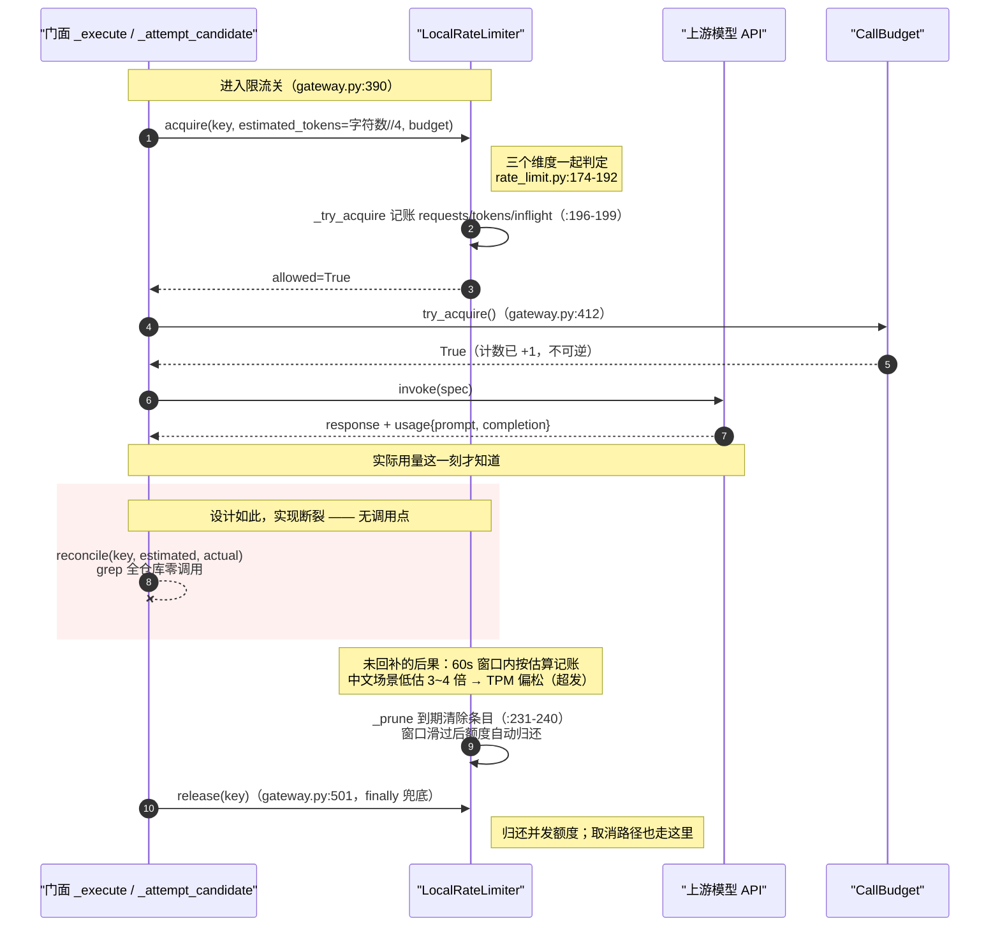
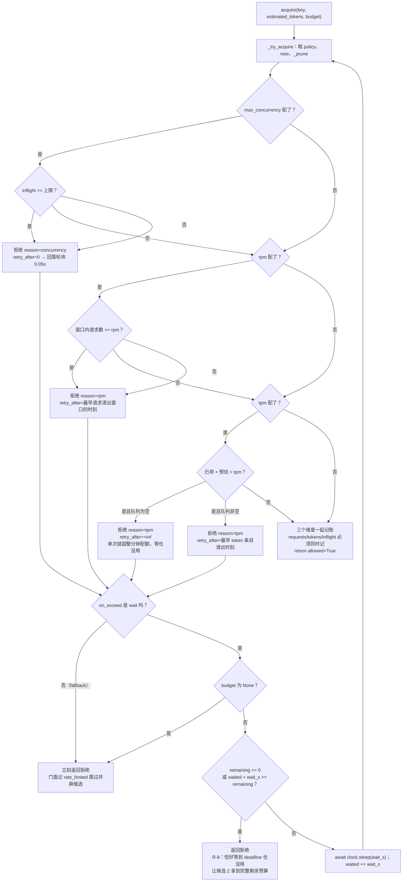
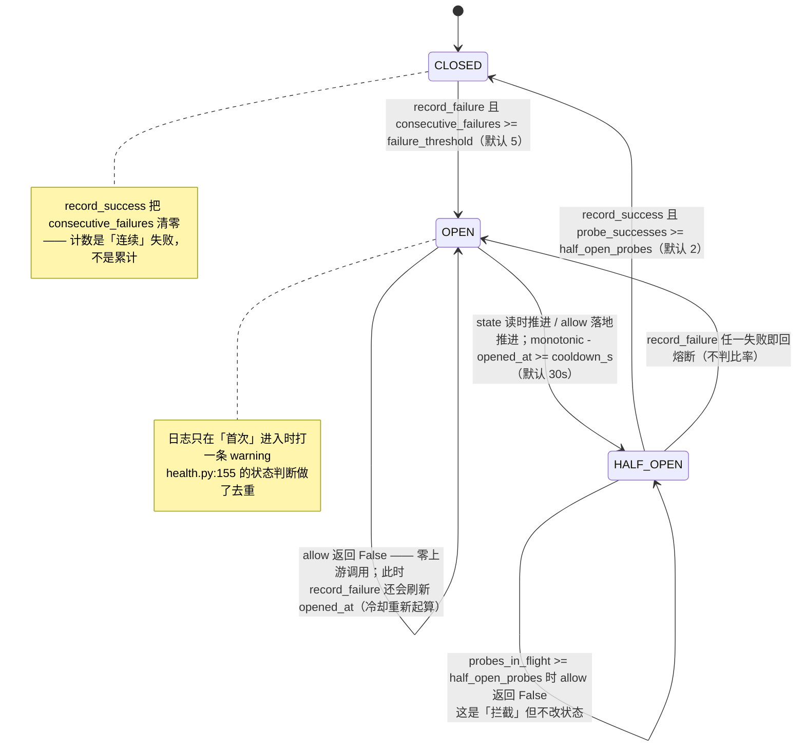
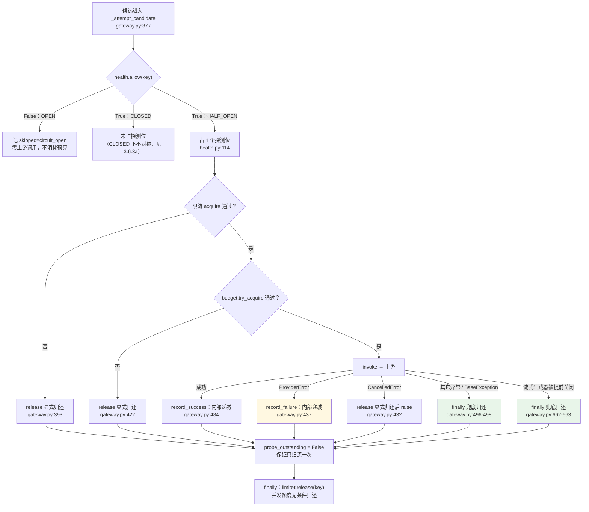
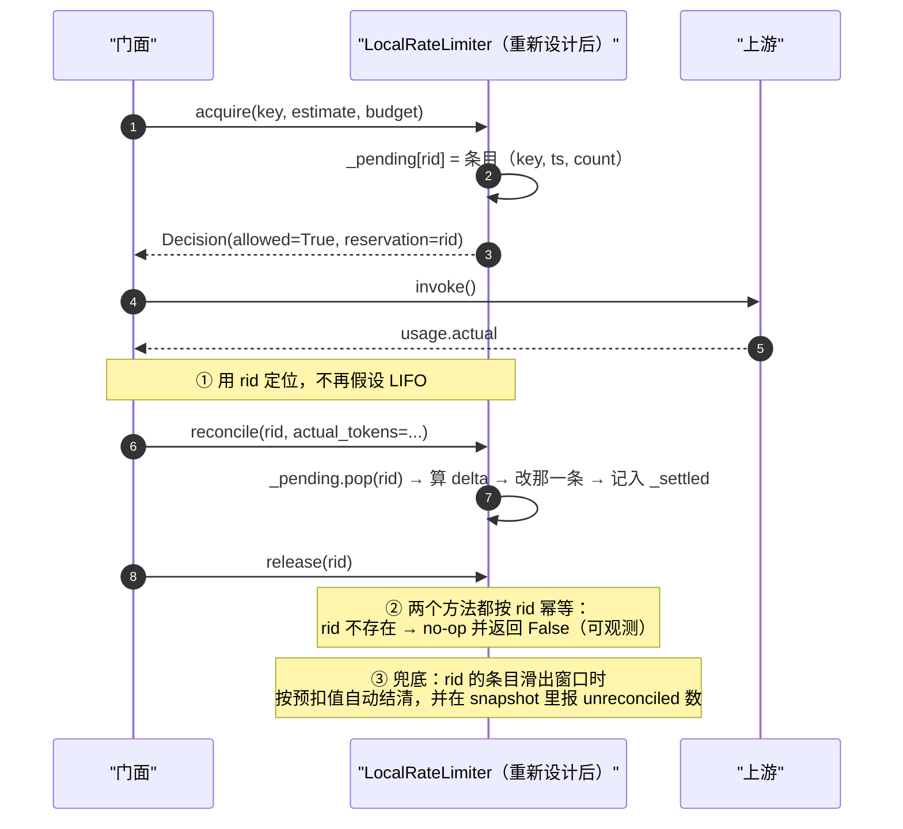

# 第 3 章 M4 可用性防护 —— `rate_limit.py` / `health.py`

> 本章回答的判断题只有一道：**这个候选现在值不值得打。**
>
> 上一章讲完候选链从哪来、怎么排序；这一章讲链上每一个候选在被真正发起之前，还要过两道关。
> 关掉它俩，`_attempt_candidate` 就只剩「try_acquire → 打」；加上它俩之后，
> 一个已知挂掉的模型和一个已经打满配额的模型，都会在**不消耗任何上游调用**的情况下被摘掉。

先说位置。这两道关的**位置本身就是设计约束**，不是实现细节：

```
gateway.py:377    if not self._health.allow(spec.key):        # ① 熔断硬拦截
gateway.py:390    decision = await self._limiter.acquire(...) # ② 限流申请
gateway.py:411    while True:                                 # ③ 重试循环（才轮到打上游）
gateway.py:412        if not budget.try_acquire(): ...
```

需求文档 §4 的四条硬约束里第一条就是「`health` / `rate_limit` 在 `retry` 之前」。
代码在 `_attempt_candidate` 的 docstring（`gateway.py:365-374`）里把这条写成了明确的
三步编号，`health.py:3-6` 又解释了一遍理由：对一个已经连续失败 5 次的模型重试三次，
不只是浪费三次请求，而是**挤占 `CallBudget`**，让本该降级到健康模型的请求直接超时。

这个「挤占」二字是本章的暗线：这两道关拦的是请求，但它们真正保护的是**预算**。
下面会看到，`rate_limit` 里最精妙的一处（R-8 边界）和 `health` 里最可疑的一处（探测位归还），
本质上都是在守护同一个东西。

---

## 3.1 三维限流：为什么三个维度必须用三种算法

`rate_limit.py:1-21` 的模块 docstring 一上来就摆了一张「维度 → 要点」表，
但那张表回答的是「用了什么」，没回答「为什么不能统一」。而后者才是这里唯一值得写下来的一段推理。

### 3.1.1 决定性差异：额度「什么时候回来」可不可算

三个维度表面上是三个数字，实际上按同一个标准分成两类：

| 维度 | 额度是什么 | 额度何时释放 | 可计算吗 |
|---|---|---|---|
| RPM | 窗口内已发生的**请求次数** | 最早的请求滑出 60s 窗口那一刻 | **可精确计算** —— `requests[0] + 60 - now` |
| TPM | 窗口内已占用的 **token 量** | 最早的 token 条目滑出窗口那一刻 | **可精确计算** —— `tokens[0][0] + 60 - now` |
| 并发 | 当前**在途请求数** | 某一个在途请求结束（成功/失败/取消） | **不可计算** —— 别人什么时候回来没人知道 |

这一条差异直接决定了等待策略的形态，而代码里有一行专门为它存在：

```python
# rate_limit.py:147-149
wait_s = decision.retry_after_s
if wait_s <= 0:
    wait_s = _CONCURRENCY_POLL_S          # 0.05s
```

RPM / TPM 的拒绝决策里带着一个**有意义的 `retry_after_s`**（`rate_limit.py:182`、`:192`），
所以 `wait` 可以「算一次，准点睡」；并发维度的拒绝只能返回 0
（`rate_limit.py:176` 只填了 reason，没填 retry_after），于是回落成 0.05 秒的短轮询。
`_CONCURRENCY_POLL_S` 的注释（`rate_limit.py:46-48`）说得很直白：「没有可计算的时间点，只能短轮询；
外层用 `max_wait_s` 兜住上界」—— 那个「外层」实际就是 `CallBudget.remaining_s()`。

**所以「三个维度用不同算法」不是风格问题，是这三种约束的信息结构不同。** 如果硬要统一成
一个令牌桶，会同时丢掉三样东西：

| 强行统一 | 丢掉什么 |
|---|---|
| 用令牌桶做 RPM | 令牌桶天然允许**突发**（攒下多少额度就能一口气打多少）；而 `rpm: 600` 的业务语义是「任意 60 秒内不得超过 600 次」。突发是被禁止的，不是被允许的 |
| 用令牌桶做 TPM | 桶是一个**标量**，而 TPM 需要「哪 2000 token 属于哪一次请求」—— 因为实际值回来后要**逐条修正**（见 §3.2）。标量桶无从修正 |
| 用令牌桶做并发 | 并发根本不是速率，是**状态量**。桶里没有「在途」这个概念 |

### 3.1.2 与业界实现的差异

| 方案 | 做法 | 本项目为什么不同 |
|---|---|---|
| **Guava `RateLimiter`** | `SmoothBursty` 令牌桶（允许积攒约 1 秒的突发额度）+ `SmoothWarmingUp` 预热 | 本项目 RPM 用**滑动窗口时间戳队列**，语义是「任意 60s 窗口内 ≤ N」，**不允许突发**。对「别把配额打爆」这个目标保守是对的，代价是回归高峰期的调用只能排队（而这正好把 §3.3 的 `on_exceed: wait` 从「偶尔触发」变成「高峰常态」） |
| **Sentinel** | `LeapArray` 细粒度时间分片环形数组统计 QPS + 独立计数器管并发线程数 + 另一套 `RateLimiterController` 做匀速排队 | 分片是为了扛每秒百万级统计、同时把内存压成常数。本项目单进程、多 agent、`rpm: 600` 量级（`configs/base.yaml:160`），`deque[float]` 的 O(1) 摊销 + 精确无分片误差已经够用 —— **量级决定数据结构**，照抄 Sentinel 是过度设计 |
| **Envoy circuit breaker** | 阈值模型是「最大连接数 / 最大 pending 请求数 / 最大请求数」这类**容量水位**，超出即快速失败（不排队） | Envoy 的默认姿态是**快速失败**（它面对的是不可控的南北向流量）；本项目默认是**排队**（`on_exceed: wait`），因为北向是自家 agent，限流通常是短暂的（`rate_limit.py:99-102`） |
| **Go `x/time/rate`** | `WaitN(ctx, n)`：令牌桶 + 自带 `ctx` 做取消/超时；调用方为每次等待单独带一个 deadline | 本项目把 deadline 的所有权收在 **`CallBudget` 一个对象**里，限流器只读不写（`rate_limit.py:157` 调 `budget.remaining_s()`）。这样「等多久」和「总共还能打几次」由同一个上界管住 —— 与 `NFR-G-04` 的「唯一计数点」是同一个思路 |

### 3.1.3 `LocalRateLimiter` 的 key 粒度：D-8 写了两层，代码实现了零层

这是本章第一个必须说清楚的事实。

需求文档 `D-8`（`需求说明书-gateway.md:397`）写的是「**按模型 + 按会话** 两层，一期不做租户维度」。
代码的实际形态是：

- `LocalRateLimiter` 的**内部命名空间**确实是按 key 分开的：`_requests` / `_tokens` / `_inflight`
  三个 `defaultdict` 都以 `key` 为索引（`rate_limit.py:113-115`），传进来的是 `spec.key`（模型键）。
  所以记账确实是「按模型」的 —— 模型 A 打满 RPM 不影响模型 B。**这一层算实现了。**
- 但**限额本身是全局一份**：`build_rate_limiter` 只读 `data["defaults"]` 构造**一个**
  `RateLimitPolicy`，然后把它当成常量传下去（`rate_limit.py:273-278`）。
  `LocalRateLimiter.__init__` 里那两个分支（`rate_limit.py:107-109`）——
  「`policy_for` 是可调用对象就按 key 取，是 `RateLimitPolicy` 就当成统一限额」——
  说明**按模型配不同限额的能力在结构上留好了**，但组合根从来没用过。
  配置里也确实没有任何 per-model 限额（`grep rpm|tpm|max_concurrency configs/*.yaml` 只有
  `base.yaml:160-162` 那三行 defaults）。
- **会话维度完全没有**：`LocalRateLimiter.acquire(key, ...)` 只收一个 `key`
  （`rate_limit.py:118-124`），签名里没有任何 `session_id`；`gateway.py:390` 调用时也只传 `spec.key`。
  `RoutingContext` 里倒是有 `session_id`（`router.py:43`），但那个字段是给 `weight` 策略做分流稳定性用的（`D-F`）。

**结论**：D-8 的两层，落地的是「按模型分账」这一层（而且是隐式的 —— 靠 key 命名空间，
不是靠策略），并且限额只能配一份。会话层 = 0。

这算设计缺陷还是有意的取舍？我的判断是**介于两者之间，但偏向缺陷**，理由是：

- 它不是「一期不做」的那类简化。一期不做的是**租户**维度（需要额外的一致性设计），
  而**会话**维度的数据已经在你手里了（`gateway.chat(..., session_id=...)`，`gateway.py:142`），
  加一层 key 前缀的成本是几行。
- 更值得注意的后果：`D-8` 承诺的「多 agent 同时跑，别把配额打爆」在实现上是**一个全局额度**。
  一个跑飞了的 agent（比如一个死循环的用例生成 agent）可以合法地吃掉整个模型 600 rpm 的全部额度，
  把这一轮回归里其他所有 agent 饿死。这不是超发，是**内部独占** —— 一个完全合法的、不会被限流器
  拦下的饥饿场景。
- 反过来说，`defaults` 单份限额也**不是不能修**：`policy_for` 已经是 callable 形状，
  把 `build_rate_limiter` 扩成「`defaults` + `per_model` 覆盖」是几行的事。所以这是「留了接口没用」，
  不是「结构上做不到」。

`configs/base.yaml:154-163` 的注释说「配 redis 会明确报错」写得很醒目，
但**没有任何一处文档或注释告诉读者「会话维度尚未实现」**。这正是这套设计最想消灭的东西：
一个配置项（`D-8` 的两层）在文档里存在、在代码里缺席，而缺席是静默的。

---

## 3.2 TPM 的预扣与回补：本章最值得怀疑的一处

### 3.2.1 为什么要预扣

`rate_limit.py:8-13` 的论证只有三句话，但它是全模块最有说服力的一段：

> `tpm` **按预估预扣、按实际回补**。不这么做的话，配额永远是「上一次请求**之后**」的视角，
> 而一个请求可能吃几千 token —— 等它回来时，超发的量已经发出去了。

把它展开：TPM 与 RPM 的根本不同在于**事件的大小事前不可知**。
RPM 里「一次请求」是确定的 1；TPM 里「一次请求」可能是 50 token 也可能是 8000 token，
而**这个数字只有上游返回 `usage` 之后才知道**（`FR-G-08`）。所以：

- 若按实际值记账（不预扣），那么从「发出请求」到「收到 usage」这个窗口内，
  限流器对该请求的消耗是**盲的**。100 个并发的长请求全部通过检查后，TPM 的实际占用才陆续到账 ——
  到账时已经超发了。
- 若按预扣记账，超发窗口被压缩到「预估误差」这一个量级，而不是「整次请求的用量」。

这和航空订票的超售问题同构：**先占座，事后核账**。区别是这里没有「退票」的成本，
所以预扣-回补是纯赚。设计文档 `架构概要设计-gateway.md:302` 那句「否则 TPM 永远滞后」
就是在说这个。

### 3.2.2 预估从哪来、偏哪边、偏哪边更危险

预估的**唯一来源**在门面里，不在限流器里：

| 入口 | 预估式 | 行号 |
|---|---|---|
| `chat` / `stream_chat` | 消息内容字符数 `// 4`，下限 1 | `gateway.py:191`、`:283`、`:804-811` |
| `embed` | 所有待向量化文本的字符数 `// 4` | `gateway.py:230` |
| 常量 | `_CHARS_PER_TOKEN = 4` | `gateway.py:65` |

`_CHARS_PER_TOKEN` 的注释（`gateway.py:60-64`）交代了三件事：只用于预扣不用于计费、
刻意不引入 tokenizer（`D-D`）、误差由 `reconcile` 回补。这是个诚实的注释。
但**这个粗估的偏差方向和幅度，代码里没有任何一处写下来**，我算一下：

| 情况 | 真实 token | 估算值 | 偏差 |
|---|---|---|---|
| 纯英文 | ~1 token / 4 字符 | 字符/4 | **基本贴合**（GPT 系 BPE 对英文约 4 字符/token） |
| **中文** | **~1 token / 1~1.5 字符** | 字符/4 | **低估 3~4 倍**（这是最要命的一格） |
| **输出 token** | — | **完全不计** | **低估**（`_estimate_chat_tokens` 只遍历 `message.content`，不看 `max_tokens`） |
| `tools` / `json_schema` 定义 | 会进 prompt，可能上千 token | **完全不计**（`:804-811` 只读 `message.content`） | **低估** |
| `system` 提示长、对话历史长 | — | 字符/4 覆盖了 | 视语言而定 |

**三个偏差方向全部是「低估」，没有一处是高估。** 原因是可以理解的：这个函数只做了一件事
「把消息文本长度加起来除以 4」，凡是「不在 `message.content` 里的 token」它都看不见。

那么低估和高估，哪个更危险？这里必须分开看，不能一句「低估更危险」了事：

- **低估的危险是超发**：`used + estimated > tpm` 这道判断（`rate_limit.py:187`）会被系统性放宽，
  实际发出去的 token 可能显著超过 `tpm: 200000`（`configs/base.yaml:161`）。
  对上游厂商而言这是真金白银的配额越界，后果可能是 429、可能是限流封禁，也可能是账单超支。
- **高估的危险是自锁**：额度被虚占，健康流量被自己的限流器打回，
  表现为「明明没打满却一直限流」。因为 TPM 的等待是有`retry_after`的（窗口滑动），
  所以它至少会自己解开，不会永久卡死。

结论：**低估更危险，因为低估的失效是「约束没生效」，高估的失效是「约束过度生效」。**
前者不可观测（限流器不会报错，它只是放行了），后者立刻可见（调用开始排队/降级）。
而这套设计里，回补机制（`reconcile`）**唯一能修正的就是低估** ——
`delta = actual - estimated > 0` 时把条目调大（`rate_limit.py:220-228`）。
所以：`reconcile` 不是「优化」，它是这个粗估方案**唯一的纠偏手段**。删掉它，
整个 TPM 维度就退化成「按字符数/4 估算的软约束」，中文场景下相当于配额被放大 3~4 倍。

### 3.2.3 `reconcile` 从未被调用 —— 这是本模块最严重的实现缺口

我把它查干净了。全仓库（含测试、含文档）搜索 `reconcile`，只有三处：

```
src/gateway/rate_limit.py:12    （模块 docstring 说「所以 reconcile 是必需的，不是优化」）
src/gateway/rate_limit.py:208   （方法定义本身）
src/gateway/gateway.py:64       （注释说「误差由 LocalRateLimiter.reconcile 回补」）
```

**零个调用点。** 门面里没有，组合根里没有，测试里也没有（`grep -r reconcile tests/` 空）。

这意味着 §3.2.2 的结论要加一条：**TPM 维度实际上运行在纯预估模式下**，
`reconcile` 是一段有方法体、有 docstring、被两份文档指名引用、但从未执行过的代码。

这是不是「设计缺陷」？我认为是，而且它比 §3.1.3 的会话维度缺席更严重，因为它**制造了一个假的确定性**：

1. `gateway.py:64` 的注释在读者的心智里建立了一个「误差会被回补」的模型。
   任何一个读这段代码的人（包括未来的维护者）都会认为 TPM 是准的。
   于是**没有人会去查「中文场景下 TPM 是不是偏松」** —— 而这正是「静默失真」的标准形态。
2. 它同时是「降级必须标记」的反例：这里发生的是一次**静默降级** ——
   从「预扣 + 回补」降级成了「只有预扣」，而降级没有任何标记。
   `reconcile` 甚至没有 `snapshot()` 能暴露的计数器（比如 `reconcile_count` / `unreconciled`），
   所以运维侧也没有任何办法发现它没被调用。
3. 修它的成本极低：门面在拿到 `response.usage` 之后调一次即可（成功路径在
   `gateway.py:483-494`，那里已经拿到了 `response`；流式路径拿不到 usage，见 `:632-641` 的说明，
   本来就该跳过）。**没做，不是因为难，是因为没人发现。**

顺带核一个设计文档的说法。`rate_limit.py:211-213` 的 docstring 写：

> 不修正的后果是配额的占用只增不减 —— 跑一段时间后 TPM 会被永久占满，
> 表现为「明明没打满却一直限流」。

**这句话是错的**，而且错得有意思：`_prune`（`rate_limit.py:231-240`）每次 `_try_acquire`
都会按 60 秒窗口清掉过期条目（`cutoff = now - WINDOW_S`，`popleft` 掉 `<= cutoff` 的）。
所以条目**不会**永不过期，TPM 也不可能被永久占满 —— 它最多被占用 60 秒。
真正不修正的后果是 §3.2.2 那个方向相反的：**窗口内系统性低估 → 超发**。
docstring 之所以写反，我猜是因为它把 TPM 想象成了「累计总量配额」（永不归还），
而实际实现是「滑动窗口配额」（60 秒后自动归还）。这类「注释描述了一个不存在的实现」
和 `reconcile` 缺席是同一个病根：**TPM 这条路径没有测试，所以注释没人校**。
（`grep -rn "tpm\|TPM" tests/` 结果为空。）

### 3.2.4 失败路径、崩溃路径：预扣的额度会泄漏吗

问题问得准，答案分三种情况，且结论都不相同：

| 场景 | 预扣的 RPM 条目 / TPM 条目会怎样 | 结论 |
|---|---|---|
| **调用失败**（503 / 429 / 超时） | `_try_acquire` 已经记了 `_requests` 和 `_tokens`（`rate_limit.py:196-198`），失败后**没有任何代码撤销它们**。`reconcile` 也不会被调用（它压根没被调用）。条目会在 60 秒后由 `_prune` 清掉 | **不泄漏，但会占用满 60 秒**。语义上这其实是**对的**：失败的请求也真的打到了上游、真的可能被计费（这正是 `gateway.py:764-776` `_record_failure_usage` 存在的理由：「失败的调用也可能产生用量」）。所以「失败不回补」是正确的设计，不是漏掉的分支 |
| **并发额度**（inflight） | `release()` 在 `finally` 里无条件调用（`gateway.py:501`），取消路径上也走得到（`:429-434` 显式 release + `finally` 兜底） | **不泄漏**。`FR-G-13` 的验收点有测试守着（`test_acceptance.py:461-485`，断言 `inflight` 归零） |
| **进程在调用中途崩掉**（kill -9 / OOM） | 整个 `LocalRateLimiter` 对象随进程消失，**没有任何东西留下** | **不泄漏**——但代价是「限流状态也一起丢了」。多进程/重启场景下的配额精度，正是 `D-E` 与 `backend: redis` 要解决的问题 |

第三格值得多说一句：**预扣额度的「泄漏」在本进程内是不可能的，因为没有任何持久化。**
它看起来像个优点（不会泄漏），实际上是个约束（不跨进程 = 重启即失忆 = 突发流量在重启后
可以重新打满配额）。这与 §3.5 的 redis 报错、§3.7 的熔断不共享，是同一个问题在三个地方的三种表现。

### 3.2.5 预扣-回补 vs `CallBudget`：同一个模式的两处应用吗？

题面给的提示是「两者都在先占后还」，我觉得**这个类比有一半是对的，另一半是错的，
而且错的那一半恰好是重要的**。逐项对比：

| 维度 | `CallBudget.try_acquire()` | `LocalRateLimiter` 的预扣-回补 |
|---|---|---|
| 占什么 | 尝试次数 + 时间窗（两个上界） | 配额（RPM / TPM / 并发） |
| 占用时机 | `gateway.py:412`，紧邻上游调用 | `gateway.py:390`，在重试循环**之前** |
| 归还吗 | **不归还。** 是**消费**型 —— 一旦 `_used += 1`（`retry.py:98`），这次尝试就永久消失了。没有 `release()` 这个方法 | **必须归还。** 是**租借**型 —— `release()` 幂等且取消路径也必须调（`rate_limit.py:204-206`） |
| 可变吗 | 不可变（时间只会流逝，次数只会增加） | **可变**（`reconcile` 会把已记的条目改小或改大，`rate_limit.py:227-228`） |
| 唯一的吗 | **是**，且这个「唯一」是 `NFR-G-04` 的核心（`retry.py:34-38`：「没有第二个地方能做这个决定」） | 不是 —— 每个维度一个账本，且将来 Redis 后端会再来一套 |
| 谁持有 | 一次 gateway 调用一个（`gateway.py:790-796`） | 整个进程一个（`bootstrap.py:109`，构造一次传进 `Gateway`） |

所以我的判断是：**它们是两种不同的机制，不是同一个模式的两处应用。**
共同点只有「事前占用」这半句（那是任何资源保护的共性），
分岔点在**归还语义**：`CallBudget` 是「花掉就没了」，限流器是「借用必须还」。

这个区分不是文字游戏，它解释了三个真实的代码形态：

1. **为什么 `CallBudget` 没有 `release()`，而 `release()` 是限流器里最需要小心的东西。**
   `FR-G-13`（取消时配额归零）之所以被写成一条验收点，就是因为有归还语义的地方才会泄漏。
   没有归还语义的 `CallBudget` 不需要这条验收点。
2. **为什么 `CallBudget` 必须在限流器之外**（`架构概要设计-gateway.md:477-479` 的实施顺序：
   第 2 步 `CallBudget` 先于第 3 步 `rate_limit`）：限流器的等待需要读预算
   （`rate_limit.py:157`），而预算不读限流器。依赖是单向的。若把两者合成一个对象，
   就会出现「为了等配额而消耗总预算」这种自我指涉的判定 —— 而那条判定正是 R-8 要处理的边界。
3. **为什么这两个「先占后还」在实现质量上差别这么大**：`CallBudget` 的占用是**不可逆**的，
   所以它的正确性只依赖一件事 —— 「只有一处调用 `try_acquire`」（可静态检查，且有一条测试
   专门验证 `should_retry` 会读它，`test_budget.py:113-125`）。
   而限流器的占用是**可逆**的，正确性就多出了三个维度：归还的**时机**（finally）、
   归还的**次数**（幂等）、归还的**归属**（哪个请求的账？）——
   后两个在 TPM 上还没有做好（见 §3.9.3）。

### 3.2.6 TPM 预扣-回补时序图（含实际断裂的那一步）

**图 3 —— TPM 预扣-回补的时序（红色自环 = 设计承诺了、代码里断裂的那一步）**



图里那条 `F--xF` 的红色自环就是本章的核心发现：
**「按预估预扣、按实际回补」这个模式，代码里只实现了前半句。**

---

## 3.3 `on_exceed`：`wait` 与 `fallback` 的代价对比

设计文档 `:305-314` 有一张表，代码把它落成了 `LocalRateLimiter.__init__` 的一个字符串参数，
并且在 `acquire` 里只有一处分支（`rate_limit.py:151-152`）。

| | `wait`（默认，`configs/base.yaml:163`） | `fallback` |
|---|---|---|
| 行为 | 在 `while True` 里睡到额度释放，或直到预算不够 | 第一次拒绝就返回，门面把它当成「跳过这个候选」 |
| 代码 | `rate_limit.py:166` `await self._clock.sleep(wait_s)` | `rate_limit.py:151-152` 直接 `return decision` |
| 代价 | **吃掉 deadline**（等待时长计入 `CallBudget`，因为 sleep 会让时钟前进，`remaining_s()` 随之减少） | **换到更贵/更弱的模型**（永久性代价） |
| 门面的反应 | 无（限流器内部消化了） | `gateway.py:391-406`：记一条 `skipped_reason="rate_limited:rpm"` + 发 `QUOTA_EXHAUSTED` 事件 |
| 什么时候对 | 限流短暂（`rate_limit.py:99-102`：「下一秒额度就回来了」） | 上游配额已经深水区，等下去不如换个模型 |

**默认 `wait` 的理由是「限流是暂时的、换模型是永久的」** —— 这是个不对称性论证，我认同它。
但代码里有一个重要的补充条件，比文档写得更强：

```python
# rate_limit.py:154-155
if budget is None:
    return decision          # 不等待 —— 等价于立即判定
```

也就是说 **`wait` 能否成立，取决于调用方有没有给预算**。没有预算的 `acquire` 一律退化成
`fallback`。这是对的（没有 deadline 的等待是无界的），但注释里「等价于立即判定」这个说法
容易让人以为「`budget=None` 时行为不变」—— 实际上它把 `wait` **变成了** `fallback`。
在 `gateway.py:390` 里预算总是传的，所以这是纯 API 层面的坑，不影响生产路径。

### R-8：边界判据是 `>=`，代码与文档一致（已核实）

条款原文（`架构概要设计-gateway.md:467`）：限流等待的边界判据用 `>=` 而非 `>`。
代码在 `rate_limit.py:157-164`：

```
remaining = budget.remaining_s()
if remaining <= 0 or waited + wait_s >= remaining:
    return RateLimitDecision(decision.allowed, decision.reason, retry_after_s=wait_s)
```

`waited + wait_s >= remaining` —— 确认是 `>=`，与 R-8 一致。

**为什么 `>` 会「白等一轮再失败」**，把时序摊开就清楚了：

设剩余预算 `remaining = 10s`，本次等待 `wait_s = 10s`（RPM 窗口最早那次刚好在 deadline 时刻滑出）。

用 `>` 走一遍：

1. 断言 `0 + 10 > 10` → **False**，不 bail，于是 `await sleep(10)`。
2. 睡满 10 秒后，`CallBudget.remaining_s()` 已经变成 **0**（时间就是被这个 sleep 花掉的）。
3. 回到循环顶部，`_try_acquire` 此时**真的成功了** —— 因为窗口确实滑过了，
   额度确实回来了。于是 `acquire` 返回 `allowed=True`。
4. 门面拿着这个 `True` 去 `budget.try_acquire()`（`gateway.py:412`）——
   `exhausted_reason()` 里 `remaining_s() <= 0` 命中 `"deadline"`（`retry.py:85-86`）→
   **`try_acquire()` 返回 `False`** → 记一条 `budget_exhausted` 的跳过记录，然后
   `break`（`gateway.py:414-424`）。
5. 净结果：**等了整整 10 秒，一次上游调用都没发出去，预算归零。**

**这一切最贵的地方不是「浪费了这次调用的 10 秒」，而是「偷走了后续候选的 10 秒」。**
`CallBudget` 是整条候选链共享的（`gateway.py:164`、`:261` 构造一次，然后
`:309-318` 在 `for` 循环里传给每个候选）。候选 1 把剩余预算的全部押在一次没有意义的等待上，
候选 2 拿到手时预算已经是 0 —— 于是**本来应该成功的降级被打成了「预算耗尽」**。
这恰恰是 `health` / `rate_limit` 必须在 `retry` 之前那条约束要防的事，
只是发生在预算维度而不是请求次数维度上。

所以 R-8 的 `>=` 本质上是一句话：**「不要把最后一次额度押在一次『刚好赶在 deadline 前拿到、
但拿到也没时间用』的等待上」**。用 `>=` 时，第 1 步就命中 `0 + 10 >= 10` → 立即返回拒绝，
`fallback` 逻辑接手，候选 2 完整地拿到 10 秒。这是**用一次「本来也无用的等待」换一次「真正有意义的降级」**。

### 一个原文档没提的细节：这个判据比「剩余不足」更严，而且是双重计入

`waited` 是限流器自己累计的等待时长（`rate_limit.py:167`），
而 `remaining` 是**从预算里读的**、已经把那些等待算进去了（因为 `sleep` 推进了同一个时钟，
`CallBudget.remaining_s()` 每次都重算，`retry.py:71-75`）。

所以 `waited + wait_s >= remaining` 把同一段等待算了两次。它的准确含义不是
「剩余预算不足以等完这一次」，而是「剩余预算先减去已经等掉的时间，再和这一次比」。
代价是**提前放弃**。对于「每次等待时长恒定 = w」的情形解一下不等式：

第 k 次迭代的判据是 `(k-1)w + w >= D - (k-1)w`，即 `(2k-1)w >= D`，
也就是 `k ≈ D/(2w)` —— **总共等掉约 `D/2`（预算的一半）就会放弃**，而不是等到预算耗尽。

这在哪一维上真正会造成损失？**并发维**，因为它是唯一一个 `wait_s` 只是下界（不可计算）的维度：
`wait_s = 0.05s` 固定轮询（`rate_limit.py:48`、`:176`），
默认 `deadline_s=120`（`configs/base.yaml:152`）下会轮询约 1200 次、**60 秒后放弃并降级**。
如果那个在途请求 70 秒后结束，实际本可以等到 —— 结果却是花钱换了个模型。

这算缺陷吗？我的判断是**算一个「保守方向的偏差」，可以接受，但不该是默认行为**，
理由：它错的方向是「更早地降级到别的候选」而不是「更晚地失败」，
所以它伤的是成本（换个更贵的模型）而不是可用性。要修也很便宜 ——
判据改成 `wait_s >= remaining`（去掉 `waited`），语义就与文档一致了。
我更倾向于保留一点保守（`>=` 加上一个很小的余量），但把余量写成一个明确的名字
（比如 `_DEADLINE_SAFETY_S`），而不是让它以「累加变量被重复计入」的形态隐式存在。
**隐式的保守和隐式的激进一样，都是不可读的不确定性。**

### 三维限流的判定流程（含 `on_exceed` 分支与 R-8 边界）



图里 `DEN3` 那条 `retry_after=+inf`（`rate_limit.py:191`）值得单独说一句：
它是「单次请求就超过整分钟配额」的拒绝路径，注释（`:188-190`）说得很清楚 ——
「这通常意味着 `tpm` 配错了，而不是『稍后就好了』」。
**这是一个把「配置错误」和「暂时没额度」分开的判据**，而且它天然与 R-8 的边界相容：
`inf >= remaining` 恒真，所以它会立刻走 `fallback` 分支，不会白等。
一个配置错误（`tpm` 设成了比单次请求还小）因此表现为「立刻降级」而不是「挂住 60 秒」。
这种「让配置错误以最快的速度、最可读的方式暴露」的写法，在 `router._explain`
（`router.py:210-233`）里也出现过一次，是本项目的稳定风格。

---

## 3.4 redis 后端为什么必须明确报错

### 3.4.1 代码事实

```python
# rate_limit.py:264-271
backend = str(data.get("backend", "local")).strip().lower()
if backend not in ("local", "memory"):
    raise NotImplementedError(
        f"限流后端 {backend!r} 尚未实现。当前仅支持进程内后端（'local'／'memory'）。\n"
        "跨进程限流（Redis）见《架构概要设计-gateway》§8 D-4，属二期。\n"
        "注意：多进程部署下使用本地后端会让实际配额**超发 N 倍**（N = 进程数）。"
    )
```

`backend: redis`（或任何拼错的值，如 `redis://...`）→ **构造期 `NotImplementedError`**，
进程起不来。注意它连「拼错的后端名」也一起拦了 ——
`backend: radis` 不会被当成 `local` 静默接受，这是个白拿的收益。

### 3.4.2 这个报错在防什么

设计哲学的第一条是「故障放大倍率有上界，且上界是**一个能读出来的数字**」；
在限流这一格，那个数字是 **N = 进程数**。而这件事的可怕之处不在倍率，在**暴露点**：

| 方案 | 本地单进程测试 | 生产多进程 | 谁先发现 |
|---|---|---|---|
| **静默降级到单进程**（打 WARNING） | 完全正常（配 600 rpm，就打 600） | **实际发出 600 × N rpm**，每个进程各自以为自己守住了 600 | **生产**。而且是「配额超发」这种**没有本地现象**的失效 —— 唯一的信号可能是上游发来的 429 或者月末账单 |
| **明确报错**（当前实现） | **起不来**，报错信息直接说「超发 N 倍」 | 同样起不来 | **开发机**，在写配置的那一刻 |

所以这不是「严格 vs 宽松」的取舍，而是**把失效从生产搬回本地**。
`rate_limit.py:260-261` 的注释原话是「宁可让多进程部署在上线前就撞到这堵墙，
也不要让它上线后才发现」—— 这句话我完全同意，而且它有一个额外的、更硬的理由：

**「配额超发 N 倍」是一个只有多进程才能观测到的性质。** 单进程部署下，
静默降级和明确报错的行为**完全一样**，而团队的大多数开发/CI 环境都是单进程。
于是「静默降级」方案下，代码库里**不存在任何一个能复现该 bug 的环境**（除非专门搭多进程压测）。
这不是「本地测试恰好没覆盖」，是「本地测试在原理上无法覆盖」。
按这个标准，静默降级不只是「没标记」，它是**在可观测性上不可能被发现的降级** ——
四个反面里最坏的一个（静默失效）。

### 3.4.3 与「启动打 WARNING 然后降级」的对比

平心而论，「WARNING + 降级」不是没有优点：

| | 明确报错 | WARNING + 降级单进程 |
|---|---|---|
| 本地能不能发现 | 能（启动即失败） | 不能 |
| 生产可用性 | **多进程部署直接不可用** | 能用（但配额是错的） |
| 迁移友好度 | 二期实现 Redis 之前，配置里**不能出现** `backend: redis` | 可以提前把配置写好，等代码跟上 |
| 运维可控性 | 没有「我知道有风险但我接受」的开关 | 有（日志里留痕） |

第二行是「明确报错」方案的真实代价，而且在本项目里**代价是实的**：
`FR-G-06`（`需求说明书-gateway.md:205`）明确写「多进程部署时限额必须**跨进程生效**
（`apps/server/storage/redis` 已就位）」。也就是说需求文档认为 Redis 基础设施**已经在了**，
而 `rate_limit.py` 仍然把跨进程后端列为「二期」。
于是当前版本的真实状态是：**`apps/server` 只要多进程部署并配 `backend: redis`，
就启动不了；配 `backend: local` 就会超发 N 倍。** 这是个需要在部署时显式决策的红线，
而它只在配置注释里出现（`configs/base.yaml:156-157`），没有出现在任何「上线检查清单」里。

如果让我重新设计这一处，我会保留报错，但**把报错改成「需要显式确认」而不是「硬失败」**：

- 默认（`backend: redis`）：抛错，同现在。
- 增加一个显式的、名字就该让人不舒服的开关，比如
  `allow_unsafe_local_backend: true`，且**必须**同时设置
  `expected_process_count: N`（用于让报错/日志算出那个数字）。
- 启动日志里打一条 `WARNING`，内容包含**上界**：「本进程按 600 rpm 限流，
  共 N 个进程 → 实际配额上限 600N rpm」。
- `doctor` 里输出同一行。

这样既保住了「本地必现」（因为默认还是报错），又给「我知道风险、我要先跑起来」留了一条
**带标记的路**。区别在于：现在这条路的替代品是 `enabled: false` —— 那条路是**完全静默**的
（见下一节），比一个显式的 `allow_unsafe_local_backend` 糟得多。

### 3.4.4 组合根里的那个例外，以及它顺手打开的一扇门

`composition/bootstrap.py:126-141` 的 `_build_limiter` 有一个刻意的分叉：

```python
data = dict(cfg or {})
if not data.get("enabled", True):
    # 注意：这里**不走 build_rate_limiter**，因为后者会校验 backend。
    # 「关掉限流」应当无条件成立，哪怕 backend 配的是尚未实现的 redis ——
    # 否则关掉它反而会报错，与本意相反。
    return LocalRateLimiter(RateLimitPolicy(), clock=clock, on_exceed="fallback")
return build_rate_limiter(data, clock=clock)
```

**为什么这个例外是对的**（我的判断：对，但它不完整）：

「关掉限流」是一个**无条件应当成立**的动作，这个直觉来自一条更普遍的原则 ——
**「关闭」永远不能因为「被关闭的那个功能尚未实现/配置有误」而失败。**
反例很好想：运维半夜遇到限流误伤，想把 `enabled` 关掉止损，
结果一改配置进程起不来了，因为 `backend` 写的是 `redis`。
此时「关掉限流」这个动作**依赖于限流后端被正确实现** —— 这是个荒谬的依赖方向。
所以这个例外不是「偷懒绕过校验」，而是**切断了这个依赖方向**，我认同。

`enabled: false` 时返回一个**空策略**的限流器而不是 `None`，理由也写在 docstring 里
（`bootstrap.py:129-132`）：网关侧不需要到处判空，「关掉限流」与「没配限流」走同一条代码路径。
这与 `Gateway.__init__` 的默认值（`gateway.py:124`：`self._limiter = rate_limit or build_rate_limiter(None, ...)`）
是同一个思路。**「不限制」被建模成「一个三档全空的限流器」，而不是「一个不存在的限流器」** ——
这样 `_try_acquire`（`rate_limit.py:174/178/184` 三处 `is not None` 判断）
天然全部短路放行，不需要在门面里加 `if self._limiter is not None`。
用一个统一对象吃掉所有分支，比在调用方散布判空要好，我认同这个选择。

**但例外打开的这扇门，是本章我认为最值得改的一处：**

`enabled: false` 走的分支**完全静默** —— 没有日志、没有事件、`doctor` 不报告
（`apps/cli/commands/doctor.py:54-59` 只输出熔断状态和未交付用量记录）。
于是「多进程 + `backend: redis` + `enabled: false`」这个组合：
进程能起来、没有任何提示、配额完全不受控（三档全空）。
这正是 §3.4.2 里那个「不可能被发现的失效」，**只是从 `build_rate_limiter` 的后门走了回来**。
而且它有真实的动机：配置里写了 `backend: redis` 说明部署者**想要多进程限流**，
进程起不来 → 最省事的解法就是把 `enabled` 改成 `false` → 问题「解决」了。

我建议的修法很小（且完全不违背「关掉限流无条件成立」）：

```
if not data.get("enabled", True):
    if str(data.get("backend", "local")).strip().lower() not in ("local", "memory"):
        _log.warning("限流已被显式关闭（enabled: false），但 backend 配的是 %r："
                     "多进程部署下配额将完全不受控。", backend)
    return LocalRateLimiter(RateLimitPolicy(), clock=clock, on_exceed="fallback")
```

三行日志的成本，换掉了本章唯一一处「完全静默的配置后果」。
**「关掉限流应当无条件成立」和「关掉限流应当留下痕迹」不冲突** ——
前者说的是不要抛错，后者说的是不要沉默。当前实现只做到了前者。

顺带记两笔小的：

- `_build_limiter` 在 `enabled: false` 时硬编码 `on_exceed="fallback"`，
  忽略了配置里的 `on_exceed: wait`。因为空策略下 `_try_acquire` 永远不会拒绝，
  这个参数**完全是惰性的**（不可观测），所以不是 bug。但它是「同一个配置项在两条分支上
  有两种含义」的例子 —— 如果将来空策略不再等于「永远放行」（比如加一个全局熔断档），
  这里会变成一个真实的差异。建议直接不传这个参数，用默认值，减少一处隐式不一致。
- `backend` 的白名单里有 `"memory"` 这个别名，但 `configs/*.yaml` 和需求文档都只写 `local`。
  一个未文档化的别名 = 一种没人知道存在的配置写法，将来如果有人把 `memory` 当成
  「另一种后端」去实现（比如内存映射文件），就会撞上这个别名。
  两行代码的事，但属于「可读性上的不确定性」，建议要么删掉别名，要么在配置注释里写上。

---

## 3.5 熔断：状态机与全部转移条件

`health.py` 225 行里，真正承载语义的只有 `CircuitBreaker` 的 100 行左右；
剩下的是一层很薄的 `HealthRegistry`（按模型键管理 breaker 的字典，`health.py:191-225`）。
值得先明确一件结构上的事：**`HealthRegistry` 是「按模型键懒创建」的**
（`health.py:204-209`：`breaker(key)` 找不到就新建）。
没有预热、没有上限、没有淘汰 —— 这和限流器一样是「键空间 = 模型数量」的有界字典，
所以不构成泄漏；但也意味着**一个从来没被调用过的模型，在 `snapshot()` 里根本不存在**
（`health.py:224-225` 遍历的是已有的 breaker），`doctor` 因此看不到它 —— 这是对的
（「没被用过」和「健康」应该可区分），只是值得知道。

### 3.5.1 状态机（含全部转移条件与触发判据）



三个状态的实现细节值得逐个交代：

| 状态 | `allow()` 的行为 | 行号 | 关键点 |
|---|---|---|---|
| `CLOSED` | 直接 `return True`，**不占探测位** | `health.py:106-107` | 正常路径零开销，代价是 `_probes_in_flight` 在 CLOSED 下恒为 0（见 §3.6.2） |
| `OPEN` | 直接 `return False` | `health.py:108-109` | **零上游调用**的来源。门面把它变成一条 `circuit_open` 的跳过记录 + `MODEL_SKIPPED` 事件（`gateway.py:377-387`） |
| `HALF_OPEN` | 探测位没满就 `+1` 并放行，满了就拒 | `health.py:112-115` | 这是唯一会**改变计数**的放行，也是 `release()` 存在的全部理由 |

`state` 是一个**惰性推进**的 property（`health.py:81-94`），注释里给了理由：
否则就得有一个后台任务定期扫所有熔断器，而那个任务唯一的作用就是改一个状态位。
这个取舍我认同，而且它比注释写的还有价值一点：**惰性推进让熔断器完全不需要生命周期管理**
（没有定时器、没有 close、没有「忘了启动扫描任务」这种失效）。
代价是 `state` 这个 property 读起来像纯函数、实际上带时间语义 —— 所以 `allow()` 里那三行
「读一次 `state`，若它已经不等于 `_state` 就落地推进」（`health.py:102-104`）
是必须的：**`state` 只做「虚拟视图」，真正的写操作只发生在 `allow()` 里**。
把「读」和「写」分开是对的，`snapshot()` 就是踩在「读」这一侧（`health.py:179` 的注释
「`state` 取的是推进后的状态」），所以排障时看到一个 `half_open` 的模型，
并不意味着它真的被探测过 —— 只是冷却到期了。

### 3.5.2 `failure_threshold` 是「连续」失败 —— 成功一次就清零

题面问到这一点，代码的答案很明确，而且**在注释里被显式强调过**：

```python
# health.py:138-139
# CLOSED 下的成功只清失败计数 —— 计数是「连续」失败，不是累计失败
self._consecutive_failures = 0
```

字段名本身（`_consecutive_failures`，`health.py:75`）和 `configs/base.yaml:166` 的注释
（「连续失败这么多次 → 熔断打开」）都一致，`_close()` 里也会清零（`health.py:173`）。
所以：**5 次连续失败熔断，中间夹一次成功就重新数。**（阈值语义已核实，与文档一致。）

这个选择值不值得？两种语义的差别在一个具体场景里最明显：**每 3 次失败夹 1 次成功的抖动模型**。
用「连续」计数，它永远不会熔断（成功率 25% 但每次成功都清零）；
用「累计窗口内失败率」，它早就被摘掉了。那么「连续」是不是选错了？

我认为**选「连续」是对的，但理由是「可解释性」而不是「准确性」**：

- 熔断器的目标是「别再往上撞」，它的动作是「零调用」，代价是「误伤一个其实还能用的模型」。
  判据必须能让运维一眼看懂为什么熔断 —— 「连续 5 次失败」是个能直接对着日志数出来的事实，
  而「滑动窗口失败率 47% > 阈值 45%」在排障时只带来新一轮争论。
- 与 `PassiveHealthCheck` 相比：Envoy 的默认 outlier detection 用的是
  **`consecutive_5xx` 连续错误**（与这里同款）加上可选的 `success_rate` 窗口统计，
  也就是说工业界的默认同样是「连续」—— 而失败率那档是显式开启的、参数更多的选项。
  本项目一期没开那档，与 `D-5`（不做语义路由）「收益不确定就放着」的风格一致。
- 真正的代价是**抖动模型不被摘除**，但那个场景下有别的防线：`CallBudget` 仍封住了放大倍率
  （`test_budget.py:113-125` 那条测试就是在守它），所以「没熔断」不等于「无限重试」。

### 3.5.3 B-6：「任一失败」回熔断 —— 实现已核实

条款（`架构概要设计-gateway.md:417`）与代码一致：

```python
# health.py:144-147
if self._state is CircuitState.HALF_OPEN:
    # 「任一失败」即回熔断 —— 见模块 docstring
    self._open()
    return
```

`HALF_OPEN` 状态下 `record_failure` **不看 `failure_threshold`、不做任何计数**，直接回 `OPEN`。
理由（`health.py:8-10`）：默认只有 2 个探测样本，算比率没有统计意义。

我想补一句比文档更有力的论证：**半开期的判据不是「模型好不好的估计」，而是一次抽样检验的接受判据。**
样本量 n=2 时，失败率只能取 0 / 0.5 / 1 三个值，
所以「失败率 > 0.3」和「至少失败一次」在 n=2 下**是同一个判据**（数学上完全等价）。
也就是说 B-6 这条修订**不是「用更简单的判据近似」，而是「在样本量 2 下不存在更好的判据」**。
真正的取舍在另一个方向上：既然不可避免地要「只要有一次失败就回熔断」，
那么 `half_open_probes` 就变成了**「每次恢复尝试要付出多少次失败」**的参数，
而不是「置信度」参数 —— 想更保守就调大它，代价是模型重新上线要多成功几次。

顺着这条线看 `HALF_OPEN → CLOSED`（`health.py:132-136`）：它要求
`probe_successes >= half_open_probes`，而 `_probe_successes` 只在 `HALF_OPEN` 下的成功里累加。
所以默认配置下语义是「**连续 2 次**探测成功才恢复」—— 但注意这里有 §3.6.3 会展开的一处偏差：
`_probe_successes` 计的是**成功次数**，而探测位的门（`probes_in_flight`）计的是**在途次数**，
两者不是同一个东西，而 `record_failure` 清零的是前者（经 `_open()`）。
所以「连续」这两个字在这里是靠「任一失败即 `_open()` 并 `_probe_successes = 0`」实现的
（`health.py:146` → `:162`），逻辑是闭合的。

### 3.5.4 `OPEN` = 零上游调用，以及它与 router 排序的分工（B-5）

「零上游调用」不是一个约定，是一条可以逐行验证的路径：

```
gateway.py:377   if not self._health.allow(spec.key):      → False（OPEN）
gateway.py:378-387  只做三件事：记账、append AttemptRecord、_emit MODEL_SKIPPED
gateway.py:387      return None                            → 不碰 invoke
```

从 `gateway.py:387` 直到底部的 `finally`（`:501`）之间**没有任何一行会发起网络调用**，
所以在 `OPEN` 状态下，那个模型的 `provider` 层调用次数严格为 0。
验收测试直接断言了这一点：`test_acceptance.py:163`
（`assert router.count("a") == calls_after_first, "熔断打开后不得再访问上游"`）——
这是本模块里最硬的一条测试，它比「状态是 open」强得多，因为它守的是**外部可观测的后果**而不是内部状态。
我特别欣赏这个断言方式：**熔断器的正确性不该靠读 `state` 验证，而该靠数上游调用次数验证。**

`OPEN` 跳过不消耗重试次数的机制也在这里：`allow()` 在 `budget.try_acquire()` **之前**
（`gateway.py:377` vs `:412`），所以被熔断拦下的候选**一次预算都没用掉**，
后面的候选拿到完整的剩余预算。这与 `health.py:3-6` 的论证是同一件事的两面。

**与 router 的分工（B-5，`架构概要设计-gateway.md:416`）**：这里有两种「用健康信息」的方式，
而它们**都在**，是刻意的：

| | `router._by_health` | `CircuitBreaker.allow()` |
|---|---|---|
| 位置 | 选链阶段（`router.py:140-155`） | 每个候选的尝试阶段（`gateway.py:377`） |
| 手段 | 排序：CLOSED=0 → HALF_OPEN=1 → OPEN=2（`router.py:150-155`） | 拦截：`return False` |
| 语义 | 「健康的优先试」——**软偏好** | 「熔断的不许试」——**硬约束** |
| 用的字段 | `breaker(spec.key).state`（**虚拟推进后**的状态，`health.py:81-94`） | 同一个 `state`，但走 `allow()` 落地推进 |
| 失败时 | 不会失败（排序总是成功） | 会拦截，产生 `circuit_open` 跳过记录 |

为什么两者都要有，代码注释（`router.py:141-146`）讲的是「排序让健康的模型优先，
硬拦截保证熔断的模型不被浪费预算」。我可以把它说得更锋利些：
**排序能解决「多个候选都还行时选哪个」，但解决不了「候选全都不健康时要不要空转」。**
当整条链都 `OPEN` 时，排序给出的还是一个非空的链（`select` 返回它，
因为 `_by_health` 不过滤、`spec.available` 与健康无关），链上每个候选都会被 `allow()` 拦下 ——
这条路径是**故意留着**的：它保证了「一路走完 → 抛 `AllCandidatesFailedError` 且每条都有其
`circuit_open` 原因」这个完整可读的收场，而不是一个「选链阶段就抛空」的模糊错误。

**但 B-5 的「排序偏好」这一半，在出厂的配置里是关着的。** 核实结果：

- `configs/base.yaml:131` 的 `chat.default` 写的是 `strategy: [capability, priority]`，
  `:135` 的 `emb.default` 是 `[capability]` —— **没有任何一个 alias 把 `health` 放进策略管道**
  （`grep strategy configs/*.yaml` 只有这两处）。
- `tests/` 里也**从未**启用过它：`grep -rn "_by_health\|STRATEGIES" tests/` 为空。

所以现状是：`_by_health`（`router.py:140-155`）有实现、
`B-5` 把它作为「两者都存在是刻意的」的论据，但它**既没被配置启用、也没有测试**。
它守的那条语义（CLOSED=0 → HALF_OPEN=1 → OPEN=2）因此是一段**未经运行、也未经断言**的代码。
严重度不高（它只是排序，硬拦截仍由 `allow()` 兜底 —— 这正是 B-5 的冗余设计的价值：
**关掉排序不会让熔断失效**），但它是个清楚的提醒：
**「两者都存在」不等于「两者都生效」；一个默认关闭的机制，其正确性需要测试来保证，而不是靠它存在。**
我建议要么在默认 alias 上启用 `health`（因为熔断本来就是默认开着的，
排序偏好应当与它同进同出），要么在 `router.py` 的 docstring 里写明「一期默认不启用」。

不过这里有一个**诊断精度上的真实缺口**，我在 §3.8 里会连同观测性一起讲：
当整条链都被熔断时，`_raise_terminal`（`gateway.py:813-832`）拿到的 `reason` 是
`"no_more_candidates"`，落到 `AllCandidatesFailedError("所有候选均失败（no_more_candidates）")`。
**「全部候选失败」和「全部候选被熔断」在错误类型与主消息上是一样的**，
只有 `summary()` 里的 `跳过(circuit_open)` 才区分得出来（`errors.py:62-66`）。
这与作者在 R-3 里极力避免的「排障方向跑偏」是同一类问题，只是发生在另一个分支上：
熔断是全模块最需要「别再往上撞」的判断，而它的失败消息却长得像一次上游故障。
（好消息：`summary()` 里确实带得出来，所以严重度是「主消息误导」而不是「线索丢失」。）

---

## 3.6 R-5 深度核查：`release()` 的每一个调用点，以及我找到的三个残留问题

这是题面点名要我给独立结论的一处，我把两条编排路径（同步 `_attempt_candidate`、
流式 `_stream_impl`）的所有出口都过了一遍。

### 3.6.1 归还机制本身的设计：一个布尔量，而不是引用计数

`gateway.py:408` 引入的 `probe_outstanding` 是这套机制的核心，注释（`:371-374`）说得很清楚：

> **`probe_outstanding` 的语义**：`health.allow()` 在 HALF_OPEN 下会占一个探测位，
> 无论走哪条出路都必须归还（记成功、记失败、或直接 release）。
> 用 `finally` 兜底，是为了让将来新增的异常分支不会静默泄漏探测位。

这个设计有个容易被忽略的优点：**用布尔量而不是「是否已归还」的标志位**。
`record_success` / `record_failure` 内部会自己完成递减（`health.py:130`、`:142`），
并把 `probe_outstanding` 置为 `False`（`gateway.py:437`、`:484`），
于是「记了结果」和「额外归还」在结构上**不可能同时发生**（一个真值变量只有两种取值，
不存在「既记了结果又再 release 一次」的状态表示）。
这比很多实现里「`released: bool` 判断两次」的写法更不容易写错 —— 因为它只有**一个**状态位，
而错误用法需要**两个**状态位才表达得出来。

### 3.6.2 全路径核查结果：确实没有泄漏

下面的表覆盖 `_attempt_candidate`（同步）与 `_stream_impl`（流式）里
每一个「`allow()` 返回 `True` 之后」可能走到的出口。
「探测位」列指 HALF_OPEN 下被占用的那一个。

| # | 出口路径 | 行号 | 归还动作 | 结论 |
|---|---|---|---|---|
| 1 | `allow()` 返回 `False`（OPEN） | `gateway.py:377-387`、`:527-531` | 无（未占用） | ✅ 正确 —— 没占就不该还 |
| 2 | `allow()` 返回 True 但状态是 CLOSED | `health.py:106-107` | 未占用；后续 `record_*` / `release` 都被 `max(0, ...)` 钳住 | ✅ 无害（见 3.6.3-a） |
| 3 | 限流拒绝 | `gateway.py:393`、`:537` | `health.release(key)` 显式调用 | ✅ 正确，且注释（`:392`）点明了理由 |
| 4 | 预算耗尽（`try_acquire` False） | `gateway.py:422`、`:547-556` | `release()` + `probe_outstanding = False` | ✅ 正确 |
| 5 | `asyncio.CancelledError` | `gateway.py:429-434`、`:589-592` | `release()` + `probe_outstanding = False`，然后 `raise` | ✅ 正确 —— **题面点名的「调用方取消」路径有显式处理** |
| 6 | 上游 `ProviderError` → 不再重试 | `gateway.py:435-448`、`:593-602` | `record_failure()`（内部递减） | ✅ 正确 |
| 7 | 上游 `ProviderError` → 继续重试 | `gateway.py:461-482` | `record_failure()` 已递减；下一轮不再持探测位 | ⚠️ 见 3.6.3-b |
| 8 | 成功 | `gateway.py:483-494`、`:628-631` | `record_success()`（内部递减） | ✅ 正确 |
| 9 | **未预期的非 `ProviderError` 异常**（比如 `_resolve_model` 抛错、provider 适配器的 bug） | 传播出 `try` | `finally`：`probe_outstanding` 仍为 True → `release()` | ✅ **这正是 `finally` 存在的意义** |
| 10 | `BaseException`（KeyboardInterrupt / SystemExit / GeneratorExit） | 同上 | 同上 | ✅ 同上 |
| 11 | 流式迭代器被提前关闭（调用方 `break`、`aclose()`） | `gateway.py:661-666` + `:664-665` 的注释 | `finally` 兜底 release + 限流 `release` | ✅ 正确 —— **题面点名的「`stream_chat` 提前退出」路径也有兜底** |
| 12 | 流式：`decode` 之前同步抛 `ProviderError`（`model.stream_chat(build())` 在 `:563` 同步抛） | `gateway.py:564-583` | `record_failure()` | ✅ 正确 |
| 13 | 并发额度（`_inflight`） | `gateway.py:501`、`:666` | `finally` 无条件 release（限流器侧幂等） | ✅ 与探测位相互独立，且 `B-15` 有测试守 |

**结论：R-5 的归还承诺在代码里是完整的，包括取消路径与流式提前退出。**
`finally` 兜底 + 单一布尔量这两个决定，把它从「靠人记得配对」变成了「结构上不可能漏」——
与 `NFR-G-04` 里 `CallBudget` 的「唯一计数点」是同一种手法：
**把正确性从「纪律」搬到「结构」上。** 这一条我认为作者做对了，而且做得比文档承诺的更好
（R-5 只说「`finally` 兜底」，实际还额外处理了 CLOSED 下的计数越界）。

### 3.6.3 但我在这一带找到三个残留问题

归还本身没漏。**漏的是另外三件事**，而它们都因为「没有测试」而存留下来
（`grep -rn "release\|probe" tests/` 只有 `B-15` 那条**测的是并发额度、不是探测位**）。

**(a) 探测位的读写在 CLOSED 下不对称，靠钳位掩盖。**

`allow()` 在 CLOSED 下放行但**不 +1**（`health.py:106-107`），
而 `record_success` / `record_failure` / `release` **无条件 -1**（`:130`、`:142`、`:127`），
只是因为都写成 `max(0, ...)` 才没有变成负数。
后果：在 CLOSED 下，`_probes_in_flight` **恒为 0，且永远无法被检测为异常**。
这不算 bug（钳位是有效的），但它意味着这个字段有**两种语义混在一起**：
「HALF_OPEN 的探测占用数」和「计数器（可能是 0）」。任何将来想用它做别的事的代码
（比如「在途探测数」上报健康页）都会读到恒 0。
**更好的写法是让 `allow()` 在 CLOSED 下也 +1**，这样「占用-归还」在三个状态下完全对称，
`max(0, ...)` 也就不需要了 —— 而 `max(0, ...)` 一旦可以去掉，
「多归还了一次」就会变成一个可以被断言发现的负数，而不是被悄悄吃掉。
我在 §3.9.4 会把这条建议展开成幂等性设计。

**(b) 重试循环内不复查熔断 —— 「零上游调用」这条不变量只在候选之间成立。**

路径 7 的细节：HALF_OPEN 里第 1 次尝试失败 → `record_failure` → **熔断立刻变 OPEN**
（`health.py:144-147`）→ 但**同一候选的重试循环还在跑**（`gateway.py:411` 的 `while True`），
它会继续 `budget.try_acquire()` → `invoke(spec)` → **又打一次上游**。
`allow()` 在这条路径上不会被再次调用（它在循环之外，`gateway.py:377`）。

量化：多出来的上游调用 ≤ `max_attempts_per_candidate - 1`（默认 `2 - 1 = 1` 次，
`configs/base.yaml` 的 retry 段），且只发生在「恰好触发熔断的那一个候选」上 ——
被 `CallBudget.total_max_attempts=4` 封死，不构成放大。
所以这是**有界的、可接受的**，但它值得被写下来，因为
**「`OPEN` = 零上游调用」这句设计承诺在这一格里是假的**，而它的假是无声的。
题面在 §3.5.4 引用 `test_acceptance.py:163` 作为「零上游调用」的证据 ——
那条断言之所以成立，是因为它测的是**第二次独立调用**（`allow()` 被重新走了一次），
如果它测的是「触发熔断的那一次调用内部，后续重试有没有打到上游」，结论会不一样。
这个「测试恰好绕开了缝隙」的现象，比缝隙本身更值得记一笔。

**(c) `_open()` 每次都刷新 `_opened_at`，所以冷却期可以被「在途失败」重新起算。**

`_open()`（`health.py:154-162`）无论当前是不是已经 OPEN，都会执行
`self._opened_at = self._clock.monotonic()`；只有**日志**做了去重（`:155` 的条件）。
注释里给出的理由是「连续失败 N 次，冷却 X 秒」，所以「最近一次失败才算起点」是说得通的语义。
但它有一个没被写下来的后果：**OPEN 期间，那些在 `allow()` 之前就已经获准放行的在途请求
如果陆续失败，会把冷却期一次次往后推。** 极端情况下（高并发 + 上游持续失败），
`OPEN` 的持续时长可以从 `cooldown_s` 变成「最后一次在途失败之后 30 秒」。
好在它是收敛的：**OPEN 之后不再放行新请求**（`health.py:108-109`），
所以在途请求是有限的（≤ 该模型的 `max_concurrency`，默认 32），刷新次数因而有界。
我的判断：**语义上可辩护（「最近一次失败」比「第一次失败」更保守），但应当写在 docstring 里** ——
因为它直接影响 `cooldown_s` 这个配置项的实际含义，而配置注释（`configs/base.yaml:167`）
只写了「冷却后进入半开探测」。这也是「拒绝静默」的一个小缺口：一个可配参数的真实语义
与它被理解的语义不同，而没有任何一处文字指出这个差别。

### 3.6.4 探测位与「探测」的关系：一个我算出来的量化偏差

`half_open_probes` 限制的是 `allow()` 放行的**候选数**（`health.py:112-114`），
而一个被放行的候选在自己的重试循环里可以打多达 `max_attempts_per_candidate` 次上游
（每次消耗 `CallBudget`）。两者相乘：

| | 熔断器以为的在途探测 | 实际可能同时存在的上游调用 |
|---|---|---|
| 默认配置（`half_open_probes=2`，`max_attempts_per_candidate=2`） | 2 | **最多 4**（且被 `total_max_attempts=4` 恰好封顶） |
| 调到 `half_open_probes=3`、每候选 3 次 | 3 | 最多 9（被 `total_max_attempts` 封顶） |

也就是说「冷却期一过只放少量流量进去」这个保护（`health.py:111` 的注释原话）
实际放进去的是 `half_open_probes × 每候选尝试次数` —— 在默认配置下是 4 而不是 2。
不过它**仍然收敛**，因为每个候选的尝试都要 `try_acquire()`（`gateway.py:412`），
而 `CallBudget` 是整条链共享的：**探测流量的上界最终是 `total_max_attempts`，不是 `half_open_probes`。**
这个结论对设计是有利的（真正的兜底是 `CallBudget`，符合「唯一计数点」的思路），
但它说明 `half_open_probes` 这个配置项的语义是「放行几个候选」而不是「打几次上游」——
配置注释（`configs/base.yaml:168`「半开期连续成功这么多次 → 恢复」）是对的，
但 `health.py:9` 的「默认只有 2 个探测样本」把它当成了样本数。两者不是一回事。

### 3.6.5 探测位的生命周期图（把 R-5 的风险画出来）



绿色两格是 `finally` 兜底覆盖的「没有专门分支」的路径 ——
它们才是 R-5 真正的价值所在（因为将来新增的异常类型会自动落进这里）。
黄色那格是 §3.6.3-b：**记完失败之后，同一个候选的重试还可能再打一次上游。**

---

## 3.7 D-E：健康状态不跨进程共享 —— 最有价值的取舍，也是最经不起推敲的一句理由

### 3.7.1 决策与代码事实

`架构概要设计-gateway.md:432`（D-E）：一期**各进程独立熔断**，
理由是「跨进程共享放二期，因为写竞争的代价可能大于收益」。
代码里落实得很干净：`HealthRegistry.__init__` 只接受 `policy` 和 `clock`
（`health.py:199-202`），整个文件**没有任何外部依赖**（import 段只有
`logging / collections.abc / dataclasses / enum / typing / foundation.clock`，`health.py:13-21`）。
所以这不是「暂时用内存实现、接口留好了」—— 是**结构性单进程**：
要跨进程共享，得给 `HealthRegistry` 加一个后端抽象，和 `rate_limit` 的 redis 是同一件事。

### 3.7.2 最坏情况到底是几倍：把「多几倍探测请求」算准

D-E 的理由只写了「最坏情况是多几倍探测请求」。我算一下这个「几倍」到底是什么：

设进程数 `N`，`failure_threshold = T`（默认 5），`half_open_probes = P`（默认 2），
每候选尝试次数 `A`（默认 2），`total_max_attempts = M`（默认 4）。

| 量 | 共享熔断（理想） | 各进程独立（当前） | 倍率 |
|---|---|---|---|
| 触发全局熔断所需的上游失败数 | `T = 5` | **`N × T = 5N`** | **N 倍** |
| 被这些失败毁掉的用户请求数 | ≈ `T / A ≈ 2.5` | ≈ `N × T / A = 2.5N` | **N 倍** |
| 每次恢复尝试打向上游的探测请求数 | `P = 2` | `N × P = 2N` | **N 倍** |
| 一个仍在故障的上游，在「恢复尝试」阶段每次要吃到的探测请求 | `P = 2` | `N × P = 2N` | **N 倍** |

**所以「多几倍」的准确答案是：倍率就是进程数 N，不是「几」。** 而且要注意，
**最大的那个数字不是探测请求，而是「触发熔断前要吸收的失败数」= `5N`。**
D-E 只提了探测请求（表中第 3、4 行），漏掉了更难看的第 1、2 行。
在 `N = 8` 的部署里：一个已经挂掉的模型要吃 **40 次失败**才会被**所有**进程都摘掉，
期间被它毁掉的用户请求约 20 个 —— 而这正是 `NFR-G-04`（故障不放大）想禁止的事情，
只不过放大的载体从「请求数」换成了「故障确认延迟」。

更微妙的第二个代价：**各进程的健康视图不一致会破坏排序的跨进程一致性。**
`router._by_health` 是按 `state` 排序（`router.py:150-155`），
如果 alias 的 `strategy` 里带 `health`，那么同一个会话在进程 A 上链路是 `[m1, m2]`、
在进程 B 上（m1 已熔断）是 `[m2, m1]` —— 于是**同一会话可能落到不同模型上**。
这正好是 `D-F`（`:433`）要避免的「同一会话在强弱模型间跳变」。
默认策略是 `["capability", "priority"]`（`configs/base.yaml:131`），
所以这条**当前不生效**（见 §3.5.4）；但它是「一旦有人把 `health` 加进策略列表就会踩到」的坑，
值得在配置注释里留一句。D-E 与 D-F 之间的这个耦合，文档里没有任何一处提到。

### 3.7.3 我对 D-E 理由的独立判断：写竞争的顾虑对不上实际要同步的信息

D-E 给的理由是 **「写竞争的代价可能大于收益」**。我不认同这条理由的适用性，
理由是：**写竞争是「高频小状态同步」的问题，而熔断需要的不是那类信息。**

熔断真正要跨进程共享的信息只有一条，而且非常粗：

> 「模型 m 在**某个时刻之前**不要用。」

这是一条**带 TTL 的、单调的、极低频写**的信息 —— 每次状态转变写一次
（一个真实的故障场景里，从 CLOSED 到 OPEN 的转变可能几分钟才发生一次），
读却发生在每次选链/每次尝试上（读多写少）。
Redis 里它就是 `SET circuit:{model} 1 EX {cooldown_s}`，读是 `EXISTS` ——
**这与「高危写竞争」完全不是同一个量级的问题。**

所以我判断 D-E 的真实取舍不在「写竞争」，而在另外两件更实在的事：

1. **一致性语义会变复杂，而一期没有可观测手段验证它。** Redis 挂掉时熔断状态怎么办？
   读失败是当成「没熔断」（放行，风险回到上游）还是「都熔断」（全平台不可用）？
   —— 这类问题的答案会写进 SLA，而现在没有 SLA 文档。**不共享的代价是可算的（N 倍），
   共享的代价是「多一个依赖 + 一组取舍」，两者性质不同**，D-E 选前者（保守、可算），
   我认为**一期这样选是对的**，只是理由该换成「一期进程数小 + 依赖越少越好 + 代价有上界」。
2. **共享会把一个进程的局部问题升级成全局问题。** 进程 A 因为本机网络抖动把模型 m 熔断了，
   共享之后所有进程都不再使用 m —— 在「本机网络抖动」这类故障里，**独立熔断反而更准**
   （那个模型对别的进程其实是好的）。这是 D-E 一个**真实且被低估的优点**，
   文档里完全没写。反过来说，这也是把健康状态共享出去的主要风险，
   而它的缓解手段（按进程标识区分、只在多数进程都失败时才全局熔断）需要先有「进程身份」的概念。

### 3.7.4 什么时候应该回头做二期

我给四个可判定的触发条件（满足任一条就该回头）：

1. **`apps/server` 真正多进程部署的那一刻。** 这是最硬的触发条件 ——
   `FR-G-06`（`需求说明书-gateway.md:205`）已经写着「多进程部署时限额必须跨进程生效」，
   说明部署形态的目标就是多进程。而多进程一旦成立，§3.7.2 表格里的 `N` 就不再是 1。
   顺带说：**限流的 redis 后端（§3.4）和熔断的跨进程共享应该同批做** ——
   它们共享同一个 Redis 连接、同一个「跨进程状态」的心智模型，
   分两批做会出现「限流已经共享了、熔断还没共享」的中间态，而那个中间态很难解释。
2. **`N × failure_threshold` 超过可接受的上游失败数。** 例如 `N = 4` 时 `5N = 20`
   次失败 / 每个故障模型 / 每次故障 —— 如果这个数字开始出现在复盘里，就该做二期。
   这个数字现在**可以算但没有地方显示**（见 §3.8 的观测缺口），
   建议在 `doctor` 或健康页里把它打出来（就是「进程数 × failure_threshold」）。
3. **需要一张统一的健康页。** 现在 `doctor` 只读本进程的 `health.snapshot()`
   （`apps/cli/commands/doctor.py:54-55`），在多进程下它给出的是一份**局部视图**而没有标注
   「这是局部视图」。一个会让人误以为「全平台只有一个模型不健康」的诊断输出，
   比没有输出更危险 —— 这条我认为是现在就该修的最小项（不用等二期，加一行「仅本进程」即可）。
4. **同一厂商整体故障**（所有模型一起挂）时，共享状态能让「厂商级熔断」成为可能。
   独立熔断下，每个模型各自数到 5 次失败才熔断，一条有 3 个同厂商模型的链
   要吃 15 次失败才全部摘掉。这是 `N` 之外的第二个乘数，值得记着。

---

## 3.8 可观测性：实现与需求的差集

`NFR-G-05`（`需求说明书-gateway.md:300`）：关键决策（选了谁、为什么跳过谁、为什么降级）
必须可从日志/事件中还原。`FR-G-10`（`:249`）要求事件清单**至少包含**七项：
调用开始 / 调用成功 / 调用失败 / 发生重试 / 发生降级 / **熔断状态变更** / 配额耗尽。

### 3.8.1 事件侧：一项定义了但从未发出

`EventName`（`gateway.py:68-82`）定义了 8 个常量，实际发出情况：

| 事件常量 | 定义 | 发出去的地方 | 状态 |
|---|---|---|---|
| `CALL_STARTED` | `:75` | `gateway.py:302` | ✅ |
| `CALL_SUCCEEDED` | `:76` | `gateway.py:742` | ✅ |
| `CALL_FAILED` | `:77` | `gateway.py:450` | ✅ |
| `CALL_RETRIED` | `:78` | `gateway.py:477` | ✅ |
| `CALL_DEGRADED` | `:79` | `gateway.py:341` | ✅ |
| `MODEL_SKIPPED` | `:80` | `gateway.py:386` | ✅（但**只有熔断一处**，见下） |
| **`CIRCUIT_OPENED`** | **`:81`** | **无** | ❌ **定义了，零调用点** |
| `QUOTA_EXHAUSTED` | `:82` | `gateway.py:403` | ✅ |

`CIRCUIT_OPENED` 是**唯一一个定义了却没有发射点的事件名**。
`grep -rn "CIRCUIT_OPENED\|circuit.opened"` 全仓库只命中 `gateway.py:81` 这一行定义本身。
所以 `FR-G-10` 七项要求里，「**熔断状态变更**」这一项在事件侧是**缺位的**。

顺带补两个同一族的缺口：
- 熔断的三个状态变更（OPEN / HALF_OPEN / CLOSED）**一个事件都没有** ——
  `CircuitState` 定义了三个值（`health.py:28-31`），但没有对应的 `CIRCUIT_HALF_OPENED` /
  `CIRCUIT_CLOSED` 常量，`EventName` 里也没有。
- `MODEL_SKIPPED` 只在熔断那一处发（`gateway.py:386`）；
  限流跳过与预算跳过**都没有对应事件**（`:394-406` 那段只发了 `QUOTA_EXHAUSTED`，
  `:414-424` 的预算跳过**什么都没发**）。所以「为什么跳过谁」在事件流里是不完整的：
  熔断跳过有事件，限流跳过有事件（QUOTA_EXHAUSTED，但字段里没有 alias/session_id，
  只有 `{"model", "reason"}`，`:402-405`），预算跳过**无事件**。

### 3.8.2 为什么会出现这个缺口：B-4 与 health 的 API 形状冲突（这是个结构问题，不是疏忽）

`B-4`（`架构概要设计-gateway.md:415`）规定「**事件只在门面发**，子模块只『返回发生了什么』」。
`health.py` 不是门面，所以它**不应该**也不**能够**发事件 —— 它现在只发日志
（`_log.warning` 在 `:156`、`_log.info` 在 `:168`、`:171`），这是遵守 B-4 的正确做法。

但门面**拿不到「发生了状态变更」这个信息**：它调用的是

```python
self._health.record_failure(spec.key)     # gateway.py:437、:566、:595
self._health.record_success(spec.key)     # gateway.py:484、:629
self._health.release(spec.key)            # gateway.py:393、422、432、498、537、590、663
```

`record_failure` / `record_success` 的返回类型是 `None`（`health.py:129`、`:141`），
`HealthRegistry` 的同名方法也是 `None`（`health.py:214-218`）。
**门面无法区分「记了一次失败但状态没变」与「这一次失败把熔断器打开了」。**
它也可以事后去读 `state` 来推断，但那是典型的 TOCTOU 写法
（拿到的可能是别的并发请求改过的状态），而且「比较前后状态」这件事写在编排层的热路径上
既丑又容易漏。

**所以：`B-4` + 当前 `health` 的 API 形状 = `FR-G-10` 的「熔断状态变更」事件在结构上无法实现。**
这不是「忘了发」，是**两个正确的决定撞在一起**。我的建议（改动最小、不动 B-4）：

```python
# health.py：让 record_* 把「是否发生了转变」返回出去（子模块返回发生了什么，正是 B-4 的话）
def record_failure(self) -> CircuitState | None:   # 发生转变时返回新状态，否则 None
```

门面拿到非 None 就在同一处 `self._emit(EventName.CIRCUIT_OPENED, {...})` ——
**事件仍然只在门面发**（守住 B-4），而 `CIRCUIT_OPENED` 这个已经写好的常量终于有了发射点。
这个改法还有额外好处：门面可以在事件里带上 `attempts` 里已有的上下文
（alias / trace_id / 第几次尝试），而那些信息 health 层根本看不见 ——
这恰好印证了 B-4 为什么规定「事件只在门面发」。

### 3.8.3 设计文档 §10 承诺的「本可服务」计数：没有实现

`架构概要设计-gateway.md` 的风险表最后一行（§10，`:480`）把
「熔断误伤」的对策写成：

> 半开探测尽快恢复；`OPEN` 期间记录「**本可服务**」的请求数供调参。

核实结果：**没有这个计数**。`CircuitBreaker.snapshot()`（`health.py:178-185`）返回四个字段 ——
`model` / `state` / `consecutive_failures` / `probe_successes` —— 没有任何计数字段，
`CircuitBreaker` 也没有计数器字段（`health.py:74-78` 只有状态、失败数、打开时刻、
探测成功数、在途探测数）。`allow()` 在 OPEN 下返回 False 时（`health.py:108-109`）
不做任何累加。

这个缺口的实际代价很具体：**「熔断误伤」的调参依据只有一个方向的数据。**
现在你能看到的只有「连续失败 5 次就熔断了」这个**因**，
看不到「熔断期间有多少次调用本来可以打给这个模型」这个**果**。
于是 `failure_threshold: 5` 到底该调大还是调小，**没有数据可依** ——
只能等有人说「最近是不是老在降级」。
这正是设计哲学第一条（「上界是一个能读出来的数字」）在熔断侧的落空：
不是上界不存在，而是**没有数字能让它可读**。

修复本身很便宜：`allow()` 的 OPEN 分支加一个 `self._blocked_count += 1`，
`snapshot()` 里加一个字段，`doctor` 里打出来（`apps/cli/commands/doctor.py:54-59` 已经在遍历了）。
但要注意 `snapshot()` 的读语义是「推进后的状态」，这个计数器会随之变成
「从熔断打开到冷却到期之间被拦下的次数」—— 语义清晰，正好就是 §10 要的那个数。

### 3.8.4 其他观测缺口

| 缺口 | 事实 | 影响 |
|---|---|---|
| `LocalRateLimiter.snapshot()` **零生产调用点** | 定义在 `rate_limit.py:242-247`，唯一使用者是 `test_acceptance.py:485`（`B-15` 断言并发归零）。`doctor` 不输出任何限流信息（`apps/cli/commands/doctor.py:54-59` 只有熔断和用量） | 排障时无法回答「现在配额用掉多少了」。**值得注意的是它连 TPM 用量都不返回**（只返回 `inflight` 和 `requests_in_window`），所以就算接上健康页，也答不了 TPM 那个最难解释的问题 |
| `LocalRateLimiter` 没有健康页/日志，只有 `logging` import 了却**一次都没用** | `rate_limit.py:25` import 了 `logging`、`:41` 建了 `_log`，然后**全文再没出现过 `_log`** | 限流器全程静默：拒绝、等待、放弃 —— 一件都不打日志。`on_exceed` 的实际触发率因此不可知（而它正是 `B-7` 那个「默认 wait 但预算不足改判 fallback」的频率） |
| `retry_after_s` 到了门面就丢了 | `RateLimitDecision.retry_after_s`（`rate_limit.py:76`）在门面只被当作布尔用；`AttemptRecord` 里记的是字符串 `f"rate_limited:{decision.reason}"`（`gateway.py:399`），**不含还要等多久** | 「为什么跳过它」能答，「还差多久」答不了 —— 而这个数字是判断「该调大 quota 还是该调小 deadline」的直接依据 |
| 熔断打开时的 `snapshot()` 不含「还要冷却多久」 | `health.py:178-185` 没有 `opened_at` 的年龄，`doctor` 只打状态（`doctor.py:58` 打 `item['state']`） | 看到 `open` 无法知道「还剩 12 秒」还是「刚刚打开」 |
| `CallBudget.has_room_for()` 是死代码 | 定义在 `retry.py:101-107`，docstring 明确说它是为了 `FR-G-06`（「等一个必然超时的队」），但**生产代码零调用点**（只有 `test_budget.py:64-69` 在测它）。限流器自己内联实现了同一判断（`rate_limit.py:161`），而且用的是 **`>=`** 而不是 `has_room_for` 的 **`>`** | ⚠️ **这是本章最该修的一处「静默陷阱」**：同一个判据存在两处实现、用了两种比较符，而**真正生效的是内联那个 `>=`（即 R-8）**。将来任何人做重构把限流器改成调用 `has_room_for`，R-8 就会**静默回归**成 `>` —— 而 R-8 没有测试（见 §3.9.2）。建议：要么删掉 `has_room_for`，要么把它改成 `>=` 并让限流器调用它，把判据收敛到一处 |

---

## 3.9 批判性评估：时间注入、测试盲区，以及如果让我重新设计

### 3.9.1 `Clock` 的注入链（`NFR-G-07` 已满足）

`NFR-G-07`（`需求说明书-gateway.md:302`）要求限额、熔断、退避必须可用**假时钟**测试、
不得依赖真实 `sleep`。链路是完整且单实例的（这一点很关键：**必须是同一个时钟对象**，
否则「限流器睡了 60 秒，而预算不知道」）：

```
bootstrap.py:88    resolved_clock = clock or SystemClock()        ← 唯一实例
bootstrap.py:98    Registry.from_config(..., clock=resolved_clock)
bootstrap.py:106-108  HealthRegistry(HealthPolicy.from_config(...), resolved_clock)
bootstrap.py:109   _build_limiter(cfg, resolved_clock)
bootstrap.py:113   Gateway(..., clock=resolved_clock)
bootstrap.py:139   LocalRateLimiter(..., clock=clock)             ← 同一个实例
gateway.py:120     self._clock = clock or SystemClock()
gateway.py:123     HealthRegistry(policy, self._clock)            ← 未注入 health 时的默认
gateway.py:124     build_rate_limiter(None, clock=self._clock)     ← 未注入 limiter 时的默认
rate_limit.py:110  self._clock = clock or SystemClock()
```

**三个消费者（`CallBudget` / `CircuitBreaker` / `LocalRateLimiter`）共享同一个 `Clock`**，
而 `CallBudget` 也是从 `gateway.py:790-796` 用 `self._clock` 造的。
测试侧的验证：`conftest.py:88` 的 `clock` 夹具是 `FakeClock`，
`conftest.py:112` 用 `gateway_kwargs.setdefault("clock", clock)` 注入网关；
`B-7` 那个测试**显式**把同一个 `clock` 传给 `limiter(clock, rpm=2)`（`test_acceptance.py:191`），
docstring 里还专门写了理由（`:183-184`：「限流器与网关必须共享同一个时钟，否则假时钟推不动等待」）——
这个注释说明作者踩过这个坑，而它正是「多实例时钟」这个陷阱的典型症状。

**「没有真实等待」的核实**：`FakeClock.sleep` 只推进虚拟时间并记录（`clock.py:108-114`，
且显式只记 `> 0` 的值，避免 `asyncio.sleep(0)` 污染退避断言）。
测试里仅有两处 `asyncio.sleep`：`conftest.py:140` 的 `await asyncio.sleep(30)`
（它是「挂住直到被取消」的手段，`BlockingTransport`，会被 `task.cancel()` 打断，
不是业务等待）和 `test_acceptance.py:478` 的 `await asyncio.sleep(0.01)`
（让三个 task 真正跑起来，属于事件循环让出，也不是业务等待）。
**结论：`NFR-G-07` 满足，测试零真实业务等待。**

`FakeClock` 放在 `src/` 而不是 `tests/`（`clock.py:23-26` 给了理由：可注入性本身是契约的一部分）
是个好决定，本项目自己写下的理由是「放 tests 里会各写一个然后行为不一致」；
我再补一条更硬的：**假时钟的「sleep 会推进时间」这个语义是契约的一部分**
（`clock.py:78-83` 解释得很清楚：若 sleep 立即返回，「退避 1s 后重试」就变成「退避 0s 后重试」，
于是退避与 deadline 的交互测不出来）。一个放在 `tests/` 里的假时钟，
**很容易被实现成「立即返回」**，而那样它就测不出 `FR-G-12`。
把它放在 `src/` 意味着它能被 review、被文档化、被强加语义 —— 这是对的做法。

### 3.9.2 测试盲区：这两道关的「设计承诺」有一半没有测试守着

我把「文档/修订里的承诺」与「测试里的断言」对了一遍：

| 承诺 / 修订 | 有测试吗 | 位置 |
|---|---|---|
| `B-6` 连续失败熔断 + 冷却后半开恢复 + 熔断期零上游调用 | ✅ | `test_acceptance.py:141-172`（断言到上游调用次数） |
| `B-7` RPM 排队而不超发 | ✅（**只测了 `wait` 模式、只测了 RPM**） | `test_acceptance.py:180-202` |
| `B-15` 取消路径并发额度归零 | ✅ | `test_acceptance.py:461-485` |
| **`R-5` 探测位归还（取消 / 限流拒绝 / 预算耗尽路径）** | ❌ | 全仓库无测试（`grep release/probe tests/` 只命中 B-15 的函数名） |
| **`R-8` `>=` 边界** | ❌ | 无测试。**这意味着把 `>=` 改回 `>` 不会让任何测试变红** |
| **TPM 维度（预扣 / 单请求超整分钟配额的 `inf` 路径 / 窗口）** | ❌ | `grep -rn "tpm" tests/` **为空** |
| **`reconcile`** | ❌ | 无调用点、无测试（见 §3.2.3） |
| **`on_exceed="fallback"`** | ❌ | `conftest.py:186` 的 `limiter` 助手把 `on_exceed` **硬编码成 `"wait"`**，所以所有限流测试都只覆盖了默认分支 |
| **`CircuitBreaker` / `LocalRateLimiter` 的单元测试** | ❌ | `tests/unit/gateway/` 下只有 `test_acceptance.py` 与 `test_budget.py`；**没有 `test_rate_limit.py`、没有 `test_health.py`**。两个文件 509 行，全部覆盖来自 3 条端到端验收测试 |
| `D-E` 多进程不共享 | ❌（结构上进程内测不了） | — |
| `build_rate_limiter` 对 `backend: redis` 报错 | ❌ | 无测试（这条报错本身的正确性只靠读代码） |
| `B-5` 的「排序偏好」（`router._by_health`） | ❌ | 无测试，且**默认配置里也没启用**（`configs/base.yaml:131` 无 `health` 策略），见 §3.5.4 |

这张表里的图景很清楚：**被测试守住的是「默认路径」和「验收点」，没被守住的是「边界、非默认分支、以及两处修订」。**
而 §3.9.2 和 §3.2.3 里我找到的实际问题（`reconcile` 未接线、`has_room_for` 死代码、
CLOSED 下的探测位不对称）**全部落在这张表的空白格里** —— 这不是巧合。
**没有测试守着的那部分，就是注释和文档开始漂移的那部分。**
对一个把「拒绝静默」当第一原则的模块来说，我认为这是最值得投入的改进方向：
`rate_limit.py` 和 `health.py` 都只需要 `FakeClock` + 一个假的 `policy_for` 就能完整单测，
零网络依赖 —— 测试它们比测试 `gateway.py` 容易得多（后者要 `httpx.MockTransport`）。

同时我也要说句公道话：`test_acceptance.py:163` 那种**断言上游调用次数**的写法，
比断言内部状态强得多（`assert router.count("a") == calls_after_first`），
`B-15` 断言 `inflight` 归零也是同一路数。这是有品味的测试设计 —— 
**问题不在测试的写法，在覆盖面。**

### 3.9.3 如果让我重新设计「预扣-回补」：幂等性必须绑在**预约标识**上

题面最后问的是这一条。我的结论是：**现在这对操作既不是幂等的，也不是并发安全的，
而且它的不安全性是静默的 —— 因为它依赖调用方「恰好按 LIFO 顺序回补」。**
逐个说：

**(1) `reconcile` 用 `tokens[-1]` 定位要修正的条目 —— 这是一个隐式的 LIFO 假设，在并发下直接错。**

```python
# rate_limit.py:224-228
tokens = self._tokens.get(key)
if not tokens:
    return
timestamp, count = tokens[-1]              # ← 「最后一条」= 「这次请求的那一条」？
tokens[-1] = (timestamp, max(0, count + delta))
```

同一个 key（同一个模型）上并发发两个请求，`_tokens` 的队列是：

```
t0: A 预扣 100   → tokens = [(t0, 100)]
t1: B 预扣 200   → tokens = [(t0, 100), (t1, 200)]
t2: A 返回实际 500 → reconcile(estimated=100, actual=500) → delta=+400 → 改的是 tokens[-1]
                 → tokens = [(t0, 100), (t1, 600)]       ← 改到了 B 的条目上！
t3: B 返回实际 200 → reconcile(estimated=200, actual=200) → delta=0 → 什么都不做
```

净效果：队列里记了 700 token，而实际是 700（100 的估计 + 500 + 200 = 800，实际记了 100+600=700）。
**误差恰好等于两个请求预估值之差，而没有任何报错。** 更糟的是，
`delta` 是相对 `estimated` 算的（`rate_limit.py:220`），而它修正的却是**另一条**记录 ——
所以这个错误会随并发度线性累积，且方向不定。

**这个缺陷当前没暴露，只因为 `reconcile` 从没被调用过**（§3.2.3）。
但这正是我最担心的地方：**将来有人「补上」这个缺失的调用点，
很可能就按最自然的方式写 —— 拿到 `response.usage` 之后调一次 `reconcile(key, estimate, actual)` —— 
然后 TPM 会开始以另一种方式失真，而这次的失真发生在已经有并发压力的生产环境里。**
一个「已被文档承诺、尚未接线」的 API 是个定时炸弹：它的文档说的是对的（「必需」），
它的签名也是对的，**唯一错的是它在并发下无法工作**，而这一点没有任何测试或注释会告诉你。

**(2) `release` 靠钳位实现「幂等」，所以重复调用不可检测。**

`rate_limit.py:203-206` 与 `health.py:127` 都是 `max(0, x - 1)`。
这意味着「多释放一次」不会报错、不会负数、不会有日志 —— 只是在并发下**悄悄放宽了约束**
（限额为 2 时，重复释放会让 3 个请求同时在途）。
调用方今天靠 `probe_outstanding` 这个布尔量（§3.6.1）保证了**恰好一次**，
所以没出问题 —— 但**这个保证在调用方，不在被调用方**，
而 API 的形状（`release(key)` 只收一个 key、不收任何标识）让它**永远无法自己检测**。

**(3) 重新设计：把「预约」变成一个一等对象。**

核心改动只有一个：**让 `acquire` 返回一个可识别的预约，而不是一个布尔 + 原因。**
（`RateLimitDecision` 现在只有 `allowed / reason / retry_after_s`，`rate_limit.py:69-80`。）



四个要点：

1. **按 `rid` 定位，不按位置**：`_tokens` 从 `deque[tuple[float,int]]` 变成
   `deque[tuple[float,int,rid]]`（或 `dict[rid] = (ts, count)` + 一个按时间排序的索引）。
   并发不再是问题，因为回补的目标由**标识**决定而不是由**顺序**决定。
2. **幂等按标识实现**：`reconcile(rid, ...)` / `release(rid)` 内部先 `pop`（或查一个 `_settled` 集合），
   第二次调用找不到 → 返回 `False`。**返回值让「多归还一次」从静默变成可断言** ——
   门面可以 `if not released: _log.warning(...)`。
   这是本项目自己的一贯手法（`retry_after_s`、`unavailable_reason`、
   `attempts` 全留）在内部 API 上的应用：**把「发生了不该发生的事」变成可读的返回值。**
3. **兜底结清 + 暴露未对账数**：条目滑出窗口时（`_prune`，`rate_limit.py:231-240`）
   按**预扣值**结清 —— 这正是当前 `_prune` 已经在做的事（丢掉条目 = 归还额度），
   所以这个改动只是**把隐式行为显式化**，并加一个 `unreconciled` 计数进 `snapshot()`。
   有了这个数，「`reconcile` 有没有被调用」就从一个只能靠 grep 回答的问题
   变成一个 `doctor` 就能回答的问题。
4. **预估值要敢于高估，但前提是回补必须可靠。** 这是第 2 问与第 8 问接在一起的地方：
   §3.2.2 里我论证了「低估更危险」，但**只有在回补不可靠时，低估才是唯一的选择** ——
   因为高估的额度收不回来（只能等 60 秒窗口滑过）。
   一旦回补可靠（按 rid、幂等、可观测），预估就该**故意偏保守（高估）**，
   由回补把多占的额度还回来。**所以「缺了 `reconcile`」这件事的真实代价
   不只是「TPM 偏松」，而是「预估器被迫停留在偏低的一侧，而这个偏低是设计者原本不打算接受的」。**
   顺带一个一行的改进：`_estimate_chat_tokens`（`gateway.py:804-811`）应当把 `max_tokens`
   计入（TPM 按厂商定义是 prompt + completion），至少把输出部分算个上界。

### 3.9.4 另外两个我在评估中发现的、值得单独记下的点

**(a) 「外层用 `max_wait_s` 兜住上界」这句承诺有一个洞：那个上界是可选的。**

`rate_limit.py:47-48` 的注释说并发维度的短轮询「外层用 `max_wait_s` 兜住上界」。
那个「外层」就是 `CallBudget.remaining_s()`（`rate_limit.py:157`）。
但 `CallBudget` 的 deadline **是可空的**：`deadline_s=None` 时 `_deadline` 为 `None`，
`remaining_s()` 返回 `math.inf`（`retry.py:71-75`）—— 而 `math.inf` 让 R-8 的
`waited + wait_s >= remaining` **恒为 False**，于是 `while True` 循环
（`rate_limit.py:141`）变成**无界**：

- 并发维度：`asyncio.sleep(0.05)` 永久轮询（真时钟下就是死循环，每次让出 0.05 秒）；
- RPM/TPM 维度：按 `retry_after_s` 真等，同样无界。

触发条件：`Gateway(..., deadline_s=None)`（`gateway.py:117` 的默认值其实是 `120.0`，
但显式传 `None` 是合法的）且 `on_exceed="wait"`。
**当前配置路径到不了这里**（`bootstrap.py:144-148` 的 `_deadline()` 总返回一个浮点数），
所以这是**潜在问题而不是线上 bug**。但它值得记下来，因为它恰好推翻了注释里那句
「外层兜住上界」的确定性：**一个「可选的上界」不是上界。**
这与设计哲学第一条的措辞（「故障放大倍率必须有上界，且上界是一个能读出来的数字」）
是直接冲突的 —— 要么禁止无 deadline 的 `Gateway`，要么在 `remaining_s()` 为
`math.inf` 时让限流器**不等待**（我认为后者更符合意图：没有 deadline 就不要排队，
直接 `fallback`，这也让 `wait` 的语义变成「只在有界的情况下排队」）。

**(b) `Gateway.__init__` 的默认限流器是「空策略」——「忘配限流」是静默的。**

`gateway.py:124`：

```python
self._limiter = rate_limit or build_rate_limiter(None, clock=self._clock)
```

`build_rate_limiter(None)` 读 `data.get("defaults") or {}` → `RateLimitPolicy()` → **三档全 `None`**
（`rate_limit.py:273-278`、`:55-57`：`None` = 不限制该维度）。
也就是说：**忘传 `rate_limit` 的 `Gateway` 默认不限流，而且没有任何提示。**
这与 §3.4.4 里 `enabled: false` 走的那条静默路径是同一个问题，
只是换了个入口（一个走配置，一个走构造参数）。

我理解这个默认值的动机（`B-9`/`B-15` 那些测试、以及「不限制被建模成一个空限流器而不是 None」
的取值风格），也知道 `bootstrap.py:109` 在生产路径上总会传一个 limiter。
但从「拒绝静默」的标准看，**「限流没生效」这件事在生产里应当有且只有一种成因**。
建议：`build_rate_limiter` 在 `cfg is None`（而非 `cfg` 里字段为空）时打一条 `WARNING`
（「未提供限流配置，本进程不做任何限流」），配置驱动的那条路径则保持 §3.4.4 建议的日志。
这样「不限流」这个状态在两个入口上都留下痕迹，而痕迹是同一句话。

**(c) 顺带一个正面评价：`RateLimitDecision` 的 `retry_after_s` 在 TPM 上的取值是精确的。**

`rate_limit.py:192` 用 `tokens[0][0] + WINDOW_S - now` 给出「最早那一条滑出窗口的时刻」。
因为 TPM 的额度是**按条**归还的（最早那条 token 记录过期就归还它的量），
所以这个 `retry_after_s` 是**精确的**而不是估计的 —— 令牌桶实现只能给出 `1/rate` 这类近似，
而它会让等待的调用**睡不够**（睡醒发现还是没额度，再睡一轮）。
这处细节是「用时间戳队列而不是计数器」这个选择的直接红利，
值得在模块 docstring 里写出来（现在那里只写了滑动窗口的理由，没写「等待时长可以算准」这个好处）。

---

## 3.10 收束

把这一章的两道关放在一起看，它们共享一个非常清晰的形状：

| | `rate_limit` | `health` |
|---|---|---|
| 问的问题 | 「这个候选**现在**有额度吗」 | 「这个候选**还配**被信吗」 |
| 数据来源 | 我们自己记的账（确定） | 上游给的事实（不确定，靠观测累积） |
| 拦下的后果 | 跳过 / 排队（可恢复） | 跳过直到冷却（有状态） |
| 最难的量 | **预估与实际之差**（未知量的事前占用） | **多少次失败才算坏**（判据本身就是取舍） |
| 「拒绝静默」的落点 | redis 必须报错（否则失效只在生产可见） | 熔断后果是「零上游调用」，必须能从日志/事件还原 |
| 我在本章找到的最大缺口 | `reconcile` 零调用点 —— 承诺的纠偏机制从未运行，且无测试能发现 | `CIRCUIT_OPENED` 零发射点 + §10 的「本可服务」计数缺失 —— 调参没有数据 |

两者做的都是同一件事：**在不确定的情况下，把「要不要花掉一次上游调用」这个决定
变成一个可读、可复现、事后可解释的动作。** 而这一章里我更想留给新同事的一个习惯是：

> 这两道关最危险的地方从来不在它们拦错了谁，而在它们**没拦**的时候，
> 没有任何东西告诉你它们没拦。§3.1.3 的会话维度、§3.2.3 的 `reconcile`、
> §3.4.4 的 `enabled: false`、§3.8.3 的「本可服务」计数 —— 四个缺口长着同一张脸：
> **一个在文档里存在、在代码里缺席的约定。** 排查它们的成本从来不在于难，而在于**没人会想到要去看**。

而这两道关真正决定的是「**要不要发起**」。一旦发起并失败，就进入全模块设计密度最高的部分 ——
失败路径：`retry` 的退避与抖动、`fallback` 的判定顺序（R-3）、流式已输出后的两条禁令（`FR-G-05`）、
以及 `CallBudget` 如何把「重试 × 候选」这个乘积结构性地封死。那是下一章。

---

## 覆盖率明细

| 文件 | 总行数 | 已读行数 | 覆盖率 | 达标 |
|---|---:|---:|---:|---|
| src/gateway/rate_limit.py | 284 | 284（1-284，全文） | 100% | ✅ |
| src/gateway/health.py | 225 | 225（1-225，全文） | 100% | ✅ |

合计：509/509 = 100% ✅

### 已读行号并集（含旁证文件，均为逐行读取）

| 文件 | 已读行范围 | 用途 |
|---|---|---|
| `src/gateway/rate_limit.py` | 1-284（全文） | 主分析对象 |
| `src/gateway/health.py` | 1-225（全文） | 主分析对象 |
| `src/gateway/gateway.py` | 1-865（全文） | `_attempt_candidate` / `_stream_impl` 的调用点与 `probe_outstanding` 生命周期、`_estimate_chat_tokens`、`EventName` |
| `src/gateway/retry.py` | 1-177（全文） | `CallBudget` 语义（`remaining_s` / `try_acquire` / `has_room_for` 死代码） |
| `src/gateway/router.py` | 1-246（全文） | `_by_health` 排序与硬拦截的分工（B-5） |
| `src/foundation/clock.py` | 1-124（全文） | `Clock` / `FakeClock` 语义（NFR-G-07） |
| `src/composition/bootstrap.py` | 1-148（全文） | 时钟注入链、`_build_limiter` 的 `enabled: false` 例外 |
| `src/gateway/errors.py` | 53-78 | `summary()` 是否渲染 `skipped_reason`（决定诊断可达性） |
| `src/gateway/types.py` | 85-115 | `AttemptRecord.skipped_reason` 语义 |
| `apps/cli/commands/doctor.py` | 40-70 | 现有可观测输出面 |
| `configs/base.yaml` | 150-185 | `rate_limit` / `health` / `deadline` 实际配置 |
| `tests/unit/gateway/conftest.py` | 1-199（全文） | `FakeClock` 夹具、`limiter()` 助手（硬编码 `wait`） |
| `tests/unit/gateway/test_acceptance.py` | 1-509（全文） | B-6 / B-7 / B-15 覆盖核实 |
| `tests/unit/gateway/test_budget.py` | 100-199 | `should_retry` / `has_room_for` / fallback 单测 |
| `docs/架构概要设计-gateway.md` | 290-335、405-480 | §4.6 限流熔断、§7 B-1…B-9、§8 D-D/D-E、§9.5 R-1…R-8、§10 风险 |
| `docs/需求说明书-gateway.md` | 196-270、300-303、363-399 | FR-G-06/07/10/11、NFR-G-05/07、D-4/D-8 |
| `docs/需求说明书-gateway.md`（引用） | 37、39-51、118-123、187、228、271-277、286 | 一手摘录（来自 03-research.md） |

### 关键词全仓库检索（用于核实「有定义无调用」的结论）

| 关键词 | 命中 | 结论 |
|---|---|---|
| `reconcile` | `rate_limit.py:12,208`、`gateway.py:64` | **零调用点** |
| `CIRCUIT_OPENED` / `circuit.opened` | `gateway.py:81` | **零发射点** |
| `has_room_for` | `retry.py:101` + `test_budget.py:64-69` | 生产代码零调用 |
| `LocalRateLimiter.snapshot()` | `rate_limit.py:242` + `test_acceptance.py:485` | 生产代码零调用 |
| `tpm` / `TPM` in `tests/` | 无命中 | TPM 维度无测试 |
| `probe` / `release` in `tests/` | 仅 `test_b15_cancellation_releases_quota` 函数名 | R-5 无测试 |
| `on_exceed` in `tests/` | 仅 `conftest.py:186`（硬编码 `"wait"`） | `fallback` 分支无测试 |
| `rpm` / `tpm` / `max_concurrency` in `configs/` | 仅 `base.yaml:160-162` | 无 per-model 限额 |
| `strategy` in `configs/*.yaml` | `base.yaml:131` `[capability, priority]`、`:135` `[capability]` | **没有任何 alias 启用 `health` 策略** |
| `_by_health` / `STRATEGIES` in `tests/` | 无命中 | B-5 的排序偏好无测试 |
| `_log` in `rate_limit.py` | 仅 `:41` 的定义 | 限流器**全程不打日志**（拒绝/等待/放弃都不留痕） |
