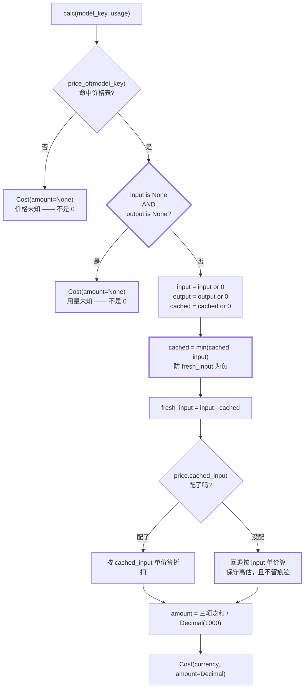

# 第 5 章 M5 计量：无论成败，这笔账怎么记

上一章收尾时有一个容易被忽略的细节。失败路径**也**会记账 —— 但不是在整个调用彻底失败之后记一次，
而是在**每一次失败尝试之后**记（`src/gateway/gateway.py:449`，位于重试循环体内）。
也就是说，一个「m1 超时 → m2 限流 → m3 成功」的调用，账本里会留下 **3 条记录**，
前两条的用量字段是 `None`。

这正好呼应设计文档 §2.1 第 4 条那句话：「失败的调用也可能产生用量，上游可能已计费，漏记会导致账单对不上」。
本章要拆的两个文件 —— `src/gateway/usage.py`（161 行）与 `src/gateway/cost.py`（151 行）—— 就是这条路径的终点。

在前面四个零件（选择、拦截、失败处置、预算）里，出错的症状都是**当场可见**的：
调用抛异常、请求被拒、日志里出现 `degraded=True`。记账不一样。记账出错的症状是**事后才出现、而且追不回来**的：
报表上的数字偏低，你既不知道低在哪里，也不知道低了多少，更不可能把当时那一刻的用量找回来。

所以评价这 312 行只需要一把尺子：**它有没有让「不知道」保持可见。**

（顺带说明：本模块里的 `chat` / `runtime` 命名，以磁盘上的源码为准 —— `Capability.CHAT` 的值已经改成 `"runtime"`
（`src/provider/types.py:168`），文档里写的还是 `chat.default`，这是同一次改名的半途状态，与计量设计无关。）

## 5.1 全貌：这一串数字从哪来、到哪去

先建立一张地图，否则后面每一节都会陷进细节里。

```mermaid
flowchart TB
    subgraph PROVIDER["src/provider —— 契约层（厂商无关）"]
        U["Usage<br/>input/output/cached_input_tokens<br/>每个字段都是 int | None"]
    end

    subgraph GW["src/gateway —— 计量层（纯内存，零 IO）"]
        CALC["CostSheet.calc()<br/>价格表 × 用量"]
        C["Cost<br/>currency + amount: Decimal | None"]
        UR["UsageRecord<br/>13 字段快照"]
        LED["UsageLedger<br/>有界 10000 条 + dropped"]
        GW["Gateway._finalize()<br/>gateway.py:703-762"]
    end

    U --> GW
    GW --> CALC
    CALC --> C
    GW --> UR
    C --> UR
    UR --> LED

    GW ==>|出口 1 返回值| R1["GatewayResult<br/>.usage / .cost"]
    GW ==>|出口 2 事件| R2["CALL_SUCCEEDED<br/>cost 只以 str 形式携带"]
    LED ==>|出口 3 拉取| R3["ledger.records<br/>doctor 只用来数个数"]
    LED -.->|出口 4 drain<br/>当前 0 个调用方| R4["src/repo<br/>全部为空文件"]
```

这张图要传达四件事，每一件后面都会展开：

| 出口 | 形式 | 现状 |
|---|---|---|
| 1. 返回值 | `GatewayResult.usage` / `.cost`（`src/gateway/types.py:138-139`） | 通，随每次调用返回 |
| 2. 事件 | `CALL_SUCCEEDED` 带 `str(cost)`（`gateway.py:749`） | 通，但只带**字符串**；失败事件不带任何计量信息 |
| 3. 拉取 | `Gateway.ledger` 属性（`gateway.py:848-849`） | 通，但只在进程内，且只有一个消费者（`apps/cli/commands/doctor.py:62`） |
| 4. 交付 | `UsageLedger.drain()`（`usage.py:102`） | **不通 —— 全仓库 0 个调用方** |

先把出口 4 这个结论钉住，它会在 §5.3 和 §5.6 各咬一次：
在 `src/`、`apps/`、`tests/` 三个目录下检索 `drain`，除了它自己的定义处，没有任何调用。

## 5.2 `Usage`：为什么它住在 provider 侧，以及 `None + 5` 到底等于几

### 归属：它是契约，不是账本

`Usage` 定义在 `src/provider/types.py:255-290`，而所有记账逻辑都在 `src/gateway/`。这个跨界不是随手放的，
我认为**归属是对的**，理由是三条独立的：

1. **产生权在哪，定义就在哪。** `Usage` 的唯一产生者是 provider 适配器的解析函数
   （`src/provider/openai/llm.py:300-325` 读 `prompt_tokens`/`completion_tokens`，
   `src/provider/openai/embedding.py:130-142` 只读 `prompt_tokens`）。
   字段名到厂商字段的映射是**厂商知识**，这张映射表就是各 `llm.py` 的全部规格 —— 它若住在 gateway，
   gateway 就被迫知道「OpenAI 的缓存字段叫 `prompt_tokens_details.cached_tokens`、
   DeepSeek 叫 `prompt_cache_hit_tokens`」（这两个名字确实出现在 `openai/llm.py:314-319`）。
   那正是 `NFR-G-01` 要禁止的反向依赖。

2. **它是 `ChatResponse` / `EmbeddingResult` 的组成部分**（`types.py:304`、`types.py:320`），
   而不是 `GatewayResult` 的组成部分。一个 provider 即使被直接调用（比如单测、或绕开 gateway 的脚本），
   也必须能回答「这次用了多少 token」。反过来，`Cost` 只出现在 `gateway/types.py:112`，
   因为**价格是 gateway 的概念**（价格表挂在 gateway 配置下，`configs/base.yaml:170`）。

3. **gateway 侧的类型引用 provider 侧的类型是顺方向的**（`gateway/usage.py:21-22`
   import `gateway.types.Cost` 与 `provider.types.Usage`），符合 `NFR-G-01`。

真正的代价在别处，值得说清楚：`Usage` 的 `None` 语义因此变成了**跨两层的约定**，
它的「唯一权威解释」写在 provider 的文档里（`provider/types.py:257-261`），
而最依赖这个语义的代码在 gateway（`cost.py:115`、`cost.py:120-122`）。
跨层约定的风险是可以量化的 —— 见 §5.6，那里有一处规则被**复写**而不是复用，
而两处目前恰好等价，纯属幸运。

### `_add_opt`：一条把「部分未知」变成「可累加」的规则

先看 `Usage` 三个成员里唯一被真正用到的那一个。`__add__`（`types.py:277-282`）逐字段调用
`_add_opt`（`types.py:285-290`），语义是一张真值表：

| `a` | `b` | `_add_opt` 返回 | 直觉解释 |
|---|---|---|---|
| `None` | `5` | `5` | 一边没报，另一边报了 → 就用报了的那边 |
| `5` | `None` | `5` | 同上 |
| `None` | `None` | `None` | 两边都不知道 → 仍然不知道 |
| `5` | `7` | `12` | 正常相加 |

**为什么这个语义是对的？** 关键在于它要服务什么场景：`UsageLedger.totals()`（`usage.py:118-140`）
把一批记录的用量加起来，而这一批里**有的记录有 usage、有的没有**（失败的尝试就留了 `None`，
见 `gateway.py:777-788`）。此时只有两种可能的结果：

- 「未知中毒」式：任何一条记录未知 → 整个汇总变 `None`。**结果是灾难性的** ——
  一次回归跑几千次调用，只要有一次上游没返回用量，整份报表就作废了。没人会接受这种报表，
  于是它会被绕过、被加 `or 0` 补丁，最后又回到 `Unknown == 0`。
- 「可数下界」式（实际选的）：未知的那部分不参与求和，结果 = 已知部分的和。
  这个数字**永远是真实值的下界**，而且它是可解释的：`KNOWN_SUM ≤ 真实值 ≤ KNOWN_SUM + 未知条数 × 未知量`。

项目的设计哲学里有一条「把不确定性压缩成**可数**、可读、可复现的东西」——
`_add_opt` 就是这个「可数」在算术层面的落地：`None` 不污染求和，只让求和结果成为一个**可数的下界**。

这里的取舍要说透：代价是**下界与真值的距离没有被打出来**。
`totals()` 返回一个 `Usage`，它不告诉你「这里面有 3 条记录是未知的」，
调用方也没法从返回类型上分辨「100% 已知的 200 个 token」和「20% 记录未知的 200 个 token」。
§5.9 会把它作为第一优先级的重构点。

### 两个成员目前是死代码（`known` / `total_tokens`）

任务点名的三个成员里，只有 `__add__` 处于活跃状态（被 `usage.py:139` 与
`src/provider/openai/embedding.py:195` 用到）。另两个的现状：

- `Usage.known`（`types.py:267-269`）：全仓库**没有任何读取点**。
  `gateway/errors.py:95` 里那个 `self.known` 是另一个类的属性（可用 alias 列表），同名不同物。
- `Usage.total_tokens`（`types.py:271-275`）：同样无读取点。
  唯一的 token 展示走的是裸字段拼接（`apps/cli/presentation/render.py:63`）。

这不是缺陷（契约先行、实现按需跟进是合理的），但它暴露了一个真实的**耦合风险**：
`Usage.known` 的判据是「input **或** output 非 None」，而 `cost.py:115` 把它**原地重写**成了
`input is None and output is None`（德摩根等价）。两份代码各自表达同一个语义，谁也不会因为对方改变而报错。
如果哪天有人把 `known` 改成「两面都已知才叫已知」（一个很自然的想法），
`cost.py` 的行为不会跟着变，于是「`usage.known` 为真但成本是 `None`」这种自相矛盾的状态就会悄悄出现。
`cost.py:115` 只要写成 `if not usage.known:` 就没有这个问题 —— 这是一处**低成本的一致性修复**，
不是风格洁癖，因为它把一条跨层约定从「两处一致」降级为「一处定义」。

顺带一提：`Usage.__str__` 不存在，所以 CLI 遇到未知用量时会直接打印
`token None↓/None↑`（`render.py:63`）。而旁边的成本有 `Cost.__str__` 把 `None` 渲染成「未知」
（`gateway/types.py:119-122`）。同一个屏幕上，成本会说话，用量不会 —— 一个小而真实的观感不对称。

## 5.3 `UsageRecord` 的四个维度：覆盖了，但只覆盖了一半的聚合方向

`FR-G-08` 要求「维度至少支持：按**模型**、按**逻辑名**、按**会话**、按**调用方标识**」。
逐条核对 `UsageRecord`（`usage.py:27-49`）：

| 需求维度 | 字段 | 状态 |
|---|---|---|
| 按模型 | `model_key`（`:33`）＋ `provider`（`:34`）＋ `model`（`:35`） | ✅ 且比要求更细 —— 物理键、厂商适配器名、厂商模型名三者分开存 |
| 按逻辑名 | `alias`（`:32`） | ✅ |
| 按会话 | `session_id`（`:40`） | ✅ |
| 按调用方标识 | `caller`（`:41`） | ✅ |
| （附加）链路 | `trace_id`（`:31`） | ✅ 超要求：能把这个数字挂回某一次具体调用 |
| （附加）降级 | `degraded`（`:47`） | ✅ 超要求，且很值钱 —— 「这次特别贵」多半就是因为降级到了强模型 |
| （附加）尝试序号 | `attempt_index`（`:49`） | ⚠️ 设计上超要求，实现在**失败路径上没填**（见下） |
| （附加）时间 | `mono_at`（`:44`） | ⚠️ 单调时钟，不是墙钟（见下） |
| 缺失 | 能力/调用种类 | ❌ 无法从记录本身区分这是一次 chat 还是 embedding |

**字段层面全部达标，真正的差集在聚合层。** 两个聚合函数能做的事很不均衡：

| 想按什么聚合 | 用量（token） | 成本（金额） |
|---|---|---|
| 按会话 | ✅ `totals(session_id=...)`（`usage.py:133-134`） | ❌ |
| 按逻辑名 | ✅ `totals(alias=...)`（`:135-136`） | ❌ |
| 按调用方 | ✅ `totals(caller=...)`（`:137-138`） | ❌ |
| 按模型 | ❌ **不支持** | ✅ `cost_by_model()`（`:142-161`） |
| 总额 | ❌ 需自己遍历 `records` | ❌ 需自己遍历 dict |
| 任意组合 | ❌ 只能选一个维度 | ❌ |

这张表里有两个真问题：

**（一）token 没有「按模型」的入口。** 需求里的「按模型」维度在成本侧落实了，
在用量侧没有 —— 想回答「这轮回归里 gpt-4o-mini 一共烧了多少 token」，
调用方得自己去遍历 `ledger.records` 并手写分组（`records` 是公开属性，`usage.py:109-111`）。
于是一个**必然出现**的问题被推给了每一个调用方，而每个人写出来的口径都会略有不同
（比如有人会把 `None` 当 0 加进去）。这正是「收敛口径」应该由库承担的事。

**（二）`totals()` 的分组维度只能选一个。** 参数是三个平级的 `str | None`，
语义是 AND 过滤（`:133-138`）。想按「会话 × 模型」交叉透视，做不到。
`D-8` 决定一期不做租户维度，说明作者对「先做窄」是有意识的 —— 这算**有意的取舍**。
但结合起来看，聚合层的实际能力是「三个近似有用的求和」，而需求里那句
「这一轮回归跑下来花了多少钱」需要的是「按会话求和 + 按模型求和 + 两者相乘都要能算」。
我倾向于认为：**一期窄口径是合理的取舍，但缺「按模型统计 token」这一条不属于取舍，属于遗漏** ——
它和 `cost_by_model()` 是同一形状的问题，成本几乎为零。

**（三）一个可被利用的 API 语义漏洞。** `totals()` 用 `None` 同时表示两件事：
「不过滤这个维度」和「`session_id` 字段本身是 `None`」。后果是：
**「没有会话的调用一共花了多少」这个问题无法提问**。传 `session_id=None` 得到的是全部记录。
而「无会话调用」是真实存在的量 —— `gateway.chat()` 的 `session_id` 是可选参数
（`gateway.py:359` 的测试就传了，但默认不传），一次零散调用就落进这个桶。
修法很便宜：用一个 `_UNSET` 哨兵区分「不传」与「传 None」，或者干脆提供一个
`totals_by(field=..., value=...)` 的显式接口。这是典型的「用 `None` 当哨兵」反噬 ——
有意思的是，整个模块的主题恰好就是「`None` 有明确语义」，这里却让 `None` 同时承载了两个语义。

**一个实现上的观察：`mono_at` 用单调时钟而非墙钟**（`usage.py:42-44`）。
设计稿写的是 `at: datetime`（`docs/架构概要设计-gateway.md:273`），实现换成了 `float` 单调读数，
注释说明了理由：需要绝对时间戳时由交付方在落库时补。

这个改动值得展开，因为它是**有意为之**而不是偷懒：

- 好处：单调时钟不会因为 NTP 校时/夏令时回跳而出现「第 5 条的记录时间早于第 4 条」这类脏数据。
  记账数据最怕时间倒退 —— 任何按时间排序的报表都会错乱。
- 代价：`mono_at` 对**跨进程不可比**。一次回归由多个 agent 进程驱动时，
  每个进程的单调时钟原点不同，落库方给它们盖上同一批墙钟时间戳，批内顺序就丢了。
  这恰好是「同一批里谁先谁后」—— 而账单对不上时，这个顺序往往是关键线索。

对比一下同一项目在另一处的选择：`CallBudget` 的 deadline **刻意用绝对时刻而非剩余秒数**
（`docs/架构概要设计-gateway.md:413` B-2，理由是避免每次等待后的重算误差）。
同一份代码里，预算用绝对时间，账本用相对时间。两者都对，因为它们回答的问题不同：
预算问「现在还能不能发」，需要跨 await 可比；账本问「这条记录是这一批里的第几条」，
需要的是**批内稳定**。真正的缺口是：`UsageRecord` 没有第二个「批内序号」字段来补上顺序信息，
而 `attempt_index` 又只在成功路径填 —— 于是「顺序」这件事在两个字段之间掉到了地上。

**`attempt_index` 在失败路径上是哑的。** `_record_failure_usage()`（`gateway.py:764-788`）
构造 `UsageRecord` 时不传 `attempt_index`，于是它取默认值 `0`（`usage.py:49`）。
而调用点 `gateway.py:449` 位于重试循环内，手边就有 `retry_index`（`gateway.py:410`），
`len(attempts)` 也能算出全局序号 —— 信息是现成的，只是没传。
后果：一个候选重试了 3 次全失败，账本里是 3 条**完全一样**（`attempt_index=0`、`degraded=False`）
的记录，唯一的区分是 `mono_at` 的毫秒级差值。
而 `usage.py:48` 那条注释明确写着「重试会重复计费，这个字段让账单可解释」——
这个承诺在失败路径上（**最需要解释账单的那条路径**）没有兑现。
这是一处实现与注释不符的缺口，不是设计取舍。

## 5.4 `UsageLedger` 的边界：为什么必须丢、为什么必须说

### 上限保护的不是内存，是「故障不放大」的内存维度

`UsageLedger(max_records=10_000)`（`usage.py:87-100`）在超限时丢弃**最旧**的记录并累加 `dropped`。

`NFR-G-04` 被反复讲成「一次厂商故障不能被放大成整轮回归的灾难」，通常理解为**请求次数**的上界。
账本上限是**同一个约束在内存上的对偶**：

> 交付方（repo）挂了或变慢 → 账本堆积 → 若账本无界，堆积会先把**调用方进程**吃掉。

也就是说，一个下游子系统（记账）的故障，会通过一个无界缓冲区升级成整个 agent 进程的 OOM。
`usage.py:79-81` 的注释把这个因果链写得很直白。它是**唯一一处**能被上游故障反向拖垮的耦合点 ——
而它的存在形式竟然只是一个默认参数。

所以「为什么要丢」不是「因为内存贵」，而是：**在两个坏事里选一个**。
不丢 → 进程死，整轮回归废掉（连同账本本身一起丢，而且丢得干干净净）。
丢 → 少几笔账，但进程活着、剩下的账在。

判断「丢旧账比崩进程好」时有一个隐含前提值得点出来：**丢的必须是旧账**。
`del self._records[:overflow]`（`usage.py:99`）删的是列表头部，即最早的记录。
换一种选择（丢最新的）会得到相反的性质：保留一条从头开始的连续前缀，
但**实时观测**能力归零。对「这轮回归花了多少钱」这个问题的现场回答能力来说，保尾部是对的
—— 它是唯一能让运维在进程还活着的时候看到「最近在花多少钱」的窗口。

### `dropped` 为什么必须存在 —— 但只存在了一半

先给结论：**`dropped` 这个计数器的存在是对的，而且它是整个模块里最「拒绝静默」的一处设计；
但它的交付是残缺的，残缺方式恰好让「拒绝静默」失效了。**

为什么必须有：丢数据本身可以接受，**不知道丢了多少**不可以。
回到 §5.4 的第一性原理 —— 报表少了几笔账，和报表少了几笔**且系统告诉你少了几笔**，
是两种完全不同性质的东西。前者是「数据不可信」，后者是「数据可信但残缺」。
后者可以进报表（标注「本区间有 137 条记录因交付积压被丢弃，金额下界」），前者只能进垃圾桶。

`deque(maxlen=N)` 是 Python 里最省事的有界队列，但**它默默丢弃且不给任何通知** ——
把它用在这里，正好是本项目要消灭的「静默失效」的教科书形态。
手写 list + 显式计数（`usage.py:95-100`）的唯一目的就是这个计数器。这个选择是有品味的。

现在说残缺。`dropped` 是**对象上的属性**（`usage.py:113-116`），不是**交付物的一部分**。
`drain()`（`usage.py:102-106`）返回 `tuple[UsageRecord, ...]`，里面**没有** `dropped`。
意味着：

- 谁从 ledger 取走了数据，谁就拿到了「这一批记录」；
- 但「在这一批之前，已经有 N 条被永久丢弃了」这个事实，**不在他手上**；
- 他必须额外知道要去读 `ledger.dropped` 属性 —— 而这依赖于他知道这个属性的存在。

更糟的是，全仓库**没有任何地方读过 `dropped`**（只有定义处，`usage.py:114-116`）。
`usage.py:115` 的注释写着「大于 0 就是缺陷，应当在监控上报警」——
报警的线没有接到任何地方：没有事件（`gateway.py:834-839` 的 `_emit` 是唯一的推送通道，
溢出时没有发）、没有日志（`usage.py` 连 `logging` 都没 import）、没有暴露到 doctor
（`apps/cli/commands/doctor.py:62` 只数了 `len(records)`，读的是 `records` 这个 O(n) 复制属性
而不是 `dropped`）、没有被交付。

因此第 3 条问题里那个「值得怀疑的点」的答案是：**现在真的会丢，而且丢了没人知道。**
让这个结论从「理论上可能」变成「当下必然」的，是出口 4 的断链：
`drain()` 没有调用方 → `_records` 只增不减 → 攒到 10000 条以后**每来一条记录就丢一条最旧的**。
按一次全量回归的规模估算：成功调用记 1 条、每次失败尝试也记 1 条（`gateway.py:449`），
3 个 agent 各跑 2000 次调用、20% 需要重试一次 ≈ 7200 条 —— 单轮回归就能摸到上限。
届时账本会进入「恒定 10000 条」的稳态，`dropped` 单调爬升，而 `doctor` 屏幕上显示的
「未交付的用量记录：10000 条」看起来**一切正常**。

这就是本项目最忌讳的那种症状：**一个看起来健康的系统，正在安静地丢掉最开头那段账。**
（注意 `doctor.py:62` 那句提示语的措辞 —— 「未交付」—— 说明作者完全清楚这里应该有人来取，
只是取的人还没写。这不是设计缺陷，是**未接线的中间状态**，但那句话的输出不会自己告诉你它溢出了。）

### 另一个方向：`UsageLedger` 没有线程安全声明

`FR-G-13` 要求「并发调用下，限额、熔断计数、用量累加必须**线程/协程安全**」。
`record()` 里 `append` + `del` + `self._dropped += overflow` 三步之间没有 `await`，
在 asyncio 单线程模型下天然原子 —— **协程安全成立**。
但若 gateway 被放进线程池（服务化部署的常见做法），三步之间可能交错：
两个线程同时看到 `len > max`，各自算出 `overflow`，`del` 两次、`dropped` 加两次，
结果既可能多删也可能重计。
`usage.py:76-85` 的类文档写了内存边界，没写**并发模型假设**。
对 `NFR-G-07`（可测试、可用假时钟）里的「并发」那半句来说，这是一个应该写下来的前提。
这条我是按「文档缺失」而不是「缺陷」记的 —— 因为在 asyncio 单线程的实际用法下它不咬人，
但它是那种「换个部署方式就咬人、且症状是账目错乱」的隐患。

### 关于上限值本身

`10_000` 是硬编码默认值，`bootstrap.py:110` 构造时用 `UsageLedger()` 不传参，
所以它**不可配置**。我倾向于认为这是**对的取舍**：它是安全阀而不是业务参数，
做成配置项只会诱使人调大。可议的是删除的实现是 `del self._records[:overflow]` ——
每次溢出搬 1 万条指针（C 层 memmove，约 80KB）。当前规模下这远在 `NFR-G-03` 的 1ms 预算之内，
但如果有人把上限提到百万级，它就从「每次调用 O(1)」变成「每次调用 O(n)」，
而且是在**最热的路径**上。真要留余地，用「一次删一批」（删掉超额量的 10% 左右）
就能把摊还成本压回 O(1)，实现只多一行。这是一个「当前无害、扩展时致命」的形状，
值得在注释里写一句上限的物理含义（1 万条 ≈ 多少 MB、对应多少次调用）。

## 5.5 `cost.py`：三个单价、一次扣减、一次除法

### 价格是配置，不是代码

`Price(input, output, cached_input=None)`（`cost.py:42-50`）与 `CostSheet.from_config`
（`cost.py:73-78`）合起来实现 `D-6`：**改价是改配置，不是改代码、更不是发版**
（`需求说明书-gateway.md:395`）。价格表长这样（`configs/base.yaml:170-186`）：

```yaml
cost:
  currency: CNY
  prices:
    chat-openai:   { input: 0.001,  output: 0.002 }
    chat-deepseek: { input: 0.001,  output: 0.002, cached_input: 0.0001 }
```

这里有两件小事，都是「把不确定性钉死」的具体动作：

**（一）计价单位写死在代码里。** `PRICE_UNIT = Decimal(1000)`（`cost.py:36-39`），
注释的理由是「单位混用是成本计算出错的头号原因」。
这个判断和业界一致：主流厂商的价目表在「每 1K」和「每 1M」之间来回换过好几轮，
人工誊抄时几乎必错一次。把单位钉在代码里，折算责任就落在**填价格表的那一刻** ——
那一刻人的眼睛正看着原始报价，是最不容易错的时点。这和「单位换算放在数据入口、
不要放在消费端」是同一条工程直觉。

**（二）三单价的语义。** `input` / `output` 分别定价是 `FR-G-09` 的明文要求；
`cached_input` 是缓存命中的输入单价。三者构成了一个**不完整的笛卡尔积** ——
有「缓存输入价」但没有「缓存输出价」，因为这符合真实的计费模型：
prompt caching 只作用于输入侧（把前缀的 KV 缓存复用），输出侧不存在缓存。
所以这个不对称不是遗漏，是对上游计费模型的如实建模。

### `cached_input=None` 的回退：保守，但沉默

`cost.py:129` 那一行是本节的核心决策：

> 若 `price.cached_input is None`，则用 `price.input` 作为缓存命中的单价。

**`None` 在这里的文档语义是**「厂商不支持缓存计价」（`cost.py:48-50`），
回退到原价 = 不享受折扣 = **按最贵的方式算**。方向选择是对的：
宁可高估也不要低估，因为预算/告警是按金额设阈值的，低估会让阈值失效。

但这里有一个**静默失真，方向和 §5.2 相反**：
如果厂商**确实**支持缓存、用户**只是忘了配** `cached_input`，成本会被**高估**，
而且这个高估**不留任何痕迹** —— 没有日志、没有标记，`Cost.known` 为真，
报表上看不出任何异样。在上面那份配置里，`chat-deepseek` 配了 `cached_input: 0.0001`，
而它正是唯一被解析出缓存字段的路径（`src/provider/openai/llm.py:313-319`，DeepSeek 走
`provider: openai + vendor: deepseek`），所以**恰好**没踩这个坑 —— 靠的是配置纪律，不是结构。

一句话概括这个取舍：**「未知的折扣率」被当成了「没有折扣」**。
这依然是「未知当成某个具体值」，只是这次挑的值是保守的那一侧。
按同一套哲学，正确的做法不是换一个默认值，而是让这件事**可数**：
`CostSheet` 可以暴露「哪些模型配了价但没配缓存价」，启动期校验（`B-9` 把启动期校验放在组合根）
顺手就能打出来 —— 如果该模型从没出现过缓存 token，那是无害的；出现过，就是一次真实的少算/多算。

### 缓存命中的 token 是输入的子集：`min` 防的是什么

`cost.py:124-127` 是全文件最精妙的两行：

> 缓存命中的 token **已经包含在上游报的 `prompt_tokens` 里**，
> 所以必须先从原价部分扣掉，再从 `cached` 数量本身算折扣价。

用数字说清楚（按 `configs/base.yaml:176-178` 的 `chat-openai` 价）：
一次调用 `input_tokens=1000`、`cached_input_tokens=600`。

| 算法 | 计算式 | 结果 |
|---|---|---|
| 正确（先扣子集） | `400 × 0.001/1000 + 600 × 0.0001/1000`（假设配了折扣价） | `0.00046` |
| 忘记扣（重复计费） | `1000 × 0.001/1000 + 600 × 0.0001/1000` | `0.00106` |

忘记扣的代价是**2.3 倍**（缓存折扣越深，倍数越大），且这个错误只在**有缓存命中时**才出现 ——
本地点一次对话永远不复现，一上量就系统性偏差。这是典型的「上线才出现的账单错」。

再看 `cached = min(cached, input_tokens)`（`cost.py:126`）的 `min`。
它的直接作用是**保证 `fresh_input = input_tokens - cached` 不为负**，否则会算出负成本。
但它防的是什么上游行为？`cached > prompt_tokens` 意味着两件事之一：

1. 厂商的字段语义与我们的假设不同（例如 `prompt_cache_hit_tokens` 是某种累计值，
   或者 `prompt_tokens_details` 里塞了别的东西）；
2. 适配器**取错了字段**（`openai/llm.py:313-319` 在两条路径之间做了一次 fallback 猜测，
   猜错的成本很低，猜错的概率不低）。

两种情况都说明**解析逻辑与真实语义脱节了**，而 `min` 把它们统一压缩成「静默地按不重复计费处理」。
`fresh_input` 变成负数是一个**免费的正确性信号**（它绝不可能合法发生），
`min` 把它顺手抹平了。所以这里的判断是：

- **保留 `min`（不返回负成本）是对的** —— 一条负金额进入报表比一次静默钳制更糟；
- **但钳制事件本身应该可观测** —— `cost.py:34` 已经建了一个模块级 logger `_log`
  （`logging.getLogger(__name__)`），而**全文件再没有第二处引用它**。
  这个未被使用的 logger 大概率就是当初想在这里打一句 warning 留下的。
  一行 `_log.warning("cached(%s) > input(%s)，疑似字段语义不符：model=%s", ...)` 就能把
  「我们上游的缓存字段可能理解错了」变成一个可检索的信号。

这条线还有一个更隐蔽的推论：既然 `cached > input` 只可能来自解析错误，
那么**现在这个钳制让我们无法发现解析错误**。一个错误的适配器可以带着 100% 的错误缓存量
在系统里跑很久，账单只是「没那么便宜」，没人会去查。

### 为什么是 `Decimal`，以及 `str` 中转到底在防什么

`_decimal`（`cost.py:143-151`）用 `Decimal(str(value))` 而不是 `Decimal(value)`，
注释的解释是后者会把 `0.001` 变成 `0.001000000000000000020816681711721685...`。

先说清一件事，避免夸大：**这个精度问题在「几千次调用累加」这个规模上不会导致金额算错。**
IEEE 754 双精度有约 15-17 位有效十进制数字，一次调用的成本在 `1e-5 CNY` 量级，
几千次累加后仍在 `1e-2 CNY`，相对误差量级停留在 `1e-16`。换成 float，你的账单**数字是对的**。

那 `str` 中转防的是什么？防的是**表示层失真**，而它的传播路径是真实的：

| 环节 | 若用 `Decimal(float)` 会发生什么 |
|---|---|
| `str(cost)` 进日志/事件（`gateway.py:749`） | 打印出 50 多位小数，人眼无法读，日志检索也匹配不上 |
| `GatewayResult.cost` 返回给调用方 | 下游 `json.dumps` 一个非浮点安全的值，或直接以字符串落库 |
| 报表展示 |  accountants 看到一个不该存在的精度，信任度下降 |
| 测试断言 | `assert costs["m1"].amount == Decimal("0.0006")`（`tests/unit/gateway/test_acceptance.py:371`）会变成一个「看起来随机」的浮点数比较，测试开始不稳定 |

也就是说：**它防的不是算错，而是「算对了但看起来像算错了」**。
在这条链路上，后者同样致命 —— 一份没人相信的成本报表等于没有报表。
这正是 Stripe 那套做法的同一个直觉：Stripe 的金额字段用**最小货币单位的整数**
（`100` = 1.00 美元）而不是浮点数（[Stripe Create a charge](https://docs.stripe.com/api/charges/create?lang=php)
的 `amount` 定义，[Stripe PaymentIntent.amount](https://stripe.dev/stripe-android/payments-core/com.stripe.android.model/-payment-intent/amount.html) 的 `int` 签名）。
云厂商账单同理，普遍用 Decimal 或整数微元。共同点是：
**金额在系统边界上必须是精确的、可逐位复现的表示，浮点数不适合承载它。**

回到 `str` 中转的必要性，还有一个具体的技术前提值得点明：
价格来自 YAML，而 `0.001` 在 YAML 里被解析成 **Python float**（`cost.py:57` 传进来的就是它）。
所以 `Decimal(str(float))` 是**唯一**能把「配置里写的十进制字面量」原样还原的路径。
如果 `_decimal` 直接拿 float，你再怎么处理都晚了一步 —— 精度已经在解析 YAML 那一刻丢了。

最后是 `... ) / PRICE_UNIT`（`cost.py:131-135`）：**先全部乘出整数倍的分子，最后统一除一次 1000**。
这是一个很细但正确的写法：三项各自的整除会引入三次舍入，合并成一次只剩一次。
而且 `Decimal` 的除法在默认上下文（28 位有效数字）下，对这量级的数结果是精确的。



图里加粗的两处是**决策点**，两个虚框是一个判断的两种出口。
本节的所有争议都挂在标了粗边的那两条上：
`C` 决定「未知」的边界（§5.6 展开），`E`/`I` 是两处静默修正（已在上面展开）。

## 5.6 两处 `None` 判定：单侧未知按 0 计入，是缺陷还是折中

这是本章最需要下判断的一处，我先把事实摆清。

`cost.py:115` 与 `cost.py:120-122` 是两条相邻的规则：

```python
if usage.input_tokens is None and usage.output_tokens is None:   # :115  都未知 → 未知
    return Cost(currency=self.currency, amount=None)
input_tokens = usage.input_tokens or 0                            # :120  单侧未知 → 0
output_tokens = usage.output_tokens or 0                          # :121
```

会话内实测确认的行为：embedding 场景 `output_tokens` **恒为 `None`**
（`src/provider/openai/embedding.py:142` 是刻意这么写的，注释说明「补 0 会让成本看起来像免费」），
但成本**算得出来**（实测 `0.0000023 CNY`），没有退化成未知。

### 支持这个设计的理由（三条，都很硬）

1. **它与 `Usage` 自己的语义完全一致。** `Usage.known`（`types.py:268-269`）判的就是「或」：
   任何一侧非 None 就叫已知。`total_tokens`（`:272-275`）用的是同一条规则。
   `cost.py:115` 只是把同一个判据写成了德摩根等价形式。**一致性本身就是价值** ——
   一套系统里同一个问题有两个答案，比其中一个答案不够好更糟。

2. **它区分不出「不适用」和「没告诉」，但它选择保住更常见的那一侧。**
   embedding 的输出侧 `None` 是**结构性不存在**（向量化没有输出 token 这个概念），
   按「任何一侧未知即未知」处理，会让**所有 embedding 调用的成本全部变成未知** ——
   一个为了正确性而把最常用场景整体报废的规则，在实践中一定会被人绕过。

3. **另一条路通向「报表作废」。** 如果严格化，一次回归里只要有一条上游没报用量，
   整个成本汇总就变 `None`。那时用户会做的第一件事是加 `or 0`，最后回到「未知等于 0」。
   **过严的规则不会产生更严的系统，只会产生被绕过的规则。**

### 风险（一个，但很实）

`None` 在这条路径上**同时承载了两个语义**：`input_tokens is None` 既可能是
「这次调用没有输入 token 这个概念」，也可能是「上游没告诉我们输入 token」。
`or 0` 把后者静默地变成了「用了 0 个 token」，于是**成本被少算，且不留痕迹**。

具体到会咬人的场景：某个 OpenAI 兼容网关（或某次适配器字段名猜错，
`openai/llm.py:322` 读的是 `prompt_tokens`）只返回 `completion_tokens`。
此时 `input_tokens=None`、`output_tokens=500`，`calc` 走 `:120` 那一支，
成本 = 输出的钱，输入的钱变成 0。**`Cost.known` 为真，`Cost.__str__` 打印一个正常金额，
`cost_by_model()` 把它和其他正常记录加在一起。** 少算 80% 你可能几个月都发现不了，
因为你没有任何基准去对照。当初 `FR-G-08` 那条「不得编造为 0」防的正是这件事，
而它在 `calc` 里从后门回来了 —— 只不过这次编造的是**乘积的一项**而不是总量。

### 我的结论

**规则本身是正确的取舍，但缺了一个前提的显式化。**
「单侧未知按 0 计入」的正确性**依赖于一个未被声明的不变量**：
*缺失的那一侧必须是结构性不存在的*（embedding 的 output、或者某些厂商不报 cached 明细）。
代码里没有任何东西验证这个不变量，而违反它的代价是静默少算。

所以这不算设计缺陷，也不是纯折中，而是**一个正确的默认值配了一个缺失的告警**。
按项目自己的哲学（「把不确定性压缩成可数、可读、可复现的东西」），
修复不需要 tokenizer、不需要破坏现有的聚合能力，只需要让**这次少算被标记出来**：

- 最小改法：`Cost` 增加一个字段记录「计算时哪几侧被默认成了 0」（见 §5.9）。
  有标记的少算 ≠ 静默少算，前者是可数的（「本区间 12% 的金额在输入侧用量缺失的前提下算出」）。
- 更小改法：在 `:120-121` 处判断「一侧为 None 且另一侧 > 0」时打一条 warning
  （`_log` 已经在了，`cost.py:34`）。噪音可控（只有上游真的不报某侧时才会响），
  且立刻把「静默」变成「可检索」。

我**不建议**改成「任一侧未知即未知」，理由在上面第 3 条：它会让 embedding 的成本统计整体消失，
而消失的成本统计比不准的成本统计更没用。

## 5.7 `NFR-G-06`：不写库 —— 但这条链现在是断的

`NFR-G-06` 要求 gateway 保持存储无关，`usage.py:3-9` 的模块文档把它讲得比需求更透：

> 交付方向不能反过来：一旦 gateway import 了 repo，它就绑死在某种存储上，
> 而用量记账是**最不该失败**的东西，不该因为数据库不可用而拖垮模型调用。

**核实一：有没有 IO 依赖。** 没有。
`cost.py:21-30` 只 import 了 `logging` / `collections.abc` / `dataclasses` / `decimal` / `typing`
和两个本项目的类型模块；`usage.py:15-22` 只 import 了 `collections.defaultdict` / `dataclasses` /
`typing` 和同样两个类型模块。全局检索两个文件：无 `sqlalchemy`、无 `redis`、无 `open`、
无 `httpx`、无 `pathlib`。（`cost.py` 唯一的 IO 相关痕迹是 `cost.py:34` 那个未被使用的 logger，
logging 本身不写文件。）**这条硬约束是干净的。**

**核实二：数据以什么形式出去。** 三条路，见 §5.1 的表。要补充的是它们的**结构化程度**差异：

- 返回值 `GatewayResult.cost`（`gateway/types.py:139`）：完整的 `Cost` 对象，**但只覆盖成功调用**；
- 事件 `CALL_SUCCEEDED`（`gateway.py:742-751`）：把 cost 转成 **`str(cost)`** 发出去 ——
  下游拿到的是「0.0006 CNY」或「未知」这样的人类可读串，**不是结构化的金额与币种**。
  事件是唯一的推送通道（`B-4`：事件只在门面发），一个想实时统计成本的订阅者只能去解析字符串。
- 失败事件 `CALL_FAILED`（`gateway.py:450-453`）：payload 里**只有 model 和 error，没有任何计量字段** ——
  尽管就在上一行，`_record_failure_usage()` 刚往账本里写了一条「这次可能被计费了」的记录。
  **失败路径的计量信息在事件通道上是完全缺失的**，而设计文档 §2.1 第 4 条恰恰把
  「失败也可能产生用量」列为必须处理的情况。这是一个真实的可观测性缺口：
  想从事件流里数「有多少次调用可能被计费了」，数不出来。

**核实三：链路状态与风险。** `src/repo/` 下的 7 个文件**全部是 0 字节**
（`checkpoint.py` / `event.py` / `memory.py` / `message.py` / `session.py` / `skill.py` / `__init__.py`），
`drain()` 无调用方。所以结论是：

**这个设计在链路未接通时不会导致数据「被默默丢弃」——它会导致数据被「有计数器地丢弃」，
而计数器没接到任何地方，所以在观测上等价于默默丢弃。**

区分这两个层次很重要，因为它决定了风险的性质：

| | 设计意图 | 当前实际 |
|---|---|---|
| 数据是否会丢 | 只在交付方积压时丢，且丢的可数 | 必然丢（攒满 1 万条后持续丢弃） |
| 丢失是否可见 | 通过 `dropped` 报警 | 不可见（无人读 `dropped`） |
| 何时开始丢 | 需要故障才会触发 | 一次全量回归就可能触发（§5.4 的估算） |
| 后果 | 报表缺一笔，有标注 | 报表缺**开头那一整段**，无标注 |

「gateway 只产生数据、组合根接线」这个设计本身**是对的**，它是 `NFR-G-06` 唯一可行的落地方式，
而且接线成本极低 —— `bootstrap.py:110` 已经构造并持有那个 ledger 对象，
组合根只要拿 `runtime.gateway.ledger.drain()` 就能接上，不需要改 gateway 一行。
问题在于**这个「极低」的成本现在是 0 而不是 1**：
`src/repo/` 的空实现让这条链从来没被接通验证过，而 gateway 这一侧**已经完成了全部工作**
（记录在产生、计数在累加、drain 接口在设计时就是为此准备的）。
一个已经做完 90% 的功能，因为剩下 10% 没有归处而处于「静默丢数据」状态 ——
这是本模块当下最值得优先处理的一件事，优先级高于本章任何一条重构建议。

我在 §5.9 会把「`drain()` 带上 `dropped`」列为最高收益的改动，原因就在这里：
它让**接口形状本身**强制接线方看到损失，而不是依赖他记得去读一个属性。

## 5.8 `D-7`：异步落库换来了什么，代价谁在付

`D-7`（`需求说明书-gateway.md:396`）选的是「调用返回后**异步批量**落库」，理由「记账不应拖慢调用」。
把它和三条约束放在一起看，会发现它不是一个独立决策：

| 约束 | 与 `D-7` 的关系 |
|---|---|
| `NFR-G-03` 单跳开销 < 1ms | 同步落库意味着每次调用多一次网络往返（毫秒到几十毫秒），**直接超标一到两个数量级** |
| `NFR-G-06` 不直接访问数据库 | 一旦这条成立，「调用路径上同步写库」在结构上就不可能 —— 写库的动作只能发生在 gateway 之外 |
| `NFR-G-04` 故障不放大 | 同步写库会把「数据库不可用」放大成「模型调用全部失败」—— 让最不重要的子系统拖垮最重要的 |

所以：**`D-7` 的「异步」不是性能调优，而是 `NFR-G-06` 的必然推论。**
换句话说，「异步批量」这句话里的「异步」甚至有点误导 —— gateway 里没有任何后台任务、
没有定时器、没有 `asyncio.create_task`（两个文件的全部实现里没有任何一处调度代码）。
真正的机制是**调用方节奏的批**：谁来 drain、多久 drain 一次，全在 gateway 之外。
gateway 提供的是**缓冲**，不是**异步**。这个区分很重要，因为它决定了「谁负责时效」。

**代价是明确的：进程崩溃时未交付的那一批丢失。** 而当前的补偿手段是**零**：

| 可能的补偿 | 当前状态 |
|---|---|
| 关闭时 flush | `Gateway.aclose()`（`gateway.py:841-844`）只清模型缓存、关 provider 连接，**不 drain** |
| 定时 drain | 无定时器，无后台任务 |
| 落盘 WAL / spill | 无（且会违反「不写库」的精神，虽然写本地文件不违反字面） |
| 事件通道兜底 | 失败事件不带计量字段（§5.7），且 cost 只以字符串形式出现 |
| 至少一次语义 | `drain()` 是「取出并清空」（`usage.py:102-106`），先清后写 = **至多一次**；调用方写库中途失败，这一批就永久没了 |

最后一行值得单独说：`drain()` 的语义是 **take-and-clear**。这使得「取出记录」与「确认落库」
之间没有可回退的窗口。改成 `take()` + `commit()`/`nack()`（或者让 `drain()` 只在消费方确认后清空）
就能拿到至少一次语义。有一条现成的幂等键可用：`trace_id` + `model_key` + `attempt_index`
（`usage.py:31,33,49`）—— 唯一性足够，去重成本很低。这也顺便给 §5.3 里
「失败路径 `attempt_index` 恒为 0」增加了一条**独立的**修理由：那个字段不只是给人看的注释，
它还是要被拿去当幂等键的。

至于「最后一批丢失」这个固有的暴露窗口有多大，当前答案是「**全部**」——
因为 drain 从未被调用。等接线上以后，暴露窗口 = drain 周期，
所以「批量」的粒度选择应该由**可接受的最大丢失量**倒推，
而不是由「批大一点效率高」倒推。这一点值得在接线时明确写进注释。

## 5.9 如果让我重新设计计量层

按收益排序，前三条都是**几个字段的改动**，不需要动架构。

### （1）`dropped` 必须进入交付物，并且必须有人喊

现接口：`drain() -> tuple[UsageRecord, ...]`（`usage.py:102`）。
改成 `drain() -> tuple[tuple[UsageRecord, ...], int]`（或返回一个带 `dropped` 的小结果对象）。

理由不是「信息更全」，而是**接口即契约**：只要 `dropped` 不在返回值里，
每一个接线方都有机会忘记它，而当他们忘记时，故障是静默的。
把它放进返回值，忘记就变成不可能 —— 这不是防呆，是把「不静默」编码进类型。

配套：溢出时 `_emit` 一个事件或打一条 `_log.warning`（**只要一处**即可，
不要两边都做 —— gateway 的 `B-4` 说「事件只在门面发」，而 `usage.py` 不是门面，
所以这里应该选日志，或者更准确地说：由 `gateway.py` 在 drain 包装里检查 `dropped` 并发事件）。

**一个我愿意反向借鉴业界的做法。** OpenTelemetry 的 metrics SDK 面对同样的
「基数爆炸要保护内存」问题，选择**不丢弃**，而是把溢出的测量值折叠进一个
`otel.metric.overflow=true` 的特殊数据点，代价是丢掉这些点的属性维度
（[OTel cardinality limits](https://opentelemetry.io/blog/2026/cardinality-limits-in-opentelemetry/)）。
对比一下：

| | OTel 溢出策略 | 本模块溢出策略 |
|---|---|---|
| 保护什么 | 进程内存（SDK 内聚合，默认上限 2000 组属性） | 进程内存（上限 1 万条记录） |
| 丢弃什么 | **属性维度**（无法再按属性下钻） | **最旧的一批记录**（连同金额） |
| 总额是否正确 | ✅ 仍然正确（值被保留，只是并进 overflow 点） | ❌ 金额永久缺失 |
| 损失是否随数据交付 | ✅ 是（overflow 数据点本身就是数据的一部分） | ❌ 否（`dropped` 是生产端对象的属性） |

两种做法在「让损失可见」上都做了努力，但 OTel 保住了**总额**，只牺牲了下钻能力。
对**账单**这个用途来说，这个次序是对的：报表的第一用途是回答「这轮花了多少钱」，
第二用途才是「花在哪个模型上」。**总额错了比明细错了严重得多。**
所以我会给本模块加一条 OTel 式的出路：溢出时不要删记录，而是把最旧的 N 条
**折叠成一条合成聚合记录**（用量与成本相加，标记 `aggregated=True`，保留不了维度就置空），
这样总额永远正确、明细有损但**有标记**。实现约 20 行，收益是把「丢数据」降级为「降精度」。

### （2）`Cost` 应该携带「为什么未知」

现在的 `Cost` 只有 `currency` + `amount: Decimal | None`（`gateway/types.py:108-122`），
`amount=None` 的两个来源（`cost.py:113` 价格没配、`cost.py:118` 用量没返回）
在类型上**完全不可区分**，`Cost.__str__` 把它们都渲染成「未知」，
`cost_by_model()` 把它们合进同一个 `None` 桶（`usage.py:147-156`）。

这是我对本模块最实质的一条批评，理由只有一个：**这两个未知的修法完全相反。**

| 未知原因 | 谁的责任 | 修法 | 排障入口 |
|---|---|---|---|
| 价格没配 | 运维/配置 | 在 `configs/<env>.yaml` 加 `prices.<model_key>` | 配置仓库 |
| 用量没返回 | 适配器/上游 | 查该厂商的响应字段名是否变了、上游是否开始省略 usage | `trace_id` → 原始响应（`ChatResponse.raw`） |

现在运维拿到一个「未知」成本，**无法判断该去翻配置还是去翻 provider 适配器**。
这个症状和项目里已经记录过的一条教训**同构**（`R-3`）：
`fallback.decide` 的判定顺序写反不报错，只是让**排障方向跑偏** ——
默认配置下「全部候选失败」会被误报成「预算耗尽」，而两者的修法完全相反。
`Cost` 的 `None` 目前是同一类问题：正确的标记、错误的可分性。

建议的形状（不破坏现有调用方）：

```
Cost(currency, amount, basis="metered" | "estimated" | None, unknown=("no_price",) | ("no_usage",) | ("no_price","no_usage"))
```

顺带解决 `D-5` 的后续：`basis` 让「一期不做 tokenizer 估算」这个决定变成**可撤销的** ——
将来加估算时，估算值带 `basis="estimated"`，报表可以分开统计而不会污染精确值。
这比「一期不做」更符合项目「把不确定性变成可数」的一贯做法：不做估算是因为
**混在一起的估算会毁掉精确值的可信度**，而不是因为估算本身没用。
有意思的是，本项目在**限流**这一侧已经在做 token 估算了（`gateway.py:804-811` 的
`_estimate_chat_tokens`，按字符数除以常量），用在 TPM 预扣上（`gateway.py:191,283`）。
同一件事（估 token），在限流侧做、在计费侧不做，**这个不一致是刻意的且正确的**：
限流侧的估算误差是**自我修正**的（桶会回填，`FR-G-06` 还有预扣/回补机制），
计费侧的估算误差会**永久进入报表**。这是本模块最值得学的一条判断依据：
**同一个技术手段，用在「误差会被时间冲掉」的地方和「误差会被固化下来」的地方，
是不同的决定。**

### （3）聚合层补齐两个方向

- `totals(model_key=...)`：把 §5.3 里「token 没有按模型的入口」补上，与 `cost_by_model()` 对称。
- 一个 `cost_total() -> tuple[Cost, int]`（总成本 + 未知记录数）：
  现在没有「总额」入口，而调用方自己相加时几乎必然写错 ——
  把所有 bucket 的 `amount` 相加时遇到 `None`，正确行为是**总额标记为部分未知并给出未知条数**，
  错误行为是 `sum(x for x in ... if x)`（静默跳过）。库不提供正确答案，就是在批量生产错误答案。
  另外 `unknown_records` 这个计数是「可数」哲学的直接兑现：它把
  「下界与真值的距离」从不可知变成可知。

### （4）小项

- `totals()` 用 `_UNSET` 哨兵替换 `None`，让「无会话的调用」可查询（§5.3）。
- `UsageLedger.__len__`：`doctor.py:62` 现在用 `len(ledger.records)`，而 `records` 每次调用
  复制一个最多 1 万元素的元组（`usage.py:109-111`）只为数个数。一个 `__len__` 就够。
- `Usage.__str__`：与 `Cost.__str__` 对齐，让 CLI 不再打印 `token None↓/None↑`。
- `_record_failure_usage` 补 `attempt_index=retry_index`（`gateway.py:449` 处信息现成）。
- `UsageRecord` 增加一个能力/种类字段（chat / embedding），
  现在无法从记录本身区分，而两者在「输出侧 None 是结构性还是缺失」上语义完全不同（§5.6）。
- 如果服务化部署会用到线程池：加锁或明确写「仅协程安全」（§5.4）。
- `max_records` 的注释里写清它对应的调用量级（§5.4）。

### （5）测试：本模块最大的空白

检索整个 `tests/`：`cost.py` / `usage.py` **没有任何直接的单测文件**
（`tests/unit/gateway/` 下只有 `test_acceptance.py` 与 `test_budget.py`）。
现有的覆盖只有两条集成路径：

- `B-12`（`test_acceptance.py:349-371`）：3 次调用的会话汇总 + `cost_by_model` 的 happy path；
- `B-13`（`:380-394`）：没配价格 → `amount is None`、`str(cost) == "未知"`；
- 以及一条「上游没返回 usage → 未知」（`:397` 起）。

**没有被任何测试钉住的，恰好是本章讨论的每一个争议点**：
缓存折扣的扣减、`min(cached, input)` 的钳制、单侧未知按 0 计入、
`_add_opt` 的四格真值表、`dropped` 的累加、`cost_by_model` 里 `None` 与已知金额的混合、
`totals()` 的 `None` 过滤语义、`_decimal` 对 float 的拒绝。
一个以「拒绝静默」为纲领的模块，把它的全部边界行为留在了无测试状态 ——
这不是风格问题，因为**这些行为一旦被改错，症状是账单静默失真，而不是测试变红**。
不需要很多用例（十几个即可，全部是纯函数级的），但它们是把 §5.6 那条判断
从「我们讨论过」变成「有回归保护」的唯一办法。

## 5.10 小结

把这一章压成四句话：

1. **`None` 的语义贯穿全模块，且大体上守住了。** `Usage` 三字段、`Price.cached_input`、
   `Cost.amount`、`calc` 的两处判定，都做到了「不把未知写成 0」。
   唯一从后门回来的地方是 `cost.py:120-121` 的单侧未知按 0 计入 —— 我判定它是
   **正确的默认值 + 缺失的告警**，不该改成严格模式，但该被标记。
2. **这个模块最大的敌人不是错误，而是二义性。** `None` 在三处同时承载了两个语义：
   `cached_input`（不支持缓存 vs 忘了配）、`totals(session_id=None)`（不过滤 vs 无会话）、
   `input_tokens=None`（不适用 vs 没告诉）。三处的后果都是「不可数」，
   而「可数」正是本项目哲学的第二个字。
3. **两个零件都写完了，账却还没人收。** `drain()` 零调用方 + `src/repo/` 全空 +
   `dropped` 无人读 = 一次全量回归就能触发的静默丢账。
   这是当前**优先级最高**的一件事，而且它不需要改 gateway ——
   但需要把 `dropped` 塞进 `drain()` 的返回值，否则接线方会在不知情的情况下交付一份残缺的账。
4. **账本的表达力还欠三个字段**：`Cost` 缺「为什么未知」、汇总缺「未知有多少条」、
   记录缺「这次算的是哪一侧缺失」。三者都指向同一件事：
   这个模块已经做到了「不把不知道说成 0」，但还没做到「把不知道说得清楚到能修」。

到这里，五个零件 —— 选择、拦截、失败处置、预算、计量 —— 都已经拆开看过了。
它们各自都只是**数据**和**纯函数**：一个决定、一个判断、一条记录、一个数字。
真正把它们缝成「一次调用」的，是 `gateway.py` 里那个把它们串起来的方法 ——
那里才是所有顺序约束、所有降级禁令、所有返回路径交汇的地方，也是下一章。

---

## 覆盖率明细

| 文件 | 总行数 | 已读行数 | 覆盖率 | 达标 |
|---|---:|---:|---:|---|
| `src/gateway/cost.py` | 151 | 151（1-151，全文） | 100% | ✅ |
| `src/gateway/usage.py` | 161 | 161（1-161，全文） | 100% | ✅ |

合计：312/312 = 100% ✅

旁证文件（不计入覆盖率，但结论引用了具体行号）：
`src/provider/types.py:255-290`（`Usage` / `_add_opt`）、`src/gateway/types.py:108-122`（`Cost`）、
`src/gateway/gateway.py:400-460,690-865`（记账调用点与出口）、
`src/provider/openai/llm.py:300-325`、`src/provider/openai/embedding.py:130-142`（`None` 的产生处）、
`tests/unit/gateway/test_acceptance.py:344-400`（B-12 / B-13）、
`configs/base.yaml:170-186`、`apps/cli/commands/doctor.py:62`、`apps/cli/presentation/render.py:63`、
`src/composition/bootstrap.py:110`。
