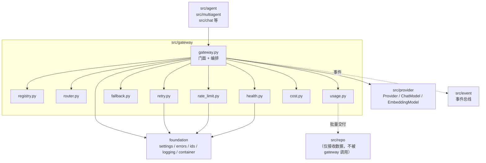
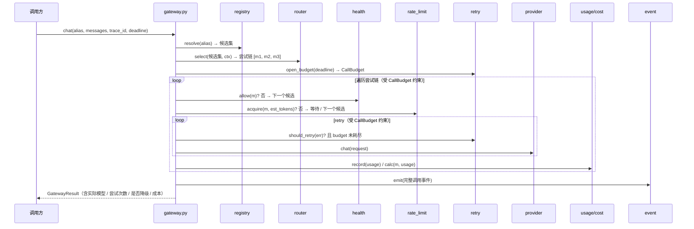
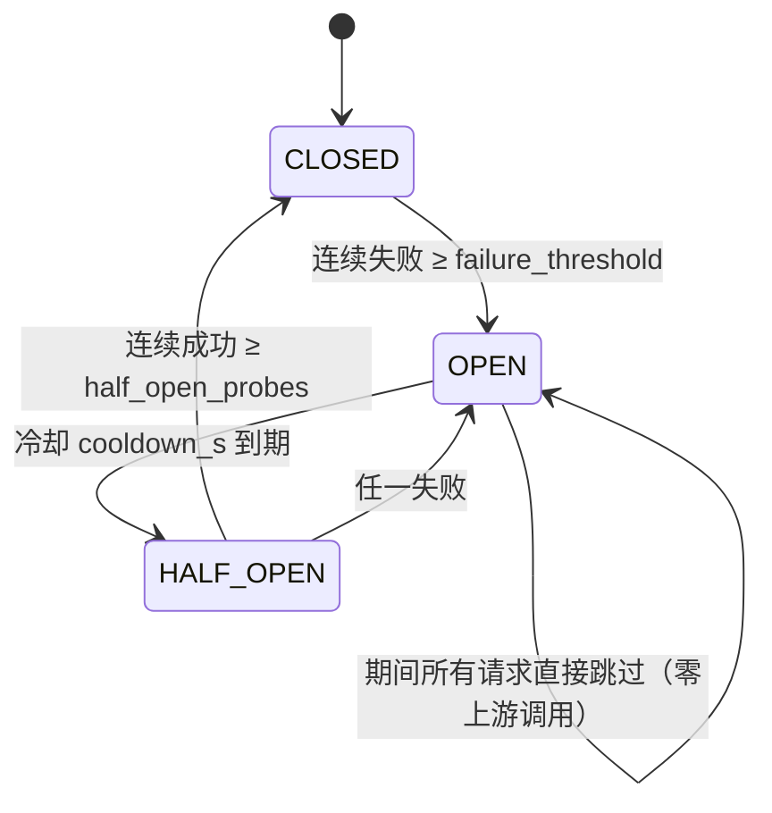

# `src/gateway` 架构概要设计

| 项 | 值 |
|---|---|
| 文档层级 | **架构层**（第二篇）。前置：《需求说明书-gateway》；后续：《详细设计与任务清单》 |
| 承接 | 需求说明书-gateway 的全部 `FR-G-xx` / `NFR-G-xx` |
| 强耦合 | `docs/架构概要设计-provider.md` §4.2 —— **重试边界的结论必须两侧一致** |
| 状态 | 待评审 |

---

## 0. 设计目标（一句话）

> 让「**故障**」在系统里的放大倍率**有上界**，且这个上界是一个**可以被读出来的数字**，
> 而不是散落在各处的重试次数相乘出来的意外结果。

`NFR-G-04`（故障不放大）是本模块**最重要的**约束，本设计的多数结构决定都服务于它。

---

## 1. 结构总览

```
src/gateway/
├── gateway.py      门面 + 责任链编排（唯一对外入口）
├── registry.py     逻辑名 → 候选集 的解析与注册
├── router.py       候选 → 有序尝试链
├── retry.py        可重试判定 + 退避 + **总尝试上限**
├── fallback.py     候选切换决策（含流式边界）
├── rate_limit.py   RPM / TPM / 并发
├── health.py       健康统计 + 熔断状态机
├── usage.py        token 记账
└── cost.py         价格表 × 用量
```

### 1.1 依赖图



**三条硬边界**：

1. `src/provider` **只被 `gateway.py` 引用**（FR-G-01 验收点：全仓库检索只有 gateway 出现 provider）；
2. `src/repo` 是**数据接收方**，gateway **不调用它**（`NFR-G-06`）—— 交付方向见 §4.5；
3. `src/event` 只被 `gateway.py` 在边界上调用，各子模块（retry / health …）**不发事件**，
   只**返回**「发生了什么」，由门面统一发。否则事件语义会散在 9 个文件里。

---

## 2. 责任链（本模块的骨架）

需求文档 §4 的责任链图，落到代码结构上是**一个编排方法**，不是 9 层装饰器：



### 2.1 顺序是设计约束，不是实现细节

| 顺序 | 约束 | 理由 |
|---|---|---|
| `health` **先于** `retry` | 熔断的模型**不消耗重试次数** | 对一个已经确认挂掉的模型重试三次，是纯粹浪费；更糟的是它会挤占 `CallBudget`，导致本该降级到健康模型的请求直接超时 |
| `rate_limit` **先于** `retry` | 配额耗尽的模型也不该重试 | 同上；且排队等待要计入 deadline |
| `retry` **在** `fallback` **之内** | 每个候选各自重试，重试耗尽才换 | 反过来的话，「换候选」会掩盖「同一模型的瞬时抖动」 |
| `usage`/`cost` **在** 每次尝试后 | 失败的调用也可能产生用量 | 上游可能已计费（尤其是流式半截断开），漏记会导致账单对不上 |

---

## 3. `CallBudget` —— 本设计的核心机制

`NFR-G-04` 要求「任何失败路径下上游请求总数有上界」，`FR-G-12` 要求「总 deadline 贯穿」。
这两条**必须由同一个对象强制**，否则会出现「重试次数没超，但时间超了」或者
「时间没超，但已经打了 27 次上游」这类组合漏洞。

```python
class CallBudget:
    """一次 gateway 调用的总预算。retry 与 fallback **都必须**向它申请。

    - `remaining_attempts` —— 跨候选累计的上游调用次数上限
    - `deadline`           —— 绝对时刻，不是「剩余秒数」
    """
    def try_acquire(self) -> bool: ...     # 还能再打一次上游吗？
    def remaining_s(self) -> float: ...
    def exhausted_reason(self) -> str | None: ...   # "attempts" | "deadline" | None
```

**两条设计决定**：

1. **`deadline` 用绝对时刻而非剩余秒数** —— 剩余秒数在多层传递中每次都要重算，
   且容易被误当成「本层的超时」而重新起算。绝对时刻天然不可漂移。
2. **获取配额的唯一 API 是 `try_acquire()`** —— `retry.py` 和 `fallback.py` 都
   **禁止**自己数次数。数次数的地方只有一处，上界才是可知的。

**于是「重试 3 × 候选 3」这个乘积在结构上不可能发生** ——
不是靠配置写对，是靠**没有第二个地方能做这个决定**。

> 这是本设计里唯一一处「用结构消除一整类 bug」的地方，也是它值得单列一节的原因。

---

## 4. 各文件设计

### 4.1 `gateway.py` —— 门面

```python
class Gateway:
    async def chat(self, alias: str, messages: Sequence[Message], *,
                   trace_id: str, deadline_s: float | None = None,
                   session_id: str | None = None, caller: str | None = None,
                   **opts) -> GatewayResult: ...

    def stream_chat(self, alias: str, messages: Sequence[Message], *, ...) -> AsyncIterator[StreamEvent]: ...

    async def embed(self, alias: str, texts: Sequence[str], *, ...) -> EmbedResult: ...
```

**`GatewayResult` 必须携带**（FR-G-05 要求「降级必须标记」）：

| 字段 | 用途 |
|---|---|
| `response` | 厂商返回体 |
| `alias` / `model_used` | 我请求的是谁，实际用的是谁 |
| `attempts: list[AttemptRecord]` | 每次尝试的候选 + 失败原因 —— **跨模型失败唯一可排障的依据**（FR-G-11） |
| `degraded: bool` | 是否发生降级 |
| `usage` / `cost` | 本次用量与成本（成本未知时为 `None`，不是 0） |
| `trace_id` | 贯穿 |

**为什么 `attempts` 要保留全部记录**：只保留「最终失败原因」的话，
一次「m1 超时 → m2 限流 → m3 鉴权失败」的调用会只显示最后一条，
而真正的原因可能是第一条（正是它导致了后面的连锁）。

### 4.2 `registry.py` —— 逻辑名解析

```python
class ModelSpec:          # 一个物理模型
    key: str              # 配置里的键名
    provider: str         # → src/provider 的 Provider.NAME
    model: str            # 厂商模型名
    capabilities: frozenset[Capability]
    priority: int
    weight: float | None

class AliasSpec:          # 一个逻辑名
    alias: str            # "runtime.default"
    candidates: list[str] # 有序候选键
    strategy: list[str]   # ["capability", "priority"]
```

**启动期校验**（`C-3`）：注册表构建时即断言「所有 alias 至少有一个候选」
「候选引用的 key 都存在」「策略名是已知的」。**这些错误必须在启动期抛**，
而不是等第一次线上调用才发现 alias 拼错。

### 4.3 `router.py` —— 候选 → 尝试链

策略按配置顺序**管道式**组合，每个策略是 `(候选集, 上下文) → 候选集`：

| 策略 | 语义 |
|---|---|
| `capability` | 剔除不满足本次请求能力的候选（工具 / 流式 / 视觉 / JSON） |
| `priority` | 按显式优先级排序 |
| `weight` | 按权重分流（灰度 / A-B） |
| `cost` | 同能力下便宜优先 |
| `health` | 按当前健康度降序（**可选**：熔断的模型靠后而非剔除，保留兜底机会） |

**过滤后为空 → 抛明确错误**（FR-G-03），错误信息必须列出**缺失的能力**：

> `没有任何候选同时满足 [tools, stream, vision]；候选集 chat.default = [a(无 tools), b(无 vision)]`

**`health` 策略与 `health.allow()` 的分工**：前者是**排序偏好**，后者是**硬拦截**。
二者都存在是刻意的 —— 排序让健康的模型优先，硬拦截保证熔断的模型不被浪费预算。

### 4.4 `retry.py` / `fallback.py`

```python
# retry.py
def should_retry(err: ProviderError, budget: CallBudget) -> bool:
    return err.retryable and budget.try_acquire()

def backoff_delay(attempt: int, base: float, jitter: float, sleep: Sleep) -> float:
    """指数退避 + 抖动。`sleep` 可注入 —— 测试用假时钟（NFR-G-07）。"""
```

```python
# fallback.py
@dataclass
class FallbackDecision:
    proceed: bool
    reason: str        # "stream_committed" | "budget_exhausted" | "not_degradable"

def decide(err, *, stream_committed: bool, budget, candidate, remaining) -> FallbackDecision: ...
```

**两条不可越过的规则**：

1. **`stream_committed` 为真时禁止降级与重试**（FR-G-05）——
   正文已经吐给用户了，重新发起只会得到第二份不连贯的输出。此时候选链**直接终止**，
   抛错结束流。
2. **禁止跨能力语义降级**（FR-G-05）——
   把「要求结构化输出」的请求降级到不支持 JSON 的模型，**不是容错，是产生错误结果**。
   降级前必须重新做一次能力过滤。

### 4.5 `usage.py` / `cost.py`

```python
# usage.py
@dataclass
class UsageRecord:
    trace_id: str; alias: str; model: str
    input_tokens: int | None      # None = 上游未返回（不得记为 0）
    output_tokens: int | None
    cached_input_tokens: int | None
    session_id: str | None; caller: str | None
    at: datetime
```

**交付方向**：gateway **不写库**（`NFR-G-06`）。`usage.py` 在内存中聚合，按批或按
会话结束交给 `src/repo`。**谁调用 repo** 由组合根决定 —— 结构上等于
「gateway 产生数据，组合根把它接到 repo 上」，而不是「gateway 依赖 repo」。

**`cost.py` 的三个细节**：

| 细节 | 处理 |
|---|---|
| 输入/输出分别定价 | `Price(input, output, cached_input=None)` |
| 缓存命中折扣 | `cached_input_tokens` 单独按 `cached_input` 单价算，其余按 `input` |
| 价格未知 | 返回 `None`（**不是 0**），`GatewayResult.cost = None` |

`None` 与 `0` 的区分在这里和 `Usage` 同源：**0 元成本是「免费」，`None` 是「不知道」**，
前者会让成本报表静默失真。

### 4.6 `rate_limit.py` / `health.py`

**限流**（FR-G-06）：本地令牌桶走快路径，Redis 做跨进程同步（`D-4`）。

| 维度 | 实现要点 |
|---|---|
| RPM | 滑动窗口计数（Redis）+ 本地预取额度 |
| TPM | 按**预估** token 预扣、按**实际**用量回补 —— 否则 TPM 永远滞后 |
| 并发 | 信号量；**取消时必须释放**（FR-G-13 验收点要求配额归零） |

`on_exceed` 两种行为的差别：

| 取值 | 行为 | 代价 |
|---|---|---|
| `wait` | 排队，等待时长计入 `CallBudget` | 可能吃掉整个 deadline |
| `fallback` | 立即换下一个候选 | 可能换到一个更贵的模型 |

**默认 `wait`** —— 限流通常是**短暂**的（下一秒配额就回来了），
换模型是**永久性**的代价（更贵 / 更弱）。但如果 `CallBudget.remaining_s()` 不足以
等完预计排队时间，**必须**改判为 `fallback` —— 等一个必然超时的队是纯粹的浪费。

**熔断**（FR-G-07）状态机：



**`HALF_OPEN → OPEN` 是「任一失败」而非「失败率」** —— 半开期的样本量太小
（默认 2 个），算比率没有统计意义。用「任一失败」更保守，也更简单。

---

## 5. 配置与装配

```yaml
gateway:
  aliases:
    chat.default:
      candidates: [gpt-4o-mini, qwen-plus, local-qwen]
      strategy: [capability, priority]
    chat.reasoning:
      candidates: [deepseek-v4-pro, qwen-plus]
      strategy: [capability, weight]
    emb.default:
      candidates: [text-embedding-v3]

  retry:
    max_attempts_per_candidate: 2
    total_max_attempts: 4          # ← 与 CallBudget 绑定
    backoff_base_s: 1.0
    jitter_ratio: 0.3

  fallback: { enabled: true, on_stream_started: false }
  deadline: { default_s: 120 }

  rate_limit:
    enabled: true
    backend: redis
    defaults: { rpm: 600, tpm: 200000, max_concurrency: 32 }
    on_exceed: wait

  health: { failure_threshold: 5, cooldown_s: 30, half_open_probes: 2 }

  cost:
    currency: CNY
    prices:
      gpt-4o-mini:     { input: 0.001, output: 0.002 }
      deepseek-v4-pro: { input: 0.002, output: 0.008, cached_input: 0.0005 }
```

**启动期必须校验**（`C-3`，在组合根里做）：

1. 每个 alias 至少一个候选；
2. 候选引用的 model key 存在；
3. `strategy` 里没有未知策略名；
4. `total_max_attempts ≥ 1` 且**不小于** `max_attempts_per_candidate`（否则单候选都跑不完就超预算）；
5. 每个候选的 provider 已在 `registry` 中注册。

前 4 条是配置自洽性，第 5 条跨了 `foundation.settings` 与 `src/provider` ——
这正是它必须放在**组合根**的原因：只有那里同时看得见两边。

---

## 6. 需求追溯表

| 需求 | 设计落点 |
|---|---|
| FR-G-01 唯一入口 | §1.1 三条硬边界；`gateway.py` 三个方法 |
| FR-G-02 逻辑名寻址 | `registry.py` `AliasSpec`；启动期校验 |
| FR-G-03 路由 | `router.py` 管道式策略；空候选报错 |
| FR-G-04 重试 | `retry.py` + **`CallBudget`**（§3） |
| FR-G-05 降级 | `fallback.py` `FallbackDecision`；`stream_committed` 与跨能力两条禁令 |
| FR-G-06 限流 | `rate_limit.py`；TPM 预扣回补；`wait` 不足时改判 `fallback` |
| FR-G-07 健康熔断 | `health.py` 状态机；`health.allow()` 在 retry 之前 |
| FR-G-08 用量 | `usage.py` `UsageRecord`；`None` 语义 |
| FR-G-09 成本 | `cost.py`；缓存折扣；未知返回 `None` |
| FR-G-10 事件 | 仅 `gateway.py` 发；子模块**返回**发生了什么 |
| FR-G-11 错误归一化 | `attempts` 保留全部记录；`CancelledError` 不包装 |
| FR-G-12 超时预算 | `CallBudget.deadline` 用**绝对时刻** |
| FR-G-13 取消与并发 | 信号量释放；配额归零验收点 |
| NFR-G-03 单跳开销 | 路由/限额/记账全内存；仅 Redis 路径有网络往返 |
| NFR-G-04 故障不放大 | **`CallBudget.try_acquire()` 是唯一计数点** |
| NFR-G-06 不碰数据库 | §4.5 交付方向（组合根接线） |
| NFR-G-07 可测试 | `backoff_delay(..., sleep=)` 注入；见 §8 D-C |

---

## 7. 关键设计决策

| # | 决策 | 被否决的方案 | 理由 |
|---|---|---|---|
| **B-1** | 用 `CallBudget` 单一对象强制两个上界 | retry 与 fallback 各自计数 | 各自计数会让「重试次数没超但时间超了」这类组合漏洞无法被结构性排除 |
| **B-2** | `deadline` 用绝对时刻 | 剩余秒数逐层传递 | 剩余秒数在每层都要重算，极易被误当成本层超时而重新起算 |
| **B-3** | 编排是**一个方法**，不是装饰器链 | 9 层中间件套娃 | 顺序是**约束**（§2.1），散在 9 层里没人能一眼看出顺序错了；且中间件链难以表达「health 失败要跳过 retry」 |
| **B-4** | 事件只在门面发 | 各子模块各自发 | 否则事件语义散在 9 个文件，且难以保证顺序与完整性 |
| **B-5** | `health` 同时提供「排序偏好」与「硬拦截」 | 只留一种 | 排序让健康的优先，硬拦截保证熔断的不浪费预算 —— 两者解决不同问题 |
| **B-6** | 半开期「任一失败」即回熔断 | 算失败率 | 样本量太小（2 个），比率无统计意义 |
| **B-7** | 限流默认 `wait`，但预算不足时改判 `fallback` | 固定 `wait` 或固定 `fallback` | 限流通常短暂，换模型是永久代价；但等一个必然超时的队是纯浪费 |
| **B-8** | cost 未知返回 `None` | 返回 `0` | 同 `Usage`：`0` 是「免费」，`None` 是「不知道」 |
| **B-9** | 启动期校验放在**组合根** | 放在 `registry.py` | 第 5 条校验需要同时看见 `settings` 与 `src/provider`，只有组合根两边都看得见 |

---

## 8. 待确认（需评审）

| 编号 | 问题 | 影响 | 建议 |
|---|---|---|---|
| **D-A** | **`src/gateway` 缺 `types.py`** | `GatewayResult` / `AttemptRecord` / `FallbackDecision` / `CallBudget` 无处安放；塞进 `gateway.py` 会让该文件承载类型 + 编排两件事 | **新增 `src/gateway/types.py`**（放 `GatewayResult` / `AttemptRecord` / `ModelSpec` / `AliasSpec`），`CallBudget` 留在 `retry.py`（它是行为不是数据） |
| **D-B** | `CallBudget` 归属 | `retry.py` / `fallback.py` / 独立文件 | 放 `retry.py`。它是重试语义的载体，fallback 只是**消费者** |
| **D-C** | 假时钟从哪来 | 影响 `NFR-G-07`；`backoff` / 熔断冷却 / 限流窗口**全部**依赖时间 | **建议 `foundation/clock.py`**（可注入 `now()` 与 `sleep()`）。当前结构与 provider 篇 `D-C` 是同一个问题，**应合并决策** |
| **D-D** | 限流 token 预估器从哪来 | TPM 预扣需要「这次大概用多少 token」 | 一期用「字符数 / 4」的粗估 + 实际值回补；不引入 tokenizer 依赖 |
| **D-E** | 健康状态是否跨进程共享 | 多进程部署时各进程的熔断独立 | 一期**独立**（每进程各自熔断，最坏情况是多几倍探测请求）；跨进程共享放二期，因为写竞争的代价可能大于收益 |
| **D-F** | `weight` 策略的分流稳定性 | 按会话固定还是每次随机 | **按会话哈希固定** —— 否则同一会话在强弱模型间跳变，体验不可解释（与 `D-5` 不做语义路由同一考虑） |

---

## 9. 实施顺序

| 步 | 内容 | 完成判据 |
|---|---|---|
| **1** | `registry.py` + `router.py` + 启动期校验 | 逻辑名解析、能力过滤、空候选报错全部可测；**不涉及网络** |
| **2** | **`CallBudget`** + `retry.py` + `fallback.py` | 验收场景 B-5 / B-9 / B-10 通过。**这是全模块最该先做对的部分** |
| **3** | `health.py` + `rate_limit.py` | B-6 / B-7 / B-15 通过；用假时钟跑 |
| **4** | `usage.py` + `cost.py` + 事件 | B-12 / B-13 / B-14 通过 |
| **5** | `gateway.py` 编排收口 | 全部 B-1 ~ B-16 通过 |

**第 2 步必须先于第 3、4 步**：`CallBudget` 是 retry / fallback / rate_limit（排队等待）
三者的公共依赖。它一旦定形，后面三个都是它的消费者；反过来则会三处各写一遍计数逻辑 ——
正是本设计要消灭的东西。

---

## 9.5 实现阶段的修订（回填）

以下是编码阶段做出的、与本文档前述内容不一致的决定。**回填是为了让文档与代码不分叉** ——
一份过时但没人知道的架构文档，比没有架构文档更糟。

| # | 修订 | 原稿 | 现在 | 理由 |
|---|---|---|---|---|
| **R-1** | **新增 `src/gateway/errors.py`** | §8 D-A 只说缺 `types.py` | 同时补 `errors.py` | `AllCandidatesFailedError` 既不是数据类型（不属于 `types.py`），也不该留在编排文件里。按 `src/provider/errors.py` 的**对称结构**补，是让两层「契约 + 错误 + 类型」三件套保持一致的最小改动 |
| **R-2** | **新增 `src/composition/`** | 装配分散到 `apps/*/runtime/` | 共享装配收进 `src/composition/bootstrap.py`；`apps/*/runtime/` 只做 app 特有的事（CLI 的日志与 trace_id） | 三个 app 各写一份「读配置 → 建注册表 → 建网关」，会在第一次有人只改其中一份时开始漂移，症状是「CLI 能降级、服务里不能」这类极难归因的差异。这正是 besa-iv-kb《重构文件结构设计》§2.5「组合根唯一且被两个 app 共享」要避免的 |
| **R-3** | **`fallback.decide` 的判定顺序** | §8 未明确 | **「没有下一个候选」排在「预算耗尽」之前** | 顺序写反不会报错，只会让排障方向跑偏：默认配置下（`total_max_attempts=4`、每候选 2 次、2 个候选），「所有候选都失败」时预算**恰好同时**耗尽，于是「全部候选失败」被误报成「预算耗尽」。两者修法完全相反 |
| **R-4** | **`max_attempts_per_candidate` 的落地** | §4.4 的伪代码只判 `should_retry` | 重试循环同时判**单候选上限**与**全局预算** | 只判后者会让一个候选吃掉全部预算，降级链后面的候选永远轮不到 —— 而配置里写的 `max_attempts_per_candidate` 变成一个没人读的数字 |
| **R-5** | **熔断探测位的归还** | §4.6 状态机未涉及 | 新增 `CircuitBreaker.release()`，并在 `finally` 里兜底 | 取消路径上最容易漏。泄漏一个探测位意味着 `HALF_OPEN` 的探测位被永久占用，模型**再也恢复不到 CLOSED**，而日志上只有一条「进入半开探测」，看不出泄漏 |
| **R-6** | **`degraded` 的语义边界** | §4.1 只说「`degraded` 标记是否降级」 | `degraded` **只表示运行时故障导致的降级**；缺密钥等导致的模型不可用在选链阶段就被过滤，**不计入** | 混同之后，一个没配密钥的环境里每次调用的 `degraded` 都是 `True`，这个标记就再也不能回答「这次是不是出了故障」 |
| **R-7** | **`Registry.from_config(provider_options=...)`** | 未涉及 | 新增测试注入点，转交给每个 provider 构造器 | 没有它，网关的全部路径只能靠真实网络测试 —— 而「401 该不该重试」这类断言在真实网络下无法稳定复现 |
| **R-8** | **限流等待的边界** | §4.6「预算不足时改判 fallback」 | 判据用 `>=` 而非 `>`：**恰好等到 deadline 才拿到额度同样没用** | 拿到额度的那一刻预算已归零，这次调用必然被 `try_acquire` 拒掉。白等一轮再失败，不如立刻换候选 |

---

## 10. 风险

| 风险 | 影响 | 对策 |
|---|---|---|
| `CallBudget` 被绕过 | 上界失效，故障放大 | 结构性约束 + 代码审查重点；**不允许任何地方出现第二个 attempt 计数器** |
| 降级链配得过长 | 单次调用横跨 4 个厂商，延迟叠加 | 启动期对候选数给出上限告警；`total_max_attempts` 独立于候选数封顶 |
| 限流 Redis 成为瓶颈 | 每次调用多一次网络往返 | 本地预取额度 + 批量同步；`NFR-G-03` 的 1ms 预算主要给这里 |
| 用量聚合丢失 | 账单对不上 | 失败路径也必须记（§2.1 第 4 条）；进程关停时强制 flush |
| 与 provider 的重试叠加 | 重试风暴 | provider §4.2 边界表 + 本模块 `total_max_attempts`；**两侧必须同批实现、同批评审** |
| 熔断误伤 | 健康模型被摘除，全部流量挤向备选 | 半开探测尽快恢复；`OPEN` 期间记录「本可服务」的请求数供调参 |
