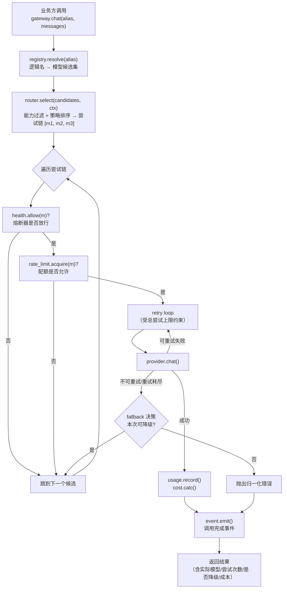

# `src/gateway` 需求说明书

| 项 | 值 |
|---|---|
| 文档层级 | **需求层**（第一篇）。后续：《架构概要设计》→《详细设计与任务清单》 |
| 覆盖范围 | `src/gateway/` 全部 9 个文件 |
| 上游依赖 | `src/provider/`（契约）、`src/event/`（事件总线，可选） |
| 下游消费 | `src/agent/`、`src/multiagent/`、`src/runtime/`、`src/memory/`、`src/context/` |
| 状态 | 待评审 |

---

## 1. 这份文档回答什么

同 `provider` 篇：只回答**要解决什么问题**、**必须提供哪些能力**、**什么算合格**。

**本文不回答**：路由算法怎么写、令牌桶怎么实现、熔断器状态机长什么样。文中文件名仅用于圈定职责边界。

**前置阅读**：`docs/需求说明书-provider.md`。两篇共享 `D-1`（重试不叠加）这一条约定，**必须以同一份结论为准**。

---

## 2. 背景与定位

`provider` 解决了「同一个请求在不同厂商 API 上怎么写」。但它在设计上是**单厂商视野**的——一次调用只认一个模型，失败就失败。上层真正需要的是另一层能力：

- 我要的是「**一个够用的模型**」，不是「`gpt-4o-mini` 这个具体型号」；
- 这个厂商挂了，能不能**自动换一个**；
- 多 agent 同时跑，**别把配额打爆**；
- 这一轮测试跑下来**花了多少钱**；
- 某个模型连续失败，**别再往上撞**。

**gateway 的定位：全部模型调用的唯一入口（single entry point），在 provider 之上承担「选谁、失败怎么办、花多少、还活着吗」这四件事。**

一句话分工：

> provider 管**怎么写**，gateway 管**用哪个、挂了怎么办、花了多少**。

### 2.1 为什么必须收敛到唯一入口

如果允许业务直接调 provider，下面四件事会**各自散落、无法收敛**：

| 能力 | 散落后的后果 |
|---|---|
| 路由 | 每个业务模块自己 `if` 判断用哪个模型，换模型要全仓库改 |
| 降级 | 各写各的重试，故障时重试风暴互相叠加 |
| 限流 | 无人知道全局配额，多 agent 并发直接把厂商配额打爆 |
| 成本 | 无法回答「这次回归跑了多少钱」，也无法按会话/租户分摊 |

这四条正是 `besa-iv-kb`《重构文件结构设计》§2.2 那条判据的模型侧体现：**换一个实现（换模型、换厂商、换限流策略）要不要改业务代码**。

---

## 3. 范围

### 3.1 本模块负责

| 职责 | 文件 |
|---|---|
| 统一调用门面（对话 / 流式 / 向量化的唯一入口） | `gateway.py` |
| 逻辑模型名 → 实际模型/厂商的解析与注册 | `registry.py` |
| 路由：按能力、优先级、权重、成本选模型 | `router.py` |
| 重试策略（可重试判定、退避、总尝试上限） | `retry.py` |
| 降级：主模型失败后按链切换备选 | `fallback.py` |
| 限流：RPM / TPM / 并发数 | `rate_limit.py` |
| 健康与熔断：摘除不健康模型、半开恢复 | `health.py` |
| 用量记账（token 维度） | `usage.py` |
| 成本核算（价格表 × 用量） | `cost.py` |

### 3.2 本模块明确不负责

| 不做的事 | 归属 |
|---|---|
| 厂商 API 请求构造 / 响应解析 / SSE 解析 | `src/provider/` |
| Prompt 模板、上下文裁剪与压缩 | `src/context/` |
| 会话历史、消息持久化 | `src/runtime/` `src/repo/` |
| 用量与成本的**落库** | `src/repo/`（gateway 只**产生**用量与成本数据并交给 `repo`） |
| 工具定义与执行 | `src/tool/` `src/skill/` |
| 事件总线的实现 | `src/event/`（gateway 只**发**事件） |
| 面向外部协议的服务化暴露（REST / MCP） | `apps/server/` `apps/mcp/` |
| 多智能体的编排策略（谁先谁后、辩论几轮） | `src/multiagent/` |

> **边界判据**：gateway 处理的是「**一次模型调用**」范围内的决策。
> 一旦问题变成「**多个 agent 之间**怎么协作」，就不属于 gateway。

---

## 4. 一次调用的责任链（核心图）

gateway 的 9 个文件不是并列的 9 个模块，而是**同一次调用上依次经过的 9 道关**。这张图是本模块的需求骨架：



**这张图直接推导出下面四条硬约束**：

1. **`health` 与 `rate_limit` 在 `retry` 之前**——不健康的模型不该被重试三次，那是纯浪费；
2. **`retry` 在 `fallback` 之内**——每个候选各自重试，重试耗尽才降级；
3. **总尝试次数必须封顶**（`retry 次数 × 候选数` 的乘积）——否则一次故障会被放大成重试风暴；
4. **流式一旦开始输出正文，`fallback` 与 `retry` 都必须失效**——已经吐给用户的内容无法收回。

---

## 5. 功能需求

编号 `FR-G-xx`。

### 5.1 门面与解析

#### FR-G-01 — 唯一调用入口

**要求**：全平台所有模型调用**必须**经 gateway。提供三类入口：对话补全、流式对话、向量化。

- 三个入口的能力语义与 `provider` 契约一致，但**多出**：尝试次数、实际命中的模型、是否发生降级、本次用量与成本。
- 从 `provider` 抛出的错误，在 gateway 边界上**必须被归一化**（见 `FR-G-11`），不得原样泄漏厂商细节。

**验收点**：全仓库检索，除 `src/gateway/` 外**无任何模块**直接 import `src/provider/`。

#### FR-G-02 — 逻辑模型名寻址

**要求**：业务用**逻辑名**（alias）请求模型，物理模型由配置决定。

- 逻辑名形如 `runtime.default` / `runtime.reasoning` / `emb.default`，表达的是**用途**而非型号；
- 换模型 = 改配置，**业务代码零改动**；
- 请求未注册的逻辑名 → 报错并**列出可用的逻辑名**（便于发现拼写错误）。

**验收点**：把 `runtime.default` 从 A 模型改配为 B 模型，全仓库代码零改动且行为随之改变。

### 5.2 选择与路由

#### FR-G-03 — 路由

**要求**：按可组合的策略从候选中选出有序的尝试链。

至少支持：

| 策略 | 说明 |
|---|---|
| 能力过滤 | 剔除不满足本次请求能力的候选（工具/流式/视觉/JSON） |
| 优先级 | 显式优先级排序 |
| 权重 | 按权重做分流（灰度、A/B） |
| 成本优先 | 同能力下选成本更低者 |

- 策略**可组合**且顺序明确；
- 过滤后**候选为空** → 报明确错误（指出「没有任何模型同时满足：工具调用 + 流式 + 视觉」），而不是静默失败。

**验收点**：请求「流式 + 工具调用」，候选集中只有不支持工具的模型 → 报错并说明缺失的能力。

### 5.3 可靠性

#### FR-G-04 — 重试

**要求**：

- 只重试「可重试」类错误（判定依据来自 `provider` 的错误归一化结果）；
- 指数退避 + **抖动**（避免多 agent 同时重试造成的同步脉冲）；
- **必须支持总尝试次数上限**，且该上限是**跨候选累计**的，不只是单个候选内的；
- 重试次数、退避基数、抖动比例可配。

> ⚠️ **与 provider 的重试不得叠加**——见 `provider` 篇 `D-1`。两篇必须以同一结论落地，且 gateway 侧的「总尝试上限」是最后的兜底。

**验收点**：配置「重试 3 次、候选 3 个」时，一次全失败调用的上游请求总数**不超过配置的总上限**。

#### FR-G-05 — 降级

**要求**：主候选失败后，按尝试链切换备选。

- **降级链可显式配置**（推荐），也可按能力自动推导；
- 降级发生时**必须在返回结果中标记**（命中了哪个模型、这是第几次尝试）——静默降级会让「为什么这次答得差」永远查不出来；
- **流式场景**：正文一旦开始输出，**禁止**降级与重试，只能把错误抛出并结束流；
- **降级不得跨能力语义**：把「结构化输出」请求降级到一个不支持 JSON 的模型，是错误而非容错。

**验收点**：
- 主流模型 503、备选正常 → 返回备选结果且标记已降级；
- 流式已输出 5 个分片后上游断开 → 抛错结束，**不**重新发起。

#### FR-G-06 — 限流

**要求**：以「模型」为维度限制请求速率与并发。

- 至少支持 **RPM**（每分钟请求数）、**TPM**（每分钟 token 数）、**最大并发**三个维度；
- 获取配额失败时的行为可配：**排队等待**（默认，受总 deadline 约束）或**立即降级到下一个候选**；
- 多进程部署时限额必须**跨进程生效**（`apps/server/storage/redis` 已就位），单进程内也要有本地快速路径。

**验收点**：并发发起超过 RPM 的请求 → 实际发往上游的请求速率不超过配额；跨进程部署时同样成立。

#### FR-G-07 — 健康与熔断

**要求**：

- **被动统计**：连续失败达阈值 → 熔断器打开，**在一段时间内直接跳过**该模型（不再发起调用）；
- **半开探测**：冷却期后放行少量请求探测，成功则恢复，失败则继续熔断；
- **主动探测**（可选）：定期轻量探测模型可用性，用于健康页面；
- 熔断与限流、降级的交互必须明确：熔断打开的模型**不消耗重试次数**（在 `retry` 之前拦截）。

**验收点**：某模型连续失败达阈值 → 后续请求**直接跳过**它（上游零调用）→ 冷却后半开探测成功 → 恢复使用。

### 5.4 计量

#### FR-G-08 — 用量记账

**要求**：记录每次调用产生的 token 用量。

- 维度至少支持：按**模型**、按**逻辑名**、按**会话**、按**调用方标识**（如 agent 名 / 用户标识）；
- 上游**未返回用量**时如实标记为未知，**不得编造为 0**；
- 数据产生后交给 `repo` 落库，gateway **自身不直接访问数据库**。

**验收点**：一次调用结束后，可按会话维度汇总出该会话的输入/输出 token。

#### FR-G-09 — 成本核算

**要求**：按「模型单价 × 用量」计算成本。

- 价格表**必须外置可配**（单价会变，且不同供应商不同）；
- 支持输入/输出**分别定价**；
- 支持**缓存命中折扣**（若厂商对命中缓存的 token 单独计价）；
- 币种需明确；未知价格时标记为「未知成本」而非 0；
- 成本**必须能按会话/任务聚合**——「跑一轮全量回归花了多少钱」是刚需。

**验收点**：给定价格表与已知用量，成本计算与手工核算一致；价格表缺失该模型 → 标记未知，不抛异常。

#### FR-G-10 — 事件发布

**要求**：在调用边界发布事件，供 `src/event/` 消费。

至少包含：**调用开始 / 调用成功 / 调用失败 / 发生重试 / 发生降级 / 熔断状态变更 / 配额耗尽**。

- 事件必须携带可关联的标识（会话、调用方、逻辑名、实际模型、尝试序号）；
- 事件发布**不得**阻塞调用链路（失败也不能影响主流程）；
- **provider 不发事件**（见 `provider` 篇 `NFR-P-02`），事件统一在 gateway 边界产生。

**验收点**：一次「重试两次后降级成功」的调用 → 事件序列完整反映 {开始、重试、降级、成功}。

### 5.5 语义与边界

#### FR-G-11 — 错误归一化

**要求**：向上层暴露 gateway 自己的错误语义，**不泄漏厂商细节**。

- 必须能区分「**所有模型都失败了**」与「**某个模型失败了**」——前者是业务该处理的，后者是内部细节；
- 必须携带**尝试记录**（每个候选失败的原因），否则一次跨模型失败无法排障；
- `CancelledError` **必须原样传播**，不得被包装或吞掉。

**验收点**：三个候选全部失败 → 抛出「全部失败」错误，且消息中含三个候选各自的失败原因摘要。

#### FR-G-12 — 超时预算贯穿

**要求**：**整体 deadline**，而不是每一跳各自超时。

- 调用方给出总 deadline；重试、降级、排队等待**全部**在该预算内；
- 预算耗尽时**立即停止**并报「超时」，**不得**再发起新的尝试；
- 剩余预算不足时，应跳过必然超时的尝试（例如剩余 2s 而该模型 P99 是 30s）。

> 这条不写清楚，重试 × 降级的乘积会让一次调用挂到几分钟。

**验收点**：总 deadline 设为 10s、重试 5 次 → 实际耗时不超过 10s（含退避等待）。

#### FR-G-13 — 取消与并发安全

**要求**：

- 并发调用下，限额、熔断计数、用量累加必须**线程/协程安全**；
- 调用方取消时，在途请求与已获取的配额必须**正确释放**（否则配额会泄漏）。

**验收点**：并发 100 次调用中随机取消 20 次 → 配额计数最终归零，无泄漏。

---

## 6. 非功能需求

| 编号 | 需求 | 说明 |
|---|---|---|
| `NFR-G-01` | **依赖单向** | gateway → provider。**不得**反向。gateway 也**不得**被 `provider` 感知（gateway 只出现在配置与装配处）。 |
| `NFR-G-02` | **唯一入口** | 除 gateway 外，无模块直接依赖 provider（`FR-G-01` 的机械校验）。 |
| `NFR-G-03` | **单跳开销可忽略** | 除真实网络耗时外，gateway 自身单次调用的额外开销应 **< 1ms**（路由/限额/记账都是纯内存操作）。 |
| `NFR-G-04` | **故障不放大** | 任何失败路径下，上游请求总数必须有上界（`FR-G-04` / `FR-G-12`）。这是本模块**最重要的**非功能约束。 |
| `NFR-G-05` | **可观测** | 关键决策（选了谁、为什么跳过谁、为什么降级）必须可从日志/事件中还原。 |
| `NFR-G-06` | **不直接访问数据库** | 用量与成本的持久化经 `repo`，gateway 保持存储无关。 |
| `NFR-G-07` | **可测试** | 限额、熔断、退避必须可用**假时钟**测试，不得依赖真实 `sleep`。 |
| `NFR-G-08` | **无密钥可启动** | 所有模型都不可用时，应用必须能启动并给出明确错误（而非崩溃）。 |

---

## 7. 配置需求

```yaml
gateway:
  # 逻辑名 → 用途。业务只认左边，右边随便换
  aliases:
    runtime.default:
      candidates: [gpt-4o-mini, qwen-plus, local-qwen]
      strategy: [capability, priority]     # 可组合，顺序即优先级
    runtime.reasoning:
      candidates: [deepseek-v4-pro, qwen-plus]
      strategy: [capability, weight]
    emb.default:
      candidates: [text-embedding-v3]

  retry:
    max_attempts_per_candidate: 2
    total_max_attempts: 4          # 跨候选累计上限 —— 故障放大器
    backoff_base_s: 1.0
    jitter_ratio: 0.3

  fallback:
    enabled: true
    on_stream_started: false       # 流式已输出则禁止降级（FR-G-05）

  deadline:
    default_s: 120                 # 整体预算（FR-G-12）

  rate_limit:
    enabled: true
    backend: redis                 # 多进程跨进程生效
    defaults: { rpm: 600, tpm: 200000, max_concurrency: 32 }
    on_exceed: wait                # wait | fallback

  health:
    failure_threshold: 5
    cooldown_s: 30
    half_open_probes: 2

  cost:
    currency: CNY
    # 价格表：每 1K token 单价
    prices:
      gpt-4o-mini:        { input: 0.001, output: 0.002 }
      deepseek-v4-pro:    { input: 0.002, output: 0.008, cached_input: 0.0005 }
```

**要求**：

- `C-1` 尝试链、策略、限额、价格表**全部外置**，不硬编码；
- `C-2` 未配置价格的模型**不阻断调用**，只标记成本未知；
- `C-3` 配置错误（如引用了未注册的模型、候选集为空）在**启动期**即报错，而不是等运行时；
- `C-4` 逻辑名与实际模型的映射关系必须可被**单独查询**（供健康页与排障）。

---

## 8. 验收标准（场景化）

| # | 场景 | 期望 |
|---|---|---|
| B-1 | 全仓库检索 provider 的引用 | 仅 `src/gateway/` 出现 |
| B-2 | `runtime.default` 改配另一个模型 | 业务代码零改动，行为随之改变 |
| B-3 | 请求未注册的逻辑名 | 报错并列出可用逻辑名 |
| B-4 | 主候选 503、备选正常 | 返回备选结果，且**标记已降级** |
| B-5 | 三个候选全部失败 | 抛「全部失败」，含各自的失败原因 |
| B-6 | 某候选连续失败达阈值 | 后续请求**直接跳过**（上游零调用）；冷却后半开恢复 |
| B-7 | 并发超过 RPM 限额 | 实际发往上游的速率不超配额 |
| B-8 | 总 deadline 10s + 重试 5 次 | 总耗时 ≤ 10s |
| B-9 | 「重试 3 × 候选 3」全失败 | 上游请求总数 ≤ `total_max_attempts` |
| B-10 | 流式已输出 5 个分片后断开 | 抛错结束，**不**重新发起 |
| B-11 | 请求「流式 + 工具调用」，候选均不支持 | 报错并说明缺失能力，**零网络调用** |
| B-12 | 一次调用结束 | 可按会话维度汇总 token 与成本 |
| B-13 | 模型无价格配置 | 正常返回，成本标记未知 |
| B-14 | 一次「重试 2 次后降级成功」 | 事件序列完整：开始 / 重试 / 降级 / 成功 |
| B-15 | 并发 100 次、随机取消 20 次 | 配额计数归零，无泄漏 |
| B-16 | 检查 gateway 错误信息 | 不含 API Key、不含厂商原始报文全文 |

---

## 9. 决策点（需评审确认）

| 编号 | 决策点 | 备选 | 建议 |
|---|---|---|---|
| **D-1** | **与 provider 的重试如何不叠加** | 同 `provider` 篇 | **必须以同一结论落地**；gateway 侧的 `total_max_attempts` 是兜底 |
| **D-2** | 降级链是**显式配置**还是**按能力自动推导** | (a) 显式；(b) 自动；(c) 显式优先 + 自动补齐 | **(c)** —— 显式可控，自动兜底避免「候选只有一个」时无路可退 |
| **D-3** | gateway 是**进程内库**还是**独立服务** | (a) 库，`apps/server` 经 `transport` 暴露；(b) 独立网关服务 | **(a)** —— 结构上 gateway 在 `src/` 而非 `apps/`，且进程内调用零网络开销；对外暴露由 `apps/server/transport/` 负责 |
| **D-4** | 限流在多进程下的一致性 | (a) 纯 Redis；(b) 本地令牌桶 + Redis 同步；(c) 单进程够用 | **(b)** —— 本地路径快，Redis 保证全局不超发 |
| **D-5** | 是否做**语义路由**（按问题难度选模型） | 按 query 复杂度自动选强/弱模型 | **一期不做**。收益不确定，且会让「为什么这次用了贵模型」难以解释 |
| **D-6** | 价格表的维护方式 | (a) 配置文件；(b) 数据库；(c) 二者合并 | **(a) 一期**，价格变动频率低，配置文件 + 评审即可 |
| **D-7** | 用量/成本落库是**同步**还是**异步** | (a) 调用返回后异步批量落库；(b) 同步写 | **(a)** —— 记账不应拖慢调用；用 `usage.py` 聚合后批量交 `repo` |
| **D-8** | 限流维度 | 全局 / 按模型 / 按会话 / 按租户 | **按模型 + 按会话** 两层，一期不做租户维度的复杂配额 |
| **D-9** | 是否需要 `src/foundation` | 同 `provider` 篇 `D-3` | **建议补**，gateway 需要统一的配置、日志、ID 生成、错误基类 |

---

## 10. 与相邻模块的契约要点

| 相邻模块 | 契约 |
|---|---|
| `src/provider` | gateway 是唯一消费者；回传归一化错误与能力声明 |
| `src/event` | gateway **发**事件，不自建总线 |
| `src/repo` | gateway **产生**用量/成本数据，**不直接落库**（`NFR-G-06`） |
| `src/agent` `src/multiagent` | 业务方；只认逻辑名，不认物理模型 |
| `apps/server` `transport` | 唯一对外暴露 gateway 能力的地方（若需 REST 查询用量/健康） |
| `apps/server` `storage/redis` | 多进程限流的后端 |

---

## 11. 下一步

本文定稿后进入《`src/gateway` 架构概要设计》，届时需要产出：

- 责任链的类图与调用时序（`§4` 图的落地形式）；
- 路由策略的组合语义与优先级规则；
- 熔断器状态机、限流算法选型；
- 总尝试上限与总 deadline 的**联合约束**如何在代码中统一表达（`NFR-G-04`）；
- 用量/成本的数据结构与聚合粒度，及与 `repo` 的交接点；
- 事件清单与字段定义（与 `src/event/types.py` 对齐）。
