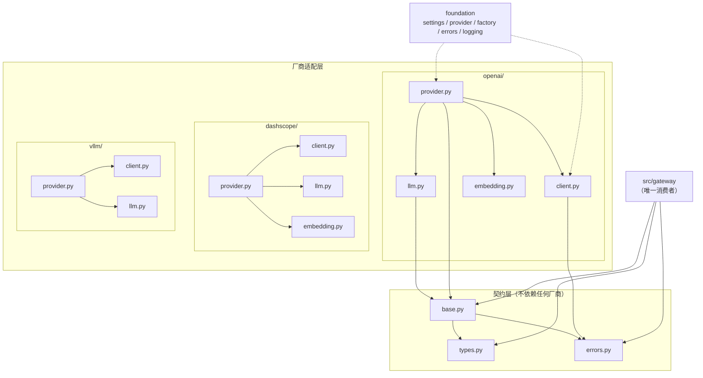
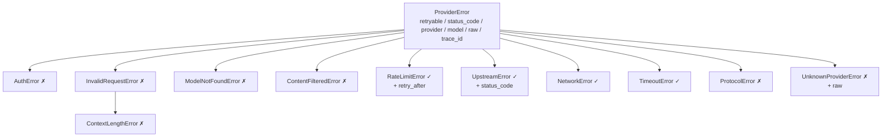
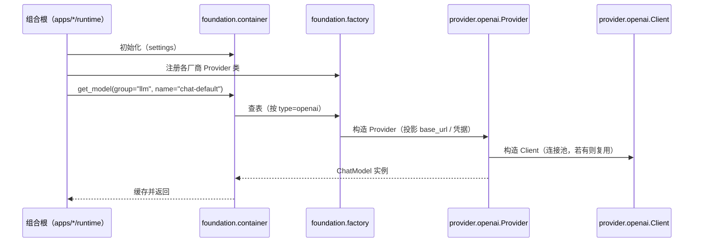

# `src/provider` 架构概要设计

| 项 | 值 |
|---|---|
| 文档层级 | **架构层**（第二篇）。前置：《需求说明书-provider》；后续：《详细设计与任务清单》 |
| 承接 | 需求说明书-provider 的全部 `FR-P-xx` / `NFR-P-xx` |
| 本文回答 | 分层怎么切、契约长什么样、关键机制怎么落地、为什么这么选 |
| 本文不回答 | 每个函数体怎么写、具体异常消息文案、单测用例清单 |
| 状态 | 待评审 |

---

## 0. 设计目标（一句话）

> 让「**换厂商 / 换传输 / 换端点形状**」三件事各自只影响一个文件，
> 并且让上层**看不见**这三件事发生过。

---

## 1. 结构总览

```
src/provider/
├── base.py            契约：Provider / ChatModel / EmbeddingModel 抽象
├── types.py           契约：Message / ChatRequest / ChatResponse / Usage / Capability
├── errors.py          契约：错误树 + retryable 判定
│
├── openai/
│   ├── provider.py    厂商静态事实 + 装配入口
│   ├── client.py      HTTP 传输（连接池 / 超时 / SSE 拆行 / 网络层重试）
│   ├── llm.py         Chat 能力：payload 构造 + 响应解析
│   └── embedding.py   Embedding 能力
├── dashscope/         同上四件套
├── vllm/
│   ├── provider.py  client.py  llm.py
│   └── （无 embedding.py —— 见 §4.2）
└── mock/              ⚠️ 结构缺位，待确认（§9 D-A）
```

### 1.1 依赖图



### 1.2 分层规则（可由 import-linter 机械校验）

| 层 | 文件 | 允许依赖 | 禁止依赖 |
|---|---|---|---|
| 契约层 | `base.py` `types.py` `errors.py` | `foundation.*`、标准库、`pydantic` / `httpx`（仅 `client` 相关类型） | **任何厂商子包**；任何 `src/*` 业务模块 |
| 厂商层 | `<厂商>/*.py` | 契约层、`foundation.*`、标准库、`httpx` | `src/gateway`、`src/agent`、`src/event`、其它厂商子包 |

两条契约建议直接写进 `pyproject.toml` 的 import-linter：

```ini
[contract:provider-contract-layer]
name = provider 契约层不得依赖厂商层
type = forbidden
source_modules = ["provider.types", "provider.errors"]
forbidden_modules = ["provider.openai", "provider.dashscope", "provider.vllm"]

[contract:provider-no-business]
name = provider 不得依赖任何业务模块
type = forbidden
source_modules = ["provider"]
forbidden_modules = ["gateway", "agent", "multiagent", "event", "repo", "chat", "memory", "skill", "tool"]
```

> 第一条（`base.py` 不在 forbidden 里，因为它需要 import `types.py`/`errors.py`）的
> 价值见 §4.1：契约层一旦能被厂商层反向影响，假实现就会被逼着实现用不到的钩子。

---

## 2. 契约层设计

### 2.1 `types.py` —— 数据载体

| 类型 | 字段要点 | 备注 |
|---|---|---|
| `Role` | `Literal["system","user","assistant","tool"]` | 非法 role 在本地拦截（FR-P-01） |
| `TextPart` / `ImagePart` | 文本 / 图片（URL 或 base64） | 多模态（FR-P-06） |
| `Message` | `role` / `content: str \| list[ContentPart]` / `name` / `tool_call_id` / `tool_calls` | `tool_call_id` 用于回填工具结果（FR-P-03） |
| `ToolSpec` | `name` / `description` / `parameters`(JSON Schema) | 传给厂商工具定义 |
| `ToolCall` | `id` / `name` / `arguments_raw: str` / `arguments: dict` | **同时保留原始串与解析结果** |
| `Capability` | `chat` `stream` `tools` `json` `vision` `embedding` | 能力声明（FR-P-08） |
| `ChatRequest` | `model` / `messages` / `temperature` / `max_tokens` / `stream` / `response_format` / `stop` / `tools` / `timeout_s` / `trace_id` | 厂商无关 |
| `Usage` | `input_tokens: int\|None` / `output_tokens: int\|None` / `cached_input_tokens: int\|None` | **`None` = 未知，不是 0**（FR-P-10） |
| `ChatResponse` | `content` / `reasoning` / `tool_calls` / `usage` / `model` / `finish_reason` / `structured_native: bool` / `raw` | 见下 |
| `EmbeddingResult` | `vectors` / `dimension` / `usage` / `model` | 维度校验（FR-P-07） |

**三个字段的设计理由**：

- **`ToolCall` 同时保留 `arguments_raw` 与 `arguments`**：厂商返回的是**字符串**形式的 JSON，
  且**可能是非法 JSON**（模型幻觉）。只留解析结果，出错时原始串就丢了，无法排障；
  只留原始串，则每个消费者都要自己 `json.loads` 一遍。两者都留，解析失败时把原始串放进错误里。
- **`Usage` 用 `None` 而非 `0` 表示未知**：`0` 和「不知道」在计量上语义完全不同 ——
  前者会让成本算成 0 元（静默错误），后者会触发「标记未知」（FR-P-10 / D-5）。
  用类型系统强制区分，比靠注释约定可靠。
- **`ChatResponse.structured_native`**：标记「本次是否走了厂商原生结构化输出」。
  降级发生时（FR-P-04 允许按能力降级），下游必须知道这次 JSON 是**约束出来的**还是
  **运气好**，否则无法判断是否需要重试。

### 2.2 `errors.py` —— 错误树



（✓/✗ = `retryable`）

**统一属性**（基类提供，所有子类继承）：

| 属性 | 用途 |
|---|---|
| `retryable: bool` | **gateway 唯一需要读的字段** —— 重试决策的全部依据 |
| `status_code: int \| None` | 排障；脱离厂商后只剩这一个数字有意义 |
| `provider` / `model` | 定位是哪个厂商哪个模型出的问题 |
| `raw: str \| None` | 厂商原始报文，**截断后**保留（FR-P-09 要求不吞原始信息） |
| `trace_id` | 贯穿到 gateway 与日志 |
| `retry_after: float \| None` | 仅 `RateLimitError`；上游给了 `Retry-After` 就遵守它 |

**状态码 → 错误类的映射表**（厂商适配层实现，是这一层唯一的「翻译」动作）：

| 状态码 | 映射 | retryable |
|---|---|---|
| 400 | `InvalidRequestError`（若报文含 context length → `ContextLengthError`） | ✗ |
| 401 / 403 | `AuthError` | ✗ |
| 404 | `ModelNotFoundError` | ✗ |
| 408 | `TimeoutError` | ✓ |
| 413 | `ContextLengthError` | ✗ |
| 429 | `RateLimitError` | ✓ |
| 5xx | `UpstreamError` | ✓ |
| 连接失败 / 读超时 | `NetworkError` / `TimeoutError` | ✓ |
| 响应非 JSON / 缺字段 | `ProtocolError` | ✗ |

**`CancelledError` 不在这棵树里** —— 它是 `asyncio.CancelledError`，
必须**原样传播**（FR-P-14）。适配层的任何 `except` 都不得捕获 `BaseException`。

### 2.3 `base.py` —— 三个抽象

```python
class Provider(ABC):
    """厂商描述。纯声明 + 装配入口，不碰 HTTP。"""
    NAME: ClassVar[str]
    DEFAULT_BASE_URL: ClassVar[str]
    API_KEY_ENV: ClassVar[str]
    REQUIRES_API_KEY: ClassVar[bool]

    def capabilities(self, model: str) -> frozenset[Capability]: ...
    def chat_model(self, model: str, cfg: ModelCfg, client: Client | None = None) -> ChatModel: ...
    def embedding_model(self, model: str, cfg: ModelCfg, client: Client | None = None) -> EmbeddingModel: ...


class ChatModel(ABC):
    @abstractmethod
    async def chat(self, req: ChatRequest) -> ChatResponse: ...

    @abstractmethod
    def stream_chat(self, req: ChatRequest) -> AsyncIterator[str]:
        """逐段产出**增量正文**。注意：是普通 def 返回异步迭代器，还是 async def —— 见 §4.1。"""

    async def aclose(self) -> None: ...


class EmbeddingModel(ABC):
    @abstractmethod
    async def embed(self, texts: Sequence[str], *, batch_size: int | None = None) -> EmbeddingResult: ...

    async def aclose(self) -> None: ...
```

**为什么 `chat` 是抽象方法，而不是「模板方法 + 抽象钩子」**（继承自 `besa-iv-kb` 的教训）：

测试替身只需要实现 `chat` 本身。若把 `chat` 做成模板方法、把 `_build_payload` 做成抽象钩子，
假实现就被迫实现一个它**根本用不到**的 HTTP 载荷构造器 —— **假实现会因此无法实例化**。
所以：**公开契约抽象，公共管线以普通辅助方法提供，由子类按需调用。**

**为什么 `embedding_model()` 默认抛 `CapabilityNotSupported` 而不是返回 `None`**：

`vllm/` 没有 `embedding.py`（§4.2），所以「这个厂商不支持向量化」是一条**正常路径**，
不是异常路径。但返回 `None` 会让调用方写出 `if m is None:` 的检查，
而这个检查在错误的地方（gateway 已经按能力过滤过了，走到这里说明过滤失效）。
用异常表达「这是编程错误，不是运行时状况」，让能力过滤失效**立刻暴露**。

---

## 3. 厂商适配层：为什么是「四件套」

| 文件 | 抽象 | 一句话职责 | **什么时候需要改它** |
|---|---|---|---|
| `provider.py` | `Provider` | 厂商静态事实 + 装配入口 | 厂商新增能力、换默认模型、改凭据变量名 |
| `client.py` | `Client` | 怎么把字节发出去、怎么把流收回来 | 换 HTTP 库、加代理、加埋点、改超时策略 |
| `llm.py` | `ChatModel` | 发什么字段、怎么读回响应 | 厂商 API 形状变了 |
| `embedding.py` | `EmbeddingModel` | 同上，针对向量化 | 同上 |

**这四刀是按「变化原因」切的，不是按「代码量」切的。** 判据很简单：

> 当这件事发生时，你希望**只改哪一个文件**？

- 出网要走公司代理 → 只改 `client.py`；
- 厂商把 `max_tokens` 改名了 → 只改 `llm.py`；
- 新增一个厂商 → 新建一个目录，**上层零改动**；
- 厂商把 embedding 端点下线了 → 删掉 `embedding.py`，能力声明随之收缩。

**与 `besa-iv-kb` 的差异（一处改进）**：那边的 `BaseLLM` 把 HTTP 传输（`_post_json` /
`_stream`）也放在 `base.py` 里。本设计把它**提出来成 `client.py`**，理由是：
`besa-iv-kb` 中「会话管理、超时、重试退避」与「厂商字段映射」在同文件里，
新增一个非 OpenAI 形状的厂商时，两边都要读。分开后，`llm.py` 可以短到十几行。

### 3.1 `client.py` —— 传输层

```python
class Client:
    def __init__(self, *, base_url: str, api_key: str = "", timeout_s: float = 60.0,
                 proxy: str | None = None, transport: httpx.AsyncBaseTransport | None = None): ...

    async def post_json(self, path: str, payload: dict, *, trace_id: str) -> dict: ...
    def stream_sse(self, path: str, payload: dict, *, trace_id: str) -> AsyncIterator[str]: ...
    async def aclose(self) -> None: ...
```

**关键点**：

1. **持有单个 `httpx.AsyncClient`**（连接池），而不是每次调用新建 —— FR-P-13。
   `besa-iv-kb` 里 `client is None` 时每次自建是**测试便利**，但生产路径必须复用；
   本设计把「注入的 client」变成**唯一路径**，由 `container` 负责复用。
2. **`transport` 参数是单测的唯一入口**（FR-P-13 验收点：注入 mock transport 后全程零真实网络）。
3. **`stream_sse` 产出的是「SSE 行」，不是「正文增量」** —— 拆行是传输层的事，
   从行里取 `delta.content` 是 `llm.py` 的事。这条边界让 `ollama` 这种
   **非 SSE** 的流式协议只需要覆写 `llm.py` 的解析，不必动传输层。

### 3.2 `llm.py` —— 模板方法

```python
class OpenAIChatModel(ChatModel):
    def _endpoint(self) -> str: ...                    # 厂商差异点 1：URL
    def _build_payload(self, req: ChatRequest) -> dict: ...   # 厂商差异点 2：请求体
    def _parse(self, body: dict, req: ChatRequest) -> ChatResponse: ...  # 厂商差异点 3：响应
    def _delta_content(self, sse_line: str) -> str: ...       # 厂商差异点 4：SSE 增量

    async def chat(self, req) -> ChatResponse:        # 公共管线，不覆写
        self._validate(req)                            # 本地校验（FR-P-01）
        self._guard_capabilities(req)                  # 能力拦截（FR-P-08）
        payload = self._build_payload(req)
        body = await self._client.post_json(self._endpoint(), payload, trace_id=req.trace_id)
        return self._parse(body, req)
```

四个钩子 = 四类厂商差异。`openai` 与 `vllm` 的差异**只在 `_endpoint` 与能力声明**；
`dashscope` 若走兼容模式，则与 `openai` 的差异**几乎为零** —— 这正是 D-2 建议走兼容模式的收益。

### 3.3 能力矩阵

| 厂商 | chat | stream | tools | json | vision | embedding | 备注 |
|---|:---:|:---:|:---:|:---:|:---:|:---:|---|
| `openai` | ✓ | ✓ | ✓ | ✓ | ✓ | ✓ | 基准形状 |
| `dashscope` | ✓ | ✓ | ✓ | ✓ | ✓ | ✓ | 走 OpenAI 兼容模式；部分 qwen 模型无 vision |
| `vllm` | ✓ | ✓ | △ | △ | △ | **✗** | tools 需服务端 `--enable-auto-tool-choice --tool-call-parser`；能力**由部署的模型决定** |

> **`vllm` 那一列全是 △ 是设计要点，不是偷懒。**
> 自建 vLLM 的能力**不取决于适配器，取决于部署时加载了什么模型、开了什么参数**。
> 所以 `vllm/provider.py` 的 `capabilities()` **必须从配置读**，不能硬编码：
>
> ```yaml
> models:
>   local-qwen:
>     provider: vllm-local
>     type: vllm
>     model: Qwen3-32B
>     capabilities: { chat: true, stream: true, tools: true, json: true, vision: false, embedding: false }
> ```
>
> 这正是 FR-P-08 要求「能力可被配置覆盖」的**真实原因** —— 不是为了灵活，是因为
> 有一家厂商的能力**在编译期不可能知道**。

### 3.4 字段映射表（三家差异的单一事实来源）

| 语义 | `openai` | `dashscope`（兼容模式） | `vllm` |
|---|---|---|---|
| 端点 | `/chat/completions` | `/chat/completions` | `/chat/completions` |
| 最大输出 | `max_tokens` | `max_tokens` | `max_tokens` |
| 工具定义 | `tools` | `tools` | `tools` |
| 工具选择 | `tool_choice` | `tool_choice` | `tool_choice` |
| 结构化输出 | `response_format` | `response_format` | ⚠️ 需服务端支持，否则**本地关掉** |
| 增量正文 | `choices[0].delta.content` | 同左 | 同左 |
| 思考增量 | — | `delta.reasoning_content` | `delta.reasoning_content`（取决于模型） |
| 结束原因 | `stop` / `length` / `tool_calls` | 同左 | 同左 |
| 用量 | `usage.prompt_tokens` 等 | 同左 | 同左 |
| 鉴权 | `Authorization: Bearer` | 同左 | **无**（本地端点） |

**这张表是 `llm.py` 四钩子的完整规格**，也是新增厂商时唯一需要填的东西。

---

## 4. 关键机制

### 4.1 流式的返回形状

`stream_chat` 声明为 **`def` 而非 `async def`**，返回 `AsyncIterator[str]`：

```python
def stream_chat(self, req: ChatRequest) -> AsyncIterator[str]:   # 注意：没有 async
```

**理由**：`async def` + `yield` 得到的异步生成器，**调用时不会执行任何代码** ——
连参数校验、能力检查都不会跑，要等第一次 `__anext__`。这会让
「请求了不支持流式的模型」这个错误**延迟到消费端**，且错误发生的位置离调用点很远。
用普通 `def` 返回生成器，可以在**调用瞬间**完成校验并抛错（FR-P-08 验收点要求本地拦截）。

代价：真正的网络请求仍要等首次迭代。**这是可接受的** —— 校验与建立连接分离，
让「配置错了」和「网络挂了」是两类可区分的失败。

### 4.2 重试边界（承接 D-1）

**结论：`client.py` 只重试网络层错误，HTTP 状态码错误一律上抛。**

| 失败 | 谁处理 | 理由 |
|---|---|---|
| 连接失败（`ConnectError`） | `client.py` 重试 | 请求**大概率没到达模型**，本地重试最自然 |
| 读超时（`ReadTimeout`） | `client.py` 重试 | 同上 |
| 4xx（含 401/400/404） | **上抛** | 重试只白烧配额 |
| 5xx / 429 | **上抛给 gateway** | 厂商故障需要**跨模型**决策，换一个模型往往比锤同一个更有用 |

**累计上界由 gateway 的 `total_max_attempts` 兜底**（架构概要设计-gateway §5.2）。
本模块的 `retries` 配置只作用于网络层，默认 **1**（即最多 2 次尝试）——
不要设大，因为它会和 gateway 相乘。

**退避必须带抖动**（FR-G-04 同款理由）：多 agent 并发时，同步退避会形成脉冲，
把刚恢复的上游再打挂一次。

### 4.3 凭据解析（FR-P-12）

```
模型级 api_key > 模型级 api_key_env > 厂商段 api_key_env > 厂商约定环境变量
```

实现落在 `foundation.provider.resolve_api_key`，`Provider` 构造时调用。两条硬约束：

1. **云厂商缺失密钥 → 构造期抛错**（fail fast）。等到第一次调用才报 401，会让
   「配置写错了」伪装成「网络问题」。
2. **本地端点无密钥 → 不发 `Authorization` 头**，而不是发 `Bearer `（空值）。
   后者在部分网关会被判为「鉴权失败」而不是「无需鉴权」。

### 4.4 推理模型处理（FR-P-05）

```
if not content.strip() and finish_reason == "length":
    logger.warning("...思考过程可能吃光 max_tokens...", extra={"trace_id": ...})
```

**为什么必须是 WARNING 而不是 DEBUG**：这个症状的最终表现是
「**检索命中了，但答案是空的**」—— 业务侧看到的是"模型不听话"，
根因却在 `max_tokens` 配置上。中间隔了三层，没有这条日志就是纯靠猜。

**`reasoning` 走独立字段**（`ChatResponse.reasoning`），**不进 `content`**。
进 `content` 会污染下游的结构化解析（`json.loads` 直接失败），
而这类污染在开发期极难复现（只在推理模型上出现）。

### 4.5 多模态与结构化输出的本地拦截

两者都是「**能力不足时在本地报错，而不是透传给上游**」：

| 场景 | 行为 |
|---|---|
| 向无 `vision` 能力的模型发图片 | 本地抛 `CapabilityNotSupported`，**零网络调用** |
| 要求 `json_schema` 但未传 schema | 本地抛错，**不静默降级**（`besa-iv-kb` 的教训） |
| 向无 `tools` 能力的模型传工具 | 本地抛 `CapabilityNotSupported` |
| 向无 `json` 能力的模型要求结构化输出 | **降级**为无约束生成，并在响应标记 `structured_native=False` |

前三条**拦截**，第四条**降级** —— 差别在于：前三条发生时会静默产出错误结果，
第四条发生时结果**仍然可用**（只是约束弱了），但下游必须知道。这个区分是刻意的。

---

## 5. 装配与配置



**实例缓存键是 `(group, name)` 而非 `(group, name, model)`** ——
同一逻辑模型名复用同一实例，这正是 FR-P-13 连接复用的落点。

---

## 6. 需求追溯表

| 需求 | 设计落点 |
|---|---|
| FR-P-01 统一契约 | `base.py` 三个抽象；`ChatRequest`/`ChatResponse` |
| FR-P-02 流式 | `client.stream_sse`（拆行）+ `llm._delta_content`（取增量）；§4.1 返回形状 |
| FR-P-03 工具调用 | `ToolSpec` / `ToolCall`（保留 `arguments_raw`）；`Message.tool_call_id` |
| FR-P-04 结构化输出 | `ChatResponse.structured_native`；§4.5 拦截与降级的分界 |
| FR-P-05 推理模型 | `ChatResponse.reasoning` 独立字段；§4.4 的 WARNING |
| FR-P-06 多模态 | `ImagePart`；§4.5 本地拦截 |
| FR-P-07 向量化 | `EmbeddingModel.embed`；`EmbeddingResult.dimension` 校验 |
| FR-P-08 能力协商 | `Provider.capabilities()`；§3.3 能力矩阵（vllm 从配置读） |
| FR-P-09 错误归一化 | `errors.py` 错误树 + §2.2 映射表 |
| FR-P-10 用量透传 | `Usage` 的 `None` 语义 |
| FR-P-11 传输级重试 | `client.py`；§4.2 边界表 |
| FR-P-12 凭据解析 | `foundation.provider.resolve_api_key`；§4.3 |
| FR-P-13 客户端生命周期 | `Client` 持有连接池 + `transport` 注入点 |
| FR-P-14 超时/取消/并发 | `ChatRequest.timeout_s`；错误树不含 `CancelledError` |
| FR-P-15 Mock | ⚠️ **结构缺位**，见 §7 D-A |
| NFR-P-01 全异步 | 三个抽象全 async（`stream_chat` 例外，见 §4.1） |
| NFR-P-02 依赖单向 | §1.2 import-linter 契约 |
| NFR-P-05 无密钥可启动 | `REQUIRES_API_KEY` 类属性 |
| NFR-P-06 契约先于实现 | §2.2 / §1.2 第一条契约 |

---

## 7. 关键设计决策

| # | 决策 | 被否决的方案 | 理由 |
|---|---|---|---|
| **A-1** | 四件套切分（provider / client / llm / embedding） | `besa-iv-kb` 的三件套（传输混在 `base.py`） | 传输与字段映射的变化原因不同，混在一起会让新增非 OpenAI 形状厂商时要读两个关注点 |
| **A-2** | `chat` 是抽象方法，公共管线是普通辅助方法 | 模板方法 + 抽象钩子 | 抽象钩子会让测试替身无法实例化（`besa-iv-kb` 实测） |
| **A-3** | `stream_chat` 是 `def` 返回异步迭代器 | `async def` + `yield` | 后者把参数/能力校验推迟到首次迭代，错误位置远离调用点 |
| **A-4** | `Usage` 用 `None` 表示未知 | 用 `0` | `0` 会让成本静默算成 0 元 |
| **A-5** | 不支持 embedding 时**抛异常** | 返回 `None` | 返回 `None` 会让调用方在错误的地方做检查，掩盖能力过滤失效 |
| **A-6** | 本地端点不发 `Authorization` 头 | 发 `Bearer `（空值） | 空 Bearer 会被部分网关判为鉴权失败 |
| **A-7** | HTTP 状态码错误不在 provider 重试 | provider 也重试 5xx | 厂商故障需要跨模型决策；且与 gateway 重试会相乘 |
| **A-8** | vLLM 能力从配置读 | 硬编码 | 自建服务的能力由部署决定，编译期不可能知道 |

---

## 8. 待确认（需评审）

| 编号 | 问题 | 影响 | 建议 |
|---|---|---|---|
| **D-A** | **`src/provider/mock/` 结构缺位** | FR-P-15 无处落地；CI 无法在无密钥环境跑通（这是 `besa-iv-kb` 的硬前提） | **新增 `src/provider/mock/`**，含 `provider.py` + `llm.py` + `embedding.py`（`client.py` 不需要，假实现不发网络）。对齐 `besa-iv-kb` 的 `libs/mock/` 先例 |
| **D-B** | `dashscope` 兼容模式 vs 原生 | 影响 `llm.py` 的复杂度 | 走兼容模式（D-2 已定），`_endpoint` 与 `openai` 仅差 base_url |
| **D-C** | 假时钟从哪来 | 影响 FR-P-14 与 gateway NFR-G-07 的可测性 | 建议 `foundation/clock.py`（可注入的 `now` / `sleep`），否则测试要真 `sleep` |
| **D-D** | 是否需要 `rerank` 契约 | 测试用例召回场景可能需要 | 一期不做（需求 D-4）；若做，独立成 `rerank/` 子包而非塞进 `openai/` |
| **D-E** | `provider.py` 是否 import `httpx` | 影响「纯声明可离线断言」这条性质 | **不 import**。`client.py` 是唯一 import `httpx` 的文件（`D-A` 的 mock 除外） |

---

## 9. 实施顺序

分四步，每步结束都可独立验证：

| 步 | 内容 | 完成判据 |
|---|---|---|
| **1** | `types.py` + `errors.py` + `base.py` | 契约层可被 import，且**不 import 任何厂商子包**（跑 import-linter） |
| **2** | `mock/` + `openai/` | 无网络跑通：chat / stream / tools / embedding 四条路径 + 全部验收场景 A-1~A-14 |
| **3** | `dashscope/` | 换配置即切换厂商，**业务代码零改动**（A-1） |
| **4** | `vllm/` | 无密钥可调用（A-3）；能力从配置覆盖生效 |

**第 2 步是成败关键**：它同时验证契约是否够用、mock 是否好写。
若 mock 写起来别扭，说明契约有问题 —— 这是**最容易发现契约缺陷的时刻**，
错过这一步，等三家厂商都写完再改契约，代价是四倍。

---

## 9.5 实现阶段的修订（回填）

以下是编码阶段做出的、与本文档前述内容不一致的决定。**架构文档更晚、更具体且带理由时以它为准；
反过来，实现中发现的更好的做法也回填到这里**，避免文档与代码分叉而无人知道。

| # | 修订 | 原稿 | 现在 | 理由 |
|---|---|---|---|---|
| **R-1** | **`vendor` 字段** | `providers:` 段按厂商名索引，与 `provider` 是同一个东西 | 新增可选 `vendor`：`provider` 选**适配器**，`vendor` 选 **providers 段的条目**（端点 + 凭据）；缺省时取 `provider` | DeepSeek / SiliconFlow / Moonshot 走 **OpenAI 兼容协议**但端点和密钥是自己的。只有 `provider` 一个字段就只能二选一：共享真 OpenAI 的 base_url（错），或在每个 model 上重复写 base_url + api_key_env（忘写一个就静默连错地方） |
| **R-2** | **厂商默认能力集** | openai / dashscope 的默认集含 `EMBEDDING` | **移除 `EMBEDDING`**（与既有的移除 `VISION` 同理） | 「这个模型能不能向量化」是**模型**的事实而非厂商的事实。留在默认集里会让 `emb.default` 的候选出现只能对话的模型，被选中后在上游报 400 —— 一个指不到配置的错 |
| **R-3** | **`mock/` 子包** | 原结构无 `mock/`（见 §8 D-A） | 已补齐 `provider/mock/{provider,llm,embedding}.py`，无 `client.py` | 见 §8 D-A |
| **R-4** | **跨厂商复用 `client.py`** | §1.2「厂商层禁止依赖其它厂商子包」 | 允许复用 `client.py` 与已确认 OpenAI 兼容形状的实现；**仍禁止**复用 `provider.py` | 按字面执行会让连接池 / SSE 拆行 / 错误整形存在三份然后跑偏。判据是「这段代码里有没有厂商语义」。全文见 `src/provider/openai/__init__.py` |
| **R-5** | **`api_key_env` 的优先级** | FR-P-12 的四级链，默认回退到适配器类属性 | 配置里显式给了 `api_key_env` 就**不再回退**到类属性 | 回退会让错误信息指错方向：`runtime-deepseek` 走 openai 适配器，报错却说「设置 OPENAI_API_KEY」，用户会去设一个完全无关的变量 |
| **R-6** | **退避等待受 deadline 约束** | FR-P-11 只约束重试次数 | 追加：`delay > budget.remaining_s()` 时**不再重试** | 不判这条，`1+2+4+8…` 的指数退避能把 10 秒预算撑成几分钟 —— 总超时在长尾路径上形同虚设 |
| **R-7** | **流式错误归一化** | FR-P-09 未明确流式中途断开的处理 | `HttpClient._stream_impl` 全程包在归一化里，**不只是建连那一下** | 长连接中途断开（`ReadError` / `RemoteProtocolError`）是最常见的流式故障，且发生在 `async for` **内部**。漏掉这层，上层收到的是原始 `httpx` 异常，既无 `retryable` 语义也带着传输层内部细节 |
| **R-8** | **`stream_sse` 返回形状** | 未明确 | `Client.stream_sse` 与 `ChatModel.stream_chat` 都是**普通 `def`** 返回异步迭代器 | `async def` + `yield` 会推迟到首次迭代才执行代码，让「请求了不支持流式的模型」这个错误发生在离调用点很远的地方（§4.1） |

---

## 10. 风险

| 风险 | 影响 | 对策 |
|---|---|---|
| 三家厂商字段差异被低估 | `llm.py` 里长出 `if` 分支丛林 | §3.4 映射表**先填满**再写代码；填不出来的格子就是未知风险 |
| 厂商悄悄改 API | 线上解析失败，表现为 `ProtocolError` | `raw` 字段 + 日志；`ProtocolError` 必须带原始报文截断 |
| 推理模型行为差异 | 空答案、`max_tokens` 被思考吃光 | §4.4 的 WARNING；`max_tokens` 默认值按「思考 + 正文」给 |
| 假实现与真实实现行为漂移 | 测试全绿但线上挂 | mock 与真实实现**共用同一契约测试套件** |
| 与 gateway 的重试叠加 | 一次故障放大成重试风暴 | §4.2 边界表 + gateway 的 `total_max_attempts`；**两侧必须同批实现** |
