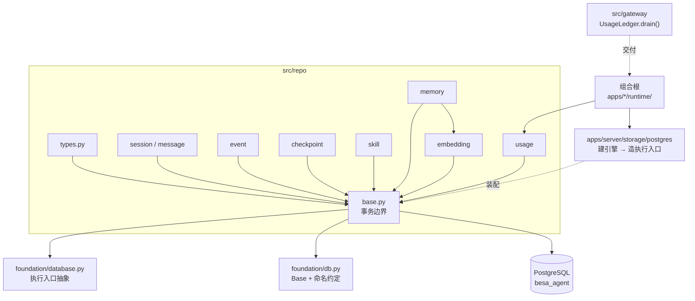
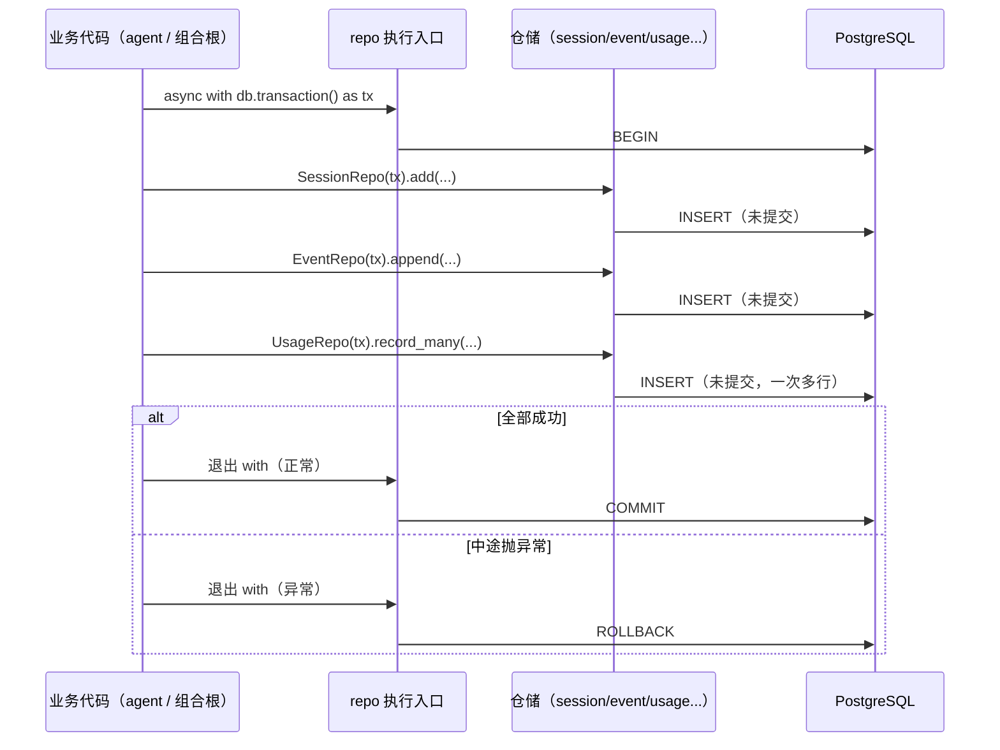
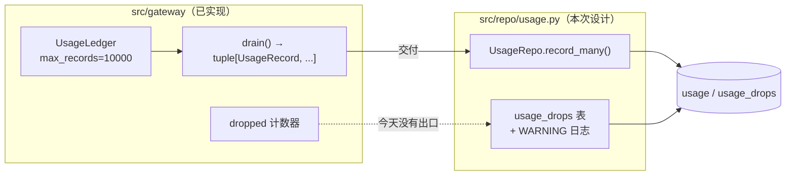
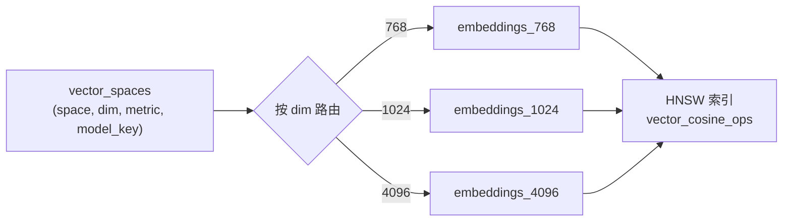
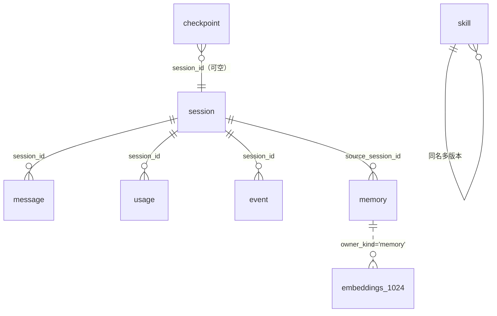
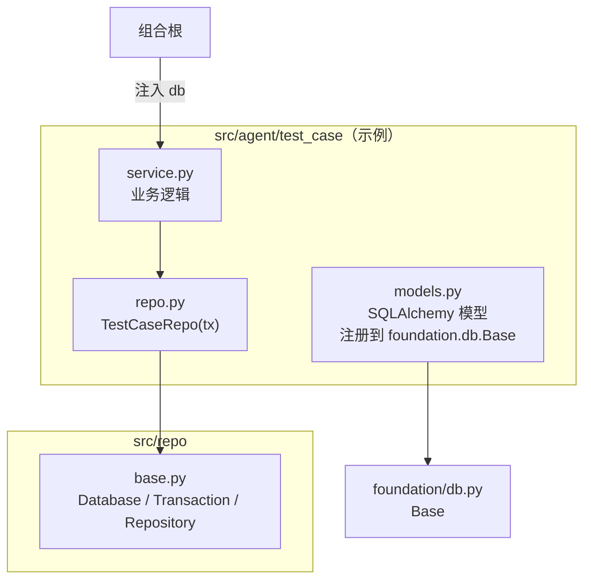
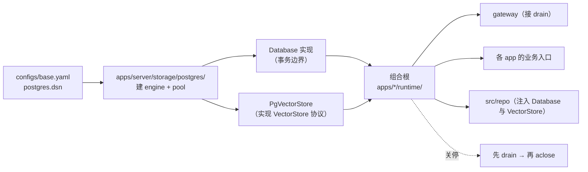

# `src/repo` 架构概要设计

| 项 | 值 |
|---|---|
| 文档层级 | **架构层**（第二篇）。前置：《`src/repo` 需求说明书》 |
| 承接 | 需求说明书-repo 的全部 `FR-R-xx` / `NFR-R-xx` |
| 强耦合 | `docs/gateway/架构概要设计-gateway.md` §4.5 —— **用量与成本的交付方向必须两侧一致** |
| 数据库 | PostgreSQL 17.11 + pgvector 0.8.6（库名 `besa_agent`） |
| 状态 | 待评审 |

---

## 0. 设计目标（一句话）

> 让「**一次业务操作 = 一个事务**」成为**默认**而非特例 ——
> 把事务边界的开启/提交/回滚收成一份实现，业务代码不再有 commit 的权利。

`NFR-R-02`（单一事务边界）是本模块**最重要的**约束，多数结构决定都服务于它。

---

## 1. 结构总览

```
src/repo/
├── __init__.py        只导出事务入口与仓储，不导出 SQLAlchemy 的东西
├── base.py            ★ 事务边界 + 仓储基类（本模块的承重墙）
├── types.py           存储无关的载体：分页、时间范围、批量结果、向量空间描述
├── session.py         会话
├── message.py         消息
├── event.py           事件（append-only）
├── memory.py          记忆（元数据 + 向量写入的编排）
├── checkpoint.py      断点与续跑
├── skill.py           技能（只增不改）
├── usage.py           ★ 用量与成本（gateway 的交付点）
└── embedding.py       ★ 向量能力：VectorStore 协议 + 与 memory 的事务编排
                          （pgvector 的具体实现在 apps/server/storage/postgres/vector.py）

migrations/            仓库根，Alembic（与 foundation/db.py 共用 Base）
├── env.py
└── versions/
```

### 1.1 依赖图



**三条硬边界**：

1. `src/repo` **不 import 任何业务模块**（`NFR-R-03`）—— 它是 provider 与 gateway 的**下游**，
   反向依赖会让契约无法表达。业务表由业务模块自持（`FR-R-09`）。
2. `src/repo` **不建引擎** —— 建引擎的权利只在组合根与 `apps/*/storage/`（`foundation/db.py` 定死）。
3. `src/repo` **不认识 Redis** —— 缓存/锁/限流属于 `apps/*/storage/redis/`。repo 只管权威数据。
4. `src/repo` **不认识 pgvector** —— `vector(N)` / `<=>` / HNSW 都是 Postgres 特有的，
   所以向量能力的**协议与编排**在这里，**实现**在 `apps/server/storage/postgres/vector.py`。
   注入方式与 `Database` 完全同构：repo 只认协议（见 §3.4）。

---

## 2. 核心机制：事务边界

### 2.1 为什么必须是同一个对象

`foundation/database.py` 的 docstring 已经给出了结论，这里把它落到结构上：

> 多套并存的 DB 访问约定（有的对象收 sessionmaker、有的收 engine）会导致**一个对象无法兼任两者**……
> 于是想在一次业务操作里同时用仓储和向量库，就必须同时持有 sessionmaker 与 engine，
> 并接受两者**不能共享连接与事务**。

真实事故（`besa-iv-kb`）：`VectorWriteStep` 把「按文档版本删旧 + upsert」拆成两个事务 →
崩在中间向量全丢。在 agent 场景里的同构风险是 **checkpoint + 事件 + 用量** 三步分家。

所以本模块只暴露**一个**入口，并且把「选择的自由收走」：



**关键点**：业务代码从头到尾没有 `commit` 这个词。它只能在边界内做事，
边界的开与关由 `repo` 决定 —— 这就是「把选择的自由收走」。

### 2.2 仓储拿事务的方式（`DR-2`）

仓储**构造时注入**执行入口，而不是方法参数传入：

```
SessionRepo(tx).add(session)            # ← 是这种
SessionRepo(db).add(tx, session)        # ← 不是这种
```

理由与 `foundation/db.py` 的说法一致（「仓储接收注入了执行入口的实例」）：
方法参数传入会让「这次调用到底在哪个事务里」变成一个每个方法都要读一遍的问题，
而构造时注入让**仓储实例与事务同生命周期** —— 拿到的仓储必然是同一个事务的。

### 2.3 为什么不用装饰器 / 隐式按请求（`DR-1`）

| 方案 | 问题 |
|---|---|
| 装饰器（`@transactional`） | 把边界**藏起来**了。读到 `await repo.add(x)` 时无法知道它在不在事务里、边界在哪 |
| 隐式按请求（一个 HTTP 请求一个事务） | 在 agent 场景下**语义错误**：一次模型调用可能跨几秒到几分钟，事务开着不放会长时间持锁；而且 `apps/cli` 根本不是请求模型 |
| **显式 `async with`** | 边界在一行代码里可见；能表达「一次业务操作」而不是「一次请求」 |

代价是每个业务入口都要写一行 `async with`。这个代价是**换来可见性**的。

---

## 3. 各文件设计

### 3.1 `base.py` —— 事务边界与仓储基类

```python
class Database(Protocol):
    """执行入口。**唯一**的事务边界。"""
    def transaction(self) -> AsyncContextManager[Transaction]: ...
    async def aclose(self) -> None: ...

class Transaction(Protocol):
    """事务内的执行手段。仓储只认它。"""
    async def execute(self, statement) -> Any: ...
    async def fetch_all(self, statement) -> Sequence[Any]: ...
    async def fetch_one(self, statement) -> Any | None: ...
    async def flush(self) -> None: ...

class Repository:
    """仓储基类。收执行入口，**不收 engine、不收 sessionmaker**。"""
    def __init__(self, tx: Transaction) -> None: ...
```

**为什么 `Transaction` 是 Protocol 而不是接收 `AsyncSession`**：
这样内存实现可以满足同一个协议（`NFR-R-04` 要求可测试），
而「换了 SQLAlchemy 版本要不要改仓储」变成一个只影响实现层的问题。

### 3.2 `types.py` —— 存储无关的载体

| 类型 | 用途 |
|---|---|
| `Page[T]` | 分页结果（items + next_cursor + has_more） |
| `TimeRange` | 时间范围过滤（半开区间，避免边界重复） |
| `BatchResult` | 批量写入结果（成功数 + 丢弃数 —— **丢弃必须可见**，与 gateway 的 `dropped` 同源） |
| `VectorSpace` | 向量空间描述：(name, dim, metric, model_key) |

`BatchResult` 里带 `dropped` 不是装饰：gateway 那边正是因为「丢了却不告诉任何人」而留下了缺口，
repo 不重复同一个错误。

### 3.3 `usage.py` —— 本模块第一优先级（`FR-R-07`）

**这是整块设计里价值最高的一处**：它接上的是一根**currently 断着的线**。



**设计要点**：

| 点 | 做法 | 理由 |
|---|---|---|
| 批量写 | 一次 `INSERT ... VALUES (...), (...)` 多行 | `NFR-R-06`：写放大受控 |
| 未知用量 | 落 `NULL` | `NFR-R-08` / `FR-G-08`：「未知」不是 0 |
| `dropped` | 落一行 `usage_drops` **并且**打 WARNING | `DR-8`：日志让人立刻看见，落库让历史可查 |
| 失败不影响调用 | 记账在事务里，但调用方（组合根）**不 await 它的结果来决定成败** | `NFR-R-07`：记账是旁路 |

**三处已知缺陷的修复位置**（本次架构分析发现，见 `docs/besa-agent-gateway/ANALYSIS_REPORT.md`）：

| 缺陷 | 修在哪 | 具体 |
|---|---|---|
| `drain()` 零调用方 | **组合根 + 本模块** | 组合根在关停前与按批定时 drain；repo 提供 `record_many` |
| `dropped` 无出口 | **本模块**（新表 + 日志） | 不能只存在内存里 |
| 失败记录 `alias=""` | **gateway 侧**（`gateway.py:764-788`） | repo 这边只要求 `alias` 非空；填值需要 gateway 把 alias 传进 `_record_failure_usage` |

> 第三处不在 repo 的范围内，但它会**污染** repo 的数据：`alias` 为空的失败记录
> 会让任何按逻辑名的聚合静默丢掉它们。这里记一笔是为了让两侧同时改。

### 3.4 `embedding.py` —— 向量能力的协议与编排（`FR-R-08`）

**实现在别处。** 本文件放两样东西：`VectorSpace` 描述 + `VectorStore` 协议，
以及「元数据与向量写在同一事务」的编排。**pgvector 的具体实现**
（`vector(N)` 表模型、HNSW 索引、`<=>` 距离检索）在
`apps/server/storage/postgres/vector.py`。

判据是 `NFR-S-01`（谁实现协议、谁定义协议）：`vector(N)` 是**列类型**、`<=>` 是**运算符**、
HNSW 是**索引类型** —— 三者都是 Postgres + pgvector 特有的，换一个向量后端这三样全要重写。
所以它们是「必须绑定具体后端」的实现，按 `docs/server_storage` 的边界划分归 storage。

**注入方式与 `Database` 完全同构**：`memory.py` 拿到的是一个 `VectorStore` 实例，
它不知道背后是 pgvector 还是别的东西。这样「存储无关」这条在向量上也是成立的。

#### 维度问题的处理（`DR-4`，本模块最需要解释的一处）

pgvector 的 `vector(N)` 把维度**钉在列类型上** —— 一个列只能存一个维度。
而本项目的配置里**三种维度并存**：`emb-mock` 768、`emb-dashscope` 1024、
SiliconFlow 实测 4096。

三个备选：

| 方案 | 评价 |
|---|---|
| (a) 每实体一张向量表（`besa-iv-kb` 的做法） | 外键完整、每实体可独立建索引。但平台有 7 个阶段 + 多智能体产物，**实体数会膨胀**，每加一类产物就要加一张表 |
| (b) 一张多态表（`owner_kind` + `owner_id`） | 表只有一张，但**维度无法解决** —— `vector(N)` 定死 |
| **(c) 按维度分表 `embeddings_768` / `_1024` / `_4096`** | 表数 = **维度数**（3），不是实体数；同表内多态解决实体膨胀；维度进表名解决列类型约束 |

**选 (c)**。理由是它把「膨胀因子」放在**变更频率最低的那个维度**上：
维度由 embedding 模型决定，一个部署里最多两三种；实体类型则每个版本都可能新增。



**维度不匹配必须报错**（`CR-7`）：把 1024 维的查询向量发给 4096 维的空间，
不得静默截断或补齐 —— 截断后的距离**没有任何意义**，且不会报错。这与 provider 的
「维度不符立刻报错」（`FR-P-07`）是同一条纪律。

#### 索引选型

| 索引 | 何时选 |
|---|---|
| **HNSW**（本次选它） | 召回率高、不需要训练数据、支持增量插入。代价是建索引慢、内存占用大 |
| IVFFlat | 建得快、内存小，但**需要先有数据才能训练**，且增量插入后召回率会退化 |

选 HNSW 的理由很实际：本场景是**边写边查**（agent 跑起来就一直在写记忆），
IVFFlat 的「先有数据再训练」与它不合。

**代价必须写下来**：HNSW 的索引构建受 `maintenance_work_mem` 限制（本机默认很可能不够），
大表建索引前要临时调大，否则会走磁盘排序、慢到不可接受。

### 3.5 其余仓储

| 文件 | 关键设计点 |
|---|---|
| `session.py` | 外部标识（`session_id`）与自增主键分离 —— 前者对外，后者对内做外键 |
| `message.py` | **会话内序号 `seq`** + 唯一约束 `(session_id, seq)`：对话历史能重建的前提是顺序有定义，不能靠自增 id 碰运气 |
| `event.py` | **append-only**：不提供 update/delete 方法。改事件属于删证据 |
| `memory.py` | 元数据写在 `memory` 表，向量写在 `embeddings_*` 表，**同一个事务**（编排在此文件里，向量写入委托 `embedding.py`） |
| `checkpoint.py` | 带**格式版本号**；读到不认识的版本必须报错，不得按旧格式猜（`FR-R-05`） |
| `skill.py` | `(name, version)` 唯一，**只增不改** —— 正在运行的任务可能还引用着旧版本 |

---

## 4. 表结构设计



| 表 | 关键列 | 索引 / 约束 |
|---|---|---|
| `session` | `session_id`(uniq) `caller` `title` `status` `created_at` `updated_at` `metadata` | uniq(session_id)；idx(updated_at desc) |
| `message` | `session_id` `seq` `role` `content` `name` `tool_call_id` `tool_calls` `created_at` | **uniq(session_id, seq)**；idx(session_id, seq desc) |
| `event` | `event_id`(uuid uniq) `name` `trace_id` `session_id` `caller` `alias` `model_key` `attempt_index` `payload` `occurred_at` | idx(trace_id)；idx(session_id, occurred_at desc)；idx(occurred_at desc) |
| `usage` | `trace_id` `alias` `model_key` `provider` `model` `input_tokens`↓ `output_tokens`↓ `cached_input_tokens`↓ `cost_amount` `currency` `degraded` `attempt_index` `session_id` `caller` `occurred_at` | idx(session_id, occurred_at)；idx(model_key, occurred_at)；idx(trace_id) |
| `usage_drops` | `dropped_count` `window_start` `window_end` `reason` `occurred_at` | idx(occurred_at desc) |
| `memory` | `memory_id`(uuid uniq) `kind` `content` `source_session_id` `source_agent` `weight` `created_at` `expires_at` `superseded_by` `metadata` | idx(kind, created_at desc)；idx(source_session_id) |
| `checkpoint` | `run_id` `format_version` `step_index` `node_id` `status` `state` `artifacts` `created_at` | idx(run_id, created_at desc) |
| `skill` | `name` `version` `description` `parameters` `permissions` `enabled` `created_at` | **uniq(name, version)** |
| `vector_spaces` | `space`(uniq) `dim` `metric` `model_key` | uniq(space) |
| `embeddings_<dim>` | `space` `owner_kind` `owner_id` `model_key` `embedding`(vector(N)) `created_at` | uniq(space, owner_kind, owner_id)；**HNSW(embedding vector_cosine_ops)** |

**说明四处刻意的选择**：

1. **`↓` 标记的 token 列可为 `NULL`** —— 未知不落 0（`NFR-R-08`）。DDL 无法强制「不许写 0」，
   所以这条靠代码纪律 + `CR-2` 的测试守着。
2. **`usage` 与 `event` 都带 `alias`** —— 按逻辑名聚合是需求点名的能力（`FR-G-08`）。
   失败记录如果 `alias` 为空，聚合会静默丢掉它们（见 §3.3 的第三处缺陷）。
3. **时间戳统一用 `timestamptz`**（`DR-9`）。gateway 传出来的 `UsageRecord.mono_at` 是**单调时钟读数**，
   不可跨进程比较；入表时必须由交付方补绝对时刻 —— `usage.py` 的注释已经说明了这一点。
4. **`embeddings_<dim>` 的表模型不在本模块** —— 它定义在
   `apps/server/storage/postgres/vector.py`（因为列类型就是 pgvector 的 `vector(N)`），
   但**注册到同一个 `foundation/db.Base`**，所以同一事务成立。
   本模块只声明这张表**必须存在、必须有哪些列与索引**。

---

## 5. 与 gateway 的接缝

这一节是两份文档强耦合的地方（`docs/gateway/架构概要设计-gateway.md` §4.5）。

| 方向 | 内容 |
|---|---|
| gateway 产生 | `UsageLedger` 累积 `UsageRecord`（含 `cost` / `degraded` / `attempt_index`） |
| gateway 暴露 | `drain()` 返回并清空记录；`dropped` 计数丢弃量 |
| repo 消费 | `UsageRepo.record_many(records)` |
| **谁接线** | **组合根**（`apps/*/runtime/`）—— `NFR-G-06`：「谁调用 repo 由组合根决定」，gateway 不依赖 repo |

**为什么由组合根接线而不是 gateway 直接调 repo**：gateway 是 provider 的唯一消费者，
而 repo 在依赖链上比 gateway **更下游**。让 gateway import repo 会让「一层只依赖它下面那层」
这条线变成一个菱形，也让「gateway 可以脱离数据库单测」这件事失效。

**接线的具体时机**（三个都可能丢数据的地方）：

1. **按批**：攒够 `batch_size` 或到 `flush_interval_s` 就 drain 一次；
2. **会话结束**：一次回归跑完；
3. **关停**：`Runtime.aclose()` 里**先 drain 再关连接** —— 目前 gateway 的 `aclose()`
   不 drain，缓冲区里的记录会直接消失（`docs/besa-agent-gateway/ANALYSIS_REPORT.md` §5.4 已记录）。

---

## 6. 与业务模块的接缝（`FR-R-09`）



**三条规则**：

1. 业务模块的表**定义在自己包里**（`src/agent/test_case/models.py`），
   但必须注册到 **`foundation/db.Base` 这同一个 Base** —— 否则 Alembic 看不到它，
   而且跨表事务无法成立。
2. 业务模块的仓储**继承 `repo.base.Repository`**，通过它拿事务 —— 不自己建引擎、不自己 commit。
3. **repo 不 import 业务模块**。方向是单向的：业务 → repo → foundation。

**取舍（诚实记一笔）**：这条设计让业务模块要自己写 ORM 模型与仓储，
比「全部塞进 repo」多一些样板代码。换来的是：
`repo` 保持在依赖链的下游，且**新增一个测试阶段不需要改 repo**。

---

## 7. 装配与迁移

### 7.1 装配



引擎的构造**只在 `apps/*/storage/`**（`foundation/db.py`：「建引擎的权利只在组合根手里」）。
`src/repo` 只认 `Database` 协议。

### 7.2 连接预算（对着本机实测值算）

实测：`max_connections = 100`，`shared_buffers = 128MB`，PG 17.11。

```
可用连接 ≈ 100 − 3（superuser 保留） = 97

分配（一期）：
  apps/server  1~4 worker × (pool 5 + overflow 5) = 10 ~ 40
  apps/cli     1 进程 × (pool 2 + overflow 0)     =  2
  apps/mcp     1~2 进程 × (pool 2 + overflow 2)   =  4 ~ 8
  alembic      迁移时独占                           =  1
  ────────────────────────────────────────────────────
  峰值 ≈ 51，留出约 45 的余量给 psql / 监控 / 未来的额外 worker
```

**为什么 pool 默认给 5 而不是 20**：连接是**全局共享**的稀缺资源，
而「每个进程开大池」是典型的局部最优、全局最差。默认值必须小，
需要调的人显式调。

### 7.3 迁移

| 项 | 决定 |
|---|---|
| 工具 | Alembic |
| `Base` 与命名约定 | 来自 `foundation/db.py`（与运行时**共用**，避免「迁移看到的表」与「运行时看到的表」不一致） |
| 目录 | 仓库根 `migrations/` |
| 向量扩展 | 迁移里 `CREATE EXTENSION IF NOT EXISTS vector`（幂等），且**不静默跳过**（`CR-10`） |
| 维度表 | 一期的三个维度（768/1024/4096）由迁移建出；新维度 = 新迁移（维度是**部署时事实**，DDL 不能数据驱动） |
| 目标库 | **只** `besa_agent`。本机 `besa` 库属于另一个项目，严禁迁移（`NFR-R-09`） |

---

## 8. 关键设计决策

| # | 决策 | 被否决的方案 | 理由 |
|---|---|---|---|
| **R-A** | ~~`Transaction` 是 Protocol 而非 `AsyncSession`~~ → **见 §12 的实现期修订**：抽象点放在**引擎/方言**，`Database` / `Transaction` 是具类 | 收 `AsyncSession` / 收 Protocol | 原意是「让内存实现能满足同一协议」。编码时发现走不通（§12），改成的做法收益更大：**同一份仓储代码跑在 SQLite 与 Postgres 上** |
| **R-B** | 事务用显式 `async with` | 装饰器 / 隐式按请求 | 装饰器藏边界；隐式在 agent 场景语义错误（一次调用几分钟，长事务持锁） |
| **R-C** | 仓储**构造时**注入事务 | 方法参数传入 | 仓储实例与事务同生命周期，「这次在哪个事务」不需要每个方法读一遍 |
| **R-D** | 业务表由业务模块自持 | 全部塞进 repo | repo 是 provider/gateway 的下游，承载业务表会导致反向依赖 |
| **R-E** | 向量按**维度**分表 | 每实体一张表 / 一张多态表 | 膨胀因子放在变更频率最低的维度上；多态解决实体膨胀 |
| **R-F** | 向量索引用 HNSW | IVFFlat | 边写边查的场景下 IVFFlat「先有数据再训练」不合 |
| **R-G** | `usage` 批量写 + `dropped` 落表 | 逐行写 / 丢弃只记内存 | `NFR-R-06` 写放大；`dropped` 无出口是 gateway 已经犯过的错 |
| **R-H** | 时间戳统一 `timestamptz` | 存单调时钟读数 | 单调读数跨进程不可比，落库必须是绝对时刻 |
| **R-I** | `event` 表 append-only | 提供 update/delete | 改事件属于删证据 |
| **R-J** | `skill` 只增不改 | 原地更新 | 正在运行的任务可能还引用着旧版本 |
| **R-K** | 向量**协议**在 repo、**实现**在 storage | 两样都放 repo | `vector(N)` / `<=>` / HNSW 是后端特有；与 `Database` 的注入方式同构（对应 `docs/server_storage` 的 `DS-6`） |

---

## 9. 待确认（需评审）

| 编号 | 问题 | 影响 | 建议 |
|---|---|---|---|
| `Q-1` | 内存实现的测试替身做到什么程度 | 决定 `NFR-R-04` 的成本 | 只实现 `Database` 协议 + 一个 `InMemoryTransaction`；完整语义（唯一约束/外键）由真实 PG 的集成测试覆盖 |
| `Q-2` | 集成测试用哪个库 | 需要本机或容器有 PG | 用 `besa_agent_test`（同实例、独立库），与 `besa_agent` 隔离；`test.yaml` 里钉死，避免 CI 误连生产库 |
| `Q-3` | 消息内容存 `text` 还是 `jsonb` | 影响多模态与工具调用的存储 | 多模态内容（`ContentPart` 序列）用 `jsonb`，纯文本走同一列 —— 统一 `jsonb` 更省心但放弃全文索引；一期建议 **`jsonb` + 生成列**保留纯文本检索能力 |
| `Q-4` | 事件表的分区/归档策略 | 事件量 = 调用量 × 每调用数个，增长最快 | 一期不做分区，但**表设计要预留**（按 `occurred_at` 范围分区）；给出「单表超过多少行就该分区」的判据 |
| `Q-5` | `usage` 的 `cost_amount` 精度 | 与 `cost.py` 的 `Decimal` 除法对齐 | `numeric(18, 8)`：够存到 10 亿分之一元，且不会像 float 那样在累加时漂移 |
| `Q-6` | 向量表是否也存原文摘要 | 影响检索后是否需要回表 | 建议**回表**（向量表只存向量与归属），避免同一份内容两处存储而漂移 |

---

## 10. 实施顺序

| 步 | 内容 | 完成判据 |
|---|---|---|
| **1** | `base.py` + `types.py` + Alembic 骨架 + `session` / `message` | `CR-1` / `CR-5` / `CR-10` 通过。**先跑通事务，不带向量** |
| **2** | **`usage.py` + 接上 gateway 的 `drain()`** | `CR-2` / `CR-3` / `CR-4` 通过 —— **修掉那根断着的线** |
| **3** | `event.py` + `memory.py`（暂不带向量） | `CR-6` 的结构化过滤部分通过 |
| **4** | `checkpoint.py` + `skill.py` | `CR-8` / `CR-9` 通过 |
| **5** | `embedding.py` + pgvector 的维度策略 | `CR-6` 的语义检索部分、`CR-7` 通过 |

**第 2 步排在第 1 步之后、其余之前是刻意的**：它是**唯一一处已经存在断口**的地方
（`drain()` 零调用方），而且它不需要向量、不需要业务模块配合 ——
投入产出比最高。

---

## 11. 风险

| 风险 | 影响 | 对策 |
|---|---|---|
| 业务模块绕过执行入口自己 commit | 事务边界失效，「三件事同事务」的保证悄悄没了 | 结构性约束（仓储不暴露 session）+ 代码审查重点；`CR-11` 守着 |
| 连接池配得过大 | 多进程下打满 `max_connections = 100`，所有 app 一起失败 | 默认值取小（5）；启动时若 `pool_size × 预期进程数 > 80` 打 WARNING |
| HNSW 索引构建超出 `maintenance_work_mem` | 建索引走磁盘排序，慢到不可接受 | 迁移文档里写明需要临时调大；大表建索引给出操作步骤 |
| 事件表单表膨胀 | 查询变慢、vacuum 压力大 | 预留按 `occurred_at` 分区（`Q-4`）；给出触发分区的行数判据 |
| 误连到 `besa` 库 | 两个项目的 `alembic_version` 互相覆盖，可能改坏另一个项目的数据 | 库名不同 + `CR-12` 类的测试守着；迁移前打印目标库名并要求确认 |
| `dropped` 又一次没有出口 | 重演 gateway 的缺口 | `usage_drops` 表 + WARNING + `CR-3` 测试 |
| Redis 与 Postgres 的数据职责划不清 | 有人把权威数据放 Redis，重启就丢 | 判据写死：**能丢的才进 Redis**；repo 不认 Redis（§1.1 硬边界 3） |

---

## 12. 实现期回填的修订

与 `docs/gateway/架构概要设计-gateway.md` §9.5 同一性质：**编码阶段推翻或修正了设计稿的地方**。
回填是为了让文档与代码不分叉 —— 一份过时但没人知道的架构文档，比没有架构文档更糟。

| # | 修订 | 原稿 | 现在 | 理由 |
|---|---|---|---|---|
| **RR-1** | **抽象点从「事务类」移到「引擎/方言」** | `Database` / `Transaction` 是 `Protocol`，CLI 提供一个「内存实现」满足同一协议 | 两者都是具类（住 `foundation/database.py`）；CLI 用的是**内存 SQLite 引擎** | **原方案走不通**：`Transaction.execute()` 收的是 SQLAlchemy 语句，一个内存对象**无法**执行它 —— 于是那个「内存实现」只能是个什么都不做的空壳，而空壳会**静默丢弃写入**，正是本项目最不能接受的失败。改成引擎抽象之后收益更大：**仓储代码只写一次**，SQLite 与 Postgres 共用 |
| **RR-2** | **禁止嵌套事务，且必须报错** | 设计稿未涉及 | `Database.transaction()` 用 `ContextVar` 检测嵌套并抛 `RuntimeError` | 嵌套调用会各建一个会话 = **两个独立事务**（外层提交、内层回滚），而**两边都不报错**。这正是本模块存在的理由所要消灭的事故形态，所以必须把它变成一条明确的错误。用 `ContextVar` 而非实例属性，是因为数据库对象与并发协程是一对多的 |
| **RR-3** | **`Transaction` 的读写方法收绑定参数** | 设计稿只写了「收语句」 | `execute` / `fetch_all` / `fetch_one` / `scalar` 都收 `params` | 写第一个真实仓储时发现的：仓储必然要传绑定参数。缺了它只能拼字符串 —— 那既引入注入面，也让数据库无法复用执行计划 |
| **RR-4** | **连接失败必须补上目标信息** | 设计稿只说「明确报错」 | 健康检查捕获连接异常并重抛，带上 `库名 @ 主机:端口` 与三条常见原因 | 实测：库不存在 / 角色不存在 / 密码错三种情况，asyncpg 报的都是同一句 `ConnectionDoesNotExistError: connection was closed in the middle of operation`（PostgreSQL 故意不区分角色是否存在）。不补目标信息，排障第一步就卡住 |
| **RR-5** | **`SQLAlchemy` 移出 `postgres` 可选依赖** | `postgres` 组里有 `SQLAlchemy` | 进主依赖；`postgres` 组只留 `asyncpg` / `alembic` | SQLAlchemy 是**与方言无关**的抽象层，CLI 的 SQLite 路径也要用它。留在可选组会让「CLI 的默认存储」变成可选能力，与「无数据库即可跑通」这条项目级前提冲突 |
| **RR-6** | **`CREATE EXTENSION vector` 需要超级用户；首次部署是一次性前置** | 设计稿只说「迁移里建，幂等」 | 迁移里**保留** `CREATE EXTENSION IF NOT EXISTS vector`；但部署文档必须写明：**首次部署要先由超级用户建一次** | 实测：`vector.control` 里**没有 `trusted = true`**，所以 `besa` 角色直接建会报「只有超级用户能创建扩展」。而扩展**已存在**时，`besa` 跑 `CREATE EXTENSION IF NOT EXISTS` **能通过** —— `IF NOT EXISTS` 在权限检查之前短路。所以迁移的写法不用改，但**漏掉这一步会让首次部署失败**，且报错信息指向「权限」而不是「你少做了一步」 |

### 第二批：交付链路落地时发现的（步骤 2）

| # | 修订 | 原稿 | 现在 | 理由 |
|---|---|---|---|---|
| **RR-7** | **`UsageLedger` 需要一个「取走并清零」的丢弃计数出口** | 设计稿只说「`dropped` 必须有出口」 | 新增 `UsageLedger.drain_dropped()`，与 `drain()` 对称 | 交付方是**周期性**调用的，而 `dropped` 是**只增不减的累计值**。直接读会让同一笔丢弃被反复上报 ——「丢了 3 条」被记成 3、6、9…… 每一次看起来都像新丢的。**「有出口」不够，还得是「能被消费的出口」** |
| **RR-8** | **`Runtime.aclose()` 必须先 flush 用量再关连接** | 设计稿只在 §5 提到「三个可能丢数据的时机」 | `Runtime.flush_usage()` + `aclose()` 里显式先调 | `Gateway.aclose()` 关的是 provider 的 HTTP 客户端，**不 drain 它的账本**。不补这一步，缓冲区里的记录会跟着进程消失，且**不会有任何错误**。顺序也不能换：flush 要进事务，连接关了就没地方写 |
| **RR-9** | **`Transaction` 需要 `add_all`** | 只有 `add` | 新增 `add_all()` | 批量落库（`NFR-R-06`）要用它。循环 `add()` 在大数据量下会产生 N 条往返，而每条往返都是一次网络等待 |
| **RR-10** | **批量写的效果**两个后端不同 | 设计稿笼统写「一次事务多行」 | Postgres：N 行 → **1 次 executemany**；SQLite：N 行 → **N 次 INSERT** | 实测。SQLite 路径下 SQLAlchemy 拿不到它需要的 RETURNING 支持，退化成逐行。**CLI 的数据量极小且库在内存里，这个差异可以接受** —— 但不能假装它不存在：`NFR-R-06` 的达标范围是 Postgres |
| **RR-11** | **`alembic.ini` 必须纯 ASCII** | 原稿写了中文注释 | 改成 ASCII，中文说明挪进 `migrations/env.py` | 实测：Alembic 用 `encoding="locale"` 读 ini，而中文 Windows 的 locale 是 **cp936**。UTF-8 中文会让 alembic 在启动前就死：`UnicodeDecodeError: 'gbk' codec can't decode byte`。`PYTHONUTF8=1` 能绕过，但让构建工具依赖环境变量太脆 |
| **RR-12** | **CLI 默认不注入 `database`**（有意，不是漏接） | 设计稿说 CLI 用「内存实现」 | CLI 默认 `Runtime.database is None`，用量只留内存 | 内存 SQLite **没有表**（CLI 不走迁移），贸然注入会让每次 `flush_usage()` 都以「表不存在」失败并刷告警 —— 一个每次都报错、但功能其实正常的告警比没有告警更糟。需要持久化时显式注入 |
| **RR-13** | **无数据库时仍要 drain，并告警一次** | 设计稿未涉及 | `try_flush_usage(None, ledger)` 取走记录 + 每进程告警一次 | 不 drain 的话账本会涨到 `max_records` 然后**静默丢弃** —— 正是本项目最不能接受的失败。告警一次是「看得到但不吵」的取舍点 |

### 第三批：事件落库时发现的（步骤 3）

| # | 修订 | 原稿 | 现在 | 理由 |
|---|---|---|---|---|
| **RR-14** | **事件的 `trace_id` 从 `foundation.logging` 的 contextvar 取** | 设计稿说「事件必须携带可关联标识」，未说从哪来 | 用现成的 `current_trace_id()` | gateway 的 7 个 emit 点里**只有 3 个**在载荷里带 `trace_id`。但 `foundation/logging.py` 早就用 contextvar 承载了它（日志格式串要用）—— 于是**不需要改 gateway** 就能拿到。这也是它必须是 contextvar 而非全局变量的原因：多 agent 并发时，全局变量会让 A 的事件挂上 B 的 trace_id |
| **RR-15** | **用量与事件的 `trace_id` 来源不同，必须在源头归一化** | 未涉及 | `to_usage_rows` 里：显式参数优先，缺了取上下文 | 实测踩到：用量的 `trace_id` 来自 `chat(trace_id=...)` 的**显式参数**，事件的来自 **contextvar**。调用方不传显式参数时，前者是空串而后者有值 —— 两张表虽然同属一次调用却**关联不起来**，而它们恰恰是靠 trace_id 串成一条线的 |
| **RR-16** | **批量 upsert 必须用 `RETURNING` 而不是 `rowcount`** | 未涉及 | `.returning(EventRow.event_id)` + 数返回行数 | 批量执行（executemany）返回的是 `IteratorResult`，**它没有 `rowcount`** —— 拿不到「实际插了几行」，也就分不清「写成功」与「因重复被忽略」。而这两件事必须能区分：前者正常，后者说明同一批被交付了两次。实测两个后端都支持 executemany + RETURNING |
| **RR-17** | **`Transaction` 需要 `dialect_name`** | 未涉及 | 作为一等属性暴露 | 少数语句要按方言选构造器（`on_conflict_do_nothing` 在两个后端各有自己的 `insert`）。暴露出来好过让每个仓储去 `session` 内部掏方言名 —— 那既依赖实现细节，也会让「这里有后端差异」散落各处而没人知道 |
| **RR-18** | **`session_id` / `caller` 在事件里暂时为空**（已知缺口） | `FR-G-10` 要求事件携带会话与调用方 | 两列**可空**，暂不填；有一条测试记录这个状态 | gateway 的 7 个 emit 点**全都不带**这两个字段（本次架构分析已记录）。补它需要改 gateway（每个 emit 点都带，或引入一次调用上下文的绑定），属于跨模块改动，**没有和本次一起做**。**不要把「表建好了」当成「这一维可用」** —— 有一条用例专门钉住它，那天补上时会红 |
| **RR-19** | **`Runtime.flush_pending()` 必须有端到端测试** | 设计稿的测试策略没点到这一层 | 新增 `tests/integration/composition/test_delivery.py` | **这是实现期真实踩到的**：`flush_pending` 里把 `record_ledger(*self._take_usage())` 写成了位置参数展开，而 `dropped` 是关键字参数 —— **207 个测试全绿**，直到真跑一次端到端才炸。教训：单测覆盖了每一环，却没覆盖「它们接起来」那一环，而那个接缝恰恰是最容易出错的地方 |

### 一个让整个向量设计成立的事实

实测确认：**PostgreSQL 的 DDL 是事务性的** —— 在一个事务里 `CREATE TABLE` 然后回滚，表**不会存在**。

这条不是冷知识，它是本设计的前提之一：`DR-4`（向量按维度分表）与 `FR-R-08`
（「向量与业务行同事务」）能成立，正是因为建表与写入可以在同一个事务里一起提交或一起回滚。
反之，`besa-iv-kb` 的 `VectorWriteStep` 事故（「删旧 + upsert 拆成两个事务 → 崩在中间向量全丢」）
也只有在 DDL/DML 同事务的数据库上，才**有可能**被修好。

> 这也解释了为什么迁移必须由 `foundation/db.py` 的**同一份 `Base`** 驱动：
> 迁移看到的表与运行时看到的表若不一致，跨表事务会在一个「以为自己知道表结构」的假设上运行。
