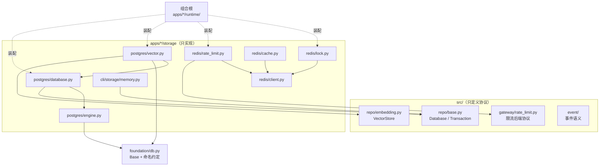
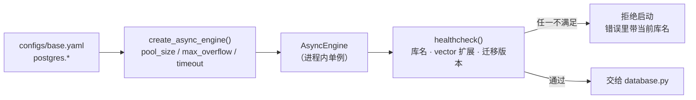
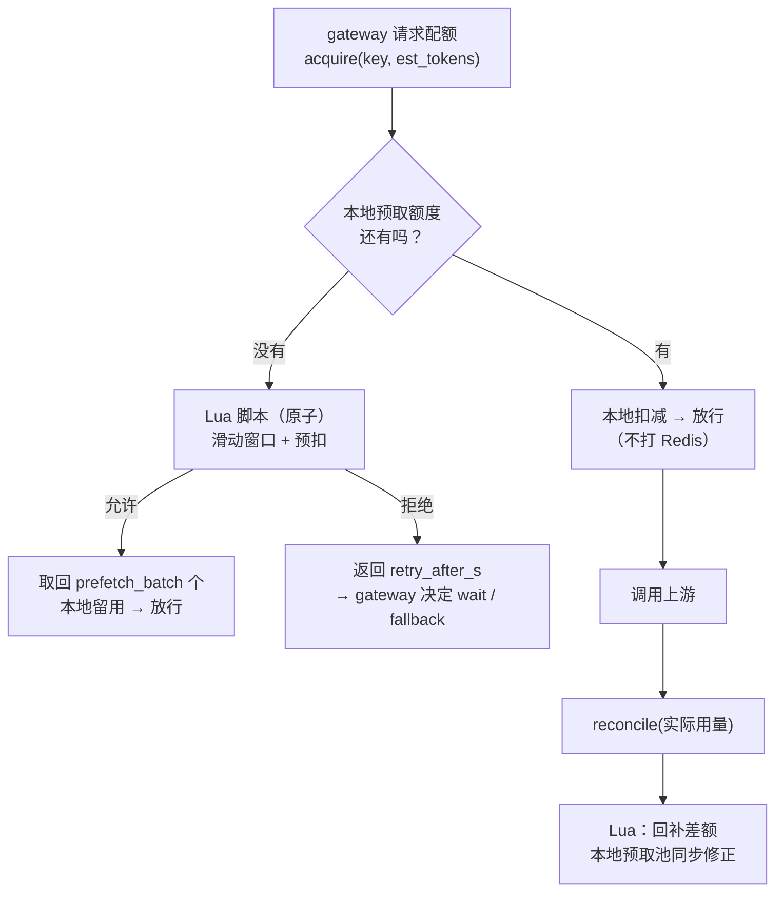
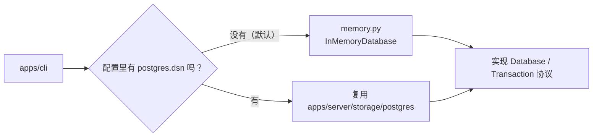
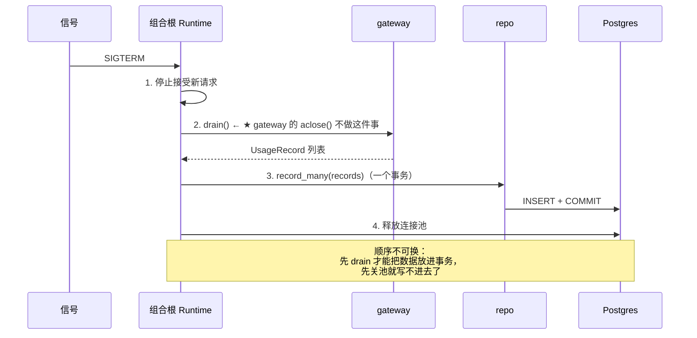

# `apps/server/storage` 架构概要设计

| 项 | 值 |
|---|---|
| 文档层级 | **架构层**（第二篇）。前置：《`apps/server/storage` 需求说明书》 |
| 承接 | 需求说明书-server_storage 的全部 `FR-S-xx` / `NFR-S-xx` |
| 强耦合 | `docs/repo/架构概要设计-repo.md`（本模块实现它的协议）；`docs/gateway/需求说明书-gateway.md` `FR-G-06` |
| 后端实测 | PostgreSQL 17.11 + pgvector 0.8.6；**Redis 5.0.14.1**（`maxmemory=0`，与一个 Celery 实例共用） |
| 状态 | 待评审 |

---

## 0. 设计目标（一句话）

> 把「**连上哪个后端**」这件事从业务代码里彻底拿出去，收到进程启动的那一层 ——
> 而 `src/` 只认协议，不认识任何具体后端。

`NFR-S-01`（只实现协议，不定义协议）是本模块最重要的约束：**本模块是「被注入」的一方**。

---

## 1. 结构总览

```
apps/
├── server/storage/
│   ├── postgres/
│   │   ├── engine.py      引擎 + 池 + 健康检查
│   │   ├── database.py    Database 实现（事务边界）
│   │   └── vector.py      PgVectorStore（pgvector 的表模型 / 索引 / 检索）
│   └── redis/
│       ├── client.py      客户端 + 连接 + 健康检查
│       ├── rate_limit.py  ★ 多进程限流后端（FR-G-06 的落点）
│       ├── lock.py        分布式锁（断点续跑互斥）
│       └── cache.py       读缓存（可丢失）
└── cli/storage/
    └── memory.py          内存实现（默认，无外部依赖）
```

### 1.1 依赖图



**箭头方向是本模块的全部纪律**：`apps → src`，反向一条都没有。
`src/` 里出现 `from apps...` 的一刻，这个设计就塌了（`CS-13` 守着）。

---

## 2. `postgres/` —— 装配与执行入口

### 2.1 引擎与池（`engine.py`）



**三个设计点**：

| 点 | 做法 | 理由 |
|---|---|---|
| 进程内单例 | 模块级 `lru_cache` 或 container 持有 | `FR-S-01`：每仓储新建池 = fd 打爆（`foundation/container.py` 已写明这个教训） |
| 池默认**小** | `pool_size=5, max_overflow=5` | 连接是**全局共享**的稀缺资源；「每进程开大池」是局部最优全局最差 |
| 健康检查**拒绝启动** | 库名/扩展/迁移版本三项 | 「迁移版本与代码不一致」如果不拦，会在第一次写表时以「列不存在」的形式炸出来，离原因很远 |

### 2.2 为什么健康检查必须查**库名**（`FR-S-03`）

这不是洁癖 —— 本机 5432 上有一个 `besa` 库属于**另一个项目**（`besa-iv-kb`），
它已经有 37 张表和 `alembic_version = 0009_text2sql_registry`。

如果 DSN 指错到那个库：

- 我们的迁移会往它的 `alembic_version` 里写一个**别的版本号**；
- 它下次跑迁移时会认为「已经到 0009 了」，于是**跳过本该执行的迁移**；
- 结果是两个项目的数据结构都坏了，而且**双方都不会立刻收到错误**。

这是典型的「静默跨项目损坏」，所以要在启动期硬拦：

```
检测到 DSN 指向的是 `besa` 库 —— 那是另一个项目（besa-iv-kb）的库。
本项目的库是 `besa_agent`。已拒绝启动，避免两个项目的 alembic_version 互相覆盖。
```

### 2.3 `Database` 实现（`database.py`）

```python
class PostgresDatabase:            # 实现 src/repo/base.py 的 Database 协议
    def __init__(self, engine: AsyncEngine) -> None: ...

    @asynccontextmanager
    async def transaction(self) -> AsyncIterator[PostgresTransaction]:
        async with self._sessionmaker() as session:
            async with session.begin():        # ← 唯一的事务边界
                yield PostgresTransaction(session)

    async def aclose(self) -> None: ...
```

**`session.begin()` 是这里最重要的一个词**：它让「进 `async with` 即开事务、出即提交/回滚」
成为不可绕过的事实。业务代码拿到的 `PostgresTransaction` **不暴露 `commit`**。

---

## 3. `redis/` —— 装配与后端特异实现

### 3.1 实测约束（这一节决定了下面所有设计）

本次实测出来的四条事实，**其中两条推翻了初稿的设计假设**：

| 实测 | 含义 | 对设计的影响 |
|---|---|---|
| **`redis_version = 5.0.14.1`** | 有 Lua ✓、有 Streams ✓；**无 ACL**（6.0 才有）、无 Functions | 只能单密码认证；原子性靠 **Lua 脚本**；跨进程事件可用 Streams |
| **`maxmemory = 0`** | **无内存上限** | ⚠️ 初稿以为 `noeviction` 是风险 —— **错了**。`maxmemory-policy` 只在 `maxmemory` 被设时生效，而它是 0。真正的风险是**无限增长直到 OS OOM**，不是「写入失败」 |
| **`maxmemory_policy = noeviction`** | 惰性（因为 maxmemory=0） | 一旦有人给这个实例设了 maxmemory，策略就会变成「写入报错」。**我们的缓存必须自己有 TTL 和总量上限**，不能依赖 Redis 淘汰 |
| **现有键：`besa:queue:ingest`、`_kombu.binding.*`** | 这个实例**不是我们独占**，另有一个 **Celery** 部署在用 | ⚠️ 初稿的键前缀 `besa:rl:` **必须改成 `besa_agent:rl:`** —— `besa:` 这个命名空间已经被兄弟项目的 Celery 队列占了 |

**由此得到三条硬约束**：

1. **严禁 `FLUSHDB` / `FLUSHALL` / `KEYS *`（生产）** —— 会清掉别人的 Celery 队列。
   这条要写进代码注释与运维文档，不是「注意一下」。
2. **键前缀统一 `besa_agent:`** —— 明确归属，避免与 `besa:` 混为一谈。
3. **我们自己的键必须有 TTL 与总量上限** —— 因为没有 maxmemory 兜底，也没有淘汰策略兜底。

### 3.2 客户端（`client.py`）

- 进程内单例的连接池；
- 启动 ping 一次；
- 暴露健康状态给 `doctor`；
- 所有键操作走一个**前缀拼装器**（单一出口，避免有人手写键名漏掉前缀）。

### 3.3 ★ 多进程限流后端（`rate_limit.py`）

这是本模块**价值最高**的一处 —— 它让 `src/gateway` 里那个「明确报错」的分支不再需要存在。



**四个设计点**：

| 点 | 做法 | 理由 |
|---|---|---|
| **滑动窗口用 ZSET + Lua** | `ZREMRANGEBYSCORE` + `ZCARD` + `ZADD` 在一个脚本里 | 固定窗口（`INCR`+`EXPIRE`）在窗口边界会有**两倍配额**的突刺；而 `DS-4` 已定「读-判断-写」必须原子 |
| **本地预取额度** | 一次向 Redis 取 `prefetch_batch` 个，本地用完再取 | `NFR-G-03` 要求 gateway 单跳 < 1ms；「每个请求一次 Redis 往返」会把这个预算吃光 |
| **预取方向是「少用不多用」** | 预取的额度若未用完会作废 | 超发是**不可恢复**的（配额已经打出去了），少用只是浪费一点额度。方向必须选安全的那个 |
| **并发维度用租约** | 每个在途请求登记一个带 TTL 的令牌，计数 = 未过期令牌数 | 并发是「在途数」，跨进程只能靠租约表达；进程崩溃时租约自然过期 |

**必须同时接上 `reconcile`（跨模块的第二步）**：
`src/gateway/rate_limit.py` 的 `reconcile` **当前零调用点** —— 也就是说 TPM 的
「按预估预扣、按实际回补」只实现了前半句。本后端实现它之后，**gateway 侧也必须开始调用它**。
这属于本次设计里明确标注的跨模块改动（见 §8）。

### 3.4 分布式锁（`lock.py`）

用于断点续跑的互斥：同一个 `run_id` 不得被两个进程同时续跑。

| 要素 | 设计 |
|---|---|
| 获取 | `SET key value NX PX ttl`，`value` 是持有者标识（UUID） |
| 续期 | **看门狗协程**（`DS-5`）：TTL 的 1/3 处续一次，直到业务结束 |
| 释放 | **Lua 校验持有者再删** —— 不能直接 `DEL`，否则可能删掉别人的锁（自己超时后锁被别人拿了的情况） |
| 崩溃恢复 | 依赖 TTL 自然过期，**不依赖优雅关闭**（`FR-S-06`） |

**为什么释放必须校验持有者**：如果不校验，会发生这样一串：

```
P1 拿到锁 → P1 卡住超过 TTL → 锁过期 → P2 拿到锁 → P1 醒来执行 DEL → 删掉了 P2 的锁
→ P3 也拿到锁 → P2 与 P3 同时跑同一个 run
```

这条链上每一步都不报错，最终症状是「断点续跑偶尔重复执行」—— 而重复执行在测试平台里
意味着**重复发起了测试**。所以 `DEL` 必须包在 Lua 里做持有者比对。

### 3.5 缓存（`cache.py`）

- 键一律带 TTL（`C-S-2`），**没有默认永久键**；
- 单键大小与总量都要有上限（因为 Redis **没有 maxmemory 兜底**）；
- **空值不缓存**（`FR-S-07`）：把「查不到」缓存成空值，会让一次上游抖动变成持续的错误；
- 缓存层对调用方**透明失败**：Redis 挂了 → 直接回源，不抛错（缓存不是依赖）。

### 3.6 跨进程事件（本期不做，`DS-1`）

Redis 5.0 有 Streams，技术上可行。但一期不做，理由是它会引入一个**新的可靠性问题**：
「事件在 Stream 里积压了怎么办 / 消费者崩了怎么重放」——
而 `src/event` 的落库路径（Postgres）已经给了持久化保证。
一期先用「本地总线 + 落库」，跨进程分发等有明确需求再上。

---

## 4. `cli/storage/` —— 内存实现



**为什么默认是内存**：项目有一条级联的前提是「**无需数据库即可跑通**」——
`configs/base.yaml` 的注释、`test.yaml` 的存在、`doctor` 能无依赖运行，都建立在它上面。
如果 CLI 默认要连 PG，这条前提就没了。

**内存实现要做到什么程度**（`Q-1`）：只实现 `Database` / `Transaction` 协议 +
够用的查询语义。唯一约束、外键、`ON CONFLICT` 这些**由真实 PG 的集成测试覆盖**，
不要在内存里重新实现一个数据库。

---

## 5. pgvector 实现（`postgres/vector.py`）

### 5.1 为什么实现在这里而不是 `src/repo`（`DS-6`）

`vector(N)` 是**列类型**、`<=>` 是**运算符**、HNSW 是**索引类型** —— 三者都是
Postgres + pgvector 特有的，换一个向量后端这三样全要重写。

所以按 `NFR-S-01` 的判据（本模块只实现协议），它属于这里：

| 层 | 内容 |
|---|---|
| `src/repo/embedding.py` | `VectorSpace` 描述、`VectorStore` 协议、与 memory 的事务编排 |
| `apps/server/storage/postgres/vector.py` | 表模型（`vector(N)`）、HNSW 索引、距离检索的 SQL |

### 5.2 维度策略

pgvector 的 `vector(N)` 把维度钉在列类型上，而本项目配置里 **768 / 1024 / 4096 三种并存**。

**按维度分表**（`embeddings_768` / `_1024` / `_4096`），由 `vector_spaces` 表登记
`(space, dim, metric, model_key)`，实现按 `dim` 路由。

膨胀因子的选择理由见 `docs/repo/架构概要设计-repo.md` §3.4：
**表数 = 维度数（3），而不是实体数**（后者会随每个测试阶段新增而膨胀）。

**维度不匹配必须报错**：把 1024 维的查询发给 4096 维的空间，截断或补齐后的距离
**没有任何数学意义**，而且不会报错。这与 provider 的 `FR-P-07`（维度不符立刻报错）同一条纪律。

### 5.3 索引与它的运维代价

选 **HNSW**（`vector_cosine_ops`，`m=16`，`ef_construction=64`），
理由是场景为**边写边查**（agent 一跑起来就持续写记忆），而 IVFFlat 需要「先有数据再训练」。

**代价必须写进运维文档**：HNSW 构建受 `maintenance_work_mem` 限制，
本机 `shared_buffers` 只有 128MB，默认的 `maintenance_work_mem`（通常 64MB）
在表变大后会**走磁盘排序**，慢到不可接受。迁移文档里要给出「建索引前临时调大」的具体步骤。

### 5.4 表模型的归属与迁移的耦合

`vector.py` 里的表模型必须注册到 **`foundation/db.Base`**，与 `src/repo` 的表**同一个 Base** ——
这是「向量与关系行同事务」能成立的前提。

**由此产生一个必须写明的耦合**：`migrations/env.py` 需要 import 两边
（`src/repo` 的表 + `apps/server/storage/postgres/vector.py` 的表）才能看到全部表。
这是**唯一**一处「迁移侧跨 apps/src 引用」，要在 `env.py` 的注释里写清楚原因，
否则下一个人会以为这是分层破坏。

---

## 6. 连接预算

对着实测的 `max_connections = 100` 算：

```
可用 ≈ 100 − 3（superuser 保留） = 97

apps/server  1~4 worker × (5 + 5)  =  10 ~ 40
apps/cli     1 进程 × (2 + 0)      =   2
apps/mcp     1~2 进程 × (2 + 2)    =   4 ~ 8
alembic      迁移时独占             =   1
────────────────────────────────────────
峰值 ≈ 51  →  余量 ≈ 46
```

**启动时的护栏**（`FR-S-02`）：

```
pool_size × (1 + max_overflow) × 预期进程数 > 80  →  打 WARNING
```

这个数不是拍出来的：`80` 是给「psql 排障 / 监控 / 未来多开一个 worker」留的余量。
**默认值取小**（5）是对的 —— 让需要的人显式调大，而不是让所有人默认吃满。

---

## 7. 关停顺序与 `drain` 接线

关停顺序是**有约束的**（`FR-S-10`），写成图：



**第 2 步为什么必须在组合根做**：gateway 的 `aclose()` 只关 provider 的 HTTP 客户端，
**不 drain** 它的 `UsageLedger`（本次架构分析已在 `ANALYSIS_REPORT.md` §5.4 记录）。
如果不显式做，缓冲区里的用量记录会随着进程一起消失 —— 而且**不会有任何错误**。

---

## 8. 跨模块的两处接线（本期必须同时改）

设计到这里，有两处**不是本模块能单独完成**的改动，必须与相邻模块同批做：

| # | 改动 | 在哪 | 为什么必须同批 |
|---|---|---|---|
| 1 | `reconcile` 开始被调用 | `src/gateway/gateway.py`（在每次尝试后） | 本模块实现了 redis 后端的回补，而 **gateway 侧的 `reconcile` 目前零调用点** —— 只做后端 = 白做 |
| 2 | `_record_failure_usage` 填上 `alias` | `src/gateway/gateway.py:764-788` | 失败记录的 `alias` 是空串，会让**按逻辑名的聚合静默丢掉全部失败记录**（`docs/repo` §3.3 已记） |

这与 `docs/gateway/架构概要设计-gateway.md` §9.5 的 R-x 是同一类：**实现期发现的设计缺口，要回填**。

---

## 9. 关键设计决策

| # | 决策 | 被否决的方案 | 理由 |
|---|---|---|---|
| **S-A** | 本模块**只实现协议**，不定义 | 协议也放这里 | 协议属于 `src/`；放这里会让 `src/repo` 反向依赖 `apps/` |
| **S-B** | 健康检查**拒绝启动**而非警告 | 只打 WARNING 继续跑 | 「迁移版本不一致」「连错库」这类问题在警告里会成为背景噪音，而它们的后果是**数据损坏** |
| **S-C** | 键前缀 `besa_agent:` | `besa:` | 实测发现 `besa:` 已被兄弟项目的 Celery 队列占用 |
| **S-D** | 严禁 `FLUSHDB` / 生产禁 `KEYS *` | — | 同一个 Redis 实例上跑着别人的 Celery |
| **S-E** | 限流滑动窗口用 **Lua** | `INCR` + `EXPIRE` | 固定窗口在边界有**两倍配额**突刺；且「读-判断-写」必须原子 |
| **S-F** | 本地**预取额度**，方向取「少用不多用」 | 每请求打一次 Redis | `NFR-G-03` 的 1ms 预算；超发不可恢复，少用只是浪费 |
| **S-G** | 锁释放用 **Lua 校验持有者** | 直接 `DEL` | 否则「锁过期 → 别人拿到 → 你删掉别人的锁」这条链会让断点续跑重复执行 |
| **S-H** | 缓存**不缓存空值** | 缓存空值防穿透 | 「查不到」缓存成空值，会让一次抖动变成持续的错误 |
| **S-I** | pgvector 实现在 storage，协议在 repo | 全放 repo | `vector(N)` / `<=>` / HNSW 都是后端特有 |
| **S-J** | 跨进程事件一期**不做** | 用 Streams 做 | 会引入「积压/重放」这个新问题；而落库路径已给持久化保证 |
| **S-K** | CLI 默认**内存**存储 | 默认接 PG | 保住项目级前提「无数据库可跑」 |

---

## 10. 待确认（需评审）

| 编号 | 问题 | 影响 | 建议 |
|---|---|---|---|
| `Q-1` | 内存实现的语义边界 | 决定测试替身的成本 | 只做协议 + 够用查询；唯一约束/外键交给真实 PG 的集成测试 |
| `Q-2` | 集成测试用哪个库 / Redis 库号 | 需与生产隔离 | PG 用 `besa_agent_test`；Redis **用 `/1` 库**（`/0` 上有别人的 Celery），并在 `test.yaml` 钉死 |
| `Q-3` | 本地预取额度取多大 | 影响 Redis 往返频率与额度浪费 | 初值 `prefetch_batch=10`；预取太多会在低流量时浪费配额，需要实测调 |
| `Q-4` | 并发维度的租约 TTL | 太长则崩溃后恢复慢，太短则长请求被误判 | 取「模型调用 P99 × 2」并暴露配置项 |
| `Q-5` | 是否给 Redis 设 `maxmemory` | 现在是无上限 | 建议设一个（并配 `volatile-lru`），**但**这会影响同实例上的其它项目 —— 需要与运维确认后再动，不能由本模块擅自改 |
| `Q-6` | Redis 是否需要密码 | 现在无密码（仅监听 127.0.0.1） | 本机暴露面可接受；若将来跨机访问必须加密码 —— 且 Redis 5.0 **无 ACL**，只能单密码，做不到按项目隔离 |

---

## 11. 实施顺序

| 步 | 内容 | 完成判据 |
|---|---|---|
| **1** | `postgres/engine.py` + `database.py` + `cli/storage/memory.py` | `CS-1` / `CS-2` / `CS-3` 通过。**先让 repo 有执行入口可用** |
| **2** | `redis/client.py` + 健康检查 + 前缀拼装器 | `CS-4` / `CS-5` / `CS-14` 通过 |
| **3** | `postgres/vector.py` | `CS-11` 通过（依赖 `docs/repo` 的 `VectorStore` 协议已定稿） |
| **4** | **`redis/rate_limit.py` + gateway 侧的 `reconcile` 接线** | `CS-6` 通过 —— **两处必须同批** |
| **5** | `redis/lock.py` | `CS-7` / `CS-8` 通过 |
| **6** | `redis/cache.py` + 关停顺序里的 `drain` 接线 | `CS-9` / `CS-10` / `CS-12` 通过 |

**第 1 步必须先做**：`src/repo` 的一切都要靠它提供执行入口，没有它 repo 无法跑起来。
**第 4 步是唯一一处「必须跨模块同批」的**，排在这里是为了让前三步先建立好可测试的基础。

---

## 12. 风险

| 风险 | 影响 | 对策 |
|---|---|---|
| **误对 `besa` 库跑迁移** | 两个项目的 `alembic_version` 互相覆盖，双方迁移都会被跳过 | `FR-S-03` 启动期硬拦 + 迁移前打印目标库名 |
| **误执行 `FLUSHDB`** | 清掉兄弟项目的 Celery 队列 | `S-D` 写进代码注释与运维文档；生产环境不给该命令 |
| **Redis 无 maxmemory，缓存无限增长** | 吃光机器内存 → OS OOM | 每个键必须有 TTL + 总量上限；`Q-5` 与运维确认后设 maxmemory |
| **本地预取额度导致实际配额用不满** | 低流量时浪费额度（方向安全，但会让人困惑） | 在校准文档里写明；`Q-3` 给调参入口 |
| **锁续期看门狗泄漏** | 协程未随业务结束而退出 | 看门狗与业务协程**同生命周期**；`CS-8` 用「kill 进程」验证自然过期 |
| **连接池打满 `max_connections`** | 所有 app 一起失败 | 默认池小 + 启动护栏告警（§6） |
| **HNSW 建索引超出 `maintenance_work_mem`** | 建索引走磁盘排序，极慢 | 运维文档给出临时调大的步骤 |
| **`reconcile` 只做了后端没接前端** | TPM 仍停在纯估算模式 | §8 明确标注为**两处必须同批**之一 |
| **假时钟/假 Redis 与真实实现的语义差** | 测试绿但生产错（本次架构分析已发现过同类问题：`FakeClock.sleep` 无 `await` 掩盖了取消路径缺陷） | 适配器的集成测试**必须打真实后端**；替身只用于纯逻辑单测 |
