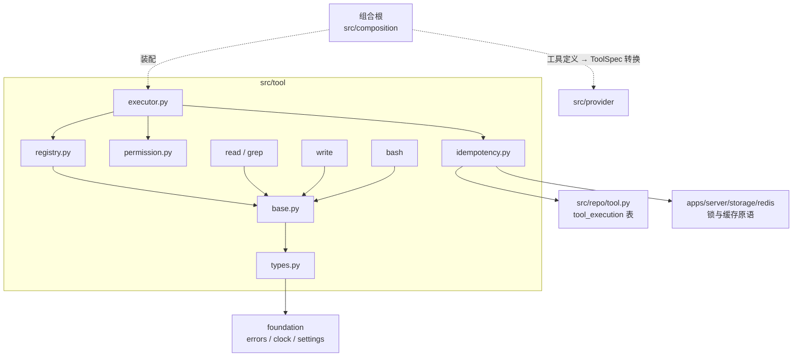
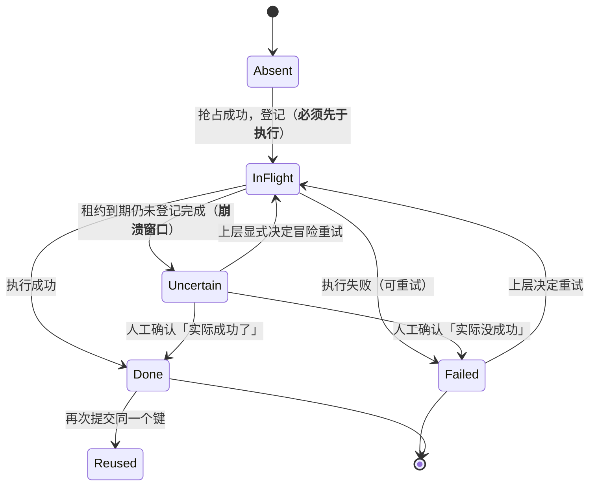
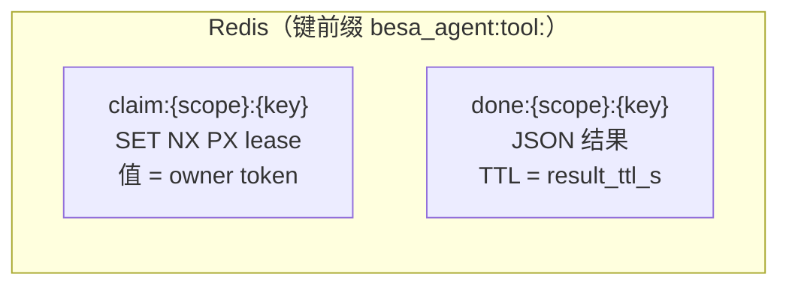
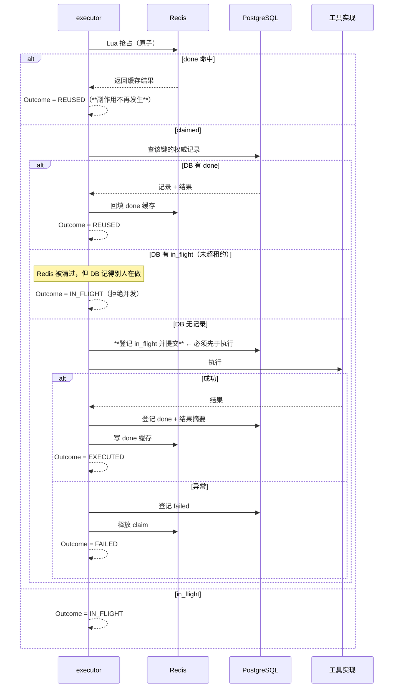
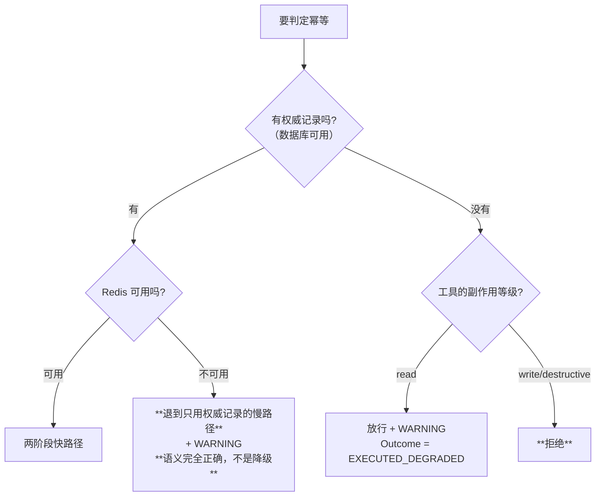
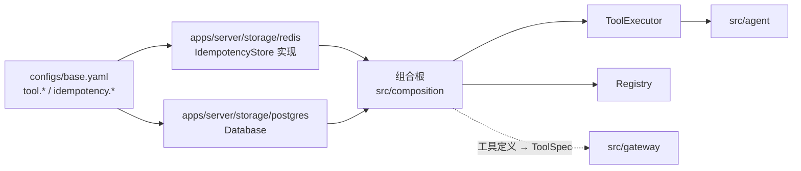

# `src/tool` 架构概要设计

| 项 | 值 |
|---|---|
| 文档层级 | **架构层**（第二篇）。前置：《`src/tool` 需求说明书》 |
| 承接 | 需求说明书-tool 的全部 `FR-T-xx` / `NFR-T-xx` |
| 强耦合 | `docs/repo/架构概要设计-repo.md`（执行记录的落库与事务边界）；`docs/server_storage/架构概要设计-server_storage.md`（Redis 键前缀与不可用时的行为） |
| 外部依赖 | Redis 5.0.14.1（实测）、PostgreSQL 17.11 |
| 状态 | 待评审 |

---

## 0. 设计目标（一句话）

> 让「**同一个调用，无论被提交几次，副作用只发生一次**」成为默认 ——
> 并把「**无法确定副作用到底发生没有**」这个窗口，显式地标成不确定，而不是假装成功或失败。

第二句和第一句同样重要。工具执行跨越了数据库事务的边界（副作用在文件系统、子进程、
外部 API 上），所以「恰好一次」做不到；能做的是**把不确定性收敛到一个可识别的状态**。

---

## 1. 结构总览

```
src/tool/
├── __init__.py      只导出契约与注册表，不导出具体工具
├── types.py         ToolDefinition / ToolCall 参数 / ToolResult / SideEffect / Outcome
├── base.py          Tool 抽象基类 + 执行上下文（ToolContext）
├── registry.py      注册与查找（重名硬失败）
├── executor.py      ★ 执行编排：校验 → 幂等 → 权限 → 执行 → 登记
├── permission.py    按副作用等级与调用方的授权判定
├── idempotency.py   ★ 幂等协议（Redis 快路径 + PostgreSQL 权威）—— 本模块的核心
├── bash/            destructive，默认关闭
├── grep/            read
├── read/            read
└── write/           write

src/repo/tool.py     tool_execution 表（基础设施数据，与 event / usage 同类）
```

### 1.1 依赖图



**四条硬边界**：

1. **不 import `provider`**（契约 4 机械强制）。工具定义是本模块自己的类型；
   转换发生在组合根（`DT-5`）。
2. **不 import `gateway`** —— 决定「带哪些工具、调用哪个模型」是上层的事，
   本模块只回答「调用某个工具会怎样」。
3. **不 import `agent` / `multiagent`** —— 依赖方向单向（`NFR-T-01`）。
4. **不认识 Redis 客户端**（`node: RS`）—— 幂等的**判定逻辑**在这里，
   但锁与缓存的**原语**由 `apps/server/storage/redis` 提供，与 `repo` 拿 `Database` 同构。

---

## 2. 核心机制：幂等的两阶段协议

### 2.1 为什么是「两阶段」而不是「一次 SET NX」

只做一次抢占的话，会有这样一串（每一步都不报错）：

```
A 抢占成功 → A 执行（副作用已发生）→ A 崩溃，没来得及记录
                                          ↓
B 来提交同一个键 → 发现没有 done 记录 → 认为没执行过 → 再执行一遍
                                          ↓
                                    副作用发生了两次，而系统认为只发生了一次
```

所以要**先登记、后执行、再登记**，把「正在执行」这个中间态显式化。

### 2.2 状态机



**`Uncertain` 是一等状态，不是异常**。它表达的是
「登记了开始、但没等到结束」—— 工具层**没有能力**判断副作用到底发生没有，
所以它不猜。`DT-8` 把重试的决定权交给上层。

### 2.3 Redis 的形状：两个键 + 一个 Lua



**两个键而不是一个**，是因为它们的语义与生命周期不同：

| 键 | 语义 | TTL | 能丢吗 |
|---|---|---|---|
| `claim` | 「有人正在做」的**短期租约** | `lease_s`（120s） | 能 —— 丢了最多是并发去做，而 DB 的 `in_flight` 会兜住 |
| `done` | 「已经做完了」的**结果缓存** | `result_ttl_s`（1h） | 能 —— 丢了回 DB 查 |

**抢占必须是一个原子判定**（判断 done / 抢占 / 已被占三者不能分开做，否则中间有窗口）：

```lua
-- KEYS[1]=claim  KEYS[2]=done   ARGV[1]=owner  ARGV[2]=lease_ms
-- 返回 {"done", <结果>} | {"claimed"} | {"in_flight"}
if redis.call('EXISTS', KEYS[2]) == 1 then
  return {'done', redis.call('GET', KEYS[2])}
end
if redis.call('SET', KEYS[1], ARGV[1], 'NX', 'PX', ARGV[2]) then
  return {'claimed'}
end
return {'in_flight'}
```

三个返回值恰好对应上层要做的三件事：**直接复用 / 我来做 / 等或拒**。

> **为什么用 Lua 而不是三条命令**：`EXISTS` → `SET NX` → 失败再判断，
> 中间任何一步被其他协程或进程插进来，都会让「已完成的键」被重新执行。
> 这与 `docs/server_storage` 的 `DS-4`（滑动窗口用 Lua）是同一条理由：
> 「读-判断-写」必须原子。

### 2.4 完整流程（含 DB 兜底）



**三个关键顺序，写反了都不报错**：

| 顺序 | 反了的后果 |
|---|---|
| **登记先于执行** | 崩在中间 → 下次重试**再执行一遍**，而系统完全不知道发生过 |
| **幂等判定先于权限校验** | 重复的调用因「无权限」被拒，上层以为没执行 —— 而副作用早已发生 |
| **先查 DB 再决定执行** | Redis 被清过时，会把「已完成」当成「没做过」，重复执行 |

### 2.5 参数指纹：只做确定性的序列化

```python
def fingerprint(tool_name: str, args: Mapping[str, Any]) -> str:
    raw = json.dumps(dict(args), sort_keys=True, ensure_ascii=False, separators=(",", ":"))
    return hashlib.sha256(f"{tool_name}\x00{raw}".encode()).hexdigest()
```

**规范化只做一件事：JSON 的确定性序列化**（键排序、无多余空白、非 ASCII 不转义）。
**不对参数值做任何语义加工** —— 不 strip、不做路径归一化、不折叠大小写。

理由是一条非对称性（`FR-T-03`）：

> **去重失败是安全的（多跑一次），误去重是危险的（少跑一次，且没人知道）。**

举例说明这条线画在哪：

| 两个参数 | 是否同一次 | 为什么 |
|---|---|---|
| `{"a":1,"b":2}` vs `{"b":2,"a":1}` | **同一次** | 键序是序列化噪声，`sort_keys` 消掉 |
| `"path":"./a.txt"` vs `"path":"a.txt"` | **不同次** | 归一化路径需要「相对谁」的上下文，而那个上下文可能变；算错就会把两次不同的读当成一次 |
| `"content":"x "` vs `"content":"x"` | **不同次** | `write` 的内容里有意义；strip 会让一次写多一个空格的调用被去重掉 |
| `1` vs `1.0` | **同一次** | JSON 层面它们序列化不同…… 因此**这里要显式说明：我们不做数值归一化**，两者算不同次（安全方向） |

**最后一行是刻意的**：数值等价归一化看起来无害，但它要求「所有参数值的类型语义都被正确理解」，
而参数是任意 JSON。省下的重复执行不值得引入一类「以为归一化对了其实没有」的风险。

### 2.6 结果缓存的大小

Redis **实测 `maxmemory = 0`**（无上限），`maxmemory-policy` 是惰性的 ——
也就是说**没有淘汰兜底**，缓存涨到把机器吃光为止。

所以上限必须由我们给：

| 阈值 | 行为 |
|---|---|
| ≤ `max_cached_result_bytes`（64KB） | 存完整结果，后续复用返回原样 |
| > 阈值 | **不存内容，只存摘要 + `truncated: true`**。去重**仍然生效**（键还是 done），但复用时会告诉调用方「结果太大，没能缓存」 |

「结果太大无法复用」本身是一个**需要被调用方看见的状态** —— 假装复用了、
返回一个被截断的结果，会让下游基于不完整信息做判断。

---

## 3. 权威记录：`tool_execution` 表

放在 `src/repo/tool.py`（`DT-9`），与 `event` / `usage` 同类：**基础设施数据**，
不是某个测试阶段的领域产物。

| 列 | 说明 |
|---|---|
| `id` | 自增主键（`BigIntPk`，见 `foundation/db.py`） |
| `idem_key` | 幂等键（显式或派生）。**与 `scope` 组成唯一约束** |
| `scope` | 作用域（会话 / 运行标识）—— 同一份参数在不同作用域里是**不同的调用** |
| `tool_name` | 工具名 |
| `args_digest` | 参数指纹，便于「参数一样但键不同」时排查 |
| `state` | `in_flight` / `done` / `failed` / `uncertain` |
| `owner` | 持有者标识（用来判断是不是自己登记的） |
| `trace_id` / `session_id` / `caller` | 归属维度，与 `usage` / `event` 对齐 |
| `started_at` / `finished_at` | 绝对时刻 |
| `result_digest` | 结果摘要（总是有） |
| `result` | 结果载荷（**有大小上限**，超限只留摘要） |
| `result_truncated` | 结果是否被截断 |
| `error` | 失败原因（已脱敏的字符串，**不存异常对象** —— 与 `AttemptRecord` 同一条理由） |

**唯一约束 `UNIQUE(scope, idem_key)` 是最后一道保险**：
两个进程同时登记时，数据库只让一个成功，另一个拿到 `IntegrityError` ——
把它翻译成 `IN_FLIGHT` 而不是失败。这比「先查再插」可靠：
后者在并发下有竞态窗口，而且**不会报错**。

### 3.1 `uncertain` 的判定

```
state = in_flight 且 now() - started_at > lease_s   →  视为 uncertain
```

**判定在读取时做，不写回**（不做一个「扫描并改状态」的后台任务）：

- 后台任务需要调度、需要处理「任务本身崩了」，且改状态是**破坏性**的
  （把 `in_flight` 改成 `uncertain` 之后就再也回不去了）；
- 而读取时判定是幂等的、无状态的，且 `in_flight → done` 的迟到登记仍然能覆盖它。

---

## 4. 幂等不可用时的分流

⚠ **「Redis 不可用」不等于「幂等不可用」** —— 这一点是编码阶段修正的（`RT-2`）。



**为什么 Redis 不在不算降级**：唯一约束 ``(scope, idem_key)`` **本身就是正确的
并发闸门** —— Redis 只是它的快路径。少了它，每次多一次 SELECT + INSERT，
但语义一点没变。让 Redis 的可用性等价于整个 agent 的可用性，是这个模块不该背的代价。

**为什么真的没有权威记录时 `read` 放行、`write` 拒绝**：
只读重复的代价是「浪费一次 IO」，为了它让整个 agent 停工代价不成比例；
而重复写会产生**第二份内容**（追加模式、内容里带时间戳的场景尤其如此）。
`destructive` 更不必说 —— 不可逆。

**`EXECUTED_DEGRADED` 是一个独立的 outcome**（不是 `EXECUTED`）：
调用方要能回答「这次是不是在没有幂等保护的情况下跑的」——
否则「偶尔出现的重复执行」永远查不出原因。

---

## 5. 各文件设计

### 5.1 `types.py` —— 契约载体

| 类型 | 内容 |
|---|---|
| `SideEffect` | `Literal["read", "write", "destructive"]`。**与权限、幂等降级策略都挂钩** |
| `Outcome` | `Literal["executed", "executed_degraded", "reused", "in_flight", "refused", "failed", "uncertain"]` |
| `ToolResult` | `outcome` / `ok` / `output` / `error` / `truncated` / `elapsed_s` / `idem_key` |
| `ToolInvocation` | 一次调用的入参：`tool_name` / `arguments` / `scope` / `idempotency_key` / `trace_id` / `caller` |

`Outcome` 刻意比「成功/失败」多几档：**`reused` 与 `executed` 是不同的**
（前者没有发生副作用），**`executed_degraded` 与 `executed` 也是不同的**
（前者没有幂等保护）。把它们合并成 `ok: bool` 会让上面那些问题全部变成「查不出来」。

### 5.2 `base.py` —— 工具契约

```python
class Tool(ABC):
    name: ClassVar[str]
    description: ClassVar[str]
    parameters: ClassVar[Mapping[str, Any]]   # JSON Schema
    side_effect: ClassVar[SideEffect]         # **工具自己声明**（DT-4）

    @abstractmethod
    async def run(self, args: Mapping[str, Any], ctx: ToolContext) -> ToolResult: ...
```

`ToolContext` 携带：作用域、trace_id、caller、已授权的范围、时钟。
**它不含 Redis / DB 句柄** —— 工具实现不该自己做幂等，
它甚至不该知道幂等的存在（那是 executor 的事）。

**参数 schema 校验必须在执行前做**（`FR-T-01`）：
不合法就把错误回给模型让它改，**绝不「尽力执行」**——
带着错参数执行的副作用会产生更难查的问题。

### 5.3 `registry.py` —— 注册与查找

- 重名**硬失败**（静默覆盖会让一个工具悄悄失效，而没人知道从哪一刻开始的）；
- 查找失败列出全部可用名（与 `FR-G-02` 同一条纪律）；
- 支持按 `SideEffect` 与调用方授权**筛选**：给模型看的工具列表应该是
  「当前这个调用方有权限用的那些」，而不是全部 —— 让它看见用不了的工具，
  它会去调用然后被拒。

### 5.4 `permission.py` —— 授权

| 等级 | 默认 | 授权形态 |
|---|---|---|
| `read` | 放行 | 仍需**范围**（可读哪些目录） |
| `write` | 拒绝 | 需显式授权 + 范围 |
| `destructive` | 拒绝 | 需显式授权 + 窄范围（不能是「全局允许」） |

**范围默认拒绝**（`C-T-1`）：没配就是不许访问，不是「默认允许、配了才限制」。
后者的问题是「忘了配」的默认行为是**最危险的**那一种。

### 5.5 `idempotency.py` —— 本模块的核心

对外只暴露两个方法，形状刻意做得像 `Database.transaction()` ——
让「一次幂等调用」在代码里是一个**块**，而不是散落的几次读写：

```python
class IdempotencyGuard:
    async def claim(self, inv: ToolInvocation, effect: SideEffect) -> Claim: ...
    async def mark_done(self, claim: Claim, result: ToolResult) -> None: ...
    async def mark_failed(self, claim: Claim, error: str) -> None: ...
```

`Claim` 携带：`outcome`（能否执行）、`idem_key`、`owner`、以及（复用时）上次的结果。

**三个方法的顺序由 `executor.py` 保证**，而不是由调用方自觉 ——
所以 `executor.py` 是唯一的使用者，且它把顺序写死在一处。

### 5.6 四个内置工具

| 工具 | 关键设计 |
|---|---|
| `read` | 按行范围读；范围受限；**输出必须截断且明确标注** |
| `grep` | 单次返回条数上限（否则一次搜索能撑爆上下文）；返回位置而不只是内容 |
| `write` | 覆盖/追加两种模式；目标必须在授权范围内；追加模式**必须**参与幂等（它天然不可重放） |
| `bash` | **默认关闭**（`C-T-2`）；有超时、有输出上限、有拒绝清单；拒绝清单是**最低限度的兜底，不是安全边界** —— 这一点要写在代码注释里，避免有人以为配了它就安全了 |

**共同点：所有输出都必须有界**（`NFR-T-05`）。
截断而不标注，会让模型基于不完整信息做判断，而它自己不知道 —— 这比报错更糟。

---

## 6. 与 `apps/server/storage/redis` 的接口

本模块**不直接持有 redis 客户端**，而是收一个窄接口（与 `repo` 收 `Database` 同构）：

```python
class IdempotencyStore(Protocol):
    async def claim(self, key: str, owner: str, *, lease_s: float) -> ClaimState: ...
    async def fetch_done(self, key: str) -> str | None: ...
    async def mark_done(self, key: str, payload: str, *, ttl_s: float) -> None: ...
    async def release(self, key: str, owner: str) -> None: ...
    @property
    def available(self) -> bool: ...
```

**为什么是窄接口而不是直接给客户端**：

1. 本模块的单测可以用内存实现（`NFR-T-06`），不必起 Redis；
2. Lua 的原子性边界收在一处 —— 散出去的话，「读-判断-写」会在多处被拆开而没人发现；
3. 与 `Database` 的注入方式一致，组合根的装配代码形状统一。

`release` **必须校验持有者**（与 `docs/server_storage` 的 `S-G` 同一条理由）：
不校验的话，「自己超时 → 别人拿到 → 自己醒来删掉别人的锁」这条链会让并发去重失效。

---

## 7. 装配



**工具定义到 `ToolSpec` 的转换在组合根**（`DT-5`）：
`src/tool` 不能 import `provider`（契约 4 机械强制），
而契约不该为一个模块开豁免 —— 一旦开了，下一个模块也会要求开。

**没有 Redis 时**：`IdempotencyStore` 用一个「永远不可用」的实现，
于是所有写类工具自然被拒（`FR-T-06`），行为与配置一致、不需要额外分支。

### 7.1 工具事件与它需要的字段（`DT-10` / `DT-11`）

**为什么要记**：一次 agent 运行的完整过程 = 模型调用 + 工具动作。
只记前者的话，排障时看到的图景是**残缺的** ——
「模型说它读了文件」和「它真的读了吗、读到的是什么」是两件事。

**出口**：`ToolExecutor` 是 tool 模块的**唯一**事件出口（`T-M`）。
它发出的名字：

| 事件名 | 何时 | 关键载荷 |
|---|---|---|
| `tool.started` | 通过幂等与权限校验、即将执行 | `tool_name` / `subject` |
| `tool.executed` | 真的执行完成 | `outcome=executed` / 耗时 |
| `tool.executed_degraded` | **没有幂等保护**的情况下执行了（`FR-T-06`） | `outcome=executed_degraded` |
| `tool.reused` | 幂等命中，**副作用没有发生** | `outcome=reused` |
| `tool.refused` | 被权限、schema 或并发拒绝 | `outcome=refused` + 原因 |
| `tool.uncertain` | 命中崩溃窗口（`FR-T-08`） | `outcome=uncertain` |

**事件表需要加两个字段**（这是 `DT-11`）：

| 字段 | 含义 | 为什么**不**塞进 `payload` |
|---|---|---|
| `subject` | 这次动作作用于**谁**：模型键 / 工具名 | 「这个会话里 `bash` 跑了多少次」是高频排障问题，走 JSONB 查询既慢又写不出索引 |
| `outcome` | 结果档位（`executed` / `reused` / `uncertain` / …） | **幂等有没有生效**完全由它回答。它是本模块最该被统计的一维，必须能建索引 |

**`model_key` → `subject` 是一次改名而不是新增**：两者是同一个概念
（「这次动作的对象」），并存会让第三类生产者出现时要在两者之间二选一 ——
而那个选择没有正确答案。改名成本很低（表是新的、无生产数据），
但**必须在排障手册与查询里同步**。

> **口径**：`subject` 对模型事件是模型键，对工具事件是工具名。
> `alias`（逻辑名）保持只对模型事件有意义 —— 工具不经过逻辑名寻址。

---

## 8. 关键设计决策

| # | 决策 | 被否决的方案 | 理由 |
|---|---|---|---|
| **T-A** | 幂等是**两阶段**（先登记后执行） | 一次 `SET NX` 抢占 | 一次抢占在「执行完但没记录」时崩溃，重试会再执行一遍而系统不知道 |
| **T-B** | 抢占判定用 **Lua** | 三条命令组合 | 「判断已完成 / 抢占 / 已被占」必须原子，否则中间窗口会让已完成的键被重新执行 |
| **T-C** | **两个 Redis 键**（claim / done） | 一个 hash 装全部状态 | 两者 TTL 与语义不同：claim 是短期租约（可丢），done 是结果缓存（可丢但要回源） |
| **T-D** | 规范化**只做** JSON 确定性序列化 | 加路径归一化、大小写折叠、数值归一化 | 非对称性：去重失败安全，误去重危险。而语义归一化需要「理解参数语义」，参数是任意 JSON |
| **T-E** | **Redis 快路径 + PG 权威** | 纯 Redis | 纯 Redis 的问题不是「会丢」，而是「**一次清库就静默地变成可以重复执行**」 |
| **T-F** | 唯一约束 `(scope, idem_key)` 作最后保险 | 先查再插 | 先查再插在并发下有竞态窗口，且**不会报错** |
| **T-G** | `uncertain` 在**读取时**判定 | 后台任务扫描并改状态 | 后台任务要处理「它自己崩了」，且改状态是破坏性的（`in_flight → uncertain` 之后回不去）；而读取时判定无状态、幂等，且迟到的 `done` 仍能覆盖 |
| **T-H** | `Outcome` 分七档 | `ok: bool` + 若干错误码 | `reused` ≠ `executed`、`executed_degraded` ≠ `executed` —— 合并之后「这次到底有没有发生副作用」就答不出来了 |
| **T-I** | Redis 不可用时**按副作用分流** | 一律拒绝 / 一律放行 | 只读重复无害，写入重复是事故；一律拒绝会让 Redis 的可用性变成整个 agent 的可用性 |
| **T-J** | 工具自己声明 `side_effect` | 框架推断 | 框架推不出来（`bash` 既可能是 `ls` 也可能是 `rm -rf`），而它同时决定权限与降级策略 |
| **T-K** | 范围**默认拒绝** | 默认允许、配了才限制 | 后者「忘了配」的默认行为是最危险的那一种 |
| **T-L** | `bash` **默认关闭** | 默认开启 | 它等于把一台无锁的机器交给模型；「忘了关」的代价不可逆 |
| **T-M** | **B-4 正名为「每个模块只有一个事件出口」** | 「事件只在 gateway 门面发」 | B-4 的原文容易读成平台级规则，但它的**理由**是模块内的（原文：「否则事件语义会散在 9 个文件里」）—— 那说的是 gateway 内部那 9 个文件。平台里出现第二个事件生产者是正常的，出问题的是**同一个模块里有两个出口**。所以：gateway 的出口是 `Gateway._emit`，tool 的出口是 `ToolExecutor`，两者共用**同一个** `BufferingEmitter` 实例 → 用量与全部事件落进**同一个事务** |
| **T-N** | 工具事件用**独立的事件名常量**，暂不建 `src/event` | 先把 `src/event/types.py` 建起来 | `src/event` 仍未实现，而为一个字符串词汇表先建一个模块，会把「事件总线怎么设计」这个更大的问题提前引爆。两个生产者各自持有自己的名字常量（与 gateway 现状一致），等 `src/event` 落地时一起搬过去 —— 这与 `gateway.py` 里那条 TODO 是同一件事，**两处要一起搬** |

---

## 9. 待确认（需评审）

| 编号 | 问题 | 影响 | 建议 |
|---|---|---|---|
| `Q-1` | `scope` 的取值粒度 | 决定「不同作用域算不同调用」的边界 | 建议用 `session_id` 优先、缺省用 `run_id`（多智能体的一次运行）。**不要用「进程」** —— 断点续跑会换进程，那正是最需要去重的场合 |
| `Q-2` | `lease_s` 取多大 | 太短 → 长工具被误判为崩溃；太短 + 重试 = 重复执行。太长 → 崩溃后要等很久 | 取「工具 P99 耗时 × 2」，且**按工具可配**（`bash` 跑一次测试可能要几分钟，`read` 是毫秒级） |
| `Q-3` | `result_ttl_s` 取多大 | 决定「多久内复用结果」 | 1 小时起步。注意它与业务无关：过了 TTL 不是「没执行过」，而是「要去 DB 拿结果」（Redis 只是缓存） |
| `Q-4` | 结果 > 64KB 时怎么办 | 影响 `bash` / `read` 的复用体验 | 一期只存摘要 + 标记不可复用。二期可考虑把大结果落到对象存储再引用 |
| `Q-5` | `bash` 的拒绝清单要不要可配 | 安全 vs 灵活 | 可配，但**在文档与代码注释里都写明它不是安全边界** —— 把「配了拒绝清单」当成安全措施，比不配更危险 |
| `Q-6` | 工具定义的 `parameters` 是否要支持 $ref | 影响 schema 复杂度 | 一期不解析 `$ref`（只透传给厂商）；要支持的话得引入 JSON Schema 解析器，而收益不明显 |
| ~~`Q-7`~~ | ~~是否记录工具执行到 `event` 表~~ | **已裁决，见 `DT-10`** | — |

---

## 10. 实施顺序

| 步 | 内容 | 完成判据 |
|---|---|---|
| **1** | `types.py` + `base.py` + `registry.py` | `CT-15` / `CT-16` 通过。**没有副作用，先把骨架立起来** |
| **2** | `read` + `grep`（两个只读工具） | 端到端能跑通一次「定义 → 传给模型 → 拿到 `ToolCall` → 执行 → 回填」。只读工具不需要幂等也能用 |
| **3** | `src/repo/tool.py` + 迁移 | `tool_execution` 表就位（`CT-8` 的前置） |
| **4** | `idempotency.py` + `executor.py` + `permission.py` | `CT-1`…`CT-10`、`CT-17` 通过。**这一步是核心** |
| **5** | `write` | `CT-11`、`CT-12` 通过 |
| **6** | `bash`（默认关闭） | `CT-13` 通过 |

**第 2 步排在第 4 步之前是刻意的**：先把「一次工具调用能走通」证明掉，
再引入幂等 —— 否则一旦出问题，分不清是「链路不通」还是「幂等判定错了」。

---

## 11. 风险

| 风险 | 影响 | 对策 |
|---|---|---|
| **幂等键的作用域选错** | 不同会话里两次参数相同的调用被误判成同一次 → **少执行一次**，且没人知道 | `Q-1` 定清楚；`scope` 进唯一约束；派生的指纹里带上作用域 |
| **`lease_s` 太短** | 长工具（`bash` 跑测试）被误判为崩溃，第二个调用进来重复执行 | 按工具可配（`Q-2`）；默认取宽松值 |
| **误以为 `bash` 的拒绝清单是安全边界** | 绕过清单执行危险命令 | 代码注释与文档都写明「它不是安全边界」；真正的边界是 `bash` 默认关闭 + 显式授权 |
| **Redis 与 PG 的判断不一致** | 一边说 done 一边说 in_flight | PG 是权威（`T-E`）：Redis 命中也要能被 DB 覆盖；反过来 Redis 说 done 而 DB 说 in_flight 时**以 DB 为准** |
| **结果缓存撑爆内存** | Redis 实测无 `maxmemory`，会一直涨到 OOM | `max_cached_result_bytes` 上限 + `Q-4` |
| **`uncertain` 被上层当成成功或失败** | 重复执行或漏执行，且系统以为正常 | `Outcome` 里它是独立档（`T-H`）；`CT-7` 钉住 |
| **工具输出截断但不标注** | 模型基于不完整信息判断，而它自己不知道 | `NFR-T-05` + `ToolResult.truncated` 是必填字段 |
| **`event` 里没有工具执行的记录** | agent 一次运行的过程只能拼出一半（模型调用有、工具动作没有） | `Q-7` —— 需要先裁决「谁能发事件」这条冲突 |

---

## 12. 需求追溯

| 需求 | 设计落点 |
|---|---|
| `FR-T-01` 工具契约 | §5.2 `base.py`；副作用等级由工具声明（`T-J`） |
| `FR-T-02` 注册与查找 | §5.3 `registry.py`（重名硬失败、失败列全部可用名） |
| `FR-T-03` 幂等键 | §2.5 参数指纹；显式优先 + 派生兜底（`DT-1`）；**只做确定性序列化**（`T-D`） |
| `FR-T-04` 并发去重 | §2.3 Lua 原子抢占（`T-B`）+ 两个键（`T-C`）+ 租约 |
| `FR-T-05` 结果复用 | §2.6 结果缓存与大小上限（`DT-7`） |
| `FR-T-06` Redis 不可用降级 | §4 三档分流 + `EXECUTED_DEGRADED` 独立 outcome（`T-I`） |
| `FR-T-07` 权威记录 | §3 `tool_execution` 表 + 唯一约束（`T-F`）+ Redis 快路径（`T-E`） |
| `FR-T-08` 不确定状态 | §3.1 读取时判定（`T-G`）+ `Outcome.uncertain`（`T-H`） |
| `FR-T-09` 权限 | §5.4 按副作用分级 + 范围默认拒绝（`T-K`） |
| `FR-T-10` 四个内置工具 | §5.6；`bash` 默认关闭（`T-L`） |
| `FR-T-11` 工具定义到模型 | §7 装配：转换在组合根（`DT-5`）；边界由 §1.1 硬边界 1 保证 |
| `NFR-T-01` 依赖方向 | §1.1 四条硬边界 |
| `NFR-T-02` 幂等记录不可丢 | `T-E`（Redis 快路径 + PG 权威） |
| `NFR-T-03` 不确定可见 | `T-H`（`Outcome` 分七档） |
| `NFR-T-04` 不放大故障 | §5.5 executor 把工具错误转成 `ToolResult`，不让它冒泡成 agent 崩溃 |
| `NFR-T-05` 输出有界 | §5.6 共同要求 + `ToolResult.truncated` 为必填 |
| `NFR-T-06` 可测试 | §6 窄接口 `IdempotencyStore`（单测用内存实现） |
| `NFR-T-07` 可观测 | `Outcome` 分档使「复用/降级」可计数，对应 `CT-17` |

---

## 13. 实现期回填的修订

与 `docs/repo` / `docs/gateway` 同一性质：**编码阶段推翻或修正设计稿的地方**。
回填是为了让文档与代码不分叉。

| # | 修订 | 原稿 | 现在 | 理由 |
|---|---|---|---|---|
| **RT-1** | ⚠ **顺序反转：权限校验在幂等判定之前** | §4 的责任链是「③ 幂等 → ④ 权限」，硬约束里写「幂等判定必须在权限校验之前」 | ③ 权限 → ④ 幂等 | 初稿的理由（「重复的调用会因为无权限被拒，而上层以为没执行过」）漏了一件事：**幂等在权限之后时，未被授权的调用者只要猜到别人的幂等键，就能拿到别人执行出来的结果** —— 比如它无权读的文件内容。去重表于是成了越权读取的通道。而被拒的重复调用不造成实际损害：那个调用者本来就不该跑这个工具 |
| **RT-2** | ⚠ **「Redis 不可用」不等于「幂等不可用」** | `FR-T-06` 的三档分流把两者混为一谈，Redis 挂了就拒绝写入 | 只缺 Redis → **退到只用权威记录的慢路径**（正确但慢）；**只有缺权威记录**时才按副作用分流 | 顺着一个失败用例查出来的：唯一约束本身就是正确的并发闸门，Redis 只是快路径。初稿让「Redis 的可用性」等于「整个 agent 的可用性」，代价不成比例。也是同一个失败用例引出的第二个 bug（见 `RT-3`） |
| **RT-3** | **失败后无法重试** | 初稿只在 `register` 里插新行 | 新增 `ToolExecutionRepo.reopen()`，把 ``failed`` 记录重新打开成 ``in_flight`` | `(scope, idem_key)` 上有唯一约束，所以「失败后重试」不能靠再插一条 —— 会被约束挡住，而挡住的表现是 ``register`` 返回 ``False``，也就是**把这个键当成「有人在跑」永久锁死**。一次偶发故障就让那个键再也跑不了，**且没有任何报错**。而 `failed` 的语义明明是「可以重试」 |
| **RT-4** | **超限结果复用时会丢失「没能缓存」标记** | 初稿直接存结果文本 | 存一个信封 `{"o": ..., "t": ...}` | 空载荷**分不清**「结果本来就是空的」与「结果太大没能缓存」—— 而这两者对调用方的意义完全不同。后者要告诉它「去拿真正的结果，别以为这里就是全部」 |
| **RT-5** | **executor 覆盖了降级标记** | 初稿用工具返回的 outcome 直接构造结果 | 若 ``claim.degraded`` 且工具成功，outcome 改成 ``executed_degraded`` | 工具只知道「我执行成功了」，它**不知道**这次是在没有幂等保护的情况下被放行的。直接覆盖会让那个事实消失，而它是「偶尔出现的重复执行」唯一的线索 |
| **RT-6** | **`find()` 返回只读视图，而不是 ORM 行** | 初稿在 `find()` 里给 ``row.state`` 赋值 | 返回不可变的 `ExecutionView` | ⚠ 那是**真 bug**：给 ORM 对象赋值会让它变**脏**，而脏跟踪会在下一次 commit 时**真的写回数据库** —— 「读取时判定」于是静默变成了「写回」。而两者的语义差别正是那一处的全部设计意图（写回是破坏性的，``in_flight → uncertain`` 之后回不去，迟到的 ``done`` 也盖不住它） |

**这六条里有三条是同一种形态**（`RT-3` / `RT-4` / `RT-5`）：
代码在「局部看起来对」，但它让某个**上层需要知道的事实**在中途消失了 ——
失败可重试、结果没缓存、这次没有幂等保护。
它们都不报错，只是让调用方基于不完整的信息做决定。
这与 `docs/gateway` 的实现期修订里那几条是同一类问题。
