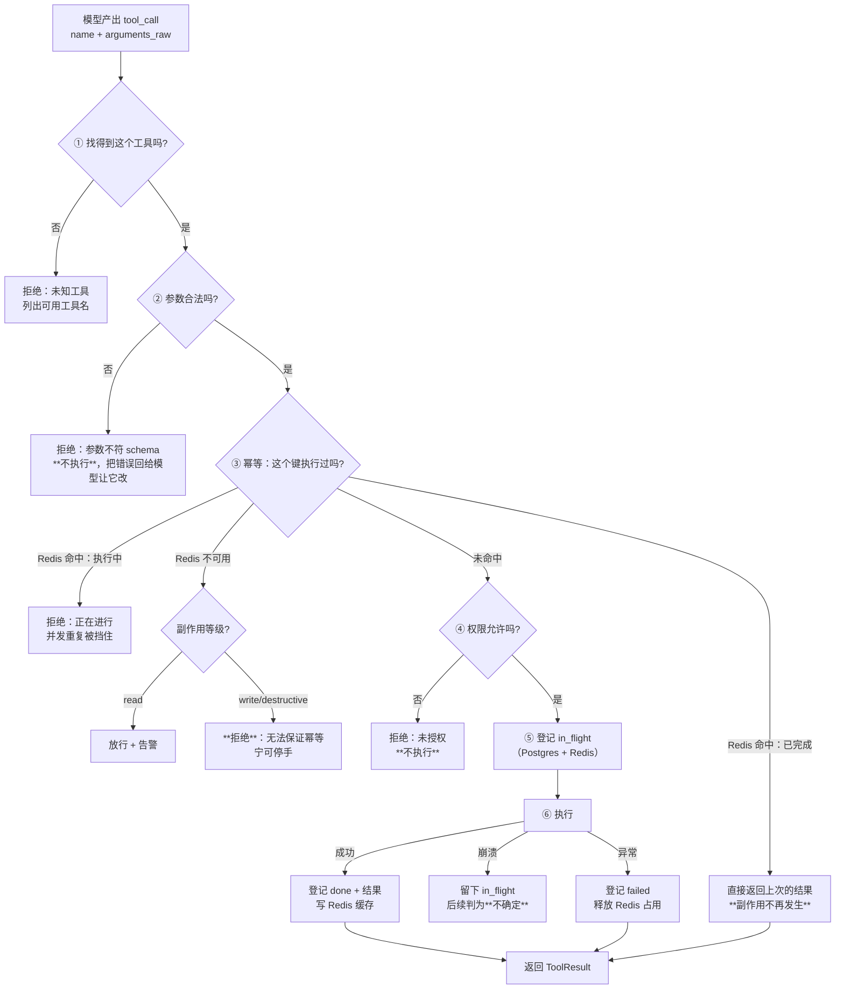

# `src/tool` 需求说明书

| 项 | 值 |
|---|---|
| 文档层级 | **需求层**（第一篇）。后续：《`src/tool` 架构概要设计》 |
| 覆盖范围 | `src/tool/` 全部文件 + `bash/` `grep/` `read/` `write/` 四个内置工具 |
| 上游依赖 | `foundation`（配置、错误、时钟）、`src/repo`（执行记录的落库） |
| 下游消费 | `src/agent/*`、`src/multiagent/*`、`apps/mcp/tools/` |
| 关键外部依赖 | **Redis**（幂等判定的快路径）、PostgreSQL（执行记录的权威存储） |
| 状态 | 待评审 |

---

## 1. 这份文档回答什么

只回答**要解决什么问题**、**必须提供哪些能力**、**什么算合格**。

**本文不回答**：工具怎么注册、幂等键怎么拼、Redis 命令怎么写。文中文件名仅用于圈定职责边界。

**前置阅读**：`docs/gateway/需求说明书-gateway.md` `FR-G-05`（不跨能力降级）；
`docs/repo/需求说明书-repo.md` `FR-R-09`（业务模块自持表的规则）。

---

## 2. 背景与定位

### 2.1 为什么需要一个独立的工具层

平台要做的是**软件测试全流程**（需求 → 设计 → 用例 → 环境 → 执行 → 分析 → 缺陷）。
这条链路上的动作分两类：

| 类别 | 例子 | 谁做 |
|---|---|---|
| **推理** | 「这几个用例覆盖了哪些等价类」 | 模型 |
| **动作** | 读一个文件、搜一段代码、写一个用例文件、跑一次 `pytest` | **工具** |

模型只能产生**意图**（``我要调用 read，参数是 path=...``），
把意图变成真实世界的副作用，是工具层的职责。

`provider` 层已经把「工具调用的**协议**」传输好了（`FR-P-03`：`ToolSpec` / `ToolCall`、
`arguments_raw` 与 `arguments` 都保留）。但它**只负责传输** —— 它不管一个工具叫什么、
参数合不合法、能不能执行、执行了会有什么后果。

### 2.2 本模块真正难的地方：副作用不能重来

如果工具都是只读的（读文件、搜代码），这一层会很简单。
但 `write` 与 `bash` 是**有副作用**的，而 agent 场景下「同一个调用被执行两次」
不是假想的风险，是**必然会发生**的：

| 重复来源 | 具体场景 |
|---|---|
| **模型重发** | 模型对同一次操作生成两个 `tool_call`（它看不到上一次已经执行） |
| **agent 重试** | 一次步骤失败后整体重试，前面的工具调用跟着重跑 |
| **断点续跑** | `checkpoint` 恢复后，已完成的步骤若没被正确记录，会再执行一遍 |
| **多 agent 并发** | 两个 agent 同时决定「先写这个文件」，谁也不知道对方在做 |
| **MCP 客户端重试** | `apps/mcp/tools/` 对外暴露后，客户端的重试是常态 |

对一个测试平台来说，这些重复的后果是具体的：**重复写一份用例文件**、
**重复执行一次破坏性的测试准备命令**、**把同一个缺陷报两遍**。

> 所以本模块的第一目标不是「工具能跑」，而是
> **「同一个调用，无论被提交几次，副作用只发生一次」**。

### 2.3 这个目标做不到 100%，必须说清楚做到哪

**工具的执行不在数据库事务里** —— 它的副作用发生在文件系统、子进程、外部 API 上。
这意味着一件事：

> 「恰好一次」在分布式里**做不到**。能做到的是
> **「同一个键最多执行一次，且不确定的状态被显式标出来」**。

具体地，一次执行有三个阶段，而崩溃可能落在任何两段之间：

```
① 登记（写「开始执行」）  →  ② 真的执行  →  ③ 登记完成（写结果）
        ↑ 崩在这里：没副作用，重试安全
                              ↑ 崩在这里：**副作用已发生但没记录** ← 不确定窗口
```

**第二阶段到第三阶段之间崩溃，是唯一无法自动消解的窗口**：
重试可能造成第二次副作用，跳过可能漏掉一次。

本模块的要求是：**把这个窗口显式地标成「不确定」，而不是假装成功、也不是假装失败**。
这与项目「拒绝静默」的主线一致 —— 不确定就是不确定，让上层能据此决策（人工确认 / 报警 / 放弃）。

---

## 3. 范围

### 3.1 本模块负责

| 职责 | 落点 |
|---|---|
| 工具契约（定义、参数、返回值、副作用等级） | `types.py` `base.py` |
| 工具注册与查找 | `registry.py` |
| 执行编排（校验 → 幂等 → 权限 → 执行 → 记录） | `executor.py` |
| 权限校验（按副作用等级与调用方身份） | `permission.py` |
| **幂等**（Redis 快路径 + PostgreSQL 权威记录） | `executor.py` + `apps/server/storage/redis/` |
| 四个内置工具 | `bash/` `grep/` `read/` `write/` |

### 3.2 本模块明确不负责

| 不做的事 | 归属 |
|---|---|
| 工具调用协议的**传输**（厂商格式） | `src/provider`（`FR-P-03`） |
| 模型路由与调用（包括请求里带哪些工具） | `src/gateway` |
| 决定「什么时候该调用哪个工具」 | `src/agent` / `src/multiagent`（这是推理） |
| 复杂能力的组合与提示词编排 | `src/skill`（见 §2.4） |
| 执行记录的持久化实现 | `src/repo`（本模块只**产生**记录） |
| Redis 客户端与锁原语 | `apps/server/storage/redis/` |

### 3.3 与 `src/skill` 的分工（容易混，先定清楚）

两者都有 `registry.py` / `executor.py` / `permission.py` —— 形状相似，但**是两件事**：

| | `src/tool` | `src/skill` |
|---|---|---|
| 是什么 | **代码**：一段能力的实现 | **数据**：可持久化、带版本的能力定义 |
| 谁产生 | 开发者写代码 | 配置 / 用户定义，落 `repo.skill` 表 |
| 形态 | 类 + 实现 | 名称 + 版本 + 描述 + 参数 schema + 提示词/步骤 |
| 与模型的关系 | 模型通过 tool calling 直接调用 | 由平台编排，内部可能调用若干工具 |
| 变更 | 改代码、发版本 | **只增不改**（正在跑的任务可能还引用着旧版本） |

一句话：**tool 是能执行的代码，skill 是可配置的编排**。
本模块不管 skill；skill 里要执行动作时，通过本模块来执行。

---

## 4. 一次工具调用的责任链



**这张图推导出四条硬约束**：

1. **参数不合法绝不执行** —— 这是编程/模型错误，执行了只会产生更难查的副作用；
2. **权限校验必须在幂等判定之前** —— ⚠ **这条与本文初稿相反，是编码阶段推翻的**
   （见架构文档的实现期修订）。初稿写的是「幂等在前」，理由是「重复的调用会因为
   无权限被拒，而上层以为没执行过」。但那条理由漏了一件事：

   > 幂等在权限**之后**时，一个**未被授权**的调用者只要猜到（或复用）别人的幂等键，
   > 就能拿到**别人**执行出来的结果 —— 比如它无权读的文件内容。
   > 去重表于是变成了一个**越权读取的通道**。

   而被拒的重复调用并不造成实际损害：那个调用者本来就不该跑这个工具；
3. **登记（⑤）必须先于执行（⑥）** —— 反过来的话，崩溃在「执行完但没登记」之间，
   下次重试会**再执行一遍**，而系统完全不知道发生过；
4. **不确定状态（G1）必须能被区分出来** —— 它不是成功也不是失败（见 §2.3）。

---

## 5. 功能需求

编号 `FR-T-xx`。

### 5.1 契约与注册

#### FR-T-01 — 工具契约

**要求**：

- 每个工具有：名称、描述、参数 JSON Schema、**副作用等级**、执行入口；
- **副作用等级由工具自己声明**，不是调用方猜的。至少三档：

  | 等级 | 含义 | 例子 | 重复执行的后果 |
  |---|---|---|---|
  | `read` | 只读 | `read` `grep` | 无害（只是浪费） |
  | `write` | 写，但可覆盖 | `write` | 覆盖同一份内容，通常无害 |
  | `destructive` | 不可逆 | `bash`（可能是 `rm -rf`） | **事故** |

- 契约**不得依赖任何厂商协议**（`tool` 不能 import `provider`）——
  厂商格式是传输层的事，工具层只认自己的定义。

**验收点**：新增一个工具不需要改任何既有文件（除注册处一行）。

#### FR-T-02 — 注册与查找

**要求**：

- 按名字注册与查找；重名**必须报错**（静默覆盖会让一个工具悄悄失效）；
- 查找失败时**列出全部可用工具名**（与 `FR-G-02` 的逻辑名寻址同一条纪律：
  拼错是最常见的错误，只说「未找到」会让人去翻文档）；
- 支持按副作用等级与调用方可用性**筛选**出「这一次该给模型看哪些工具」。

**验收点**：请求一个未注册的工具 → 报错且错误信息里含全部已注册名字。

### 5.2 幂等（本模块的核心）

#### FR-T-03 — 幂等键

**要求**：

- **优先使用调用方显式给的 `idempotency_key`**；没给时按
  **(工具名 + 规范化参数 + 作用域)** 派生；
- 「作用域」必须能区分**不同的执行上下文**（如同一会话/同一次运行里两次
  参数相同的 `read`），至少包含会话或运行标识；
- **参数规范化只做「跨重试必然一致」的部分**（键序、空白、编码），
  **不做语义归一化**（不把 `./a.txt` 与 `a.txt` 视作同一个）。

> **这条非对称性必须写下来**：
> **去重失败是安全的（多跑一次），误去重是危险的（少跑一次，且没人知道）。**
> 所以规范化要偏保守 —— 宁可少去重，不可错去重。

**验收点**：同一个键提交两次 → 第二次返回第一次的结果，副作用只发生一次。

#### FR-T-04 — 并发去重

**要求**：

- 两个调用同时提交同一个键 → **只有一个真的执行**，另一个不能同时执行；
- 后到者的行为可以是「等待」或「立刻返回『正在执行』」，但**不得**自己再执行一遍；
- 占用必须有**租约（lease）**：持有者崩溃后，租约到期能自动释放，
  否则一次崩溃会把那个键永久锁死。

**验收点**：并发提交同一个键 10 次 → 工具的真实执行次数为 1。

#### FR-T-05 — 结果复用

**要求**：

- 键已完成时，返回**上次的结果**而不是重新执行；
- 结果缓存有**大小上限**：超过上限只存摘要（存不下的部分不存），
  并在结果里标明这是复用（而不是本次执行）；
- 缓存必须有 TTL —— 过期后回到权威记录判断，而不是直接当没执行过。

**验收点**：`bash` 产生 1MB 输出 → 不把 1MB 塞进 Redis，但去重仍然生效。

#### FR-T-06 — 幂等不可用时的降级

**要求**：

⚠ **「Redis 不可用」不等于「幂等不可用」** —— 这一点是编码阶段修正的
（初稿把两者混为一谈，见架构文档的实现期修订）。**唯一约束
``(scope, idem_key)`` 本身就是正确的并发闸门**，Redis 只是它的快路径。
所以：

| 缺什么 | 行为 | 理由 |
|---|---|---|
| **只缺 Redis** | **退到「只用权威记录」的慢路径**，不拒绝、不算降级 | 每次多一次 SELECT + INSERT，但**语义完全正确**。让 Redis 的可用性等价于整个 agent 的可用性，是这个模块不该背的代价 |
| **缺权威记录**（没有数据库 / 数据库不可用） | **按副作用等级分流** ↓ | 这才是真的没有幂等保护：Redis 只是缓存，清一次库就静默地变成可以重复执行 |
| └ `read` | **放行**，打告警，且 outcome 标成 `executed_degraded` | 只读重复了无害；为了它让 agent 停工代价不成比例。但放行**必须可区分** |
| └ `write` / `destructive` | **拒绝**，并说清原因 | 重复写会产生第二份内容；不可逆的操作更不必说 |

**降级必须出声**：每一次放行都要留告警，且告警里要说清
「这次是在没有幂等保护的情况下执行的」。

**验收点**：Redis 停掉后，`write` **照常成功**（走慢路径）；把数据库也去掉后，
`write` 被拒、`read` 放行且 outcome 是 `executed_degraded`。

#### FR-T-07 — 权威记录（PostgreSQL）

**要求**：

- 幂等状态**不能只存在 Redis 里**。Redis 在本项目的定位是「**能丢的才进 Redis**」
  （见 `docs/server_storage`），而「这个调用执行过」是**不能丢的** ——
  丢了就意味着可能重复执行，而且是**静默地**变成可以重复执行；
- 因此：**Redis 是快路径，PostgreSQL 是权威**。判定顺序是
  「Redis 命中 → 返回；未命中 → 查库；库里也没有 → 才认为没执行过」；
- 执行记录同时是**审计与排障**的依据：谁、什么时候、执行了什么、结果如何。

**验收点**：清空 Redis 后再次提交同一个键 → **仍然不会重复执行**（从库里查到）。

#### FR-T-08 — 不确定状态

**要求**：

- 崩溃在「已执行、未登记完成」之间时，记录必须停在 `in_flight`；
- `in_flight` 超过租约后**不得自动当作失败重跑**，也不得当作成功 ——
  必须是一个**可被上层区分出来的第三种状态**；
- 上层据此可以：人工确认、报警、或按策略冒险重试（那是上层的决定，不是工具层的）。

**验收点**：模拟「登记 in_flight 后进程消失」→ 再查该键，状态是 `uncertain`
（或等价的显式状态），而不是 `done` 也不是 `failed`。

### 5.3 权限

#### FR-T-09 — 按副作用等级与调用方授权

**要求**：

- `read` 默认放行；
- `write` 需要调用方在允许范围内（如限定目录）；
- `destructive` **必须显式授权**，且授权要有范围（不能是「全局允许 rm」）；
- 权限拒绝时**不得执行**，且错误信息要说清「缺哪个权限」（与 `FR-G-03` 的错误信息同一条纪律）。

**验收点**：未授权的 `destructive` 调用被拒，且错误信息里有具体缺什么。

### 5.4 内置工具

#### FR-T-10 — 四个内置工具

**要求**：

| 工具 | 副作用 | 关键要求 |
|---|---|---|
| `read` | read | 支持按行范围读；**必须限制可读范围**（不得默认能读整个文件系统） |
| `grep` | read | 返回匹配行 + 位置；**必须限制单次返回条数**（否则一次搜索能撑爆上下文） |
| `write` | write | 支持覆盖与追加两种模式；**必须限制可写目录**；写入前校验目标不在禁止列表里 |
| `bash` | destructive | 有超时；有输出上限；**默认不启用**（必须显式打开）；命令可被拒绝清单拦截 |

**共同要求**：输出必须有**上限**（字节数与行数），超限时截断并**明确标注截断了**
（截断而不标注，会让模型基于不完整的信息做判断，且它自己不知道）。

**验收点**：`read` 一个超长文件 → 输出被截断且带明确标注；
`bash` 在默认配置下**不可用**（需要显式开启）。

### 5.5 与相邻模块的接缝

#### FR-T-11 — 工具定义如何到达模型

**要求**：

- 本模块**不能 import `provider`**（`pyproject.toml` 的契约 4）——
  所以工具定义是本模块自己的类型，需要**在某个同时看得见两边的地方**
  转换成厂商要的 `ToolSpec`；
- 那个地方是**组合根**（`src/composition/`），因为它是唯一允许 import 全部同仓库模块的地方；
- 转换**不得**要求工具层知道任何厂商字段。

**验收点**：全仓库检索，`src/tool/` 里没有出现 `provider`。

---

## 6. 非功能需求

| 编号 | 需求 | 说明 |
|---|---|---|
| `NFR-T-01` | **依赖方向单向** | tool → foundation / repo。**不得** import provider / gateway / agent |
| `NFR-T-02` | **幂等记录不可丢** | Redis 可丢，PostgreSQL 不可丢。判定顺序见 `FR-T-07` |
| `NFR-T-03` | **不确定必须可见** | 不允许把 `in_flight` 当成成功或失败（`FR-T-08`） |
| `NFR-T-04` | **不放大故障** | 工具执行失败不得让整个 agent 崩溃；错误以 `ToolResult` 的形式回给模型，让它换个做法 |
| `NFR-T-05` | **输出有界** | 任何工具的输出都必须有字节数与行数上限 |
| `NFR-T-06` | **可测试** | 幂等、租约、降级都要能用假时钟与假 Redis 测，不得依赖真实 `sleep` |
| `NFR-T-07` | **可观测** | 「被幂等短路了多少次」「降级放行了多少次」必须可查 —— 否则「去重到底有没有生效」永远答不出来 |

---

## 7. 配置需求

```yaml
tool:
  # 默认关闭 bash —— 它能做任何事，默认打开等于默认给 agent 一台无锁的机器
  enabled: [read, grep, write]
  # 各工具的可访问范围（**默认拒绝**，白名单式）
  scope:
    read:  ["${workdir}"]
    grep:  ["${workdir}"]
    write: ["${workdir}"]
  limits:
    max_output_bytes: 262144      # 单次输出上限（256KB）
    max_output_lines: 2000
    timeout_s: 60
  bash:
    enabled: false                # 必须显式打开
    denylist: ["rm -rf /", "mkfs", ":(){ :|:& };:"]   # 最低限度的兜底，不是安全边界

idempotency:
  enabled: true
  # 显式 key 的字段名（调用方在参数里给）
  key_field: idempotency_key
  lease_s: 120                    # 占用租约；到期视为持有者已崩溃
  result_ttl_s: 3600              # Redis 结果缓存
  max_cached_result_bytes: 65536  # 超过就只存摘要
  on_redis_unavailable:           # **必须显式配**，没有默认值
    read: allow_with_warning
    write: refuse
    destructive: refuse

redis:
  url: ${BESA_REDIS_URL:-redis://127.0.0.1:6379/0}
  key_prefix: "besa_agent:tool:"  # ⚠ 本机 6379 上 besa: 已被兄弟项目的 Celery 占用
```

**要求**：

- `C-T-1` **默认拒绝**：范围没配就不许访问（不是「默认允许、配了才限制」）；
- `C-T-2` `bash` **默认关闭**；
- `C-T-3` `on_redis_unavailable` 没有默认值，必须显式配（逼配置者做决定）；
- `C-T-4` Redis 键前缀统一 `besa_agent:`（本机 6379 上已有 `besa:queue:ingest` 等键，
  **不能假设这个 Redis 只属于我们**）。

---

## 8. 验收标准（场景化）

| # | 场景 | 期望 |
|---|---|---|
| `CT-1` | 同一个 `idempotency_key` 提交两次 | 第二次返回上次结果，**副作用只发生一次** |
| `CT-2` | 并发提交同一个键 10 次 | 真实执行 1 次 |
| `CT-3` | 没给 key，参数相同、作用域相同 | 派生键命中，第二次被短路 |
| `CT-4` | 参数键序不同但语义相同 | 视为同一次（规范化生效） |
| `CT-5` | `./a.txt` 与 `a.txt` | **视为不同次**（不做语义归一化） |
| `CT-6` | 持锁进程崩溃 | 租约到期后该键可再次执行，不会永久锁死 |
| `CT-7` | 登记 in_flight 后进程消失 | 状态是**不确定**，不是成功也不是失败 |
| `CT-8` | 清空 Redis 后重复提交 | **仍不重复执行**（从 PostgreSQL 查到） |
| `CT-9` | Redis 不可用 + `write` 工具 | 拒绝，错误信息说明「幂等不可用」 |
| `CT-10` | Redis 不可用 + `read` 工具 | 放行，且日志有告警 |
| `CT-11` | `bash` 输出 1MB | 被截断、明确标注，且不塞进 Redis 缓存 |
| `CT-12` | 未授权的 `destructive` | 拒绝，错误信息指出缺什么 |
| `CT-13` | 默认配置下调用 `bash` | 拒绝（默认关闭） |
| `CT-14` | 参数不符 schema | 拒绝执行，错误回给模型让它改 |
| `CT-15` | 请求未注册的工具 | 报错并列出全部可用工具名 |
| `CT-16` | 全仓库检索 | `src/tool/` 不 import `provider` |
| `CT-17` | 幂等短路次数 / 降级放行次数 | 可查（`NFR-T-07`） |

---

## 9. 决策点（需评审确认）

| 编号 | 决策点 | 备选 | 建议 |
|---|---|---|---|
| `DT-1` | 幂等身份 | 显式 key 优先 + 派生兜底 / 只用参数指纹 / 用 `tool_call_id` | **显式优先 + 派生兜底**。`tool_call_id` 由模型生成，重试或重新规划时会给新 id —— 那时去重直接失效，而它恰恰是最需要去重的场合 |
| `DT-2` | Redis 不可用时 | 按副作用分级 / 一律拒绝 / 一律放行 | **按副作用分级**。只读重复无害，写入重复是事故；一律拒绝会让 Redis 的可用性变成整个 agent 的可用性 |
| `DT-3` | 幂等状态权威 | Redis 快路径 + PG 权威 / 纯 Redis | **Redis + PG**。纯 Redis 的问题是「一次清库就静默地变成可以重复执行」，而这正是本模块存在的理由 |
| `DT-4` | 副作用等级谁定 | 工具自己声明 / 框架统一 | **工具自己声明**。框架推不出来（`bash` 既可能是 `ls` 也可能是 `rm -rf`），且它同时决定权限与确认策略 |
| `DT-5` | 工具定义 → `ToolSpec` 的转换点 | 组合根 / gateway 再导出 / `src/tool` 自己 import provider | **组合根**。`tool` 不能 import `provider`（契约 4），而契约是机械强制的，不该为它开豁免 |
| `DT-6` | `bash` 默认状态 | 默认关闭 / 默认打开 | **默认关闭**。它等于把一台无锁的机器交给模型；默认打开时「忘了关」的代价不可逆 |
| `DT-7` | 结果缓存存什么 | 只存摘要 / 存完整结果 / 不存 | **有上限地存**（默认 64KB），超限只存摘要。存完整结果会撞上「Redis 实测 `maxmemory=0`、无淘汰兜底」这条 —— 得由我们自己给上限 |
| `DT-8` | 不确定状态的重试策略 | 工具层自动重试 / 交给上层 / 永不重试 | **交给上层**。工具层不具备判断「这次副作用到底发生没有」的信息，自动重试就是在赌 |
| `DT-9` | 执行记录放哪 | `src/repo/tool.py` / `src/tool/` 自持表 | **`src/repo/tool.py`**。它是**基础设施数据**（谁在什么时候执行了什么），与 `event` / `usage` 同类；`FR-R-09` 的「业务模块自持表」是为测试用例/缺陷那类**领域产物**设的 |

---

## 10. 与相邻模块的契约

| 相邻模块 | 契约 |
|---|---|
| `src/provider` | 只负责工具调用**协议**的传输；本模块**不依赖**它 |
| `src/gateway` | 决定请求带哪些工具、把 `ToolCall` 交回来；本模块不参与路由 |
| `src/agent` / `src/multiagent` | 决定**什么时候**调用哪个工具；本模块只负责「调用了会怎样」 |
| `src/skill` | 技能编排可调用工具；工具的契约归本模块 |
| `src/repo` | 执行记录的**落库**；本模块只产生数据 |
| `apps/server/storage/redis` | 提供锁与缓存的**原语**；幂等的判定逻辑在本模块 |
| `apps/mcp/tools` | 把工具暴露成 MCP 工具；复用本模块的注册表 |

---

## 11. 下一步

本文定稿后进入《`src/tool` 架构概要设计》，届时需要产出：

- 幂等的两阶段协议（抢占 / 完成）与 Redis 键的具体形状、Lua 脚本的原子性边界；
- 执行记录的表结构与它与 PostgreSQL 的写入时机（**登记必须先于执行**）；
- 不确定状态的判定与暴露方式；
- 参数规范化的具体规则（做到哪一步、为什么不再往下做）；
- 四个内置工具各自的边界与输出截断策略；
- 与 `apps/server/storage/redis` 的接口（锁与缓存分别要什么原语）。
